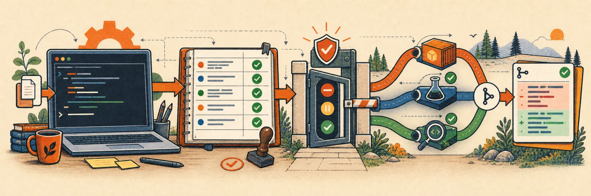
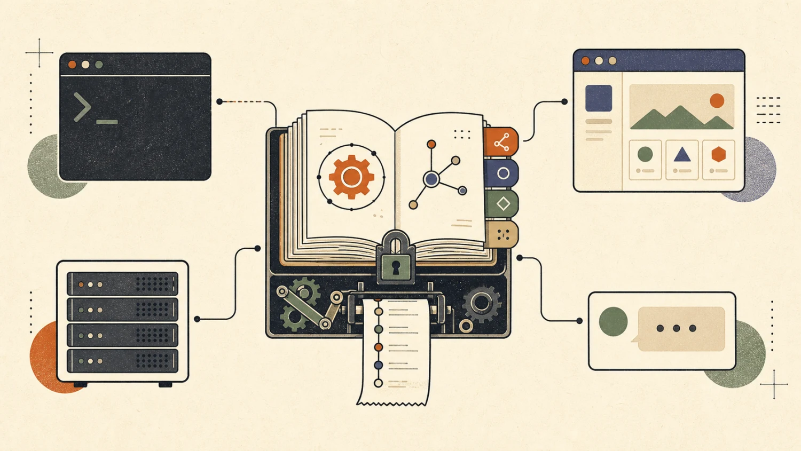

<div align="center">

# vak

### An agent you can inspect, constrain, and extend.

**A local-first Rust harness for running serious general-purpose agents without giving up the receipts.**

[](CHANGELOG.md)
[](Cargo.toml)
[](Cargo.toml)
[](docs/design/24-agent-security.md)

[Quick start](#quick-start) · [Why vak](#why-vak) · [Features](#what-you-get) · [Architecture](#one-core-many-surfaces) · [Documentation](#documentation)

</div>



vak is an open-source agent runtime for people who want powerful automation **and** a system they can reason about. It combines a native desktop app, a headless CLI, flows, an HTTP/SSE server, and chat gateways on top of one auditable core. Engineering, research, writing, data, and operations all run through that core, the same permission gate, and the same ledger.

Its thesis is simple: **Codex-grade safety, pi-grade transparency, Claude Code-grade extensibility, and opencode-grade simplicity.**

The result is not another thin model wrapper. Sessions are append-only ledgers, permissions are evaluated before every effect, restricted tools run across a broker boundary, partial work survives cancellation, and every provider dispatch produces a receipt.

> **Supported baseline: 2.0.0.** Earlier versions are unsupported and cannot be upgraded in place. See the [roadmap](docs/design/00-roadmap.md) and [changelog](CHANGELOG.md).

## Why vak

Most agents make you choose between capability and legibility. vak is built around the idea that the agent can be ambitious while the runtime remains explicit.

| Principle | What it means in practice |
|---|---|
| **Model-visible means logged** | Anything sent to a model can be reconstructed from the session JSONL. |
| **Permission before dispatch** | Agent turns, tools, subagents, flows, plans, evals, server runs, and desktop runs all pass through the same policy engine. |
| **Append-only by default** | Branching and compaction create entries; they do not rewrite history. |
| **Failure is part of the contract** | Typed errors, bounded retries, watchdogs, circuit breakers, frozen route ladders, and preserved partial output. |
| **Extensions stay extensions** | Skills, hooks, MCP servers, custom commands, and flows add capability without bloating the kernel. |
| **Your models, your machine** | Use Anthropic, OpenAI, OpenRouter, OpenCode Zen, Gemini, or Ollama; model catalogues are discovered from the provider. |
| **First-class voice** | Use governed voice sessions, bounded transcription/synthesis, discovered provider capabilities, local transcription, and Telegram/Discord/Slack voice I/O; configuration and credentials stay administratable and scoped. |

## Quick start

### 1. Install

Download the release for your platform and open it. No toolchain, no clone,
no compile.

vak supports **macOS and Linux**. Windows is not supported: paths, service
management, and sandboxing are all two-platform today, and shipping an
installer over a binary with no containment backend would be a less safe
product than this one claims to be.

| Platform | Artifact |
|---|---|
| macOS | `Vak-<version>-<arch>.dmg` — drag `Vak.app` to Applications |
| Linux | `vak-<version>-<arch>.tar.gz`, or the bootstrap script below |

The macOS build is not yet signed, so the first launch needs a right-click
→ Open rather than a double-click. Every launch after that is normal.

```bash
curl -fsSL https://get.vak.dev/install.sh | sh
```

Re-running the script is an update.

### 2. Run setup

Launch the app, or run `vak setup` from a terminal. Setup opens a guided
first run that selects a workspace, connects a provider, verifies a model,
chooses a safety posture, and — only if you ask for it — brings up
always-on channels and services.

```bash
vak setup                  # opens the guided first run
vak setup --terminal       # the same flow as terminal prompts
vak setup status           # what is configured, and what is not
```

Setup runs once. Afterwards it shows a review, not a wizard.

### 3. Start working

```bash
vak exec "fix the failing test"
vak plan "add rate limiting to the API"
vak config dump             # inspect the effective configuration
vak doctor                  # readiness, layer by layer
```

Provider and model are one route, chosen during setup and changeable at any
time. To override for a single run:

```bash
vak exec "explain this workspace" \
  --provider openai-responses \
  --model YOUR_DISCOVERED_MODEL
```

### Where your configuration and secrets live

vak resolves configuration from broadest to narrowest — shared defaults,
then per-project overrides, then per-session pins. Secrets stay out of TOML
entirely.

| What | Where |
|---|---|
| Shared configuration | `~/vak-home/.vak/config.toml` |
| Shared secrets | `~/vak-home/.env` |
| Project overrides | `<workspace>/.vak/config.toml` |
| Project secrets | `<workspace>/.env` |
| Sessions, ledgers, gateway state | the platform data home |

Real environment variables take precedence over any `.env`. Secrets are
never forwarded as ambient Bash or MCP subprocess state, and project `.env`
files and privileged project configuration load only after you trust that
workspace.

### Full install, release, and platform documentation

[`docs/release-and-install.md`](docs/release-and-install.md) covers the
lifecycle end to end: what each platform gets, how to cut a release, the
supply-chain evidence a release carries, how updates are proven not to lose
data, and how to exercise the Linux path from a Mac.

### Building from source

Contributors need a [stable Rust toolchain](https://www.rust-lang.org/tools/install),
Git, and Node.

```bash
git clone https://github.com/vak/vak.git
cd vak
scripts/vak.sh build
```

## What you get

### A real agent loop

- Streaming model output with both deltas and snapshots
- Parallel tool calls scheduled in conflict-free resource waves
- Steering while a run is active, cancellable work, and preserved partial output
- Goal mode with acceptance criteria, brokered verification, and regression obligations
- Static flow DAGs plus a bounded, fail-closed dynamic planner

### An agent that knows what it was asked

Every turn is read on seven behavioural axes — what kind of work, how long it
lives, what it can break, what standard of proof it owes, how clear it is,
what modalities it needs, and whether anyone is watching. That reading then
*narrows* the run: fewer tools when fewer will do, a shorter route ladder for
trivial work, and a higher approval floor for anything irreversible.

- It only ever narrows. A misreading can make vak more cautious or less
  capable; it can never grant a tool, widen a budget, or skip a gate.
- It explains itself. `vak intent explain "<prompt>"` prints every signal with
  the weight it carried and exactly what the run would narrow — for free,
  without dispatching anything.
- Uncertainty falls back to doing nothing special, so being unsure never
  silently takes a capability away.

```bash
vak intent explain "deploy the billing service to production"
```

### Work that outlives a conversation

Work spanning sessions, restarts, or months becomes a durable **commitment**
with its own append-only ledger, rather than a note in a transcript.

- **Reality decides when it is done.** A commitment closes `fulfilled` only
  when the runtime has checked its criteria against the world at the strength
  the work demands. The model may propose criteria; it may never mark one
  passed.
- **Waiting is not failing.** Unattended work that needs a human suspends and
  queues the question instead of failing closed.
- **Nothing evaporates.** Every commitment closes with an explicit verdict and
  its evidence — including an honest `unknown` when the runtime lost track.

```bash
vak commit list        # the portfolio, in the order it would be worked
```

### Safety that is architectural

- Three permission modes: `read-only`, `workspace-write`, and explicit `full-access`
- Composable `allow`, `ask`, and `deny` rules with deny taking precedence
- Canonical workspace confinement and symlink-escape protection in restricted modes
- Disposable built-in tool workers and separately sandboxed MCP workers
- Seatbelt on macOS, Landlock on Linux, and an opt-in no-network Docker Bash backend
- Permission changes cancel in-flight work and reject stale approvals

### Sessions with receipts

- Append-only JSONL trees with branch lineage and compact-as-entry history
- A frozen execution contract recorded at admission
- Provider dispatch receipts with purpose, model, failure domain, settlement, and usage
- State-based workspace checkpoints and restore
- Cross-session search, durable memory, and human-reviewed skill proposals

### An interface for every context

- Tauri 2 desktop app with isolated worktrees, streaming chat, diff review, editor, PTY terminal, previews, side chats, and best-of-N comparison
- **Web admin console** at `/admin` on the secured server — live activity feed, session transcripts with search, approval gates, config editing, prompt/steering/best-of-N from any browser (cookie login; see `docs/design/33-admin-console.md`)
- Headless `exec` and `plan` commands for scripts and CI
- HTTP + SSE server for custom clients
- Always-on gateway with Telegram, Discord, and Slack bridges plus outbound webhooks, including fail-closed approval forwarding. Every unknown chat lands as a reviewable pending request — approve, deny, or edit access from the admin console or desktop settings, never a config-file hand-edit (`docs/design/34-channel-onboarding.md`)

### Multi-provider without a static catalogue

| Provider flag | API family |
|---|---|
| `anthropic` | Anthropic Messages |
| `openai-responses` | Native OpenAI Responses (use for hosted GPT reasoning/tool routes) |
| `openai` | OpenAI-compatible Chat Completions (only where that endpoint supports the chosen model/features) |
| `openrouter` | OpenRouter |
| `openrouter-responses` | OpenRouter Responses (for OpenRouter models/features that require the Responses dialect) |
| `opencode-zen` | OpenCode Zen |
| `google` | Gemini |
| `ollama` | Local OpenAI-compatible Ollama endpoint |

vak asks the provider for the models available to your key and caches the result briefly. It does not bake yesterday's model list into the binary.

## Choose your surface

### Headless and goal mode

```bash
vak exec "refactor the parser" --worktree

vak exec "ship the parser fix" \
  --goal "the parser handles empty input without regressions" \
  --criteria "verify:cargo test -p vak-parser,errors remain typed"
```

Goal mode does not accept the agent's declaration of success on faith: deterministic criteria run through the tool broker, qualitative criteria go through a skeptical judge, and failures are returned to the loop as evidence.

### Desktop app

The desktop client requires Node.js/npm in addition to Rust. `npm run build`
produces both bundles — `dist/` for this shell and `dist-web/` for the copy
the server serves at `/app`.

```bash
cd crates/vak-client-ui
npm ci
npm run build
cd ../../..
cargo run -p vak-desktop
```

### Install

`scripts/build.sh` builds the shipped components and then hands placement to
the managed installer, which owns the install root and its manifest:

```bash
scripts/build.sh
```

`--no-install` builds without placing anything, `--no-desktop` excludes the
desktop frontend and Rust package, and `--prefix DIR` installs somewhere other
than the platform default. The build cache is cleaned automatically after a
workspace-version bump, preventing old identities for all workspace crates
from accumulating. The version-bump script also refreshes `Cargo.lock` without
compiling the entire workspace. Every `self` subcommand accepts the same
`--prefix`, so a custom install stays inspectable and removable:

```bash
vak self status         # build vs manifest vs service units
vak self verify         # every component against its recorded digest
vak self services-sync  # regenerate + reload the launchd/systemd units
vak self reinstall      # clear the prefix and place a fresh build
vak self update --url <feed>  # opt-in pull-and-replace from a release feed
vak self uninstall      # remove it; --purge also deletes the data home
vak doctor              # read-only health report across config, services, routes
```

`vak doctor` diagnoses; `vak doctor --repair` acts on the checks that have a
known mechanical fix (today: reinstalling on self version parity drift) and
re-checks, leaving anything else — provider auth, config warnings — for you.
Checks without a mechanical fix are never guessed at.

`scripts/vak.sh <verb>` is a thin dispatcher over all of the above, if
you'd rather remember one entry point than which of `scripts/*.sh` or
`vak self <verb>` owns a given step:

```bash
scripts/vak.sh build          # -> scripts/build.sh
scripts/vak.sh release        # -> scripts/release.sh
scripts/vak.sh install        # -> vak self install
scripts/vak.sh reinstall      # -> vak self reinstall
scripts/vak.sh verify         # -> vak self verify
scripts/vak.sh status         # -> vak self status
scripts/vak.sh update         # -> vak self update
scripts/vak.sh uninstall      # -> vak self uninstall
scripts/vak.sh services-sync  # -> vak self services-sync
scripts/vak.sh doctor         # -> vak doctor
```

It resolves `vak` from PATH first, falling back to the freshly built
`target/release` or `target/debug` binary — it never reimplements a verb,
only routes to the thing that already owns it.

### Release

```bash
scripts/bump-version.sh 0.8.1   # THE version, plus a lockfile refresh
scripts/check-version.sh        # proves no second version stamp exists
scripts/release.sh --base-url https://downloads.example.com
```

There is exactly one authoritative version — `[workspace.package] version`.
Crates inherit it, `tauri.conf.json` omits the key so Tauri derives it, and
the private frontend packages stay pinned at `0.0.0`. `check-version.sh`
fails if a second stamp reappears anywhere.

`release.sh` builds, checksums each artifact, and writes
`dist/<version>/release.json` — the feed `vak self update` reads. Every
artifact carries a SHA-256 that `self update` verifies before installing;
an artifact without one is refused. Release checks and compilation use an
isolated temporary Cargo target directory that is removed on exit, so frequent
version bumps do not enlarge the developer `target/`. The release preflight
requires 15 GiB free by default; set `VAK_RELEASE_MIN_FREE_GB` to adjust that
threshold for the build host.

### Server and gateway

```bash
vak serve --port 8901
vak serve --gateway --trust
```

The server exposes the same session, run, approval, transcript, diff, and steering contracts used by the desktop app — and serves the **workspace client itself at `/app`**, so a headless box is a place to *use* vak, not only to host it:

```bash
vak serve --port 8901          # then open http://127.0.0.1:8901/app
```

It binds loopback and answers only to loopback hostnames unless you say
otherwise. For a remote box, an SSH tunnel needs no configuration at all
(`ssh -N -L 8901:127.0.0.1:8901 you@box`); serving a real hostname needs
`[server] trusted_hosts` and is refused without it. For a durable macOS
LaunchAgent or Linux systemd user service, and the full remote-access
posture, follow the [hosting guide](docs/hosting.md).

## One core, many surfaces



```text
vak CLI       Tauri desktop ─┬─ browser        HTTP + SSE / gateway
         \                   |                          /
          \        one workspace client, two hosts     /
           \        (crates/vak-client-ui)            /
            └──────────────── vak-core ──────────────┘
                               |
            ┌──────────────────┼──────────────────┐
            |                  |                  |
        vak-agent          vak-flow         vak-permission
            |                                     |
     ┌──────┼──────┐                              |
     |      |      |                              |
 vak-tools hooks  vak-mcp  ───── broker + sandbox boundary
     |
 vak-session ── append-only ledger, contracts, receipts, recall
     |
  vak-llm ─── providers, streaming, routing, usage accounting
```

The interfaces do not implement their own privileged shortcuts. They compose the same core, permission engine, brokered registry, and session ledger. Read the [architecture roadmap](docs/design/00-roadmap.md) for the full crate map and phase history.

The desktop app and the browser client are not two clients: they are one
source tree (`crates/vak-client-ui`) behind a small host port, built twice.
What differs between them — native dialogs, a PTY, where a saved file goes —
is answered by the host, and a capability it cannot provide is *absent*
rather than broken. See [the web client](docs/design/48-web-client.md).

## Permission model

| Mode | Filesystem | Commands | Intended use |
|---|---|---|---|
| `read-only` | Workspace reads only | Restricted | Audits, exploration, review |
| `workspace-write` | Reads and writes inside the canonical workspace | Sandboxed and policy-gated | Everyday coding; the default |
| `full-access` | Unrestricted host access | Unsandboxed, still rule-gated | Explicitly trusted, supervised work |

`full-access` is never selected automatically after a denial, failure, retry, prompt request, or model recommendation. Missing containment fails closed. Unattended gateway turns deny escalations unless an explicitly configured approver surface answers in time.

See the [threat model](docs/design/24-agent-security.md), [permission design](docs/design/08-permissions.md), and [Docker sandbox design](docs/design/25-docker-sandbox.md) before changing security-sensitive behavior.

## Everyday commands

```bash
# Sessions and checkpoints
vak sessions
vak checkpoints list
vak checkpoints restore SESSION_ID SEQUENCE

# Static flows
vak flow list
vak flow check FLOW_NAME
vak flow run FLOW_NAME

# Memory and reviewed learning
vak memory
vak skills-review list

# Deterministic and live evaluation
vak eval
vak eval --live --provider PROVIDER --model MODEL
```

Run `vak --help` or `vak <command> --help` for the complete flags.

## Configuration

Configuration is layered predictably:

```text
defaults < ~/.config/vak/config.toml < .vak/config.toml < environment < CLI
```

Unknown keys warn instead of preventing startup. Privileged project keys—permissions, hooks, MCP servers, gateway, sandbox, and provider endpoint overrides—require workspace trust. Start with:

```bash
vak config dump
```

Then use the [configuration reference](docs/design/05-config.md) for provider, retry, context, UI, permission, hooks, MCP, FinOps, gateway, memory, and sandbox settings.

## Reliability and cost control

- Transient failures retry within a route ladder frozen when the run is admitted
- `Retry-After`, watchdog deadlines, circuit breaking, and cancel-aware endurance are built into the loop
- A shared dispatch ceiling prevents retry multiplication across nested mechanisms
- FinOps admission can enforce per-run, daily, and monthly spend caps
- Every attempt is receipted, including route fallback, cancellation, and typed failure domain
- Deterministic evals cover the loop, context integrity, broker boundary, routing, spend gates, and goal completion

The expected behavior for overloads, network loss, malformed streams, cancellation, open circuits, and other failures is documented in the [failure-handling matrix](docs/design/15-reliability.md).

## Extending vak

Keep the core small; add specialized behavior at the edges:

- **Skills** load instructions progressively when relevant
- **Hooks** observe and gate lifecycle events
- **MCP** exposes external tool servers through a lazy meta-tool
- **Commands** add project, plugin, or user Markdown templates
- **Subagents** run lineage-linked child sessions with attach, steer, and stop controls
- **Flows** define validated, resumable DAGs with typed failure policy

Start with the [extensibility design](docs/design/09-extensibility.md) and [flow design](docs/design/10-flows.md).

## Development

The workspace uses stable Rust, edition 2024. Before submitting a change, run the same checks required by the repository contract:

```bash
cargo fmt --all --check
cargo clippy --workspace --all-targets -- -D warnings
cargo test --workspace
```

The deterministic eval suite runs offline in roughly 100 ms:

```bash
cargo run --bin vak -- eval
```

Live checks need a configured provider key:

```bash
cargo run --bin vak -- eval --live --provider PROVIDER --model MODEL
```

Read [AGENTS.md](AGENTS.md) before changing the agent loop, tool boundary, sessions, permissions, providers, gateway, or sandbox. Its invariants are part of the product contract.

## Documentation

| Start here | Covers |
|---|---|
| [Roadmap](docs/design/00-roadmap.md) | Phase history, shipped capabilities, and remaining work |
| [Agent loop](docs/design/03-agent-loop.md) | Turns, tools, steering, scheduling, and outcomes |
| [Sessions](docs/design/02-sessions.md) | Append-only trees, projection, compaction, and contracts |
| [Security](docs/design/24-agent-security.md) | Threat model, trust boundaries, and priority order |
| [Reliability](docs/design/15-reliability.md) | Retries, watchdogs, circuit breaking, and recovery |
| [Desktop](docs/design/20-tauri-desktop.md) | Native client architecture and workflows |
| [Gateway](docs/design/22-gateway.md) | Chat routing, approvals, transports, and unattended safety |
| [Memory](docs/design/23-memory.md) | Cross-session recall and model-visible search |
| [Learning loop](docs/design/26-learning.md) | Durable notes and human-reviewed skill proposals |
| [Commitment kernel](docs/design/47-commitment-kernel.md) | How a request is read, how that narrows the run, and how "done" is proven |
| [Web client](docs/design/48-web-client.md) | One workspace client for the desktop shell, a browser, and a headless host |
| [Hosting](docs/hosting.md) | Durable local or VPS deployment |

---

<div align="center">

**Powerful enough to do the work. Explicit enough to trust the process.**

</div>
