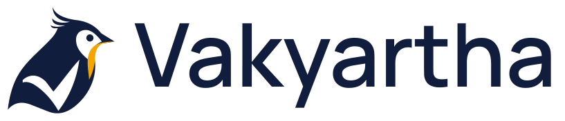
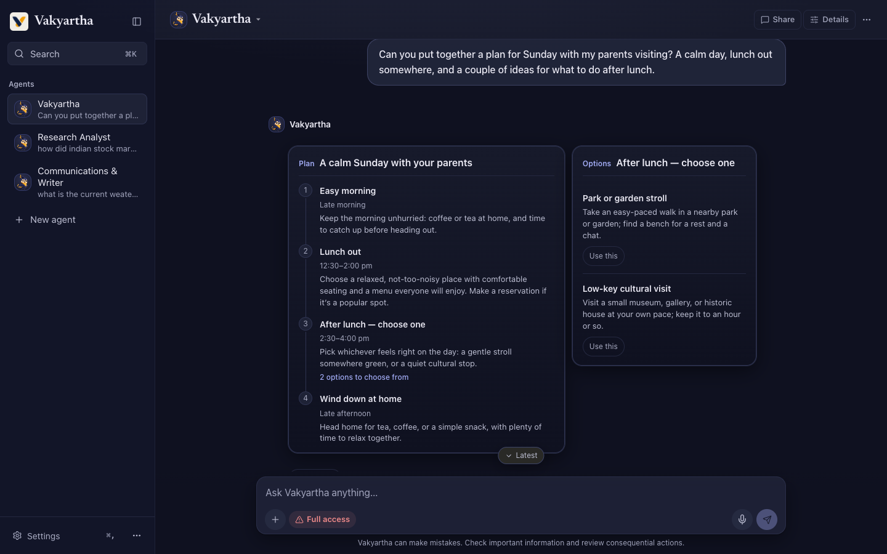
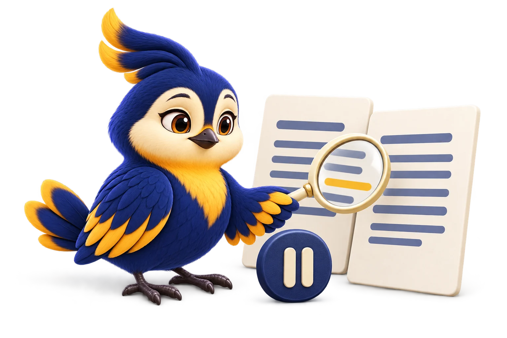
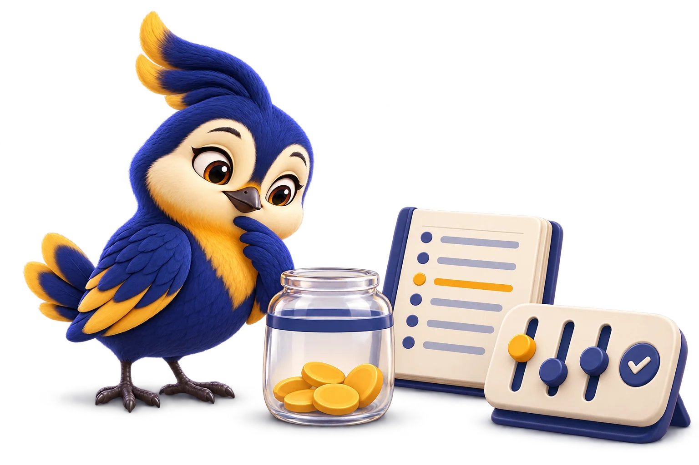
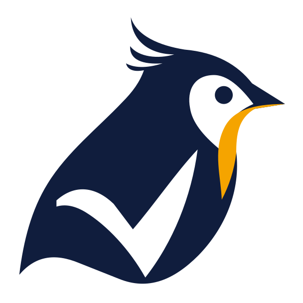

<div align="center">

<picture>
  <source media="(prefers-color-scheme: dark)" srcset="docs/brand/exports/vakyartha-lockup-reverse.svg">
  
</picture>

### From a request to work you can review.

An open-source AI agent for code, documents, research and everyday work.<br>
It runs on your machine, uses the model you choose, and works inside the boundaries you set.

[](CHANGELOG.md)
[](LICENSE)
[](Cargo.toml)
[](#get-started)
[](https://vakyartha.com)

[**Get started**](#get-started) · [What it does](#put-it-to-work) · [Why Vakyartha](#why-vakyartha) · [What's new](#whats-new-in-5x) · [Docs](docs/README.md) · [Website](https://vakyartha.com)

</div>

<picture>
  <source media="(prefers-color-scheme: dark)" srcset="docs/brand/library/wallpapers/ensemble-dusk-1920x1080.jpg">
  
</picture>

Work rarely fits inside one chat reply. A question turns into research, the research turns into a document, and a proposed fix needs a test, a diff and a decision.

**Vakyartha** keeps those steps in one place. Hand an agent a task, let it work with your files and connected tools, and look at what it made before anything lands. Steer it while it works, ask for changes to a draft, or come back next week and carry on where you left off.

> *Vākyārtha* (वाक्यार्थ) is Sanskrit for "the meaning of a sentence": understanding what was asked, and carrying it into useful work.

## Meet the companions

Every agent you create has its own character, instructions, conversations, workspace and schedule. Make a research analyst, a writer and a trip planner, and each keeps its own history.

<div align="center">

|  |  |  |  |  |  |  |  |
|:---:|:---:|:---:|:---:|:---:|:---:|:---:|:---:|
| **Vakyartha**<br><sub>attentive</sub> | **Mira**<br><sub>perceptive</sub> | **Moss**<br><sub>grounded</sub> | **Nori**<br><sub>practical</sub> | **Pip**<br><sub>resourceful</sub> | **Lumi**<br><sub>imaginative</sub> | **Tavi**<br><sub>measured</sub> | **Beni**<br><sub>dependable</sub> |

</div>

## Put it to work

Start with something you already need done:

| Bring a task | What Vakyartha does with it |
|---|---|
| **"Find out why these tests fail."** | Explores the code, runs the checks, and hands you a fix as a diff to review. |
| **"Tighten the summary in this report."** | Reads the Word or PDF file, cites the passages it relies on, and proposes tracked changes you accept or reject. |
| **"Compare these three options for me."** | Turns your material and fresh web research into a comparison with sources you can check. |
| **"Update this workbook and the deck that goes with it."** | Edits Excel and PowerPoint files as drafts, with previews of the cells, charts and slides that changed. |
| **"Plan a calm Sunday with my parents."** | Answers with a plan and options as interactive cards, not just a wall of text. |
| **"Check this every morning and tell me on Telegram."** | Sets up a scheduled routine for an agent and delivers results, and anything needing your attention, where you asked. |

<p align="center">
  
  <br><sub>A real answer in the app: the plan and the choices arrive as cards you can act on.</sub>
</p>

## Why Vakyartha

<table>
<tr>
<td width="50%" valign="top">



### Work you can inspect

Code diffs, document drafts, live previews and source citations give you something concrete to review. Drafts stay out of your folder until you accept them. Every model input, tool result and decision is kept in an append-only record, so you can trace how an answer was reached. Cancelling a run keeps what it had done.

</td>
<td width="50%" valign="top">


### Boundaries you choose

Pick read-only exploration, work inside one folder, or explicitly grant full access. Permissions are checked before every tool call, tools run in sandboxed worker processes, and keys and bot tokens live in your OS keychain or an encrypted store, never in a plain-text file. Nothing ever escalates to full access by itself.

[Read the security model →](docs/design/24-agent-security.md)

</td>
</tr>
<tr>
<td width="50%" valign="top">


### Your models, your tools

Use Anthropic, OpenAI, Google Gemini, OpenRouter, Amazon Bedrock, OpenCode Zen, any OpenAI-compatible endpoint, or a local model through **Ollama**. The model list comes from your own key, so new models appear the day they ship. Extend it with **skills**, **MCP servers**, **plugins**, **hooks** and **flows**.

[Explore extensions →](docs/design/09-extensibility.md)

</td>
<td width="50%" valign="top">


### Agents you can return to

Each agent owns its conversations, memory, workspace and routines. Reach it from the desktop app, the browser, the terminal, or Telegram, Discord and Slack. Long work has a finish line: goals are checked against evidence the runtime collected, not the model's word, and failed or unverified results stay visible.

[The agent-owned platform →](docs/design/64-agent-owned-platform.md)

</td>
</tr>
</table>

## What's new in 5.x


- **The Canvas.** Each conversation has a workspace beside it with tabs for files, drafts, saved versions, live dev servers and scheduled routines. Point at a line or a place in a document, comment on it, or ask the agent about it. Previews run on their own isolated origin with the network closed.
- **Office and PDF, built from scratch.** Vakyartha has its own engines for Word, Excel, PowerPoint, Visio and PDF, written from the specifications with no Office install or PDF library underneath. Read, cite and redline existing files or make new ones, all through a reviewed draft. Hidden text, macros and embedded scripts are labelled and never run.
- **A context engine that measures.** Each model's real capacity is probed, not assumed. Older turns are condensed into cards instead of being cut blind, and the agent can still recall any earlier result by reference.
- **Backup models across services.** Confirm that a model at another provider is the same one, and it becomes a fallback when your first choice is busy or down. Rate-limit cooldowns are coordinated across routes that share a key.
- **Headless hosting with passkeys.** Run Vakyartha on a server and sign in from your phone or laptop with an owner passkey and one-time recovery codes. See the [hosting guide](docs/hosting.md).
- **Rich cards in chat apps.** Plans, tables and results reach Telegram as formatted HTML, Slack as Block Kit and Discord as embeds, with plain text as the fallback.
- **Per-agent settings.** Each agent has its own permissions, approvals, memory policy, voice and plugins, and the settings show which values it inherits from your shared defaults.
- **Ink and Saffron.** A new visual system: readable type, plain words, and four themes (match system, light, dark and high contrast). Technical detail appears only when you ask for it.

See the [changelog](CHANGELOG.md) for every release.

<br clear="right">

## Built for work that continues


**Carry context forward.** Agents search past conversations and keep notes you can read and edit. Skills proposed from experience wait for your review before they're used. [Memory](docs/design/23-memory.md) · [Learning](docs/design/26-learning.md)

**Keep recurring work moving.** Give an agent a schedule, and its results and requests for attention land in your Inbox or a connected chat. If a routine can't run, it tells you why. [Scheduled work](docs/design/64-agent-owned-platform.md) · [Channels](docs/design/34-channel-onboarding.md)

**Talk or type.** Voice notes from chat apps are transcribed, and replies can be spoken. [Voice and its current limits](docs/design/49-live-voice.md)

**Stay in control of time and cost.** Set spend limits, steer or stop work mid-run with `/pause`, `/stop` or `/goal`, and use checkpoints to restore files. [Reliability](docs/design/15-reliability.md) · [Checkpoints](docs/design/14-checkpoints.md)

<br clear="left">

## Work where you are

| Surface | Use it for |
|---|---|
| 🖥️ **Desktop** (macOS, Linux) | Conversations, the Canvas, diff and document review, approvals, and a built-in terminal. |
| 🌐 **Browser** | The same workspace at `/app`, plus a management console at `/admin` for agents, routines, spend and operations. |
| ⌨️ **Terminal** | A full-screen client with `vak term`, or one-off requests and scripts with `vak exec`. |
| 💬 **Telegram, Discord and Slack** | Reach an agent from your phone. Each bot and chat has its own allowlist, permissions and approvals. |
| ☁️ **A server of your own** | Keep agents running around the clock on a headless box. See [hosting](docs/hosting.md) and the [AWS EC2 guide](docs/hosting/aws-ec2.md). |

<p align="center">
  
</p>

## Get started

Vakyartha runs on **macOS and Linux**. Bring a provider key or a local Ollama model; no hosted model is included. The command is **`vak`**.

### 1. Build and install

You need Git, a stable Rust toolchain, Node.js with npm, and Python 3.

```bash
git clone https://github.com/nranjan2code/code.git
cd code
scripts/build.sh
```

The script builds and installs Vakyartha. Follow its printed `PATH` instruction if it shows one. For a server without a desktop, use `scripts/build.sh --no-desktop`. The [installation guide](docs/release-and-install.md) covers updates, uninstalling, and first launch on macOS.

### 2. Connect a model and pick a workspace

```bash
vak setup
```

Setup walks you through the workspace, the AI service, the model and permissions. On a headless machine, use `vak setup --terminal`. Background services start only if you turn them on.

### 3. Give it a task

Open the desktop app, or start a conversation in the terminal:

```bash
vak term
```

Or send a single request:

```bash
vak exec "Explain this project and suggest a useful first improvement"
```

<details>
<summary><strong>Prefer the browser?</strong></summary>

Start the server:

```bash
vak serve --port 8901
```

Then, in another terminal, open the workspace:

```bash
vak open app
```

The server listens on loopback by default. `vak open admin` opens the management console. For remote access, follow the [hosting guide](docs/hosting.md).

</details>

If something needs attention, run `vak doctor` (or `vak doctor --repair` for checks with a known fix). `vak --help` lists every command.

## Under the hood



Every surface (desktop, browser, terminal and chat) talks to the same Rust core: a streaming agent loop, append-only session records, a permission engine, and tools executed by sandboxed workers.

- **Nothing the model sees goes unrecorded.** Every model request can be rebuilt from the session log.
- **Errors are values.** Provider failures retry within a planned route ladder, with a circuit breaker and cancel-aware backoff.
- **Small parts.** About thirty crates with clear seams, so the Office engine, the PDF engine and the intent layer can each be tested on their own.

Start with the [architecture tutor](docs/tutor/README.md), then the [agent loop](docs/design/03-agent-loop.md), [session record](docs/design/02-sessions.md) and [context engine](docs/design/68-context-engine.md). [AGENTS.md](AGENTS.md) is the engineering contract every change follows.

<br clear="right">

## On the roadmap

These are approved designs, not shipped features. Each design document has a `Status:` line.

- **Data architecture**: typed IDs, encrypted content-addressed storage, retention and erasure, and one catalog for search and lineage. [Plan](docs/plans/data-architecture-plan.md)
- **Mail and calendar**: governed account access, drafts you review, and nothing sent without your approval. [Design](docs/design/80-mail-and-calendar.md)
- **Intake and knowledge**: one path for feeds and documents into a searchable catalog. [Design](docs/design/76-intake-and-knowledge.md)

## Go further

- **Configure:** [Settings, providers and secrets](docs/design/05-config.md) · [Permissions](docs/design/08-permissions.md) · [Shared config](docs/design/44-shared-config.md)
- **Run always-on:** [Hosting](docs/hosting.md) · [Channels](docs/design/34-channel-onboarding.md) · [Admin console](docs/design/33-admin-console.md)
- **Build on it:** [Development guide](docs/development.md) · [Extensions](docs/design/09-extensibility.md) · [Plugins](docs/design/39-plugin-ecosystem.md) · [Flows](docs/design/10-flows.md)
- **Follow along:** [Release notes](CHANGELOG.md) · [Website](https://vakyartha.com) · [Brand and artwork](docs/brand/README.md) · [Wallpapers](docs/brand/library/wallpapers/)

## License and maintenance

The software and original documentation are [MIT licensed](LICENSE). The Vakyartha name, Songbird mark, companion characters, artwork and wallpapers are covered by [separate brand terms](docs/brand/README.md). Third-party components keep their own license notices.

Maintained by [@nranjan2code](https://github.com/nranjan2code). External pull requests are not accepted.

<p align="center">
  <picture>
    <source media="(prefers-color-scheme: dark)" srcset="docs/brand/exports/vakyartha-songbird-reverse.svg">
    
  </picture>
</p>
