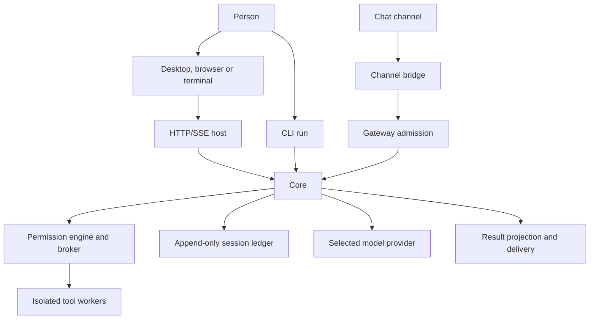

# Architecture diagrams

For the visual learning path, see the [architecture tutor](../tutor/README.md),
which links to the detailed request, agent, ledger, security, delivery,
configuration, flow, memory, desktop, Doctor, and Operations diagrams.

This overview renders directly on GitHub:

Interactive HTML documents describing how vak is put together. Open a file in
a browser without a build step. Some pages request web fonts; an offline
browser uses the fallback fonts.

GitHub displays linked `.html` files as source rather than running their
scripts. Download one and open it locally for its interactive view. The
diagram above and the tutor's PNGs remain readable on GitHub.

These are dated explanatory snapshots, not the source of truth for the current
crate graph or runtime. Check `Cargo.toml` and the relevant source before
using a diagram as implementation evidence.

| File | What it covers |
|---|---|
| [`layered-architecture.html`](layered-architecture.html) | A **static** five-layer dependency map from an earlier workspace snapshot. The current workspace has 28 members; use `Cargo.toml` for the complete list. |
| [`runtime-topology.html`](runtime-topology.html) | The **runtime** view: which processes exist, who hosts a `Core`, the gateway/channel request path, and what is shared-central vs. private-and-local. |
| [`concurrency-model.html`](concurrency-model.html) | An **animated** walkthrough of what happens when many calls arrive at once — same session (ledger lock → 409/steering), many sessions (one `Core`, rate limit), and many workspaces (`CorePool` eviction). |
| [`vak-works.html`](vak-works.html) | **The vak Works** — a playable, gamified view of the internals. Every component is a building and every message is a courier who walks the route: channels sit **outside a trust perimeter**, bridges are separate processes holding bot tokens, the gatehouse checks the allowlist, the bindings board writes `bindings.json`, cores are **built and demolished** in the pool, and the ledger tower only ever **grows**. Press **Trace a message** to follow one courier's entire life step by step, or click any courier to pick them up mid-route. |
| [`day-simulation.html`](day-simulation.html) | A **live 24-hour load simulation** of a `vak serve --gateway` host: a diurnal load curve with injected incidents (morning surge, provider-429 storm, lunch dip, workspace fan-out, traffic burst, nightly unattended batch), live component tiles, and a Grafana-style ops chart (throughput, latency p50/p95, concurrency/queue, errors/retries/auto-deny). Press **Play day**. |
| [`write-paths-and-growth.html`](write-paths-and-growth.html) | **Write paths & growth**: a measured earlier snapshot of durable writes and projected growth. Its 13 entries / 66 KB per turn and other measurements are historical; remeasure against the current storage code before making capacity decisions. |

These pages were built from the workspace manifests and source at their
respective review dates. Their styling and numbers are preserved as part of
those snapshots.

> The load figures in `day-simulation.html` are a **synthetic model** calibrated
> to the real constants (`rate_limit.rs` — 10 runs/min/IP; `core_pool.rs` — 4+1
> slots; `15-reliability.md` — retry ladder + circuit breaker), not measured
> production telemetry.
