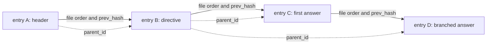
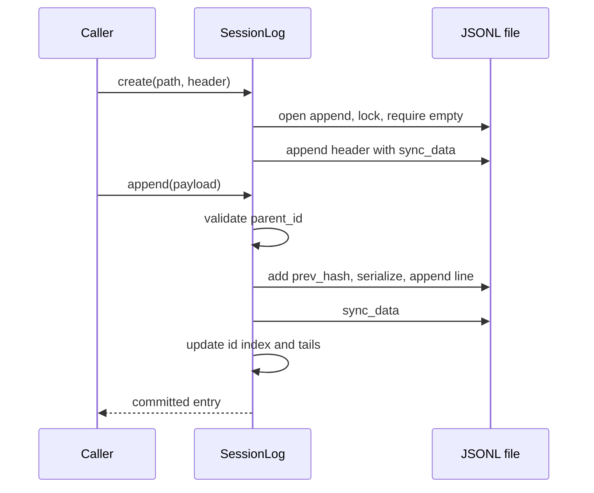
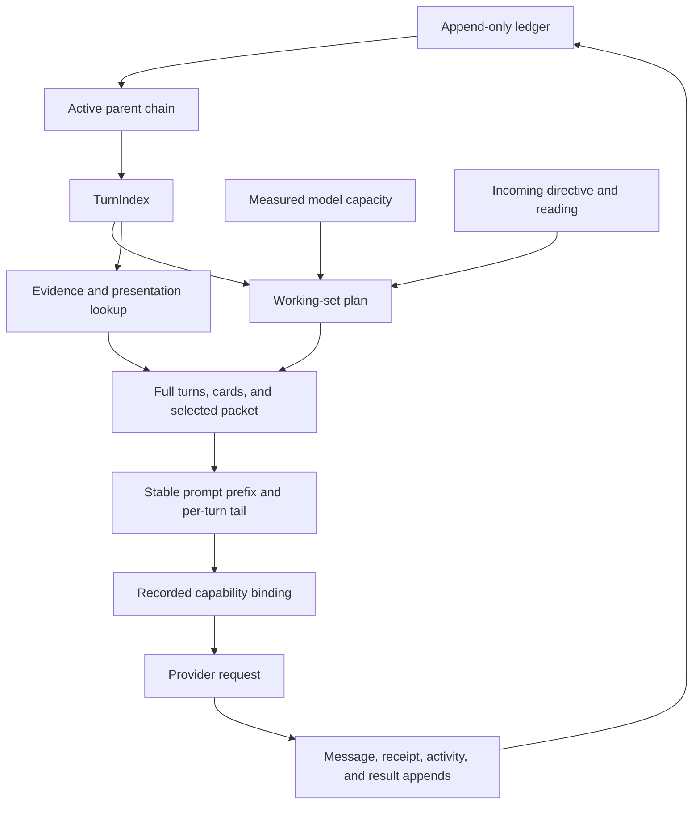
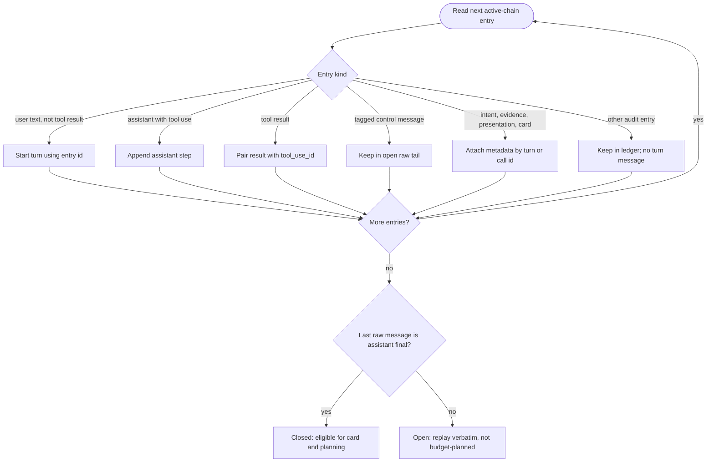
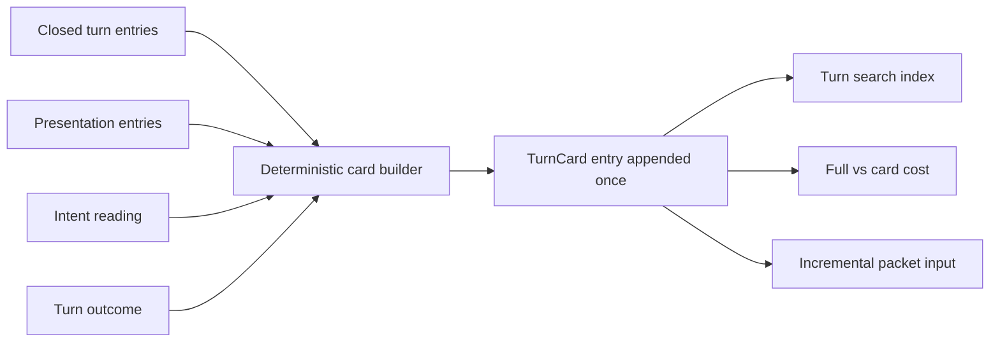
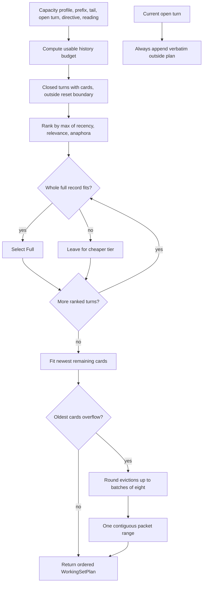
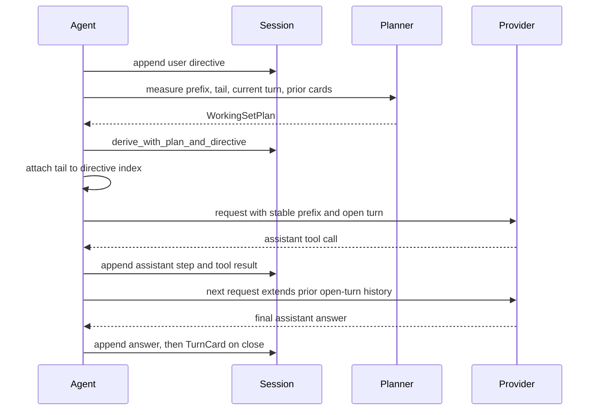

# 02 — Sessions: durable conversation and execution history

Status: implemented. The session ledger is the durable source for conversation
replay, request reconstruction, branching, and session-scoped audit records.
Capacity-aware projection is specified alongside this contract in
[`68-context-engine.md`](68-context-engine.md).

## Purpose

A session is the durable record of one agent conversation. It must answer two
different questions without confusing them:

1. **What happened?** The ledger preserves user messages, assistant steps,
   tool calls and results, runtime decisions, and relevant execution records.
2. **What should the model see now?** A deterministic projection selects and
   renders the parts of that record that belong in the next provider request.

The provider request is not itself the source of truth. Requests are assembled
from recorded session entries, plus explicitly recorded prompt and capability
bindings. This makes a model-visible input explainable after the turn and lets
the runtime replay a conversation without trusting a transient in-memory
transcript.

Sessions also provide a natural place to attach durable work, evidence,
presentation, and lifecycle facts to the conversation that produced them. They
do not replace the workspace, shared task store, checkpoint store, or other
domain-specific stores. See the relevant design documents for those contracts.

## Design choices

### Append-only records

Entries are never edited or removed. A correction is another entry; a new
interpretation is another entry; a branch changes the active tail and then
appends new entries. This preserves the exact record of what the runtime saw
and did, including failed attempts and superseded work. It also avoids making
recovery depend on rewriting a potentially large transcript safely.

The append-only rule is a durability contract, not a claim that the file is
immutable against an administrator. Hash links make accidental or direct
edits detectable when a later linked entry remains intact; they are not a
signature, external anchor, or proof against an actor who can rewrite the
whole file.

### One JSONL ledger per session

The on-disk representation is newline-delimited JSON. Each non-empty line is
one independently deserializable entry. Appending has a small, clear commit
boundary, and a reader can recover the valid prefix if a process stops during
the final write. JSONL is also inspectable with ordinary tools and allows
future entry kinds to be added without replacing an entire session document.

The location is derived from the Agent's sessions home, the id of the space
the workspace is bound to, and the session id
(`vak_config::scope::AgentScope::session_file`):

```text
<agent sessions home>/sessions/<space id>/<session-id>/   # record segments
```

A space id is a `spc_` UUIDv7 minted when a folder is first opened as a
workspace and kept, with this machine's path bindings, in the tenant's space
registry (`vak_config::spaces`, data-architecture plan M3b slice 5). It is
never a hash of the path. The Agent identity and session ownership come from
the owning Agent's home and the header; the space id only partitions sessions
by workspace. Path resolution and the Agent-home layout are owned by
`vak_config::paths`, `vak_config::scope` and `Core`, not duplicated by
callers.

### Parent pointers plus a hash chain

Each entry has an id, a `parent_id`, timestamp, payload, and optional
`prev_hash`. `parent_id` defines the active conversation history. `prev_hash`
links the serialized bytes written on disk, allowing edits to linked history
to be noticed independently of the logical parent relationship.

The two links have different jobs:

| Field | Answers | Used by |
|---|---|---|
| `parent_id` | Which earlier event is this event based on? | Active-chain traversal and branching |
| `prev_hash` | Do these exact bytes follow the previous physical ledger line? | Damage and edit warnings |

The current implementation appends entries physically and links ordinary
appends to the active tail. Branching moves the in-memory tail to an existing
entry; the next append points to that entry while its physical hash link still
points to the last line in the file. Thus the file preserves all branches,
while `parent_id` selects the currently active path. Hash verification is
performed over the exact serialized line that was written, avoiding
re-serialization differences.

### Typed event payloads

`EntryPayload` distinguishes conversational messages from records with other
purposes. The type is a boundary: projection code must decide explicitly how
each kind participates instead of treating every JSON object as chat text.
The set evolves with shipped capabilities; the principal families are:

| Kind | Why it is recorded | Raw model projection |
|---|---|---|
| `Header` | Admission snapshot and session ownership | No |
| `Message` | User, assistant, or tool-exchange message | Yes, subject to turn projection |
| `Compaction` | Reusable context packet or reset handoff | Only when selected by projection |
| `Receipt` | Provider dispatch attempts and settlement evidence | No |
| `Goal`, `GoalUpdate`, `Work` | Durable objective and managed-work lifecycle | No; selected work context has its own rendering contract |
| `Activity` | Runtime and UI lifecycle facts | No |
| `Intent` | Resolved intent, provenance, and recorded visible contribution | Only its recorded `model_visible` text, under current intent rules |
| `ChildRun` | Child completion before the parent observes it | No |
| `TurnCapabilitiesBound`, `TurnCapabilitiesRef` | Exact per-turn tool and prompt interface | No; audit and reconstruction metadata |
| `Presentation` | Validated, canonical display payload and evidence lineage | No raw payload; selected through turn rendering |
| `TurnCard` | Immutable summary of a closed turn | Rendered as a card or promoted turn record |
| `EvidenceBody` | Full backing body when a tool result was windowed | No raw body; available to recall and digest construction |

This list is explanatory rather than a frozen wire schema. The Rust enum and
serde representation in `crates/vak-session/src/types.rs` are authoritative.
New model-visible material must have a durable representation and a defined
projection; new audit data must not leak into model context by default.

## Ledger and active history

The JSONL file is the physical history. A session handle indexes parsed entry
ids in memory, tracks the physical tail hash, and tracks the active logical
tail. The active chain is obtained by following `parent_id` from that tail to
the root, then reversing the result into chronological order.



Solid arrows show physical write order and hash links. Dotted arrows point
from a parent entry to its child and show logical ancestry. B and C are one
branch; D forks from B. The active tail is either C or D, held by the open
session handle. The physical file contains both branches in either case.

Branches are not separate files or rewritten copies. `branch_at(entry_id)`
sets the active tail to an existing entry. The next normal append uses that
entry as its parent. The abandoned suffix remains in the file, but no longer
contributes to active-chain projection or active-chain usage totals.

The entry id is the stable identity used to connect messages, turn cards,
presentations, and recall operations. New entries use UUIDv7 ids. The entry
timestamp is useful for ordering and display, but it does not define identity
or ancestry.

### What the header freezes

The header is an admission record, not a serialization of every live setting.
Its frozen contract answers: which application version admitted this
conversation; which route was initially selected; what system prompt,
capabilities, and permission mode were admitted; and which prompt layers
contributed to that prompt. Prompt-layer descriptors keep provenance and
digests alongside the assembled prompt bytes. This makes later configuration
drift visible without rewriting the original admission.

Some fields are authoritative for the session lifetime and others are
historical snapshots. In particular, permission mode and the admitted
capability packet are session contract fields. Initial provider, model, route
ladder, and route annotations are snapshots only: live per-turn route planning
chooses the actual dispatch, and its `WorkReceipt` records the winning and
failed attempts. A `TurnCapabilitiesBound` stores the exact prompt/tool
interface for a turn; if its digest matches an earlier binding, a
`TurnCapabilitiesRef` points to it instead of copying the same schema packet.
The reference is an audit/storage optimization; it does not authorize a
different capability set.

The header may also bind agent identity/revision, conversation and audience
identity, ingress surface/address/bot, and parent-session or managed-work
links. These are ownership and provenance facts. They are not interchangeable:
a transport address is not the audience principal, and a child session does
not become part of its parent's message history.

## Entry format and admission snapshot

An entry has the following outer shape; payload fields are flattened into the
same JSON object and `kind` discriminates them:

```json
{
  "id": "uuidv7",
  "parent_id": "previous-active-entry-id",
  "ts": "RFC3339 timestamp",
  "prev_hash": "sha256 of preceding physical line",
  "kind": "message",
  "message": { "role": "user", "content": [] }
}
```

The first record is a `Header`. Its `FrozenContract` records the admission
snapshot: app version, initial provider/model and route plan, system prompt,
permission mode, capabilities, and prompt-layer provenance. Session ownership,
conversation/audience, workspace, and parent-session links are also recorded
where applicable.

The header is not a promise that every future turn uses the same provider or
model. Current route planning happens per turn. `WorkReceipt` entries record
actual attempts, settlement, and usage for a work unit; those receipts are the
authority for reconstructing dispatch. Likewise, the exact capability
interface for a provider turn is recorded with a binding entry or a reference
to an earlier identical binding. The header describes admission; turn records
describe execution.

## Write, open, and recovery algorithm

### Creating a session

1. Resolve the agent sessions home and workspace through the canonical path
   APIs; derive the stable session file path.
2. Create parent directories and open the file for append without truncation.
3. Acquire an exclusive non-blocking file lock for the lifetime of the
   writable handle. A second writer receives `SessionError::Locked`.
4. Refuse to create if the file is already non-empty. This prevents a second
   header from being appended to an existing session.
5. Append the header as the first entry and synchronously commit its data.

### Opening a writable session

1. Open the append handle and acquire the exclusive lock before reading.
2. Parse each non-empty line as an `Entry`, retaining valid entries and
   rebuilding the id index.
3. Verify each available `prev_hash` against the immediately preceding
   parseable line when the chain is uninterrupted; report mismatches and
   legacy-unlinked portions as warnings.
4. Skip an unparseable line and report its physical line number. A torn final
   write therefore does not make the valid prefix unusable. The on-disk file
   is never repaired or rewritten while opening.
5. Set the active tail to the final valid entry. Session selection or an
   explicit `branch_at` can then choose an earlier logical tail.

Every append validates that its `parent_id`, when present, names an indexed
entry. The implementation sets `prev_hash` to the physical tail digest,
serializes once, writes one line, calls `sync_data`, and only then updates the
in-memory index and tails. This order ensures the in-memory handle does not
claim an append succeeded before the file data was committed.

Read-only open does not acquire the writer lock and cannot append. It supports
inspection while another process owns the writable session. The lock is
explicitly released when the writable handle drops; relying on descriptor
close would keep the lock alive while duplicated descriptors remain open in
spawned child processes.



This ordering matters. If validation, serialization, writing, or synchronization
fails, the caller receives an error; the in-memory index is updated only after
the file append has synchronized. The ledger does not promise that a sequence
of separate appends is atomic as a group.

### Recovery limits

Recovery is best-effort and evidence-preserving. A malformed line is skipped
and surfaced; a hash mismatch is warned about, not silently blessed. After an
unparseable line, verification restarts without comparing the next valid
entry's hash against the last valid entry, because the skipped bytes may have
been its actual predecessor. Subsequent contiguous valid entries are checked
again. Because the session is append-only, the runtime does not truncate a
damaged suffix or repair hashes automatically. Operators and callers can
inspect `warnings()` and decide how to proceed.

## From ledger to provider request

The central invariant is:

> Every model-visible input is reconstructable from the session ledger and
> the recorded bindings used to assemble that request.

The agent loop does not build the history from a separate mutable transcript.
It asks the session/context pipeline to derive a projection. Without a
capacity plan, `derive_messages()` provides every closed turn after the
effective reset boundary at full-record fidelity and the current open turn
verbatim. For a normal provider request,
`derive_with_plan()` applies a `WorkingSetPlan` chosen for the bound model's
measured capacity. Both paths preserve complete turns and use explicit entry
rules.



The ledger contains both conversational messages and non-message facts. The
projector decides which facts become messages, which become compact context,
and which remain audit-only. A session entry that is audit-only must not
become visible merely because it exists in the ledger.

### Turns are the unit of replay

`TurnIndex` walks the active chain once and groups entries into turns. A turn
starts with a user text directive and includes assistant steps, tool calls,
tool results, and the final assistant answer. A tool exchange remains paired
with the call that caused it. The index also associates intent, evidence,
presentation records, turn cards, and compaction packets with their owning
turns.

The grouping algorithm is structural; it does not infer message roles from
their text. In chain order it behaves as follows:

1. A normal user message containing text and no tool result starts a turn. Its
   entry id becomes the stable turn id.
2. An assistant message containing one or more `ToolUse` blocks becomes a
   step. An assistant message without a tool call is remembered as the latest
   candidate final answer.
3. A user-role message containing `ToolResult` blocks appends each result to
   the most recent step by `tool_use_id`; result ids are also recorded as the
   turn's evidence handles.
4. A control-tagged message is neither a new directive nor a step. While the
   turn is open it is retained in the raw tail so the next request can replay
   the nudge exactly.
5. Intent records attach the resolved reading to the most recent turn;
   evidence bodies attach full windowed results by tool call id; presentations
   and stored turn cards are joined by turn id after the chain walk.
6. The last turn is open unless its final raw-tail message is an assistant
   message without a tool call. A later control nudge or tool result therefore
   keeps a preceding text draft open until the assistant answers again.



In the implementation, ordinary entries that are not messages or attached
turn metadata do not alter turn structure. A later user directive also
establishes that the prior turn is no longer the active open turn. The
diagram's closure decision describes the final active turn, which is the only
turn that can still be open.

Control messages such as runtime-authored retry or stop-gate nudges are
structurally tagged. They are included verbatim while the current turn is
open, because the next model call must see them. They are not treated as
user-authored directives, and once the turn closes they are omitted from the
closed-turn replay. A draft answer followed by a nudge or a tool result is
still an open turn: only a fresh final assistant message at the raw tail closes
it.

This grouping prevents a context budget from retaining a user request while
dropping the tool result or assistant action that explains its answer. It also
allows a complete turn to be represented at different levels of detail.

### Closing a turn and writing its card

The run loop writes a `TurnCard` after a turn has actually closed and only if
the turn does not already have one. Closing does not call a model to invent a
summary. It deterministically gathers the user directive, non-presentation
tool trace lines, validated presentation references, outcome, intent reading,
and narration. Short narration stays verbatim; long narration is reduced by
the existing narration resolver. The host's capacity profile estimates the
token cost of the full record and the card index text. Both measurements are
stored in the card so later planning can compare representation costs.

The card has two jobs. It is a compact, searchable index for a past turn, and
it is the stable input to incremental packet summarization. It does not
replace the underlying turn. A card created for an older ledger that predates
turn cards can be synthesized in memory for planning; that compatibility
projection does not mutate the ledger. Once a card is durably written, later
turns read it rather than recomputing its content under new code.



### Working-set projection

The planner uses the measured capacity profile for the currently bound model,
the prompt and tool prefix size, the incoming directive and intent reading,
the open turn, and a reserved output budget. The usable history budget is the
instruction horizon less the measured prefix, request tail, output reserve,
and a reserve for the current open turn. Closed turns are then assigned one
of three forms:

| Form | Request representation | When useful |
|---|---|---|
| Full | Directive, actual assistant/tool-call pattern, digest-backed tool results, presentations, and narration | Recent or retrieved turns whose detail matters |
| Card | One concise line describing asked/did/answered, outcome, and evidence ids | Older turns worth retaining cheaply |
| Packet | One summary over a contiguous older range | History beyond the card working set |

The current open turn remains verbatim. Closed turns are never split. A
working-set plan explicitly names per-turn fidelity and, when needed, one
inclusive packet range. See `68-context-engine.md` for the capacity model,
selection scoring, evidence digest formats, prefix stability, and drift
handling.

The planner's selection is a deterministic, pure calculation over its inputs;
it performs no file or network I/O. It first excludes open turns, turns
without a usable card, and turns hidden behind the latest reset handoff. It
then scores eligible closed turns for full fidelity:

```text
value(turn) = max(recency, normalized_BM25_relevance, anaphora_bonus)
recency     = 1 / (1 + number of newer closed turns)
anaphora    = 1 for the immediately preceding closed turn when the directive
              contains a recognized reference such as "that", "again", or
              "the same"
```

The relevance query combines the directive text with the resolved reading's
act and domain terms. For non-minimal readings, turn-card index text is scored
with BM25 and normalized against the strongest match. A minimal reading
disables older relevance retrieval and gives only the two newest turns
recency eligibility for full fidelity; anaphora can still promote the
preceding turn. Recency and relevance compete for the same budget at equal
weight. The planner considers turns in descending value order, fitting a
whole full record when it fits and skipping an expensive turn to consider a
cheaper one below it. A relevance promotion is recorded in `plan.retrieved`.

After full turns are selected, remaining turns are considered for card form,
newest first. The planner first determines the minimum number that must be
evicted for the card costs to fit, then rounds that eviction count up to a
multiple of eight. That batch rule keeps the packet's end boundary stable
across several requests, allowing exact-range packet reuse rather than
re-running a summary for every newly aged turn. The evicted turns are
contiguous and form one oldest-to-newest packet range. Anything that does not
fit a tier is deferred intact to the next cheaper tier; the planner never
truncates a turn to make it fit.



Compaction is incremental and packet entries are caches. A packet is keyed by
its exact first and last turn ids and is used only when the current plan asks
for precisely that range. If a larger model later has room for those turns,
it can project the original ledger entries in full even if a smaller model
previously caused a packet to be written. Growing a packet reuses the longest
stored packet with the same first turn and summarizes only additional turn
cards, not raw tool dumps.

The exceptional `reset_all` handoff entry is a real projection boundary. It
allows recovery when no usable context horizon exists; earlier entries remain
on disk and recallable, but the model projection uses the handoff summary as
the boundary. A regular packet never hides original history. If a plan names a
packet range whose exact packet has not yet been appended, the projector
temporarily renders those turns as cards rather than dropping them. If a stale
plan fails to classify a newly appended closed turn, that turn also falls
back to a card. These safeguards prefer extra context over silent loss.

### Evidence and presentation records

Tool results are conversational evidence. The call and its result are logged
as messages. When an oversized current result is windowed for the request,
the exact window is the `ToolResult` message the model saw and an
`EvidenceBody` entry preserves the full body. Closed-turn projection replaces
large results with deterministic shape-based digests that retain evidence
ids; the `recall` capability can retrieve the original result or a range.
Errors remain visible verbatim. This keeps old turns useful without copying
large outputs into every later request.

A validated presentation is persisted as a canonical `Presentation` entry at
validation time, along with its digest, identity, and evidence lineage. Both
display and model projection consume that entry. The projector does not
recreate a presentation from tool arguments, which could drift as code or
schemas change. When a past full record is rendered, the original tool call is
kept only when its result exists, the corresponding tool result is kept as a
short presentation acknowledgement, and duplicate inline presentation fences
are removed from narration. Non-presentation tool results become
shape-specific evidence digests; errors remain as recorded. Thinking blocks
are removed from closed-turn history. These rules preserve provider-valid
call/result pairing while teaching later turns what actions were taken without
replaying large raw outputs.

### Within-turn replay and stable request prefixes

During an unfinished turn, the next provider request extends the prior
request with the newest assistant step and tool results. The existing prefix
is preserved byte-for-byte as the runtime appends to the open turn. The
request tail (time, latest intent note, work contract, thread, and eligible
workspace delta) is attached to the current directive at a stable index; it is
not reattached to whichever user-role message happens to be last after tools
or nudges have been appended. This prevents a previous request's directive
from changing shape between steps and supports provider prefix caching.

Some providers require selected reasoning blocks to be replayed during tool
use; that provider-specific within-turn rule is owned by the provider adapter.
Closed-turn projection drops thinking. A tool result may be windowed on the
current turn and its full body stored separately. If the next request still
exceeds the measured horizon, the context planner may digest the oldest
current-turn result and re-plan; this is an explicit replan that may break the
cache prefix, never a character-count truncation.



## Audit and user-facing views

The model projection, human transcript, and audit trail are related but
different views over the same ledger:

| View | Main API | Content policy |
|---|---|---|
| Provider history | `derive_messages()` / `derive_with_plan()` | Capacity-aware, turn-based, excludes audit-only entries |
| Human conversation | `derive_conversation()` | Message history without runtime control nudges |
| Detailed transcript | `derive_transcript()` | Raw message entries and visible compaction markers, with authors and attachments |
| Audit and domain projections | Typed entry accessors and projectors | Receipts, activities, work state, capabilities, evidence, and lifecycle facts |

Keeping these views explicit avoids two common failures: showing internal
runtime bookkeeping as if the user said it, and omitting execution records
needed to understand or reconstruct a model request.

Usage totals and other active-conversation calculations follow the active
chain. Entries that only exist on an abandoned branch do not contribute.
Similarly, transcript and session search access must honor the shared trash
and visibility rules before opening a ledger; callers must not bypass the
session APIs by reading a JSONL file directly.

## Failure handling and operational guarantees

| Condition | Behavior | Reason |
|---|---|---|
| Another writer holds the session | Return `SessionError::Locked` | Never interleave appends |
| Create targets a non-empty ledger | Refuse creation | Never place a second header in a session |
| Invalid parent id on append | Reject append | Preserve a traversable ancestry graph |
| Torn or invalid JSON line | Skip and add a warning | Keep the valid session prefix usable without editing evidence |
| Broken hash link | Open with a warning | Preserve readable evidence and report integrity loss |
| Old entry lacks hash link | Open with an unverified-history warning | Older supported records remain readable |
| Read-only handle attempts append | Reject append | Make inspection incapable of mutation |
| Provider routing changes after admission | Use fresh per-turn route; record receipt | Header route is an admission snapshot, not dispatch authority |
| A smaller model previously caused compaction | Re-plan against current model; recover original turns when budget allows | Packets do not define history boundaries |

The lock is process-wide and held for the lifetime of a writable handle. Each
successful append calls `sync_data` before the in-memory state advances. This
prevents cooperating writers from interleaving and asks the platform to commit
the appended data. The ledger does not claim transactional atomicity across
multiple entries: a multi-entry turn may be interrupted, and the open-turn
algorithm is designed to resume from its last recorded point.

## Invariants for contributors

1. **Append only.** Never rewrite or delete session entries. Branch with a new
   active tail; correct by appending.
2. **Log before model visibility.** Any material sent to a model must be
   reconstructable through session projection. Add an entry type when a new
   kind of model-visible input is introduced.
3. **Project by explicit type.** New payload kinds default to audit-only until
   their model and human projection behavior is deliberately specified.
4. **Keep turns whole.** Planning can change fidelity, but it cannot split a
   closed turn or detach a tool result from its call.
5. **Keep the ledger authoritative.** Turn indexes, cards synthesized for
   legacy data, projections, and search rankings are derived state. Persist a
   card or packet only under its defined append-only contract.
6. **Separate admission from execution.** Header fields are admission
   snapshots where documented. Per-turn receipts and capability bindings
   govern reconstruction of what was actually dispatched.
7. **Do not treat hashes as authorization.** Hash links expose modification;
   permission, access control, and secret handling belong to their own
   security boundaries.
8. **Resolve paths centrally.** Use `vak_config::paths` and the owning
   `Core`/agent home accessors. Do not invent a parallel session path scheme.
9. **Honor lifecycle visibility.** Reads, exports, search, and restore flows
   must honor trash and workspace boundaries. Never open a ledger file as a
   shortcut around those policies.

## Implementation map

| Concern | Implementation |
|---|---|
| Entry schemas, ids, hashes, typed payloads | `crates/vak-session/src/types.rs` |
| File lifecycle, locks, append, recovery, branching, projection | `crates/vak-session/src/log.rs` |
| Turn reconstruction, evidence digests, turn cards | `crates/vak-session/src/turns.rs` |
| Reading a ledger from a position (what the catalog tails) | `crates/vak-session/src/tail.rs` |
| Cross-session search, lineage and "where is session X" | `crates/vak-catalog` (plan M6) |
| Context capacity, working-set planning, request assembly | `docs/design/68-context-engine.md` and `vak-context` |
| Provider attempts and route provenance | `docs/design/15-reliability.md` and `docs/design/42-managed-work-contracts.md` |
| Durable work and goal projection | `crates/vak-session/src/work.rs`, `docs/design/42-managed-work-contracts.md` |

The design documents for prompts, permissions, checkpoints, presentation, and
agent ownership define adjacent contracts. This document owns the ledger and
session projection boundary; it does not override those domain rules.
