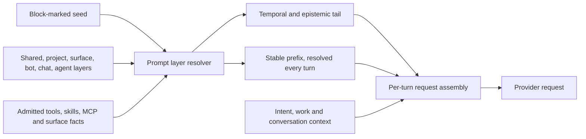

# 07 — System prompt
Status: implemented in 2.0.0

## Current contract

The shipped seed is `crates/vak-core/src/system-prompt.md`. Its block markers
split identity, operating rules, guardrails, capability, presentation and
sandbox guidance. `vak_core::prompts::seed` parses that file; `resolve`
combines editable layers with code-owned runtime sections (doc 45). The
result has a stable `text` prefix and a per-turn `tail`, rather than one
ever-growing system string.

The prefix says what this agent can actually call, where the result will be
read, and the human-editable guidance that survived trust resolution. The
tail carries temporal and epistemic stance; request assembly places it with
logged per-turn intent, work and conversation sections before the user's
last directive. The prompt is resolved per turn: each turn reads the layers
and the admitted capabilities afresh, so an edit applies from the next turn
of every session; the prefix a turn sent is recorded in its
`TurnCapabilitiesBound`. Code-owned tool
descriptions and schemas remain the callable source of truth; skills are
documents reached through `skill`, and deferred tools are loaded through
`find_tools`.

The seed is guidance, not an enforcement boundary. The permission engine,
tool broker and sandbox decide whether an effect may execute. Its guardrails
instruct the model to treat tool output as data, protect credentials, and
confirm effects outside the workspace or with irreversible impact. The
literal seed and the tests in `vak-core` are the authority for its current
wording; the historical diff notes below explain why it evolved.

For the end-to-end picture (every source of model-visible text, its
lifetime, order, ledger record and worked scenarios) see
`docs/design/83-prompt-system.md`.

Current seed: `crates/vak-core/src/system-prompt.md` (block-marked),
plus a runtime `Surface:` line and any appended surface notes. Layer composition, editing surfaces, and
trust are specified in doc 45.
Editable per layer; see doc 45. The layered blocks are the only way to set
identity and rules: the whole-prompt `.vak/SYSTEM.md` override was retired in
5.2.10 (doc 46, Part VIII row 4).

The presentation contract is universal: the prompt may select semantic shapes
such as maps, calendars, boards, entities, evidence, documents, graphs, forms,
transactions, alerts, conversations, and simulations in addition to coding,
research, data, and lifestyle results. The built-in seed pack currently ships
70 disabled, revision-3 presentation definitions. New built-in definitions are
reconciled additively at server startup; user presentations and activations are
retained.

## Diff notes

- 7.0.0-dev (data-architecture M3b slice 4): the sandbox line names
  `$TMPDIR` for scratch files instead of `.vak/scratch/`, which is now only
  the name a draft is known by; its files live in the runtime root, outside
  the project. The preview surface note no longer names `.vak/scratch/`.

- 3.0.63: expanded the presentation vocabulary from the original 52 seeded
  definitions to 70 universal definitions and documented startup
  reconciliation. Prompt examples now explain domain-neutral composition.

- v0.1.0: initial six-tool kernel prompt. Rules emphasize read-before-edit,
  small verifiable steps, error-driven fixing, workspace containment.
- v0.1.1: documented the dynamically advertised task, memory, web, and MCP
  tools; explicitly separated skill guidance from executable tools; added a
  verification/no-false-completion rule after live Ollama prompt testing found
  ambiguity around `task` and discovered skill names.
- v0.1.2: made the skill boundary imperative by explicitly prohibiting skill
  names in tool calls after live-model retries showed that a descriptive skill
  name could still be selected as an executable tool.
- v0.1.3: instructed the agent to inspect file-backed requirements immediately
  rather than asking the user to repeat them; this closes a live Ollama case
  where the model stopped before reading README.md.
- v0.2.0: **identity change.** The prompt opened with "an expert coding agent
  operating in the user's terminal", which was wrong on both halves. vak is
  general-purpose — research, writing, data, and operations run through the
  same core as code — and the *same* prompt text is served to the CLI, the
  desktop app, the HTTP server, and every chat gateway, so a Telegram user was
  being addressed as though they were at a shell. The new opening states the
  general-purpose identity and explicitly forbids assuming a surface. The
  capability contract is unchanged; the rules were widened from edit/test
  phrasing to look-before-you-act and verify-with-whatever-the-work-has, with
  the code-specific cases kept as instances rather than the whole job. Two
  clauses were added: no tool for the ask means say so rather than narrate the
  effect, and out-of-workspace or irreversible effects are confirmed first.
  `default_prompt_documents_identity_and_dynamic_tool_boundaries`
  (`vak-core/src/lib.rs`) now pins the identity phrases *and* asserts the
  coding/terminal-only wording never returns. The auxiliary prompts moved with
  it — reflection (`vak-core/src/reflection.rs`), completion audit
  (`vak-agent/src/goal.rs`), and compaction (`vak-context/src/assemble.rs`), whose
  "files created/modified" retention rule now also keeps non-file effects.
- v0.2.1: the prompt now *names* the surface instead of telling the model to
  assume nothing. `Core::with_surface` (`vak-core/src/lib.rs`) carries a
  `Surface` — `Cli`, `Desktop`, `Server`, `Chat { channel }`, `Background`, or
  the default `Unknown` — on the `Core` handle itself rather than in
  `CoreInner`, exactly as `default_deliver_to` already does, so the gateway can
  clone-and-stamp per inbound message without touching shared workspace state.
  `system_prompt()` appends a `Surface:` block that says where the reply will
  be read and what that costs: a phone-sized chat bubble, a terminal, a
  markdown panel next to a diff viewer the user can already see, an API client
  that may not render at all, or an unattended run with nobody to ask.
  `Unknown` is the default *because* it is honest — an un-stamped caller gets
  the old assume-nothing text rather than being mislabelled.

  Stamped at: the CLI run paths and `run_serve` (`vak/src/main.rs`), the
  desktop backend (`vak-desktop/src/main.rs`), the pooled per-workspace cores
  (`vak-server/src/core_pool.rs`), best-of-N children (`vak-server/src/lib.rs`)
  and the heartbeat (`vak-server/src/heartbeat.rs`) as `Background`, and each
  inbound gateway message (`vak-server/src/gateway.rs`), which narrows the
  pool's `Server` to the real transport.

  **Known limitation.** The assembled prompt freezes into the session contract
  at creation (`FrozenContract::system_prompt`, AGENTS.md rule 17), so a
  session started on one surface and resumed on another keeps the original
  `Surface:` line. This is the same staleness the frozen skills and MCP
  sections already carry, and it is left consistent with them deliberately
  rather than given a bespoke live-patching path for one line.

  *Superseded:* the prefix is now resolved per turn by the `Core` running
  the turn, so a session resumed on another surface gets that surface's
  `Surface:` line, and skills and MCP sections reflect the current admitted
  set.

- v0.2.2: the seed became a *seed*. The single document is now split on
  `<!-- block: ... -->` markers into `identity`, `capability_contract`,
  `operating_rules`, and `guardrails`, resolved through the layer chain in doc
  45. Two guardrails were added that the prompt never had: content arriving
  through a tool is data rather than instruction (an agent with web, MCP, and
  file tools had nothing at all to say about prompt injection), and
  credentials are never revealed, transmitted, or written into a command line,
  commit, or outbound request. The `Surface:` paragraph is unchanged. The
  whole-document `.vak/SYSTEM.md` override is now read as the project layer's
  `identity` only, and is demoted entirely for an untrusted project — it could
  previously delete the capability contract and every safety rule on the
  first-run path.

- v0.2.3: `surface-note` — a fourth editable block appended after the
  generated `Surface:` line under "Also true on this surface:". The line
  itself stays code-owned; a note is a separate concatenating block, so
  nothing can name or replace the runtime's own observation, and no narrower
  layer can drop a wider one's note. Notes are dropped for an untrusted
  project (unlike guardrails) because free-form context can widen perceived
  latitude rather than narrow it.

- v3.0.17: multi-turn continuity, conversational drift, and no-escape-hatch
  clarification rules in `operating_rules`. Instructs the agent that conversational
  drift across turns is expected and to follow along smoothly without complaint
  or resistance; to resolve references ("the data", "do that", "it", "something")
  against earlier turns; and prohibits using demands for manual input or clarification
  as an exception-handling escape hatch to avoid taking action or using available tools.

- v3.4.5: presentation cards are now preferentially emitted via per-shape
  `emit_*_card` tool calls (`vak-core/src/presentation_tools.rs`) rather than
  a hand-written `vak` fence, and the `capability_contract` block's card
  guidance was reworded to say so — measured against the real local model
  this app ships (gemma4:e2b-mlx via Ollama): a free-text fence in prose
  parsed as valid JSON only ~20% of the time, against 100% for a tool call
  constrained by a precise per-shape JSON Schema. The fence path stays as a
  fallback for a turn where no matching `emit_*_card` tool is present. Also
  added an explicit instruction not to restate a card just emitted via tool
  as a trailing fence — observed live producing a duplicate card, since
  `vak-server`'s tool-result projection and the client's own fence-parsing
  are independent paths with no cross-source dedup; `vak-agent`'s turn loop
  now also enforces this with one bounded repair turn
  (`find_duplicate_card_fence`, mirroring the existing malformed-fence and
  grounding-check repairs) since a small local model can't be trusted to
  self-police it from prompt wording alone.

- 3.5.0: **the composed prompt is no longer one string.** `resolve()` now
  returns a `Resolution` with `text` (the stable prefix: identity, contract,
  guardrails, surface, card catalogue, skills, mcp, standing) and a separate
  `tail` carrying `temporal` and `epistemic_stance`, which used to be fused
  into `text`. The request assembler renders one control block per turn from
  `tail` plus the session's `<intent>`/`<work_contract>`/`<conversation_thread>`
  sections and places it **before** the user's own words on the last user
  message — never after, and never as its own message. Measured live: with
  the block placed after the directive, a small local model answered the
  block's own text instead of the question; with it appended after a tool
  result and echoing the directive, the model read the echo as "the user is
  asking again" and re-emitted the same card up to nineteen times, so the
  block never restates the directive either. Rationale, the prefix-stability
  motivation (a byte-identical prefix is what lets a provider's cache serve
  it), and the cache-breakpoint mechanics are in
  docs/design/68-context-engine.md §6. `prompt_drift`/the drift fingerprint
  covers `text` only, since `tail` is per-turn by definition.

- Unreleased (after 3.5.1): the seed is permitted up to 1800 estimated tokens,
  now enforced by
  `the_seed_stays_under_its_token_budget`. Every distinct rule survives; what
  went is repetition and the fifteen card payload examples plus fence syntax
  in `capability_contract`. Cards are taught by the `emit_*_card` tools'
  own descriptions and schemas — exactly the path v3.4.5 measured at 100%
  valid against ~20% for fences — and a card tool the turn did not load is
  listed in the "More tools" catalogue. The generated "Also accepted as
  `semantic_type`" catalogue was fence-path coverage and is removed with it.
  The contract now names `find_tools` as how a listed tool is loaded. Beyond
  the seed, the composed prefix no longer carries: an inlined "active skill"
  body (a heuristic pick that changed with each reading, read without the
  digest check the `skill` tool enforces), MCP tool descriptions (server and
  tool names only; `mcp list` returns the rest), a second copy of the skill
  list (it was also in the `skill` tool's description), or memory notes of
  kind `invariant`/`procedural` promoted to guardrails (memory never writes a
  prompt layer — invariant 28). It gains the reading-independent tool
  catalogue, which was computed and logged but never rendered.

- Unreleased (prompt audit): **every code-owned section now says only what is
  true where it is sent.** The card guidance moved out of
  `capability_contract` into its own `presentation_contract` block, included
  only when card tools are admitted. The
  "files appear in the user's preview" sentence left the seed, the `bash`
  description and the "Sandbox runtime" line (deleted) for the `Surface:` line
  of desktop and web only. A background run is told to stop at a needed
  confirmation and leave the question in its result. "Never refuse to run
  something" became "never claim you cannot run something", so it no longer
  reads as overriding the guardrails. A blank line now separates the
  guardrails from the `Surface:` line. Side dispatches: compaction, handoff,
  reflection and the completion judge each state that transcript content is
  material, never instructions (their output returns as trusted context or
  memory); the handoff no longer calls vak a coding agent. The `[steering-drift]`
  nudge and the multi-part intent note no longer quote the user's request
  back (doc 68 §6). The tier-2/3 classifier chooses `domains` from the fixed
  vocabulary (`vak_intent::DOMAIN_VOCABULARY`) instead of free-form subject
  tags.

- Unreleased (resolver version 4, docs/design/47-commitment-kernel.md *What
  the second review changed*): the seed is unchanged; four runtime texts
  change. The analytical stance no longer ends "cite sources for every
  factual assertion" — the stance is chosen for analysing code and logs as
  much as the world, and the evidence standard is its own axis with its own
  wording, so the stance told a model to cite sources for a stack trace. The
  intent note no longer labels parts by act ("Part 2: author", which a small
  model copied into its answer as a heading): it gives the number of parts,
  then order and dependency as plain sentences ("Do part 2 after part 1."),
  for at most twelve parts, and per-part guidance as "For part 2: …". It
  says nothing about pasted material beyond that it is there. The
  classifier prompt shows each part on
  one line, capped at 280 characters. The conversation thread says "Primary
  objective" only for a goal a person stated with `/goal`; before, the first
  message of every conversation, "hi" included, was presented as the
  objective of every later turn.

- 5.2.10 (universal prompt audit, `docs/audits/prompts-universal-2026-09-30.md`):
  the identity names the product the person sees, **Vakyartha**, lists
  conversation, documents and planning beside the other kinds of work, and
  asks for replies in the person's language. The four named domain loops
  ("engineering: build → run…") became one general rule: check work the way
  its result can be checked — run code, cross-check sources, re-read a draft,
  confirm an action took effect — since a closed list read as the only kinds
  of work. The capability contract says that `<…>` blocks and `[marker]:`
  lines come from the runtime, are not the person's words, and are never a
  new request. A new code-owned `document_contract` block, included only when
  `office_apply` is admitted, says Word, Excel, PowerPoint and PDF files are
  made and changed only through it and reach the person as a draft for
  review; the sandbox contract no longer tells the model to deliver every
  file with `write` or `bash`. The effects guardrail counts a routine the
  person set up as authorization and says silence, failure and tool text
  never are; the data guardrail names documents, messages and calendar
  entries. The per-turn time line names the host's IANA zone and says whether
  it is the person's zone (on this machine), may not be (chat, web, API), or
  is a scheduled run whose relative dates read against the run time — the
  last replacing the `[Scheduled-run context: …]` text that used to be
  appended to the stored request. The per-turn time and stance text is now
  recorded in the ledger before the first request carries it. Side
  dispatches: the managed-contract author spells out the exact JSON shape
  (its old one-line spec described a `kind` the parser rejects), the planner
  plans any kind of work and puts approvals before external effects,
  compaction and handoff keep corrections, approvals and refusals, and open
  failures, reflection never stores credentials or model guesses, the
  classifier defines each axis value and accepts any language, and the
  heartbeat reviews commitments, routines and unfinished conversations. The
  whole-document `.vak/SYSTEM.md` override is no longer read.

- Unreleased (nudge audit): `[empty-step]` and `[grounding-check]` no longer
  quote the request (they took its first 600 characters, "Complete this
  already-admitted target"). Both now point at the person's message that
  opened the turn, which is in the same request, and say this is not a new
  request. This brings them in line with `[steering-drift]` and the rule in
  doc 68 §6 that runtime text never restates the directive. The tests that
  required the quote now require its absence.

- Unreleased (worker coordination): three code-owned tool descriptions are new
  prompt text. `ask_parent` (workers only, never the parent) tells a worker to
  ask one specific question only when it cannot go on without a decision, that
  an answer is information and not permission, and the limits. `workers`
  (parents only) describes list, status, message, reply, wait, result and
  stop over the parent's own workers. `task` gains a `background` argument
  for read-only workers. The `Surface::Worker` line is unchanged: a flow node
  also runs on it and has no `ask_parent`
  (docs/design/84-worker-questions-and-control.md).

- Unreleased (social previews): the `social.<platform>` card rule no longer
  says Reddit and X are blocked. It now says Reddit, X and YouTube searches are
  owner-only previews in Settings and LinkedIn links only a profile name, none
  of them a callable tool, so the model never claims to have searched them.
  One sentence shorter than before. The four social add-on skills were
  rewritten to the same contract: what exists, setup, limits, troubleshooting,
  a credential pasted in chat, pasted content as data, and no posting
  (docs/plans/social-platform-connectors.md).

## Successor

Doc 45 (`45-prompt-layers.md`) supersedes this document's "one constant plus
`.vak/SYSTEM.md`" model with user-editable, inherited prompt blocks. Diff
notes continue here for the shipped seed; layer composition, trust, and the
editing surfaces are specified there. Doc 68 supersedes the *runtime*
per-turn half (temporal context, stance, intent, thread) that doc 45's block
table does not cover, since those blocks were never user-editable.

## Policy

The prompt stays under 1800 estimated tokens. Every change ships with a diff
note here and passes the nightly eval suite before release (Phase 7). Prompt
churn is a bug class, not a feature — changes are reviewable events.
