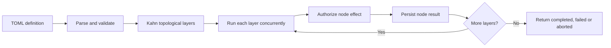

# 10 — Flows (static DAGs)
Status: implemented in 2.0.0

Static flows are validated DAGs, executed by `vak-flow::Executor`. Their
definition, execution state and node outputs are distinct from the parent
session's append-only work events. A flow node never bypasses ordinary tool
authorization (invariant 16).



## Format

`.vak/flows/<name>.toml` (project) or `data_home()/flows/` (user):

```toml
[flow]
name = "migrate-and-test"

[[nodes]]
id = "explore"
type = "agent"
readonly = true
prompt = "Find all call sites of the legacy API"

[[nodes]]
id = "refactor"
type = "agent"
paths = ["src/**"]
prompt = "Migrate the sites from {{explore}} to the new API"

[[nodes]]
id = "test"
type = "bash"
command = "cargo test"
deps = ["refactor"]
```

Node types: `agent` (prompt; readonly/paths like task), `bash` (command,
timeout_ms), `approval` (message → human gate via Approver), `merge`
(concatenates upstream outputs; always runs, emitting a partial-outcome
report when upstream failed).

Each `NodeDef` also has `deps`, `required` (default `true`) and optional
`accept` shell checks. An `accept` command runs after its node succeeds;
every check must exit successfully for the node to count as complete. The
executor authorizes these checks as brokered Bash calls.

## Semantics

- **Validate before run**: unique ids, known types, required fields per type,
  unknown deps, cycles (Kahn). `{{dep}}` template references in prompts and
  commands imply dependencies automatically; unknown references are errors.
  A self-reference currently does not add an implicit self-dependency, while
  an explicit self-dependency is rejected. `NodeDef` rejects unknown fields.
- **Layered execution**: topological layers run sequentially; nodes within a
  layer run concurrently (JoinSet). Agent nodes spawn child sessions with
  `parent_session_id` lineage — same narrowing rules as workers.
- **Typed failure policy**: `required` (default true) — failure fails the
  flow and marks every transitive dependent `skipped` in the ledger;
  `required = false` — node fails, dependents are skipped, but merge nodes
  still produce partial-outcome reports.
- **Frozen definition + resume**: each run persists a JSON `FlowState` at
  the caller's `state_path`, with run id, name, frozen TOML, start time,
  optional outcome, and per-node status/output. Each execution is a run
  (plan M4.2): the executor opens its run record, with `work = flow <name>`,
  before any node, names each node's ledger on it, and settles it with the
  flow's outcome; the checkpoint is `flow-runs/<run id>.json` in the Agent
  home. `--resume` is a new run, the next attempt, that continues from the
  newest run of that flow's checkpoint: it skips completed nodes and
  revisits pending/running ones. A prior failed/skipped node remains so.
  `/flows`, `/flows/{name}/runs` and the run graph read the run records.

The executor starts a parent work item when one is supplied, records a
`FlowNode` evidence reference after each completed node, and moves the work
item to `ReadyForVerification` on success. Required failure marks transitive
dependents skipped and returns immediately with settled outputs. Optional
failure leaves its node failed; ordinary dependents skip it, while `merge`
can still report partial upstream results. Cancellation returns `Aborted`.

## CLI

```
vak flow list
vak flow check <name>     # validate + print layers
vak flow run <name> [--resume] [--yes]
```

Ctrl-C aborts cleanly; the ledger allows resuming later.

## Deliberately out of scope (per research)

Dynamic LLM-authored planning is a separate mechanism (planner slice); flows
are deterministic, hand/GPT-authored files validated before execution.

## Later

Runs → flows adoption (`flows adopt --from <session>` with provider/model
taken only from work receipts), deterministic run-vs-run diff, and typed
recovery audits are live (demand-backed 2026-08-23: a completed run manually
rerun by hand).
