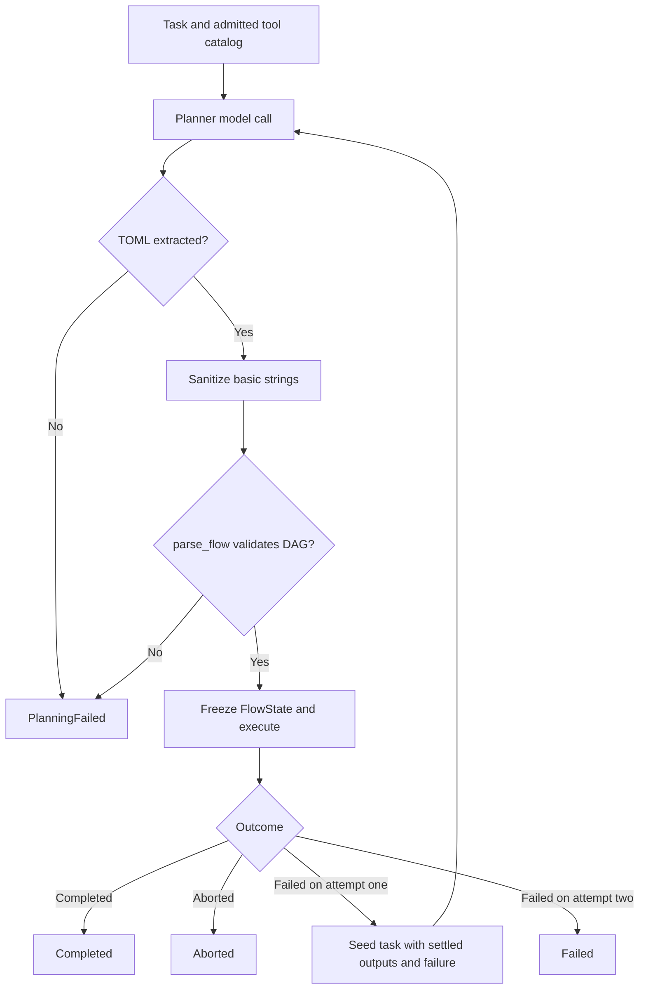

# 11 — Dynamic planner
Status: implemented in 2.0.0

For open-ended tasks where a hand-authored flow does not exist,
`vak plan "<task>" [--yes]` invokes the dynamic planner.

`vak-flow::planner::plan_and_run` produces a candidate static flow and hands
it to the same validator and executor as doc 10. The planner has no separate
tool-dispatch escape hatch.

## Loop

```
task + tool catalog ──► planner model ──► candidate TOML DAG
                              │
                              ▼
                    validate (same rules as static flows)
                    │                     │
                    ok                    invalid/unparseable
                    ▼                     ▼
                 Executor.run      planning_failed (fail-closed —
                    │               no fallback plan is substituted)
              Completed ◄─┐
                          │ structural failure
                          ▼
              bounded replan: exactly ONE more attempt, seeded with
              settled node outputs + the failure reason
```

## Design rules (from research)

- The planner sees the frozen contract's tool catalog with descriptions so
  authored nodes reference real capabilities.
- Authored DAGs are **candidates**: identical validation bar as static flows.
  Cycles, unknown types/fields/deps → `planning_failed`, never executed.
  Deterministic pre-validation repairs are applied first (both found in live
  testing): raw newlines inside single-line basic strings become `\n`, and
  nested raw double quotes are escaped via terminator lookahead (a `"`
  closes only before valid TOML continuation). Anything still invalid fails
  closed.
- **Bounded replan**: max 1 retry; seeded with settled
  outputs ("do not redo this work") and the failure reason. Budget exhausted
  ⇒ `Failed` with the last failing node.
- Per-attempt state ledgers under
  `<sessions_home>/flow-runs/plan-<id>-<attempt>.json` freeze the planner's
  sanitized TOML for audit.
- Planner system prompt is compact (~350 tokens) and covered by the prompt
  diff discipline (docs/design/07-prompt.md policy).

### Exact attempt algorithm



There are at most two **plan executions** (`MAX_ATTEMPTS = 2`). Each planner
model call may make up to three attempts on retryable provider errors, with
cancel-aware backoff starting at 500 ms and honoring `Retry-After`. It sends
no tools, requests up to 4096 output tokens, and disables provider thinking
for the TOML response. A missing, invalid or unparsable plan returns
`PlanningFailed` immediately; the second plan is reserved for a valid plan
whose execution failed. Replanning includes completed node outputs and marks
other prior nodes so the model can avoid repeating them. Each accepted plan
gets its own frozen `FlowState`, including the sanitized TOML and per-node
results.

## v1 limits

- No plan repair-by-LLM round-trips: invalid means failed (repair happens
  only structurally: template refs imply deps; newline escaping in basic
  strings before validation).
- No tiered/escalated planner models yet; the replan uses the same model.
- Server-initiated interactivity (clarifications) not modeled.
