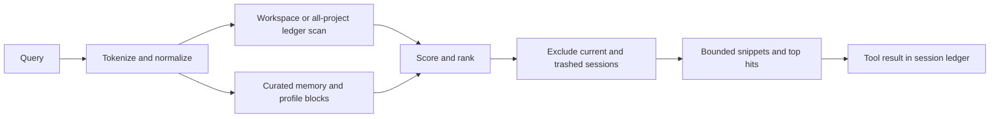

# 23 — Memory & cross-session recall
Status: implemented in 2.0.0

The memory home passed to `vak-core::memory` is the owning Agent's private
home (doc 64). Workspace notes live at
`<agent home>/memory/<hash_cwd>/MEMORY.md`; profile notes live at
`<agent home>/memory/user/USER.md`. Session search also reads JSONL ledgers
and returns their hits through the same search interface. This document
describes the shipped recall and note store; doc 26 describes learning and
skill review.

Pillar 2 of the platform plan (see `22-gateway.md` intro): Hermes' crown
differentiator is not the loop — it is that **nothing learned is ever
stranded**. Past sessions become retrievable context via a model-visible
search tool plus FTS-style indexing. We get the same capability with zero
new dependencies because our session store is already structured JSONL.

## Model

```
model calls session_search {query, limit?}
        │
vak_session::search::search(home, cwd, query, limit, exclude)
        │  scans workspace JSONL ledgers through an mtime-keyed cache
        │  ranks message text alongside curated memory/profile blocks
        ▼
top-N hits: {session, ts, role, score, snippet}
        │
returned as an ordinary tool result → appended to the ledger
```

`search_extended` and `search_all_extended` accept parsed memory blocks as
`ExternalDoc`s. A workspace search excludes the current session and the
trash; cross-project search traverses session directories and annotates
hits with the project hash. The model sees a search answer only through a
logged `tool_result`, preserving invariant 1. The cache accelerates reads;
the JSONL ledgers remain authoritative.



### Scoring

Deterministic, dependency-free:

- Query tokens lowercased, alphanumeric, length ≥ 2.
- `score_normalized` uses BM25-style saturated term frequency with
  `k1 = 1.2`, `b = 0.75`, and an approximate average length of 100 chars.
  The current term weight is the constant `ln(2)`; it does not calculate a
  corpus-specific IDF. A full phrase adds `3`; indexed entity matches can
  multiply a term contribution by `4`.
- Curated `ExternalDoc` memory hits add `2.5` to their base text score.
  `finalize` adds a small recency tie-break (`0.01`) and returns the requested
  top hits. `DEFAULT_LIMIT = 8`, caller limits clamp to 1–50, and snippets
  are bounded to 240 characters.

The per-ledger mtime-keyed cache is shipped in `vak-session::index`; a changed
ledger is visible on the next query. `vak-session::search` defines the
ranking and exclusion behavior, so the CLI, server and agent tool do not
maintain competing scorers.

## Surfaces

| Surface | Access |
|---|---|
| Agent loop | `session_search` tool, injected in `Core::run_turn_with` next to task/MCP |
| TUI/desktop/server/admin | `GET /search?q=…&limit=…` over the same function; Admin exposes scoped CRUD and cleanup controls |
| Context | the working-set planner may retrieve relevant history under its context profile (doc 68) |

## Configuration

```toml
[memory]
search_enabled = true   # default; false removes the tool from the loop
write_enabled = true    # expose remember when permissions also allow it
reflection = false     # post-run best-effort proposals when enabled
skill_proposals = true # expose propose_skill when permitted
```

Privileged rules do not apply (read-only, workspace-scoped), but unknown
keys still warn per convention.

## Exclusions & safety

- The **current** session id is excluded — its content is already in
  context; recalling it would double-count.
- Worker ledgers (`child-*`) are included; they carry `parent_session_id`
  and are legitimate knowledge.
- Search reads only; it never mutates ledgers, and respects the frozen
  contract (no rewriting, branching untouched).
- `forget` and `amend` rewrite only the curated Markdown note store under a
  per-store lock and atomic replacement. They do not rewrite session JSONL.
  A note id is the FNV-1a hash of its header line, so changing a header
  intentionally changes its id.

## Operational invariants (2026-08)

All durable-memory writes use a per-store lock and atomic temp-file replacement;
append, amend, and forget are bounded and reject control characters in header
metadata. Server and desktop search use the same curated-document ranking as
the agent tool, including stored provenance timestamps. Channel overlays are
applied after the complete tool set is assembled, and background reflection is
skipped in read-only or channel-denied contexts.
Retention is conservative: age alone never deletes a durable note. `vak memory
clean` removes only abandoned lock/temp artifacts and empty workspace
directories; stale knowledge is removed explicitly with `forget` or amended in
place. There is no automatic “dream”/overnight consolidation pass; reflection
is bounded to at most two deduplicated proposals after a clean completion.

## Phases

| Phase | Delivers | Exit criterion |
|---|---|---|
| **M0 ✅** | scan+score search in vak-session, `session_search` tool wired into every run, `/search` endpoint, `[memory]` config | relevance unit tests + agent-loop e2e proving the result lands on the ledger; fmt/clippy/tests green |
| **M1 ✅** | mtime-keyed per-ledger index cache + `search_all` cross-project scan; `/search` in TUI (`--all` flag), desktop SearchModal global toggle, `GET /search?all=true` | warm 10k-message store answered from cache < 500ms CI-safe bound (typ. ≪50ms); appends visible next query without restart; cross-dir exclusion tested |
| **M2 ✅** | Write path via model-invoked `remember` tool → `<home>/memory/<hash>/MEMORY.md` (plain markdown, provenance blocks, hand-edit-tolerant parser); recalled by search with outranking bonus; `[memory] write_enabled` flag; `GET /memory` + `vak memory` | curated notes rank above equal transcript hits (`memory_extras_outrank_equal_transcript_hits`); agent remembers mid-run and a later run recalls it citing memory (learning_loop e2e) |
| **M3 ✅** | Tiered + editable memory (docs/design/29 P1): global `<home>/memory/user/USER.md` profile tier recalled as `profile` role extras; explicit `forget_note`/`amend_note` (byte-safe rewrites, FNV id per provenance header); full HTTP CRUD (`POST/PATCH/DELETE /memory`) shared by desktop/gateway/CLI | forget removes exactly one block preserving the rest byte-for-byte; profile notes outrank equal transcript hits (`profile_tier_recalled_as_profile_role_alongside_memory`); amend/forget round-trip over HTTP e2e |
| **M4 ✅ (0.11.20)** | `[memory]` toggles (`search_enabled`, `write_enabled`, `reflection`, `skill_proposals`) are live-editable, not just config-file settings read once at startup: `Core::effective_memory_*` read every call site instead of `config().memory.*` directly, backed by the same override+`refresh_persisted_preferences` mechanism route/theme/max_turns already use; `PATCH /config` accepts `memory_*` fields (persisted via `persist_project_memory_prefs`/`persist_global_memory_prefs`, same atomic-write shape as the route/theme preferences writer); `GET /config` reports the effective values in a `memory` object it did not carry before. Admin console's Memory page replaced its three read-only status strings with real checkboxes wired to this PATCH. | a value persisted to disk by one process reaches an already-running `Core` in another without a restart (`cross_process_memory_refresh_takes_effect_without_restart`); a PATCH naming one flag leaves the other three at their current value, not whatever was on disk before the call (`patch_config_memory_flags_apply_live_and_persist`) |
