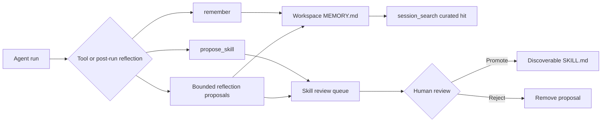

# 26 — Learning loop: memory write-path + skill proposals
Status: implemented in 2.0.0

## Current write and review path



`RememberTool` accepts a note, optional kind and tag. Its exposed kind
vocabulary is `fact`, `decision`, `preference`, `reference`, `invariant`,
defaulting to `fact`; the lower-level store also accepts `note` and
`procedural`. It writes a block with timestamp and originating session id
through `memory::append_note`. `ProposeSkillTool` writes a draft to the review
queue; it does not install a skill. Permission and channel capability checks
apply before either effect. A clean gateway completion can also run bounded
reflection, deduplicating near-identical notes and sending skill drafts
through the same human queue. Reflection is best effort and does not alter
the reply.

`vak_core::consolidation::consolidate_memory` is a separate, explicitly
invoked workspace pass. It promotes repeated or modal procedural notes to
`invariant` notes, reports conflicts among notes sharing a tag, and distills
structured entity records from certain fact patterns. It uses deterministic
text rules, so its conflict report is a lead for human review, not proof of a
contradiction. It is not an overnight job and does not promote skills.

Closes pillars M2 (memory write-path) and G5 (self-improving skills behind
review). Hermes differentiates itself with a closed loop — experience becomes
durable knowledge. We implement the loop with two model-invoked tools and one
human gate:

```
run completes ── model decides something is worth keeping
   │
   ├─ remember(note, kind?, tag?)        → MEMORY.md block (immediate)
   │      recalled by session_search, ranked above raw transcripts
   │
   └─ propose_skill(name, description, instructions)
          → review queue (<home>/skill-proposals/)
                 │  human promotes (HTTP/CLI/desktop later)
                 ▼
          <home>/skills/<name>/SKILL.md   ← discovered for EVERY future run
```

## Principles

1. **Model proposes; only humans promote skills.** A proposed skill can
   redirect arbitrary future runs — it crosses the trust boundary and must
   pass an explicit gate (invariant: unattended surfaces fail closed;
   promotion is never automatic, never time-based).
2. **Notes are cheap, visible, revocable.** MEMORY.md is plain markdown the
   user can edit or prune; every block carries provenance (timestamp, kind,
   tag, originating session id).
3. **Model-visible ⇒ logged.** Both tools are ordinary tools: the call args
   and confirmations land on the ledger as tool_use/tool_result entries.
   Promoted skills enter discovery, whose names+descriptions are captured in
   every later FrozenContract.
4. **No standing prompt injection.** Nothing is injected into prompts by the
   note store; recall flows through `session_search`, which ranks memory
   blocks against transcripts. When enabled, post-run reflection makes an
   additional model call after a clean gateway completion.

## Storage

```
<agent home>/memory/<hash_cwd>/MEMORY.md        # workspace notes, plain md
<agent home>/memory/user/USER.md               # profile tier
<agent home>/skill-proposals/<hash_cwd>/<id>.md # pending drafts
<agent home>/skills/<name>/SKILL.md             # promoted discovery
```

MEMORY.md block grammar (tolerant to manual edits):

```
## <RFC3339> [<kind>] tag=<tag> session=<session-id>
<free-form markdown lines>
```

Parser: split on `## ` headings; `[kind]` optional (defaults `note`);
unknown `key=value` tokens preserved; malformed headings become ordinary
text of the preceding block — hand-edits never lose data.

## Tools

| Tool | Args | Effect | Permission |
|---|---|---|---|
| `remember` | `note` (required), `kind` (fact\|decision\|preference\|reference\|invariant), `tag` | append block | Allowed in WorkspaceWrite+ (journaling into vak's own per-workspace store, like session ledgers themselves); denied in ReadOnly |
| `propose_skill` | `name`, `description`, `instructions` | queue file | Same |

The permission engine classifies both explicitly so they do not fall into
the generic unknown-tool Ask path — otherwise every phone-side `remember`
would stall on a forwarded gate.

## Recall

`vak_session::search_extended(..., extras: &[ExternalDoc])` scores memory
blocks with the same scorer plus a bonus that places them above equally
relevant transcript lines; hits surface as `role: "memory"` with the block's
tag/kind in the snippet prefix. `session_search` and `GET /search` both feed
parsed MEMORY.md entries in.

## Promotion

- `GET /skills/proposals` — queue listing (id, name, description, age).
- `POST /skills/proposals/{id}/promote` — installs to
  `<home>/skills/<name>/SKILL.md`; refuses silent overwrite of an existing
  skill name.
- `POST /skills/proposals/{id}/reject` — deletes the pending file.
- CLI mirrors: `vak skills-review list|promote|reject`, `vak memory`.

Provenance footer (HTML comment) survives inside SKILL.md harmlessly:
`<!-- proposed-by: <session-id> at <ts> -->`.

## Configuration

```toml
[memory]
write_enabled    = true   # remember tool available to runs
skill_proposals  = true   # propose_skill available; queue always reviewable
```

Local-only and workspace-scoped, hence not privileged — but ReadOnly mode
still denies both tools outright.

Reflection is an effectful write path, not an exception to permissions: it is
skipped in `ReadOnly` mode, honors channel tool overlays, and applies through
the same guarded memory/proposal repository used by the interactive tools.

### Worker ownership and termination

Each delegated agent receives its own child JSONL session and context window,
linked by `parent_session_id`. It does not receive a private memory file:
`remember` writes to the parent workspace tier (or the global profile tier
when explicitly selected), with the child session id preserved as provenance.
The child ledger remains on disk after completion, cancellation, or process
restart, so partial work is auditable and searchable. The live registry is
ephemeral; terminated children are removed from it even if their future is
aborted, and a process crash naturally clears the registry while preserving
the ledger. A child that dies before calling `remember` contributes no durable
memory and is not auto-promoted by reflection.

## Phases

| Phase | Delivers | Exit criterion |
|---|---|---|
| **L0 (this)** | memory store + parser, search boost, both tools, engine classification, promotion endpoints + CLI, config flags | unit roundtrips incl. hand-edited files; search outranks transcripts; e2e: agent remembers mid-run, a later run recalls it citing memory; promote→discovery loop closes; fmt/clippy/tests green |
| **L1 ✅** | Post-run reflection (`[memory] reflection = true`): auxiliary model call after clean gateway completions proposes ≤2 notes + optional skill draft; Jaccard dedup (≥0.55) against existing MEMORY.md bounds growth; skill drafts land in the same human-gated review queue; detached best-effort — never affects the reply | parser/dedup/e2e tests: near-duplicate second run writes 0 notes; invalid entries don't consume slots |
| **L2 ✅** | Desktop Settings ▸ Learning page: proposal queue with Promote/Reject + memory-note viewer (tag/kind/session provenance), 8 s polling while open; TUI `/services` ships alongside in the same ops pass | tsc/vite clean; hermetic gateway fixtures keep scripted flows deterministic |
