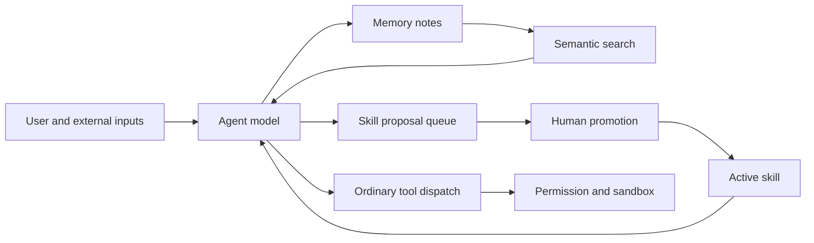
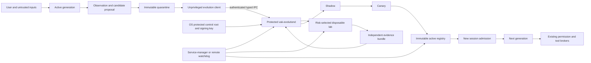

# 43 — Governed self-evolving autonomous agent (SEAA)

Status: design proposal; no behavior in this document is implemented merely by
merging the document.

## Decision

Vak may learn and produce new memory, prompts, skills, workflows, tools,
plugins, hooks, agent topologies, and routing strategies, but it never activates
an in-place mutation of the generation that is currently executing. Every
change is an immutable candidate artifact evaluated as a possible next
generation. A minimal privileged `vak-evolutiond` service, outside every
model-controlled process and its writable namespace, owns admission,
evaluation requirements, promotion, activation, revocation, and rollback.
`vak-core` is an unprivileged client of that authority, not the authority
itself. If the host cannot enforce this boundary, Vak may create and evaluate
inert candidates but must disable shadow-with-effects, canary, and activation.

Evolution may improve how Vak uses authority already delegated by a user or
operator. It may never create, widen, transfer, conceal, or redefine that
authority. Generated text and code are untrusted even when they came from Vak,
passed functional tests, or were previously useful.

The recommended architecture is a brokered local evolution plane backed by
disposable isolation, immutable artifacts, evidence-gated promotion, and
capability leases. High-risk candidates escalate to a remote or microVM lab.
Prompt-only self-improvement is insufficient; executing every candidate in a
remote lab would provide stronger default isolation but impose unacceptable
latency and operational cost on low-risk memory and prompt experiments.

## Mission

Build a complete, general evolution loop that can:

1. observe work, outcomes, corrections, failures, costs, and security events;
2. identify a reusable improvement opportunity without being hard-coded to a
   particular MCP server, repository, or task class;
3. produce one or more typed candidate artifacts;
4. evaluate candidates against functional, regression, adversarial, resource,
   and policy criteria;
5. compare them with the active baseline on held-out evidence;
6. promote eligible candidates through shadow and canary stages;
7. activate an immutable next generation only at a safe session boundary;
8. monitor real outcomes and automatically revoke or roll back regressions;
9. preserve complete lineage from source experience to every resulting effect;
10. remain contained even when the model, a prompt, a memory, a tool result, a
    candidate, or an evaluator is malicious.

This is an implementation contract for a coding agent. Completion means the
end-to-end lifecycle, containment boundaries, recovery behavior, surfaces, and
tests work together. Types, a dashboard, or a candidate-writing tool alone do
not complete the mission.

## Terminology

### Generation

A generation is the immutable set of evolution-managed artifacts active for a
scope at session admission. It is identified by a digest over ordered artifact
identities and their content digests. A session freezes the generation in its
contract; activation never changes a running session silently.

### Artifact

A versioned, content-addressed unit that may influence future behavior. An
artifact has a kind, source, scope, payload, requested capabilities, evidence,
risk classification, lifecycle state, and lineage.

### Candidate

An artifact generation that is not active. Candidate data and code are
untrusted. `Eligible` means the configured evaluation policy passed; it does
not mean the candidate is safe in an absolute sense.

### Evolution authority

The privileged `vak-evolutiond` service that validates lifecycle transitions,
applies policy, issues capability leases, selects the required laboratory,
commits activation pointers, signs checkpoints, and records receipts. Its IPC
API accepts typed requests, never shell fragments or arbitrary filesystem
paths. Models, candidate code, ordinary Vak processes, and laboratory workers
cannot read its keys or store and cannot signal, debug, or replace it.

### Evolution laboratory

An isolated environment in which a candidate is built, exercised, attacked,
and measured. Laboratories have risk tiers; all use disposable state and no
ambient production authority.

### Constitution

The policy defining authority ceilings, protected components, promotion
requirements, approval requirements, resource ceilings, and rollback rules.
It is **not agent-evolvable**. An owner may replace it only through a stronger,
versioned administrative ceremony that displays a capability diff, applies a
cool-down where configured, records an externally anchored receipt, and
revokes incompatible sessions, workers, and leases before commit. It is never
a model tool.

### Capability lease

A short-lived, non-transferable authorization issued by the authority for one
resolved operation. It binds principal, intent, artifact digest, operation,
resource, arguments or constraints, expiry, call count, and budget.

### Intent envelope

The authenticated user's run-scoped delegation: objective, allowed and denied
effects, resource scope, data-handling restrictions, budget, expiry, and
approval policy. Descendants may inherit only an equal or narrower envelope.

### Protected control root

Storage owned by the evolution authority for policy, keys, approvals,
activation pointers, revocations, and audit checkpoints. It is not under a
workspace, repository, sessions directory, or any path writable or readable by
a model-controlled process.

### Evolution campaign

A durable, user-authorized objective that may span many bounded execution
segments. It binds acceptance criteria, optimization targets, scope, budgets,
review cadence, continuation policy, and terminal authority. A campaign is not
“the model keeps talking forever”; the scheduler admits one finite segment at
a time and durable state determines whether another segment is due.

### User-terminated campaign

A campaign whose successful terminal transition is reserved to an
authenticated user or operator. Phrases such as “keep improving until I say
done” or “do not stop until I stop you” select this mode. The agent may report
progress, pause, block, or request authority, but may not reinterpret a locally
good result, exhausted turn budget, audit failure, context reset, process
restart, or ordinary conversational prose as user termination.

## Security principals and deployment profiles

Authorization decisions name an authenticated principal and never infer one
from model text. The principal taxonomy is:

- **host owner/operator** — installs Vak, controls the host, and may change the
  constitution through the administrative ceremony;
- **workspace owner/member** — may propose or approve only within explicitly
  delegated workspace roles;
- **local user or remote sender** — supplies task intent but has no evolution
  authority merely by being authenticated to a chat;
- **bot operator** — manages one bot identity and its restrictive policy, not
  the host or workspace authority;
- **publisher** — signs a supplied artifact but cannot activate it;
- **candidate author/proposer** — supplies content and is never an approver for
  the same promotion;
- **evolution authority** — the service identity that verifies policy and
  performs privileged state transitions.

Vak cannot protect a host owner from deliberate use of their operating-system
authority. It must protect the host, other workspaces, external accounts, and
delegated users from a compromised model, candidate, channel sender, workspace
member, publisher, or ordinary Vak process within that principal's ceiling.

Deployment profiles are explicit:

1. **Personal local:** the authority may run on the same host, but all
   model-controlled execution, including `FullAccess`, is still inside an OS
   sandbox that permanently denies the protected control root, authority IPC
   administration endpoints, process signalling/debugging, raw devices, and
   credential stores. Here `FullAccess` means broad access inside the delegated
   workspace envelope, never host-admin access.
2. **Shared or multi-tenant:** the authority runs under a separate OS identity
   with an authenticated IPC boundary; workers use separate identities or
   microVMs. Workspace administrators cannot read authority keys.
3. **High assurance:** the authority and audit anchor run on a separate host or
   hardware-backed service; executable candidates use attested remote labs.

A same-user daemon without mandatory worker sandboxing is a convenience
process, not a security boundary, and therefore cannot enable activation.

## Non-goals

- Do not train or modify foundation-model weights in the first implementation.
- Do not let the model edit its permission engine, constitution, evaluator
  policy, audit ledger, trusted tests, credential store, sandbox launcher, or
  activation registry.
- Do not activate arbitrary generated native libraries inside the Vak process.
- Do not treat reflection quality, model confidence, signatures, marketplace
  reputation, or passing tests as authorization.
- Do not inject all memories or learned artifacts into every prompt.
- Do not require evolution for ordinary direct chat or make every completed
  turn run a paid reflection/evaluation cycle.
- Do not introduce a second execution path that bypasses `PermissionEngine`,
  channel overlays, hooks, sandboxing, spend gates, or work contracts.
- Do not let an artifact update rewrite an existing frozen session.
- Do not claim protection against hostile generated code from a container
  alone; the threat tier determines whether a stronger lab is required.
- Do not permit automatic self-modification of the trusted Rust kernel.

## Existing foundation to preserve

The implementation must build on, rather than duplicate:

- memory and skill proposals in docs/design/23 and 26;
- the agent security invariants in docs/design/24;
- command sandboxing in docs/design/25;
- frozen route, work receipt, spend, goal, and regression contracts in
  docs/design/27;
- operations evidence and action receipts in docs/design/28;
- tasks, profile memory, backup, digest, and inbox in docs/design/29;
- schema-v2 presentation isolation in docs/design/30;
- plugin inspection, immutable generations, capability diffs, and rollback in
  docs/design/39;
- the typed capability registry and frozen session packet in docs/design/41;
- managed work contracts and evidence-based completion in docs/design/42;
- append-only session JSONL and pure projection in `vak-session`;
- brokered tool workers and OS sandbox backends in `vak-tools`;
- `PermissionEngine` and approvers in `vak-permission`;
- lazy, policy-filtered MCP execution in `vak-mcp`;
- the common `Core` assembly used by CLI, server, desktop, flows, tasks,
  subagents, and channels.

The evolution plane may propose artifacts for these systems. It does not own
their runtime authority.

### Required implementation reading

Before changing production code, an implementing agent must inspect the live
version of these sources rather than relying only on this design:

- `crates/vak-core/src/lib.rs`, `learning.rs`, `memory.rs`, `reflection.rs`,
  `skills.rs`, `session_search.rs`, `checkpoints.rs`, and `backup.rs`;
- `crates/vak-session/src/types.rs`, `log.rs`, and its search/projection code;
- `crates/vak-agent/src/lib.rs`, `goal.rs`, `task.rs`, and `context.rs`;
- `crates/vak-permission/src/engine.rs` and `rules.rs`;
- `crates/vak-tools/src/lib.rs`, worker protocol, sandbox, and built-in tool
  implementations;
- `crates/vak-mcp/src/manager.rs`, `tool.rs`, and client process lifecycle;
- `crates/vak-flow` execution, planning, persistence, and resume paths;
- `crates/vak-plugin` package store, inspection, activation, and receipts;
- `crates/vak-server/src/lib.rs`, `admin.rs`, `gateway.rs`, CorePool, session
  cancellation, config persistence, and Operations Center handlers;
- Admin/Desktop APIs and components that already implement memory, plugin,
  approval, subagent, task, and operations state;
- `crates/vak-config/src/lib.rs` and `paths.rs` for layered persistence and
  canonical homes.

Source paths may move. The invariant is to locate and inspect the actual owner
of every boundary before implementing it; do not recreate an old parallel
path because a filename in this list changed.

## Evidence basis and design status

I inspected the current design contracts and representative source paths for
memory recall/write, skill loading and promotion, MCP dispatch, permission
evaluation, capability freezing, plugins, managed work, sandboxing, and
operations evidence. The following are observed current properties:

- memory is durable searchable content rather than an enforcement language;
- skill proposals require promotion, and admitted skills are digest-frozen;
- MCP is lazy, policy-filtered, and validates the live tool catalogue before
  dispatch;
- agent tool calls authorize before execution and use the current broker;
  however, the current `PermissionEngine` treats `FullAccess` as allow-all and
  `Core::build_sandbox` returns no sandbox for that mode. That is an explicit
  prerequisite gap: SEAA activation cannot ship until protected-root and
  process-control denials apply independently of the ordinary permission mode;
- plugins use inspected immutable generations, explicit activation, capability
  diffs, and rollback;
- sessions freeze provider/model, system prompt, permission mode, and admitted
  capabilities;
- managed work and Operations Center already favor append-only evidence over
  model-authored state.

The deeper review also found a current long-horizon mismatch that this design
must not inherit:

- `StopPolicy` detects only a few textual/trivial verification failures and is
  capped by `max_blocks`;
- reaching `max_turns` returns `MaxTurnsReached` rather than durably scheduling
  the unfinished objective;
- when goal-audit attempts are exhausted, `goal_gate` appends
  `GoalStatus::Unverified`, clears `active_goal`, and permits the surrounding
  loop to return a normal completed response;
- `managed_work_gate` treats `WorkContractStatus::Unverified` as terminal;
- the active goal used by the loop is in-memory and is armed by a run call; an
  unfinished ledger entry is not by itself a cross-process continuation
  scheduler.

These are reasonable anti-loop bounds for an ordinary turn, but they do not
implement an authenticated “continue until I say done” contract. SEAA must
reuse the useful goal/work evidence machinery while separating **segment
termination** from **objective termination**.

It is an inference from those properties that one cross-artifact lifecycle and
authority will produce less control drift than separate self-improvement loops
for memory, prompts, skills, tools, plugins, hooks, and workflows. Everything
from `vak-evolution` onward in this document is proposed behavior, not evidence
that the boundary exists today. No vulnerability is claimed fixed by this
design.

## Threat model

Assume compromise or malicious behavior from any combination of:

- direct user prompts, including an authenticated but malicious user;
- indirect instructions in repositories, web pages, email, documents,
  attachments, issue text, tool output, or MCP metadata;
- model output, reasoning mistakes, deception, sycophancy, or goal drift;
- poisoned or cross-tenant memory;
- candidate prompts or skills with delayed trigger instructions;
- generated source code, build scripts, dependencies, binaries, plugins, and
  hooks;
- compromised remote MCP servers and OAuth resources;
- a subagent attempting to launder authority through its parent or sibling;
- evaluators that are fooled, correlated with the proposer, or deliberately
  manipulated;
- reward hacking, benchmark overfitting, test deletion, and evidence forgery;
- approval phishing through misleading model-authored summaries;
- capability composition where individually allowed operations produce a
  prohibited aggregate effect;
- sandbox escape, kernel attack, filesystem race, redirect/DNS rebinding,
  covert egress, and resource exhaustion;
- stale activation state, crash during promotion, rollback failure, or audit
  corruption;
- supply-chain compromise of a previously accepted artifact or publisher;
- sleeper behavior that remains benign in evaluation and activates later.

Protected assets are host and cross-workspace data, credentials, user and bot
identities, external accounts, money, reputation, the session and policy
control planes, production availability, audit integrity, and the user's
ability to understand and revoke delegated authority.

## Required invariants

These are falsifiable implementation requirements.

1. **Authority is monotone decreasing across evolution.** A candidate and all
   of its descendants execute under the intersection of constitution, user
   intent, workspace mode, channel/bot/chat policy, artifact manifest, and
   per-call lease. No layer can add a right denied by another.
2. **A generation never mutates itself.** Candidate production writes only to
   quarantine. Activation affects new admissions after an atomic pointer
   change.
3. **No self-approval.** The proposer, candidate runtime, and model-visible
   tools cannot issue promotion approvals or change promotion requirements.
4. **Every effect authorizes the final resource before dispatch.** Aliases,
   symlinks, redirects, DNS, bot identity, credential identity, and artifact
   digest are resolved before the decision and re-bound at enforcement.
5. **Candidate execution has no ambient authority.** Laboratories start with
   an empty environment, no production credentials, no host home, no control
   store, and denied network unless a lease grants a destination.
   The same protected-root and process-isolation denials remain mandatory after
   activation and in every permission mode, including `FullAccess`.
6. **Untrusted information never becomes trusted instruction by copying,
   summarizing, voting, or reflection.** Provenance and taint survive every
   derivation until an authenticated promotion decision changes lifecycle
   state; promotion does not erase provenance.
7. **Evaluators cannot be modified by the candidate they judge.** Test suites,
   holdouts, policies, and baseline results are mounted read-only and selected
   by the authority.
8. **Promotion is evidence-based and atomic.** Missing required evidence,
   unknown enforcement, partial writes, or failed verification prevents
   activation. The old generation remains active.
   Passing evaluation is evidence of tested behavior, never proof that a
   candidate lacks sleeper, deceptive, or novel behavior.
9. **Activation is digest-bound and reversible.** The registry points only to
   immutable content; rollback is an atomic pointer change to a retained
   known-good generation.
10. **Sessions remain reproducible.** Every session freezes its evolution
    generation, artifact descriptors, policy generation, intent digest, and
    admitted capabilities.
11. **Data flow is constrained in addition to tool calls.** Sensitive inputs
    cannot leave through an otherwise allowed destination unless the lease and
    data policy permit that class of data.
12. **Approval is parameter-bound.** Trusted UI renders the resolved effect,
    not model prose. Any change to target, arguments, artifact, credential,
    data class, or expiry invalidates approval.
13. **Composition is bounded.** Call count, recursion, descendants, wall time,
    CPU, memory, disk, output, tokens, and spend are enforced outside the
    model. A run-level policy may deny a sequence even when each call is
    independently allowed.
14. **Compromise is contained by identity and scope.** Memory, artifacts,
    leases, evaluation data, and activation pointers are partitioned by user,
    workspace, channel/bot/chat, and purpose where applicable.
15. **Audit precedes externally visible effect.** Intent, decision, resolved
   target, artifact generation, lease, and approval receipt are durably
   appended before dispatch; outcome and verification follow.
   Security events form a monotonic hash chain with authority-signed
   checkpoints anchored outside the mutable event store; rollback or coherent
   rewriting of local files is detected at startup and before promotion.
16. **The watchdog is outside the agent.** Candidate code cannot suppress
    anomaly detection, lease revocation, worker termination, rollback, or
    operator notification.
17. **Revocation reaches in-flight authority.** Revoking an artifact,
    generation, credential, policy, or principal cancels matching leases and
    active workers before UI state reports the revocation complete.
18. **Unknown artifact kinds and lifecycle states fail closed.** Forward
   compatibility may preserve unknown data, but it never activates unknown
   behavior.
19. **Dependencies activate as one verified closure.** Every generation binds
    exact artifact, runtime, evaluator, and dependency digests. Cycles,
    incompatible scopes or interfaces, missing objects, and partial activation
    fail closed; rollback restores the previous complete closure.
20. **Dynamic effects are either resolved or forbidden.** A lease is consumed
    atomically against the same trusted resource handle used for dispatch.
    Generic interpreters, shells, build scripts, and operations whose final
    resources cannot be resolved are unavailable to evolved artifacts unless a
    sandbox independently enforces the complete filesystem, network, process,
    secret, and resource envelope.
21. **Containment is permanent.** Shadow, canary, or active status never grants
    ambient credentials, removes sandboxing, relaxes egress, or converts tested
    behavior into trusted code. Active artifacts retain leases, budgets,
    monitoring, randomized requalification, and finite certification lifetime.
22. **Remote evidence is authenticated and fresh.** A remote lab result binds
    protocol version, request nonce, candidate and input digests, policy,
    runner image, evaluator, outputs, and resource measurements in a signed
    receipt. Replayed, revoked, incomplete, or unverifiable results fail closed.
23. **Segment exhaustion is not objective completion.** Max turns, context
    limits, process exit, audit-budget exhaustion, rate limits, and temporary
    service failure produce typed paused/blocked/interrupted states with a
    durable resumption decision. They never become `Completed` by fallthrough.
24. **Terminal authority is explicit.** For user-terminated campaigns, only an
    authenticated, addressed control action from an authorized principal may
    complete or cancel the campaign. Candidate text, quoted messages, web/MCP
    content, bot messages, and the agent's own final prose are not control
    actions.
25. **Persistence does not widen authority.** “Keep going” grants duration,
    not new files, destinations, credentials, spend, irreversible effects, or
    unattended approval. Every resumed segment receives a fresh, equal-or-
    narrower intent envelope and leases; expired authority pauses the campaign.
26. **Progress is evidence, not narration.** A continuing campaign records
    measurable state change, new evidence, or a resolved blocker per segment.
    Repeated equivalent attempts trigger backoff, strategy review, or a typed
    block instead of a tight loop or fabricated progress.
27. **Rollback does not claim to undo the world.** Pointer rollback stops
    future use of a generation but cannot erase messages, purchases, deploys,
    disclosures, or other external effects already committed. Such effects
    require explicit idempotency and compensation contracts, or irreversible
    approval that explains the residual effect.
28. **Optimization targets are authority-bearing.** The candidate cannot
    choose or rewrite the objective, success metrics, baseline, holdout
    release policy, stopping rule, or reward aggregation used to promote it.
29. **Trusted-computing-base updates are ordinary releases.** The authority,
    sandbox launcher, permission/lease enforcement, trusted resolvers,
    evaluator loader, audit verifier, and control UI cannot be evolution
    artifacts. Their signed version and enforcement ABI are bound into
    evidence, and changes invalidate affected certifications.

## Architecture options considered

### Option 1: Prompt and memory evolution

The agent writes better memories, prompts, and skills and loads them in future
runs. This is inexpensive and compatible with the current learning loop, but
application is probabilistic, poisoning crosses sessions, executable
extensions remain outside one lifecycle, and prompt compliance cannot enforce
authority. It is acceptable as an incremental experiment, not the SEAA
security boundary.

### Option 2: Brokered evolution plane with tiered laboratories

A pure artifact/state library, protected authority, immutable store, evaluation
orchestrator, capability leases, and risk-selected laboratories cover every
artifact kind. Low-risk text candidates evaluate locally without executable
authority; code candidates use disposable workers; high-risk candidates use a
microVM or remote lab. This reuses Vak's current boundaries and is the selected
design.

### Option 3: Remote laboratory for every candidate and activation

All evolution happens on an independent service with separate identity,
storage, evaluators, and policy. This gives the strongest default containment
and is preferable for multi-user or regulated deployments. It adds a service
dependency, artifact transport, offline limitations, cost, and latency that
are disproportionate for personal local notes and prompt variants. Option 2
must keep a provider interface so Option 3 can be configured by policy.

The decision-relevant tradeoffs are:

| Dimension | Option 1: prompt/memory | Option 2: brokered tiered labs | Option 3: remote-only lab |
| --- | --- | --- | --- |
| Security | Improves reuse but leaves prompt compliance and fragmented activation as primary controls | Centralizes lifecycle and authority while selecting isolation by risk; residual host-kernel risk remains for local tiers | Strongest default separation; remote authority and artifact gateway become critical trusted services |
| Performance | Lowest overhead | No evolution overhead when disabled; evaluation adds bounded local/remote work off the ordinary turn path | Highest startup, transfer, and network latency for every experiment |
| Memory/resources | Small text stores and model calls | New event/blob indexes and disposable workers; resource use is policy-bounded | Separate service/VM capacity and retained remote evidence |
| Reliability | Few new components but weak deterministic application | More state machines and workers, offset by local fallback, atomic generations, and rollback | Depends on remote service/network availability; local work blocks when unavailable |
| Operability | Simple but limited audit and containment | Moderate: labs, evidence, watchdog, canaries, and policies need operational surfaces | Highest: service identity, remote storage, fleet patching, and incident response |
| Migration | Incremental extension of learning | Reuses current registries and can ship by artifact kind and authority rung | Requires artifact protocol and remote service before useful deployment |
| Best fit | Research and low-risk advisory learning only | Default personal/local and most workspace deployments | Regulated, multi-tenant, or hostile-code deployments with strong isolation requirements |

I recommend Option 2 under Vak's current local-first constraints, with Tier 3
implemented through an interface that permits Option 3 for policies requiring
it. If the product becomes a shared hostile multi-tenant service, the balance
changes and the authority as well as the laboratory should move outside the
tenant host.

## Current and target trust boundaries

Current learning is primarily a model-directed write and retrieval loop:



The target inserts an evolution boundary without weakening ordinary dispatch:



The critical change is control ownership. Models produce proposals and may
perform bounded experiments. Only the protected authority changes lifecycle
state, and only the existing brokers produce real effects. Filesystem mode bits
under the same unrestricted process identity are not this boundary.

| Change | Before | After | Security consequence | Cost |
| --- | --- | --- | --- | --- |
| Artifact lifecycle | Memory, skills, plugins, hooks, and flows use separate activation concepts | One projected state machine with kind-specific trusted adapters | Reduces omitted gates and makes unknown transitions fail closed | New pure domain crate and migrations |
| Mutation | Files or proposal queues can change independently | Immutable blobs and next-generation manifests | Running generation cannot silently rewrite itself | Additional storage and digest checks |
| Evaluation | Mostly kind-local tests and human judgment | Policy-selected baseline, holdout, adversarial, and resource evidence | Candidate cannot define the complete test used to approve itself | Evaluation latency and spend |
| Execution | Existing permission/sandbox boundary | Same boundary plus intent envelope and digest-bound lease | Contains a hijacked model and prevents artifact authority widening | One local authorization hop and effect projection |
| Isolation | Tool/MCP/plugin-specific workers | Risk-selected inert, broker, container, or remote lab | Stronger containment for generated executable artifacts | Lab implementation and operations |
| Activation | Kind-specific enable/promote operations | Atomic scope generation commit, frozen admission, canary, rollback | Reproducible sessions and rapid revocation | Registry refresh and session rotation work |
| Monitoring | Logs, receipts, Operations Center | External watchdog over evolution, lease, process, egress, and canary evidence | Candidate cannot suppress its own kill/rollback path | Rules, alerts, and false-positive tuning |

## Crate and component ownership

### New `crates/vak-evolution`

A dependency-light library owns pure types, validation, state transitions,
digests, projections, risk classification inputs, evaluation requirements,
and promotion decisions. It performs no model call, subprocess spawn, network
call, credential resolution, approval, or active capability registration.

Keeping this pure makes lifecycle invariants reusable by CLI, server, desktop,
gateway, tests, and future remote authorities.

### New `crates/vak-evolutiond`

A minimal service binary links `vak-evolution` and owns the protected control
root, signing keys, lifecycle mutation API, lease issuance/consumption,
checkpoint anchoring, lab admission, revocation, and generation commit. Its
authenticated local protocol is versioned, length-bounded, replay-resistant,
and expressed only in closed request/response types. It does not host the
general agent loop, model providers, MCP clients, plugin code, arbitrary
hooks, or a shell.

The service manager owns restart and liveness. On platforms where workers
cannot be prevented from reading its files, connecting to administrative IPC,
signalling/debugging it, or replacing its executable, the service reports
`containment_unavailable` and refuses all activating transitions.

### `vak-core`

Owns an unprivileged `EvolutionClient` facade, artifact adapters, observation
collection, candidate generation requests, evaluation orchestration, and
cross-process refresh of read-only active-generation projections. It cannot
write authoritative lifecycle state, issue leases, or register a generation
without a verified authority receipt.

### `vak-session`

Adds evolution references and intent-envelope identity to frozen session
contracts and append-only evolution activity/receipt references. Candidate
payloads do not enter model context merely because they are in a ledger.

### `vak-tools`

Extends the broker-worker protocol with laboratory jobs, declared resource
claims, copy-in/copy-out manifests, output ceilings, and lease verification.
The untrusted worker receives a single validated job and cannot access the
authority. Every model-controlled worker, including one requested under
`FullAccess`, receives platform sandbox rules that deny the protected control
root and authority process/control interfaces.

### `vak-permission`

Remains the final per-effect policy decision. It consumes resolved artifact
provenance and intent/lease constraints but does not depend on model-generated
risk scores.

### `vak-flow`

Provides the executable representation for workflow candidates. Only a closed,
typed, bounded DAG can activate; arbitrary planner text is not a workflow
artifact.

### `vak-mcp`

Remains the sole MCP execution path. Evolution may produce schema-bound usage
recipes or propose plugin adapters, but it does not connect to a server outside
the lazy manager and channel/tool policy.

### `vak-server`, Admin, and Desktop

Expose authenticated review, policy, experiment, activation, revocation,
lineage, and rollback surfaces. They render the same projected store rather
than maintaining independent state.

### `vak-ops`

Provides process/service status for local laboratories and the external
watchdog. Operations Center shows only evidence-backed state.

## Durable storage

Authoritative state lives in an operator-selected protected control root owned
by `vak-evolutiond`, not the canonical sessions home or a workspace. A
read-only, non-authoritative projection may be mirrored into sessions data for
search and UI rendering.

```text
<protected-control-root>/
├── events.jsonl                 # hash-chained lifecycle source of truth
├── checkpoints/                # signed chain heads and anchor receipts
├── keys/                        # key references; raw keys prefer OS key store
├── policies/
│   ├── generations/<digest>.json
│   └── active.json              # atomic pointer, authenticated writes only
├── blobs/sha256/<prefix>/<hash> # immutable payloads and evidence objects
├── generations/<scope-hash>/
│   ├── <generation-id>.json
│   └── active.json              # atomic pointer
├── leases.jsonl                 # issuance/revocation/settlement receipts
├── approvals.jsonl              # exact parameter-bound approval receipts
└── indexes/                     # rebuildable projections only
```

JSONL and immutable blobs are source state. SQLite or in-memory indexes are
rebuildable. Atomic pointers contain generation id, manifest digest, policy
generation, previous generation, committed timestamp, and commit receipt.

Blob writes use create-new temporary files, fsync, digest verification,
rename, and parent-directory sync. Existing digests are read and verified,
never overwritten. Events use the same per-store locking and bounded recovery
principles as memory/session stores. Each event contains a strictly monotonic
sequence, previous-event digest, payload digest, policy generation, and
authority signature or MAC. Periodic signed chain heads are anchored in an OS
key store, TPM/counter service, transparency log, or configured independent
host. Startup and every promotion compare the local head with the latest
anchor. A corrupt trailing event may be truncated only through explicit crash
recovery and produces a durable incident. A lower sequence, fork, missing
checkpoint, signature failure, or digest mismatch freezes evolution and
requires operator recovery; it is never silently rebuilt from remaining files.

Backup includes policies, events, manifests, and active pointers. Build output,
temporary labs, caches, and reproducible indexes are excluded. Import merges
immutable objects but never changes the receiving system's active pointer or
policy automatically.

Sensitive candidate inputs and evidence are encrypted with per-object data
keys. Privacy deletion destroys those keys and writes a tombstone into the
chain; non-sensitive digests, lineage, actor, decision, and deletion receipt
remain so audit continuity is preserved. Backups never contain usable deleted
plaintext and restore cannot move an anchored sequence backwards.

Garbage collection uses a verified reachability snapshot signed by the
authority. It retains every active, canary, rollback, frozen-session,
unexpired-approval, campaign-checkpoint, and audit-checkpoint dependency.
Deletion is two-stage (tombstone, grace period, recheck, unlink) and cannot run
concurrently with generation commit without fencing. Unknown reachability or a
broken dependency freezes collection rather than risking an unrecoverable
rollback.

The authority is deliberately a privileged availability dependency only for
evolution mutations, new evolution leases, and campaign admission. If it is
down, ordinary non-evolution Vak work may continue through the existing
permission boundary, while evolved effectful components fail closed or the
session rotates to a predeclared signed baseline generation. Cached signatures
may authenticate inert prompt/skill content but never mint leases or extend
expiry. Recovery requires checkpoint reconciliation and does not accept a
locally newer unanchored chain merely to restore service quickly.

## Core data model

The exact names may change during implementation, but the semantics may not.

```rust
pub struct ArtifactId(String);
pub struct ArtifactDigest(String);
pub struct GenerationId(String);
pub struct PolicyGeneration(String);

pub enum ArtifactKind {
    Memory,
    Prompt,
    Skill,
    Workflow,
    Tool,
    Plugin,
    Hook,
    AgentTopology,
    RouteStrategy,
}

pub struct EvolutionArtifact {
    pub artifact_id: ArtifactId,
    pub revision: u32,
    pub kind: ArtifactKind,
    pub scope: ArtifactScope,
    pub source: ArtifactSource,
    pub payload: BlobRef,
    pub payload_digest: ArtifactDigest,
    pub manifest: ArtifactManifest,
    pub parents: Vec<ArtifactRef>,
    pub dependencies: Vec<ArtifactDependency>,
    pub created_at: DateTime<Utc>,
}

pub struct ArtifactDependency {
    pub artifact: ArtifactRef,
    pub required_digest: ArtifactDigest,
    pub interface_version: String,
    pub scope_constraint: ArtifactScope,
}

pub struct ArtifactSource {
    pub principal: PrincipalRef,
    pub session_id: Option<String>,
    pub campaign_id: Option<String>,
    pub campaign_epoch: Option<u64>,
    pub entry_ids: Vec<String>,
    pub source_classes: Vec<SourceClass>,
    pub trust: TrustClass,
    pub derivation_depth: u16,
}

pub enum SourceClass {
    AuthenticatedUserInstruction,
    ModelOutput,
    Reflection,
    RepositoryData,
    WebData,
    McpData,
    ToolOutput,
    ImportedArtifact,
    OperatorPolicy,
}

pub enum TrustClass {
    TrustedControl,
    AuthenticatedInstruction,
    UntrustedData,
    GeneratedCandidate,
}

pub struct ArtifactManifest {
    pub format_version: u32,
    pub description: String,
    pub compatibility: Compatibility,
    pub requested_capabilities: Vec<CapabilityRequest>,
    pub declared_inputs: Vec<DataClass>,
    pub possible_outputs: Vec<DataClass>,
    pub triggers: Vec<TriggerSpec>,
    pub resource_limits: ResourceLimits,
    pub evaluation_profile: String,
}
```

Requested capabilities are claims for inspection, never grants. The authority
derives effective capabilities by intersection with policy and the intent
envelope.

Before evaluation and again before commit, the authority constructs the full
dependency DAG across prompts, skills, workflows, tools, plugins, runtimes,
evaluator packs, and policy inputs. It rejects cycles, scope widening,
incompatible interfaces, mutable references, and missing blobs. The active
generation manifest contains the canonical ordered closure and its digest;
commit and rollback change one pointer to a complete closure, never a list of
independently mutable components.

### Lifecycle state machine

```rust
pub enum ArtifactState {
    Proposed,
    Quarantined,
    Evaluating,
    FailedEvaluation,
    Eligible,
    AwaitingApproval,
    Shadow,
    Canary,
    Active,
    Superseded,
    Revoked,
    Rejected,
}
```

Allowed transitions are explicit and validated by a pure projector. No state
is inferred from file presence.

```text
Proposed → Quarantined → Evaluating
Evaluating → FailedEvaluation | Eligible
Eligible → AwaitingApproval | Shadow | Rejected
AwaitingApproval → Shadow | Rejected
Shadow → Canary | Rejected
Canary → Active | Revoked
Active → Superseded | Revoked
```

Re-evaluation creates a new attempt and evidence bundle; it does not erase a
failure. A revoked digest stays revoked unless an authenticated operator
records a distinct reinstatement decision under a policy that permits it.

### Evolution events

```rust
pub struct EvolutionEvent {
    pub event_id: String,
    pub ts: DateTime<Utc>,
    pub scope: ArtifactScope,
    pub policy_generation: PolicyGeneration,
    pub kind: EvolutionEventKind,
}

pub enum EvolutionEventKind {
    CampaignCreated { campaign: EvolutionCampaign },
    CampaignStatusChanged { campaign_id: String, epoch: u64,
                            from: CampaignStatus, to: CampaignStatus,
                            reason: String },
    CampaignCheckpointed { campaign_id: String, epoch: u64,
                           checkpoint: CampaignCheckpointRef },
    CandidateProposed { artifact: EvolutionArtifact },
    StateTransitioned { artifact: ArtifactRef, from: ArtifactState,
                        to: ArtifactState, reason: String },
    EvaluationStarted { artifact: ArtifactRef, run: EvaluationRun },
    EvidenceAttached { artifact: ArtifactRef, evidence: EvidenceRef },
    EvaluationSettled { artifact: ArtifactRef, result: EvaluationResult },
    ApprovalRecorded { artifact: ArtifactRef, approval: ApprovalRef },
    GenerationCommitted { generation: GenerationManifest },
    GenerationRolledBack { from: GenerationId, to: GenerationId,
                           reason: String },
    ArtifactRevoked { artifact: ArtifactRef, reason: String },
    LeaseIssued { lease: LeaseRef },
    LeaseRevoked { lease: LeaseRef, reason: String },
}
```

Projection rejects invalid transitions, missing objects, digest mismatch,
policy-generation mismatch, approval mismatch, and activation without required
evidence. Projection is deterministic and idempotent.

## Constitution and policy

Add a resolved `[evolution]` configuration layer for feature availability and
safe resource defaults, but keep authority-bearing policy in an authenticated,
generationed control-plane document under
`<protected-control-root>/policies`.

Example configuration:

```toml
[evolution]
enabled = false
observation = true
candidate_generation = false
automatic_low_risk_evaluation = false
automatic_shadow = false
automatic_canary = false
max_candidates_per_day = 10
max_evaluation_usd_per_day = 1.00
local_lab = "broker"
high_risk_lab = "disabled"
```

Example constitution concepts:

```json
{
  "protected_components": [
    "permission-engine", "evolution-authority", "audit-store",
    "credential-broker", "sandbox-launcher", "trusted-evaluators"
  ],
  "automatic_promotion": {
    "memory": "eligible-to-shadow",
    "prompt": "eligible-to-shadow",
    "skill": "approval-required",
    "workflow": "approval-required",
    "tool": "approval-required",
    "plugin": "approval-required",
    "hook": "approval-required",
    "agent-topology": "approval-required",
    "route-strategy": "approval-required"
  },
  "forbidden_capability_changes": [
    "wider-filesystem", "wider-network", "new-secret", "policy-write",
    "activation-write", "audit-write", "approval-write"
  ]
}
```

The example is illustrative, not a hard-coded classification. Policies select
rules by artifact kind, scope, requested capabilities, source trust, data
class, risk signals, and deployment profile.

`GET` endpoints used to seed full-replacement `PUT` operations return only the
layer that `PUT` writes, preserving configuration invariant 21. Policy changes
are atomic, audited, authenticated, and revoke now-invalid leases before the
new policy is reported active.

Changing the constitution is distinct from changing an ordinary workspace
preference. The authority requires the host-owner role, a trusted
capability-diff UI, recent reauthentication, an exact new-policy digest, and a
policy-configured cool-down; shared/high-assurance profiles may require a
second independent operator. Commit writes a new signed policy generation,
revokes incompatible leases and workers, rotates affected sessions, advances
the external audit checkpoint, and retains a recovery path to a policy that
does not restore revoked authority. Candidate code may draft a proposed diff
as untrusted data but cannot submit the administrative mutation.

## Intent envelope and capability leases

Add a run-scoped intent envelope to the frozen contract:

```rust
pub struct IntentEnvelope {
    pub envelope_id: String,
    pub principal: PrincipalRef,
    pub objective_digest: String,
    pub allowed_effects: Vec<EffectPattern>,
    pub denied_effects: Vec<EffectPattern>,
    pub resource_scope: Vec<ResourcePattern>,
    pub allowed_data_flows: Vec<DataFlowRule>,
    pub budget: EffectBudget,
    pub expires_at: DateTime<Utc>,
    pub parent_envelope: Option<String>,
}
```

Direct mode derives a conservative envelope from authenticated surface,
workspace, permission mode, and explicit user request. Managed work can add
more exact objective and item scopes. The envelope does not replace
`PermissionEngine`; it adds a run-level ceiling.

Before dispatch, the trusted broker resolves an operation and requests a
lease:

```rust
pub struct CapabilityLease {
    pub lease_id: String,
    pub principal: PrincipalRef,
    pub session_id: String,
    pub artifact: ArtifactRef,
    pub intent_envelope_id: String,
    pub operation: ResolvedOperation,
    pub resource_handles: Vec<ResolvedResourceHandle>,
    pub lease_class: LeaseClass,
    pub argument_digest: String,
    pub data_classes: Vec<DataClass>,
    pub issued_at: DateTime<Utc>,
    pub expires_at: DateTime<Utc>,
    pub max_invocations: u32,
    pub budget: EffectBudget,
    pub policy_generation: PolicyGeneration,
}
```

The lease is non-transferable and verified at the enforcement point. Changing
arguments, following an unapproved redirect, switching credentials, or using a
different artifact digest requires a new decision. Workers never mint leases.

Each effectful tool has a trusted resolver that converts user- or model-facing
arguments into canonical handles: opened file descriptors beneath approved
roots, pinned destination IP/port plus TLS identity, credential/account IDs,
MCP server/tool identities, process images, or broker-owned transaction IDs.
The broker atomically checks and consumes the lease immediately before using
those same handles. It does not authorize a string and later re-resolve it.
Redirects, symlink changes, DNS changes, credential substitution, and reopened
paths require a fresh resolution and lease.

`LeaseClass::Resolved` is available only when this binding is possible.
`LeaseClass::SandboxBound` covers an operation such as a compiler or shell
whose complete effects cannot be enumerated; it is permitted for evolved
artifacts only inside a sandbox that independently enforces the entire file,
network, process, secret, time, and resource envelope. `LeaseClass::Forbidden`
is the default when neither condition holds. There is no unsandboxed generic
shell or interpreter path for an evolved artifact.

## Generic artifact adapter contract

SEAA must not encode special behavior for one MCP, repository, or learned
procedure. Trusted host adapters define how each closed artifact kind is
validated and materialized:

```rust
pub trait ArtifactAdapter: Send + Sync {
    fn kind(&self) -> ArtifactKind;
    fn validate_manifest(
        &self,
        artifact: &EvolutionArtifact,
        policy: &EvolutionPolicy,
    ) -> Result<ValidationPlan, EvolutionError>;
    fn evaluation_plan(
        &self,
        artifact: &EvolutionArtifact,
        baseline: Option<&ActiveArtifact>,
        policy: &EvolutionPolicy,
    ) -> Result<EvaluationPlan, EvolutionError>;
    fn materialize(
        &self,
        artifact: &EligibleArtifact,
        staging: &Path,
    ) -> Result<MaterializedArtifact, EvolutionError>;
    fn activation_descriptors(
        &self,
        artifact: &MaterializedArtifact,
    ) -> Result<Vec<CapabilityDescriptor>, EvolutionError>;
}
```

Adapters are trusted Rust code and may narrow behavior. A plugin cannot
register a new artifact kind or adapter merely through its manifest. Adding a
kind requires a normal reviewed Vak release because it adds a new interpreter
of untrusted artifacts.

## Behavior by artifact kind

### Memory

Separate immutable observations from derived beliefs and procedures. Raw
evidence keeps original provenance and never becomes instruction. Derived
entries include confidence, scope, supporting and contradicting evidence,
expiry/revalidation conditions, and supersession links.

Automatic activation may be allowed only for non-authority-bearing,
non-secret, scope-valid notes under policy. A memory that contains imperative
text remains data unless separately promoted as a prompt, skill, or workflow
candidate. Memory cannot grant permissions or select credentials.

### Prompt

Prompt candidates are templates with typed slots and a maximum rendered size,
not arbitrary replacement system messages. Trusted code limits them to named
behavioral slots and composes the fixed kernel prompt and capability contract
separately. This improves provenance and reviewability but is not a security
boundary: a model can still ignore, misread, or let candidate text interfere
with other instructions. Prompt candidates therefore never enforce policy,
grant tools, select secrets, approve effects, or weaken permanent broker,
lease, sandbox, budget, and egress controls.

Evaluation includes task quality, instruction hierarchy, injection resistance,
tool selection, refusal behavior, cost, latency, and token size. Shadow mode
runs candidate and baseline without giving the candidate effectful tools;
results are compared by independent verifiers. Any system-prompt change must
respect the 1,500-token repository limit and update docs/design/07 diff notes.

### Skill

Reuse the existing skill format, discovery precedence, content digest, loader,
and human proposal queue. Evolution adds lineage, evaluation evidence, shadow
use, canary scope, and rollback. `allowed-tools` stays advisory and never
grants authority.

Skill references are included in the artifact digest or pinned by digest.
Missing or changed references make the candidate stale. Candidate scripts are
tool artifacts and do not execute merely because a skill mentions them.

### Workflow

Compile candidates into the closed `vak-flow` DAG representation. Nodes name
admitted capabilities; edges, retries, branches, concurrency, and loops are
bounded and statically validated. Dynamic planner output may propose a DAG but
does not become the executable definition.

Evaluation verifies dependency acyclicity or explicitly bounded loops,
resource claims, permission-before-dispatch on every node, cancellation,
resume, evidence attachment, failure propagation, and equivalence between
direct, server, task, subagent, and desktop paths.

### Tool

A generated tool consists of source, manifest, exact build inputs, lockfiles,
declared protocol schema, and tests. Installation scripts do not run during
inspection. Builds happen in a disposable lab with no production credentials
and pinned toolchains. Output is a content-addressed executable or script plus
SBOM and build receipt.

Activation registers a broker-owned wrapper, never an in-process dynamic
library. Every invocation validates schema, permission, lease, resource claim,
and sandbox tier. The worker receives only one operation and returns bounded
typed output.

### Plugin

Reuse docs/design/39 ingestion, immutable package store, component inventory,
capability diff, separate install/enable/connect/allow states, and rollback.
Evolution can generate or revise a local-development plugin candidate, but
cannot approve its source, activate it, satisfy runtime dependencies, create
connections, or assign secrets.

Each contained component is also evaluated according to its kind. A benign
skill does not hide an effectful hook or MCP process in the same package.

### Hook

Hooks are automatic and therefore high risk. The first implementation supports
only a closed declarative hook language: match a lifecycle event, inspect
bounded typed fields, emit a diagnostic, deny, or request approval. It has no
filesystem, network, process, secret, policy, activation, or audit-write
primitive.

Executable hooks remain existing operator-configured hooks and cannot be
automatically generated or promoted by SEAA. A later WASM hook runtime requires
fuel, memory, host-function allowlists, deterministic I/O, signature/digest
binding, and separate design review.

### Agent topology

Topology candidates define bounded roles, task routing, communication schemas,
model constraints, maximum descendants, and budget allocation. Children use
signed, schema-validated messages and narrowed intent envelopes. They cannot
transfer leases or act as approval proxies.

Evaluation includes correlated failure, poisoned-message propagation,
deadlock, runaway delegation, cost, cancellation, and the rule that parent
completion depends on independently verified work evidence.

### Route strategy

Candidates may adjust demand scoring, fallback ordering, or model-role mapping
inside the already admitted provider/model set. They cannot invent provider
identities, credentials, or models absent from warm discovery and policy.
Evaluation uses held-out routing receipts and preserves the user's primary and
frozen-ladder semantics from docs/design/27.

## Observation and candidate generation

Observation is not automatic permission to learn. The authority selects a
bounded, redacted evidence packet from:

- explicit user correction or request to remember/improve;
- repeated tool failures or recoveries;
- verified successful work trajectories;
- work criteria and evidence;
- test results;
- cost, latency, retry, and circuit-breaker receipts;
- plugin/tool diagnostics;
- security denials and policy events;
- post-run reflection when enabled.

Secrets, irrelevant personal data, hidden evaluator cases, approval tokens,
raw credentials, and constitution internals are excluded. Evidence retains
entry references and source classes.

Candidate generation is a normal receipted model dispatch with a typed output
schema. It receives the target artifact contract and evidence packet, not
activation authority. Invalid output is rejected; repeated invalid generation
consumes the configured candidate budget and stops.

Candidate storage, review, export, and publication are also egress surfaces.
Before quarantine accepts a payload, a bounded admission worker streams it
through size/type/path validation and data-loss policy without executing,
rendering, expanding, or recursively parsing attacker-selected content. It
preserves source labels and blocks cross-scope secrets, approval material,
hidden-test content, and covertly encoded sensitive blobs according to policy.
Review UIs render inert text or safe diffs through the closed presentation
contract; they do not mount candidate HTML, follow links automatically, load
remote assets, or let Unicode/confusable presentation replace canonical bytes.

Generate multiple candidates only when the expected evaluation value justifies
cost. The active baseline is always included as a competitor; “no change” is a
valid winning outcome.

## Durable continuation and user-terminated work

Prompt instructions alone cannot provide long-horizon persistence. A request
such as “keep improving this until I say done” creates an explicit evolution
campaign only on an authenticated surface that supports durable work. The
trusted admission layer extracts the proposed objective, scope, cadence, and
terminal policy, displays them to the user when ambiguity would change cost or
authority, and records a campaign contract. Indirect content can suggest a
campaign but cannot create one.

```rust
pub struct EvolutionCampaign {
    pub campaign_id: String,
    pub principal: PrincipalRef,
    pub objective: String,
    pub objective_digest: String,
    pub criteria: Vec<CampaignCriterion>,
    pub optimization_policy_digest: String,
    pub artifact_scope: ArtifactScope,
    pub terminal_policy: TerminalPolicy,
    pub continuation_policy: ContinuationPolicy,
    pub intent_envelope_template: IntentEnvelopeRef,
    pub total_budget: EffectBudget,
    pub review_cadence: ReviewCadence,
    pub created_at: DateTime<Utc>,
}

pub enum TerminalPolicy {
    CriteriaVerified,
    UserOnly,
    CriteriaVerifiedOrUser,
}

pub enum CampaignStatus {
    Active,
    SegmentRunning { epoch: u64, fencing_token: String },
    PausedScheduled { resume_after: DateTime<Utc> },
    PausedBudget,
    AwaitingInput,
    Blocked { reason: BlockReason },
    CompletedVerified,
    CompletedByUser,
    CancelledByUser,
    Revoked,
}
```

`max_turns`, context exhaustion, audit-attempt exhaustion, provider failure,
process restart, or a segment time limit ends only the current segment. The
runner writes a checkpoint containing objective and contract digests, active
generation, completed and open work, evidence, obligations, blockers,
attempted strategies, next safe action, consumed budgets, and a progress
fingerprint. It then transitions to a truthful paused, awaiting-input, blocked,
or scheduled state. API and UI status must not map any of those states to
“completed.” `GoalStatus::Unverified` and `WorkContractStatus::Unverified`
must likewise remain resumable/non-success states rather than completion
fallthrough.

Provider stop reason and `TurnOutcome::Completed` describe only one model turn
or segment. Add a separate typed `CampaignRunDisposition` carrying campaign
status, checkpoint, progress evidence, blocker, and next wake. Server, gateway,
CLI, Desktop, notifications, and delivery adapters derive user-facing state
from that projection; they must never translate a segment's normal return into
“campaign completed.” A progress message may close an HTTP request or chat
reply while the campaign remains durably active.

The durable task/heartbeat scheduler, not a self-issued model call, resumes a
campaign. It acquires an authority-issued epoch and fencing token so two
processes cannot run the same campaign concurrently. Each segment reloads the
contract and latest checkpoint from authoritative state, refreshes policy,
freezes the current generation, derives a fresh narrowed intent envelope, and
revalidates budget and approvals. A restart or host handoff can resume from the
checkpoint without trusting a model-written summary as the source of truth.

The model proposes a segment outcome; it does not settle one. Trusted code
derives budget/approval/containment/provider failures from receipts. A claimed
technical blocker must name the attempted work and evidence and is checked by
deterministic probes or an independent bounded reviewer before becoming
`Blocked`; otherwise it becomes a retry/backoff input. `AwaitingInput` must
identify a genuinely missing user choice that changes authorized behavior, not
a request for reassurance. Model-requested pauses expire into review and cannot
silently suppress future scheduler wakes. This prevents “I am blocked” from
becoming another unverified completion path.

User-only termination is a control-plane action such as
`vak evolution campaign done <id>` or a trusted UI button. A conversational
“done” is accepted only when the authenticated channel parser resolves it as
an addressed control action for one unambiguous campaign and presents the
resulting state change; quoted text, forwarded messages, artifacts, MCP/tool
results, and candidate output never enter that parser. `done` keeps the latest
verified artifacts and stops future segments; `cancel` additionally revokes
campaign leases and discards unpromoted candidates. Neither action grants
promotion.

Persistence remains bounded and observable:

- every segment has turn, time, token, spend, tool-call, child, and effect
  ceilings;
- every campaign has total and rolling budgets, minimum interval, maximum
  unattended duration, notification cadence, and an immediate stop control;
- approval waits, exhausted authority, unresolved ambiguity, or unavailable
  containment pause rather than retrying;
- a progress receipt must cite changed state or new external evidence;
- progress is measured against contract criteria and objective state, so
  cosmetic rewrites, self-authored notes, candidate count, and repeated test
  execution do not by themselves reset the no-progress detector;
- identical progress fingerprints or equivalent failed strategies trigger
  exponential backoff, then independent strategy review, then `Blocked`;
- scheduled continuation coalesces duplicate wakes and uses retry jitter;
- no segment may suppress status, budget, denial, or stop notifications;
- retention and deletion apply to campaign evidence without breaking the
  audit chain.

This contract prevents premature completion without creating an immortal
process or a denial-of-wallet loop. It also makes the limitation explicit:
Vak can continue only while its service/scheduler is running and authorized.
Offline time remains a durable pause, not invisible work and not completion.

## Evaluation model

### Evidence bundle

```rust
pub struct EvidenceBundle {
    pub bundle_id: String,
    pub artifact: ArtifactRef,
    pub baseline_generation: GenerationId,
    pub policy_generation: PolicyGeneration,
    pub evaluator_set_digest: String,
    pub environment_digest: String,
    pub results: Vec<EvaluationCaseResult>,
    pub capability_diff: CapabilityDiff,
    pub resource_summary: ResourceSummary,
    pub security_summary: SecuritySummary,
    pub settled_at: DateTime<Utc>,
}
```

Evidence is append-only, digest-bound, and reproducible when inputs permit.
Model judgments record provider/model and are supporting evidence, never sole
proof of permission or safety.

### Evaluation classes

Every evaluation plan selects applicable classes:

- schema and structural validation;
- unit and integration tests;
- baseline regression replay;
- held-out functional tasks;
- counterfactual and metamorphic cases;
- prompt-injection and tool-output poisoning;
- memory poisoning and cross-scope isolation;
- capability escalation and confused-deputy attempts;
- secret discovery and exfiltration attempts;
- unsafe composition across multiple allowed calls;
- sandbox escape and forbidden resource access;
- cancellation, timeout, crash, and partial-write recovery;
- recursion, process, disk, output, token, and spend exhaustion;
- performance and memory benchmarks;
- determinism or acceptable variance;
- deceptive/sleeper triggers and unusual activation conditions;
- compatibility with old ledgers, configs, sessions, and surfaces.

Security tests include expected denials and verify that no effect occurred,
not merely that an error string appeared.

### Independent evaluation

The candidate cannot select, read, or modify hidden cases. The authority selects
evaluators from the policy generation and mounts them read-only. Generated
tests may supplement but never replace trusted tests.

Use different proposer and judge models where configured, but do not mistake
model diversity for a security boundary. Deterministic validators, broker
receipts, OS denial evidence, and external outcome checks carry higher weight.

Deception and sleeper tests reduce measured risk but cannot establish absence.
Eligibility records the tested distribution and residual uncertainty. Active
artifacts remain contained for their entire lifetime, expire unless
requalified, receive randomized shadow replays and policy-selected probes, and
return to `AwaitingApproval` or `Revoked` when dependencies, threat fixtures,
policy, runtime, or observed behavior materially change.

### Promotion decision

Do not collapse quality, safety, cost, and reliability into one model-authored
score. Policy declares required gates and Pareto constraints:

```text
functional minimum passed
AND no required regression failed
AND no authority/capability widening
AND all mandatory security denials observed
AND resource ceilings respected
AND quality improves or materially reduces cost/latency
AND required approval exists
```

Unknown or flaky mandatory evidence prevents eligibility. Optional noisy
metrics record uncertainty and may require more trials.

Repeated evaluation can itself leak hidden cases and train a candidate against
the gate. Policy therefore limits attempts and feedback precision, separates
diagnostic public fixtures from promotion holdouts, rotates or retires exposed
holdouts, and prevents candidate authors from querying case-level secrets.
Statistical quality gates predeclare sample size or sequential stopping rules,
minimum practical effect, variance handling, and multiple-comparison policy.
The active baseline wins ties and inconclusive comparisons; repeated candidate
search does not silently lower the threshold.

## Laboratory tiers

### Tier 0: inert evaluation

For memory metadata, prompt parsing, skill parsing, and workflow structural
validation. No candidate code executes and no model receives effectful tools.

### Tier 1: broker worker

For bounded scripts, tool protocol tests, prompt/skill shadow runs, and
workflow simulation. Use the existing disposable broker process with scrubbed
environment, OS sandbox, workspace fixture, denied network, and resource
limits.

### Tier 2: local disposable container

For builds and dependency-heavy tests. Rootless container, read-only root,
copy-on-write fixture, no host socket, no host home, no production secrets,
dropped capabilities, no-new-privileges, PID/CPU/memory/disk/output limits,
and denied network by default. Images are pinned by digest.

### Tier 3: microVM or remote lab

For unknown native code, high-risk plugins, executable hooks, parsers of
hostile data, network-capable candidates, or policy-selected sensitive work.
The lab uses a separate machine/VM identity and artifact transfer through a
validating gateway. It receives synthetic or redacted data and scoped test
credentials only.

If the required tier is unavailable, evaluation is `Blocked`; the authority
must not silently fall back to weaker isolation. Policy decides whether a
lower tier may be used for a specifically classified candidate.

### Trusted dependency acquisition

Labs do not gain general network merely because a build needs dependencies.
A trusted fetch broker resolves a digest-pinned lockfile against
policy-approved registries, verifies checksums and required publisher
signatures, records redirects and registry identities, scans package metadata,
and produces a content-addressed read-only dependency bundle plus SBOM.
Mutable versions, git branch references, undeclared downloads, and checksum
changes fail closed. Package lifecycle scripts are disabled by default; if a
build requires one, that script is modeled as generated executable code and
routed to the required isolation tier. The build receipt binds toolchain,
runner image, lockfile, dependency bundle, environment, commands, and output
digests so the result can be reproduced without ambient network.

### Remote laboratory protocol

The authority and lab gateway use mutually authenticated identities (mTLS or
an equivalent authenticated channel) and a versioned protocol. Each request
contains a one-time authority nonce, expiry, candidate and input digests,
policy generation, required runner-image and evaluator digests, resource and
egress limits, and an explicit copy-out schema. The lab returns a signed
receipt binding those fields to measured resources, outputs, denial evidence,
logs, and completion state. The authority consumes the nonce once and rejects
replay, protocol downgrade, revoked lab identity, image mismatch, missing
measurements, or unrequested output.

Copy-out accepts only declared regular files or typed values, with count,
size, MIME/schema, decompression, path, and digest validation; devices,
symlinks, sockets, archives with ambiguous expansion, and executable metadata
are rejected unless the artifact contract explicitly requires and validates
them. Revocation and cancellation close leases, terminate the lab, and prevent
late results from becoming eligible. Remote trust is bounded by attested image
identity and signed evidence; an unattested lab result is advisory only.

## Network and data-loss prevention

All laboratory and active-artifact network access passes through an enforcing
proxy or equivalent kernel boundary. A network capability specifies domain,
port, protocol, HTTP method where applicable, redirects, DNS/IP constraints,
request and response limits, rate, data classes, and credential handle.

The boundary must:

- reject private, loopback, link-local, multicast, and metadata destinations
  unless an exact policy exception exists;
- resolve and validate DNS, then bind the connection to the validated address;
- revalidate every redirect and prohibit scheme/port widening;
- prevent candidate-controlled proxy configuration;
- redact or block prohibited data classes before egress;
- record destination, bytes, data classification, credential handle, and
  outcome without logging secret values;
- close existing connections when a lease or policy generation is revoked.

Inference traffic remains a trusted separate channel. Data selected for model
context is itself an egress decision and must honor workspace/provider data
policy.

## Approval integrity

The model may provide a rationale, but the trusted server constructs approval
content from the resolved operation. An approval includes:

- principal and delegated identity;
- artifact kind, id, revision, and digest;
- current and proposed generation;
- capability diff;
- exact target and credential handle;
- data classes crossing the boundary;
- expected external or irreversible effect;
- evaluation summary and unresolved risk;
- canary scope and duration;
- expiry and one-time nonce;
- policy generation.

The approval surface uses trusted, non-extensible components and displays the
canonical principal, scope, destination/account, data classes, persistence,
trigger, maximum aggregate effect, reversibility class, artifact and closure
digests, and capability change. Candidate-controlled prose is visually
separated, size-bounded, escaped, and collapsed by default. No approval may be
embedded inside candidate Markdown, a tool result, a remote webview, or a
notification whose action omits the canonical diff. Unicode normalization and
confusable warnings protect identity display, but the signature always covers
canonical bytes rather than what fonts happen to show.

The evolution authority owns approval keys. In personal-local mode a MAC is
valid only when the same protected service both issues and verifies it; no
ordinary Vak process receives the key. Shared, remote, or multi-host profiles
use asymmetric signatures whose private keys live in an OS keychain, TPM/HSM,
or separate signing service. Canonical CBOR (or one repository-standard
canonical binary encoding selected in E0) covers protocol version, issuer,
audience, approver principal and role, artifact and dependency-closure digest,
scope, resolved operation/capability diff, policy generation, nonce,
issued-at, expiry, and key id.

Nonces are unpredictable and consumed exactly once in an authority-owned
transaction with the approved transition. The authority rejects stale policy,
wrong audience, changed scope, unknown/revoked key, lower checkpoint sequence,
or reused nonce. Rotation publishes a signed key-generation transition;
revocation invalidates unconsumed receipts from affected keys and may revoke
active generations when policy requires. Recovery keys use a separate
operator ceremony and cannot silently reset the audit sequence. Text such as
“approved” in a prompt, MCP result, repository, or memory is inert.

For a personal workspace the authenticated host owner may both request and
approve low-impact activation when policy explicitly permits; the receipt
records that lack of separation. Shared and high-impact profiles require an
approver principal distinct from the candidate author, and policy may require
two independent operator roles. A model, remote sender, publisher, candidate
process, or bot identity never counts as an approver.

## Shadow, canary, activation, and rollback

### Shadow

The candidate receives the same sanitized task input as baseline but no real
effectful leases. Tool calls run against recordings, fixtures, dry-run APIs, or
read-only snapshots. Divergence is logged and evaluated; shadow output is not
shown as authoritative user output.

### Canary

Canary activation is scoped by workspace/user/channel/task class, percentage
or explicit sessions, maximum effects, time, and budget. High-impact external
effects remain separately approved even in a canary.

Candidate-visible inputs do not contain a trusted `is_canary` flag. Cohort
selection is authority-owned, unpredictable to the candidate where practical,
and evaluated against equivalent baseline traffic. This reduces trivial
canary-aware behavior but is not claimed to defeat a determined sleeper; the
permanent containment invariant remains decisive.

### Activation

The authority verifies the complete dependency closure, all referenced blobs,
evidence, policy, approval, revocation, and compatibility again immediately
before commit. It writes the generation manifest, fsyncs it, atomically
switches the active pointer, and
then refreshes live admission state. Existing sessions retain their old frozen
generation; gateway sessions rotate according to existing stale-session rules.

Scoped activation uses optimistic preconditions over the parent scope and
current generation. Concurrent workspace/user/channel updates are merged only
by rebuilding and re-evaluating a complete closure; last-writer-wins pointer
replacement is forbidden. A child scope may narrow or replace behavioral
artifacts but cannot shadow a parent denial or select an incompatible runtime.

### Rollback

Rollback may be automatic or operator-triggered. It revokes leases for the bad
generation, cancels matching workers/runs, atomically restores a retained
generation, records before/after verification, and rotates affected gateway
bindings. Artifacts and evidence remain for forensics.

Automatic rollback signals include mandatory safety denial failure, crash or
timeout regression, unexpected destination, secret-access attempt, resource
ceiling breach, quality/correctness threshold breach, audit gap, or integrity
failure. A candidate cannot redefine these signals.

Rollback is prospective. For each external mutation, the artifact contract
must declare one of: idempotent with a broker-owned key, compensatable through
a separately authorized typed operation, or irreversible. The pre-effect UI
and audit receipt show that class. Automatic rollback may invoke only a
pre-approved compensation whose target and bounds are already resolved; it
must not improvise a second dangerous action to hide the first. Irreversible
effects remain visible as incidents/outcomes after generation rollback.

## Composition and information-flow guard

Per-call permission is necessary but insufficient. Add a run-scoped effect
ledger projected from authenticated user inputs, data reads, model-context
selection, tool calls, child delegation, egress, and external mutations.

```rust
pub struct RunEffectState {
    pub data_labels: BTreeSet<DataLabel>,
    pub resources_read: BTreeSet<ResourceRef>,
    pub resources_written: BTreeSet<ResourceRef>,
    pub destinations_contacted: BTreeSet<DestinationRef>,
    pub credentials_used: BTreeSet<SecretHandleRef>,
    pub descendant_count: u32,
    pub call_count: u32,
    pub spend: Money,
}
```

The authorization broker evaluates the proposed operation against both the
static envelope and accumulated state. Examples:

- reading a secret-labelled file followed by an otherwise allowed web call is
  denied unless that data flow is explicitly permitted;
- several low-value purchases that exceed the run total require a new
  approval;
- a child cannot forward sensitive content to a sibling with a broader egress
  lease;
- repeated harmless operations that form a denial-of-wallet pattern trip the
  run circuit breaker.

Start with conservative explicit labels and sinks. Do not claim complete
semantic information-flow tracking; surface `unknown` and require approval or
deny when policy requires assurance.

## External watchdog

Run anomaly and integrity monitoring in `vak-evolutiond`, a separate
service-identity watchdog, or a remote monitor outside candidate workers,
ordinary Vak processes, and model context. The service manager, not the agent,
owns liveness and restart. Workers cannot signal, debug, reconfigure, or hide
receipts from it. Same-account monitoring without those OS controls is not an
external watchdog and cannot satisfy the activation prerequisite. The monitor
consumes hash-chained events and process/network/resource receipts.

Detect at least:

- artifact or policy digest mismatch;
- lifecycle transition or pointer inconsistency;
- missing pre-effect audit receipt;
- repeated permission denials or approval requests;
- unexpected destinations, credentials, files, or process trees;
- rapid memory/candidate growth;
- recursive delegation and identical-call loops;
- spend, token, disk, output, CPU, memory, and wall-time anomalies;
- canary regression and baseline divergence;
- revoked artifact execution;
- laboratory escape indicators;
- cross-scope artifact or memory access.

Actions are `observe`, `freeze candidate`, `revoke leases`, `terminate lab`,
`cancel runs`, `rollback generation`, and `notify operator`. Destructive or
availability-impacting responses follow authenticated policy and record action
receipts in Operations Center.

## APIs and CLI

Control-plane APIs are authenticated and are not model tools:

```text
GET    /evolution
GET    /evolution/policy
PUT    /evolution/policy
GET    /evolution/artifacts
GET    /evolution/artifacts/{id}
POST   /evolution/artifacts/{id}/evaluate
POST   /evolution/artifacts/{id}/approve
POST   /evolution/artifacts/{id}/reject
POST   /evolution/artifacts/{id}/shadow
POST   /evolution/artifacts/{id}/canary
POST   /evolution/artifacts/{id}/activate
POST   /evolution/artifacts/{id}/revoke
GET    /evolution/generations
POST   /evolution/generations/{id}/rollback
GET    /evolution/evaluations/{id}
GET    /evolution/campaigns
POST   /evolution/campaigns
GET    /evolution/campaigns/{id}
POST   /evolution/campaigns/{id}/pause
POST   /evolution/campaigns/{id}/resume
POST   /evolution/campaigns/{id}/done
POST   /evolution/campaigns/{id}/cancel
GET    /evolution/events
```

Candidate proposal is model-visible only through one narrow tool:

```text
propose_evolution(kind, description, payload, evidence_refs, scope)
```

The tool writes a bounded candidate to quarantine. It cannot evaluate,
approve, activate, connect, grant, or select a weaker laboratory. Initially it
accepts only text artifact kinds; executable payload support arrives after the
laboratory phases.

CLI parity:

```text
vak evolution status
vak evolution policy show|set
vak evolution list [--state ...] [--kind ...]
vak evolution inspect <artifact>
vak evolution evaluate <artifact>
vak evolution approve|reject <artifact>
vak evolution shadow|canary|activate|revoke <artifact>
vak evolution generations
vak evolution rollback <generation>
vak evolution campaign create|list|inspect|pause|resume|done|cancel
vak evolution events
```

Mutations return the committed event and projection generation. Concurrent
updates use expected-generation preconditions and fail with a conflict rather
than overwriting a newer decision.

## Admin and Desktop UX

Add an **Evolution** area with:

- Overview: active generation, policy, labs, budgets, canaries, alerts;
- Campaigns: objective, terminal authority, segment state, progress evidence,
  next wake, budgets, blockers, pause/resume/done/cancel controls;
- Candidates: proposed/quarantined/evaluating/eligible/rejected states;
- Review: provenance, payload diff, capability diff, evidence, risks,
  unresolved unknowns, exact approval;
- Experiments: baseline/candidate cases, receipts, variance, resource use;
- Generations: lineage, active scopes, frozen-session consumers, rollback;
- Security: revocations, denials, integrity failures, watchdog actions;
- Policy: layer-aware authenticated settings and immutable history.

The UI never converts absence of evidence to green success. `Not evaluated`,
`unknown`, `blocked`, `failed`, and `passed` are distinct. Capability widening
and automatic-trigger changes cannot be collapsed. Approval buttons remain
disabled when required evidence is incomplete or stale.

Every view is a projection over durable events, manifests, evidence, and live
worker state. Operations Center links preserve workspace/time context and lead
to raw evidence or receipts, never synthetic metrics.

## Implementation phases

Each phase is independently reviewable and keeps evolution disabled by default
until its exit criteria pass.

Delivery is split into four mandatory workstreams with explicit gates:

1. **Evolution kernel:** principals, immutable artifacts, lifecycle, protected
   authority, cryptographic approvals, tamper-evident audit, dependency DAGs,
   atomic generation commit, and recovery.
2. **Execution containment:** mandatory protected-root sandboxing in every
   permission mode, intent envelopes, resource resolvers, leases, egress,
   composition accounting, revocation, and all-path authorization parity.
3. **Evaluation and promotion:** laboratories, trusted dependency acquisition,
   authenticated evidence, shadow, canary, monitoring, expiry, and rollback.
4. **Artifact adapters:** memory/prompt/skill first; workflows and executable
   tools only after the first three workstreams pass their relevant gates;
   plugins, hooks, topology, and routing last.

No artifact may become active until the kernel and containment gates are both
complete. Before that point “shadow” means inert replay only: no production
credentials, external mutations, or effectful lease.

### Phase E0 — pure contracts and threat-test fixtures

Work:

- add `vak-evolution` with artifact, manifest, source, state, event, policy,
  generation, campaign, segment-outcome, terminal-authority, and error types;
- implement canonical serialization, SHA-256 identity, lifecycle validation,
  pure projection, and property tests;
- add hostile fixtures for prompt injection, memory poisoning, manifest
  traversal, unknown kinds, forged approvals, invalid transitions, digest
  mismatch, and capability widening;
- add the design's security invariants to regression test names.

Exit criteria:

- invalid transitions and missing/digest-mismatched objects fail closed;
- repeated projection is deterministic;
- fuzz/property tests cannot produce an active artifact without the required
  lifecycle evidence;
- no runtime surface or model tool exists yet.

### Phase E1 — protected authority, cryptographic store, and read-only surfaces

Work:

- add the minimal `vak-evolutiond` service, authenticated typed IPC, service
  identity, protected control root, key lifecycle, and fail-closed containment
  readiness probe;
- implement blob/event/generation stores with hash chaining, monotonic
  sequence, signed external checkpoints, atomicity, fsync, bounds, recovery,
  privacy tombstones, and rebuildable indexes;
- implement canonical parameter-bound approval receipts, nonce consumption,
  key rotation/revocation, constitution-change ceremony, and anti-rollback;
- implement artifact dependency-DAG validation and atomic closure manifests;
- persist campaign contracts/checkpoints with epoch fencing, typed
  paused/blocked/interrupted outcomes, and no terminal fallthrough;
- implement reachability-fenced two-stage garbage collection and the signed
  baseline behavior for authority outages;
- add backup/export/import behavior that never imports activation;
- add read-only CLI/server/Admin inspection and lineage projection;
- integrate health/doctor checks for store integrity.

Exit criteria:

- a model-controlled process cannot read/write the control root, access
  administrative IPC, signal/debug the authority, or obtain signing keys;
- crash/fault injection at every write boundary leaves either old or new
  complete state, never a partially active generation;
- chain rewrite, fork, truncation, replay, stale anchor, key revocation, and
  backup rollback freeze evolution with a durable incident;
- corrupted objects cannot activate and remain inspectable;
- cross-workspace queries respect scope;
- old installs behave unchanged with evolution disabled;
- an unfinished campaign survives process restart without becoming complete or
  running two concurrent segments.

### Phase E2 — mandatory containment and all-path authorization

Work:

- make platform sandboxing mandatory for every model-controlled process in
  every permission mode, with permanent protected-root/process/key denials;
- add intent envelope identity to every production execution constructor;
- implement trusted per-tool resolvers and atomic resource-handle lease
  consumption at the existing dispatch boundary;
- add run effect projection, data labels/sink policy, egress enforcement, and
  revocation convergence;
- narrow subagent envelopes, prohibit lease transfer, and classify unresolved
  dynamic operations as sandbox-bound or forbidden;
- prove parity across CLI, TUI, desktop, server, gateway, tasks, flows, plans,
  evals, MCP, hooks, and subagents.

Exit criteria:

- every execution path authorizes through the same
  envelope/permission/lease/sandbox boundary before dispatch;
- `FullAccess` cannot reach protected roots or authority controls;
- a permitted read plus prohibited egress is denied as a sequence;
- symlink, DNS, redirect, credential, argument, and TOCTOU substitutions fail;
- revocation cancels matching in-flight operations before reporting success;
- no worker or candidate can mint or broaden a lease.

### Phase E3 — observation and inert text candidates

Work:

- build redacted evidence packets with provenance and data labels;
- add bounded `propose_evolution` for memory, prompt, and skill candidates;
- route reflection proposals into the same candidate store without automatic
  promotion;
- implement duplicate/supersession suggestions without deleting history;
- add budgets, rate limits, and explicit user-request generation;
- integrate durable tasks/heartbeats as the sole campaign continuation owner;
- translate goal/work `Unverified` and max-turn/context exhaustion into durable
  resumable campaign outcomes;
- add authenticated addressed pause/resume/done/cancel controls, progress
  fingerprints, retry backoff, and status notifications;
- enforce inert candidate admission DLP and safe review rendering.

Exit criteria:

- an indirect prompt cannot mark its candidate trusted or active;
- evidence packets exclude configured secret/data classes;
- candidate generation is receipted and bounded;
- no candidate changes a running or future prompt yet;
- “continue until I say done” survives turn, context, process, and host-service
  boundaries while total/rolling budgets and stop controls remain effective;
- only the authorized addressed control action terminates a user-only campaign;
- repeated no-progress segments back off and block instead of looping.

### Phase E4 — independent inert evaluation and effect-free shadow

Work:

- implement evaluator registry and policy-selected plans;
- add baseline, holdout, injection, poisoning, size, cost, and latency cases for
  memory/prompt/skill candidates;
- add read-only hidden fixtures and evidence bundles;
- implement `Eligible` decisions without activation;
- add randomized shadow replay, residual-risk recording, certification expiry,
  and requalification triggers;
- add holdout query budgets, feedback redaction/rotation, predeclared
  statistical rules, and repeated-search correction;
- expose evaluations and comparison UI.

Exit criteria:

- the candidate cannot select or change mandatory cases;
- generated tests cannot replace trusted tests;
- missing mandatory evidence prevents eligibility;
- the baseline can win and “no change” is recorded cleanly;
- shadow cannot obtain a production effectful lease.

### Phase E5 — generation-frozen text activation

Work:

- implement prompt/skill/memory shadow projection;
- consume the E1 parameter-bound approval and atomically commit the verified
  dependency closure;
- freeze evolution generation and descriptors into new session contracts;
- implement cross-process activation refresh and gateway session rotation;
- add revoke and rollback with in-flight cancellation.

Exit criteria:

- existing sessions never change artifacts mid-contract;
- a changed candidate digest invalidates approval;
- activation failure leaves the prior generation active;
- rollback restores behavior and revokes old leases before reporting success;
- irreversible effects remain reported after pointer rollback, while any
  compensation is separately pre-authorized and verified;
- prompt size remains within the documented limit;
- active text artifacts remain sandboxed, leased, monitored, expiry-bound, and
  unable to enforce or weaken security policy.

### Phase E6 — workflow and tool laboratories

Work:

- add workflow adapter and structural simulation;
- extend broker protocol for copy-in/copy-out laboratory jobs;
- add Tier 1 and pinned Tier 2 runners with hard resource ceilings;
- add the trusted dependency fetch broker and reproducible read-only bundles;
- build generated tools without ambient network or unmodeled install scripts;
- emit build, SBOM, test, sandbox, and resource receipts;
- register eligible tools only through broker wrappers.

Exit criteria:

- generated code cannot read host home, policy, sessions, credentials, or
  unrelated workspaces in restricted laboratories;
- network is absent unless an exact test lease exists;
- timeout/cancel kills descendants and cleans temporary state;
- a tool passing functional tests but requesting a wider capability cannot
  activate automatically;
- every active tool dispatch still crosses `PermissionEngine`.

### Phase E7 — plugins, restricted hooks, topology, and routing

Work:

- integrate plugin candidate lineage with docs/design/39;
- implement the closed declarative hook artifact and interpreter;
- add topology and route adapters with bounded simulations;
- evaluate component-level plugin risk and aggregate capability diffs;
- implement scoped canaries for these kinds.

Exit criteria:

- a plugin cannot hide an unreviewed hook/tool behind a benign skill;
- declarative hooks have no ambient effects;
- children cannot exceed parent intent, permissions, tools, or budget;
- route candidates cannot introduce undiscovered models or credentials;
- canary rollback is automatic on a mandatory safety regression.

### Phase E8 — high-risk lab, watchdog, and guarded autonomy

Work:

- add Tier 3 lab provider interface and one supported microVM/remote backend;
- implement mutual identity, nonces, signed result receipts, attested runner
  identity, replay prevention, bounded copy-out, cancellation, and revocation;
- enforce outbound proxy and data-class policy;
- add external watchdog, anomaly rules, incident/action receipts, and kill
  paths;
- allow policy-controlled automatic low-risk evaluation, shadow, canary, and
  rollback;
- run a sustained adversarial evolution campaign.

Exit criteria:

- unavailable high-risk isolation blocks rather than downgrades;
- watchdog can terminate labs, revoke leases, and roll back without agent
  cooperation;
- prompt, MCP, memory, plugin, evaluator, and multi-agent poisoning campaigns
  do not cross the authority ceiling;
- automatic behavior is bounded by rate, cost, scope, and generation limits;
- operators can reconstruct every promoted generation and effect.

## Verification matrix

At minimum, add deterministic suites covering:

| Area | Required cases |
| --- | --- |
| Lifecycle | every valid/invalid transition, replay, duplicate, concurrency conflict |
| Authority boundary | protected-root read/write, IPC spoof, signal/debug attempt, key extraction, `FullAccess` |
| Integrity | blob/event/pointer corruption, chain fork/truncation, stale anchor, backup rollback, partial write |
| Approval crypto | canonical encoding, nonce reuse, audience/scope mismatch, key rotation/revocation, stale policy |
| Dependencies | DAG cycles, mutable reference, incompatible interface/scope, missing blob, partial closure rollback |
| Provenance | source-class preservation through summary, reflection, copy, import |
| Candidate admission | quota exhaustion, parser bomb, secret/covert payload, unsafe preview, cross-scope export |
| Memory | poisoning, cross-user/workspace isolation, contradiction, stale note |
| Prompts/skills | hierarchy attacks, reference changes, oversize, hidden tool grants |
| Workflows | unbounded loop, bypass node, resume, cancellation, dependency corruption |
| Tools | schema confusion, path escape, symlink race, process escape, output flood |
| Plugins | traversal, special files, dependency scripts, component hiding, update widening |
| Hooks | automatic trigger abuse, timeout, forbidden primitive, fail-open attempt |
| Network | SSRF, redirects, DNS rebinding, metadata IP, covert egress, revoked socket |
| Identity | session/bot/workspace confusion, replayed approval, delegated-user mismatch |
| Leases | changed args, expiry, transfer, reuse, revoked policy, wrong artifact digest |
| Resource binding | symlink/rename race, DNS/redirect change, credential substitution, atomic lease consumption |
| Composition | read-then-egress, split purchase, sibling laundering, accumulated budget |
| Evaluation | test deletion, judge injection, benchmark overfit fixture, forged evidence |
| Evaluation oracle | repeated holdout queries, feedback leakage, optional stopping, multiple-candidate threshold erosion |
| Remote lab | mutual identity, request/result replay, runner/evaluator mismatch, copy-out abuse, late result |
| Lifetime | sleeper probes, randomized requalification, expiry, dependency/policy change, permanent containment |
| Multi-agent | poisoned message, escalation, runaway spawning, cancellation propagation |
| Recovery | crash during build/evaluate/commit/revoke/rollback, watchdog restart |
| Campaign continuation | max turns, audit exhaustion, context reset, restart, duplicate wake, fencing, fake progress, false blocker, no-progress backoff |
| Terminal authority | quoted/forwarded “done”, wrong sender/chat/bot, ambiguous campaign, done-vs-cancel, revoked principal |
| External effects | idempotency collision, compensation denial/failure, irreversible effect survives pointer rollback |
| Availability/GC | authority outage, signed baseline fallback, stale cache, live-closure collection, commit/GC race |
| Compatibility | old config/session/plugin/memory/backup and all execution surfaces |

Security tests assert protected state and absence of effects. Checking only an
error message is insufficient.

Before every implementation commit, the repository-required verification
remains:

```text
cargo fmt --all --check
cargo clippy --workspace --all-targets -- -D warnings
cargo test --workspace
```

Add targeted fuzzing and fault-injection jobs without making the ordinary
workspace test suite depend on network, credentials, Docker, or a remote lab.
Live and Tier 3 checks are explicit opt-in suites with durable receipts.

## Performance and resource validation

No numeric overhead claims are established by this design. Each phase must
measure against evolution-disabled baseline:

- session-admission latency;
- prompt/tool-definition token size;
- permission/lease decision latency;
- event append and projection latency at 10k/100k events;
- active memory and index size;
- laboratory startup and teardown;
- build/evaluation CPU, peak RSS, disk, and output;
- shadow/canary inference cost;
- gateway throughput and task scheduling delay;
- rollback and revocation convergence time;
- campaign scheduler wake delay, duplicate suppression, checkpoint size,
  no-progress detection, and unattended spend per useful progress event.

Set thresholds in policy or CI only after measurements. Evolution-disabled
ordinary turns must not spawn laboratories, perform reflection, or add network
round trips. Read-only projection may use bounded caches keyed by store
generation.

## Migration and compatibility

- Default `evolution.enabled = false` preserves current behavior.
- Existing `MEMORY.md` remains valid and is exposed as legacy observation
  evidence; it is not silently converted into active policy.
- Existing skill proposals remain human-gated. An explicit migration may
  import them as quarantined candidates while preserving original files.
- Existing installed plugins retain their registry and active state. Evolution
  references them by immutable plugin generation rather than copying payloads.
- Existing hooks remain operator-managed and are not made evolvable.
- Old session headers deserialize with no evolution generation and use the
  compatibility baseline.
- Unknown config keys retain the warning-and-ignore contract; unknown active
  artifact kinds fail closed.
- Backups from before SEAA import normally. SEAA backups never activate content
  on import.
- Server APIs use additive fields and explicit schema versions.

## Rollout

Roll out by authority, not merely by feature completeness. The order is a
security dependency order, not a suggested product sequence:

1. read-only lineage and integrity inspection;
2. protected authority, anchored audit, approval keys, and dependency closure;
3. mandatory sandbox, intent, leases, composition, and all-path parity;
4. bounded durable campaigns and candidate writing with no activation;
5. inert evaluation and effect-free shadow;
6. explicit single-workspace text activation and rollback;
7. generated tools in disposable labs;
8. scoped canaries for plugins/topologies/routes;
9. guarded automatic low-risk promotion;
10. high-risk remote isolation and broader deployments.

Each rung has an emergency configuration disable that prevents new evolution
work and revokes candidate/canary leases without deleting evidence. Stable
baseline generations remain retained according to policy; at least one known
good generation cannot be garbage-collected while a newer generation is
active.

## Implementation work packages

An implementing coding agent should create small, reviewable changes in this
order:

- WP1: crate skeleton, types, canonicalization, projector, property tests;
- WP2: protected authority service, identity, IPC, key lifecycle, deployment
  readiness gate;
- WP3: hash-chained store, external checkpoints, dependency closure,
  anti-rollback, integrity doctor, backup/privacy behavior;
- WP4: mandatory worker sandbox, protected roots, intent envelopes, resource
  resolvers, lease broker, run effect state, egress, all-path parity;
- WP5: read-only Core/server/CLI projections and authority receipts;
- WP6: durable campaign contract, segment outcomes, scheduler fencing,
  checkpoint/resume, terminal controls, progress/backoff, and goal/work bridge;
- WP7: evidence packet, admission DLP, safe preview, and bounded candidate
  proposal path;
- WP8: evaluator registry, evidence bundles, holdout-oracle controls,
  baseline/statistical/shadow harness;
- WP9: workflow adapter and Tier 1 laboratory protocol;
- WP10: approval UI/protocol, generation commit, frozen-session admission,
  rollback, expiry and requalification;
- WP11: trusted dependency fetch, Tier 2 builds, generated tool wrapper,
  SBOM/resource receipts;
- WP12: plugin, declarative hook, topology, and route adapters;
- WP13: canary controller, external watchdog, Operations evidence;
- WP14: authenticated Tier 3 protocol/provider and adversarial campaign;
- WP15: Admin/Desktop UX, accessibility, documentation, operational runbook.

Every work package must identify the original baseline tests, new invariants,
failure injection, migration behavior, and rollback before editing production
paths. Do not combine the protected authority with the untrusted worker to
save an IPC boundary. Do not temporarily bypass permission checks during
migration.

## Acceptance criteria

SEAA is complete only when all of the following hold:

- Vak can derive a general candidate from evidence, evaluate it, shadow it,
  canary it, activate it for new sessions, observe it, and roll it back;
- at least one memory/prompt/skill, workflow, generated tool, plugin, restricted
  hook, topology, and route candidate completes its supported lifecycle;
- every artifact kind uses one generic lifecycle and evidence model while its
  trusted adapter enforces kind-specific semantics;
- no model-visible operation can approve, activate, widen policy, mint a lease,
  select weaker isolation, or edit the trusted kernel;
- activation is unavailable unless authority separation and protected-root
  sandbox enforcement pass runtime readiness checks;
- all production execution paths share permission, intent, lease, sandbox, and
  audit boundaries;
- `FullAccess` remains unable to reach authority storage, keys, control IPC,
  service processes, or host credential stores;
- active sessions are reproducible from frozen generation descriptors;
- generation activation and rollback operate on a verified digest-bound
  dependency closure with no mutable references;
- corrupted, stale, revoked, or partially written artifacts fail closed;
- event-chain rewriting, truncation, replay, and storage rollback are detected
  against an independent signed checkpoint;
- approvals survive canonical round trips and reject nonce reuse, wrong
  audience, stale policy, changed closure, expired/revoked keys, and rollback;
- dynamic operations use the dispatched resolved handles or remain
  sandbox-bound/forbidden; no evolved artifact has unsandboxed generic Bash;
- high-risk laboratory unavailability blocks safely;
- remote evidence rejects protocol downgrade, replay, wrong image/evaluator,
  excessive copy-out, late completion after cancellation, and revoked lab IDs;
- active artifacts remain permanently contained and monitored after passing
  evaluation; sleeper testing is never treated as proof of safety;
- a user-only campaign cannot be completed by model self-report, max turns,
  context exhaustion, audit exhaustion, restart, quoted “done,” or an
  unauthorized principal;
- unfinished campaigns resume exactly once per fenced segment, preserve
  narrowed authority, expose truthful paused/blocked states, and back off when
  evidence shows no progress;
- campaign persistence never overrides approval, total/rolling budgets,
  containment readiness, or the immediate authenticated stop control;
- candidate admission/review cannot disclose sensitive source material or
  execute/render active candidate content;
- repeated evaluation cannot use the promotion service as an unrestricted
  hidden-test oracle or weaken predeclared statistical gates;
- rollback reports irreversible external effects and never claims pointer
  restoration compensated them;
- memory, MCP, prompt, plugin, evaluator, approval, multi-agent, exfiltration,
  and resource-exhaustion adversarial suites pass;
- cross-process revocation and rollback reach in-flight work before success is
  reported;
- operators can inspect lineage and restore a known-good generation without
  candidate cooperation;
- evolution-disabled performance and behavior remain compatible;
- repository fmt, clippy, and workspace tests pass.

## Open questions

1. Which microVM or remote laboratory backend should be supported first, and
   what platforms must it cover?
2. Should low-risk personal prompt/memory candidates ever auto-activate, or
   only auto-shadow and await a digest-bound user decision?
3. Which data-label set provides useful composition protection without
   pretending to solve semantic information flow completely?
4. What retention policy balances forensic lineage with private-data deletion
   requirements?
5. Should organization deployments require two-person approval for hooks,
   plugins, new destinations, and credential classes?
6. Which evaluator cases remain hidden locally, and how are they updated
   without making the evaluator update path a supply-chain weakness?
7. How should canary quality thresholds handle stochastic models without
   either promoting noise or requiring excessive spend?
8. When, if ever, may SEAA propose changes to trusted Rust code? The default is
   a normal branch/PR artifact that follows conventional review and release,
   never an evolution activation.
9. How should user deletion requests propagate through immutable evidence,
   backups, and derived artifacts while retaining non-sensitive audit facts?
10. Which parts of an intent envelope can be reliably derived from natural
    language, and which require explicit UI selection for high-impact work?
11. What conservative segment cadence, rolling budget, unattended-duration,
    notification, and no-progress thresholds should personal campaigns receive
    when the user specifies “until I say done” but supplies no numbers?
12. Which authenticated conversational forms may resolve to an addressed
    campaign control without a confirmation screen, especially in a chat with
    multiple bots, campaigns, or human principals?

## Final security posture

We should judge this design under model compromise, not ideal model behavior.
A hijacked model may request dangerous actions, write malicious candidates,
attack its evaluator, persuade an operator, or coordinate with subagents. It
still must encounter independently enforced identity, intent, permission,
lease, sandbox, egress, lifecycle, evidence, approval, audit, watchdog, and
rollback boundaries.

Likewise, a lazy, confused, or compromised model may announce success, claim a
blocker, exhaust its turns, or stop making useful progress. Durable campaign
state, trusted terminal authority, fenced scheduling, evidence-based progress,
and bounded backoff keep those events from silently ending the user's
objective or turning persistence into unbounded spend.

SEAA therefore evolves the untrusted behavioral layer while keeping a small,
reviewed, non-model-controlled kernel responsible for authority. That is the
line between a system that learns and a system that can silently appoint
itself administrator.
