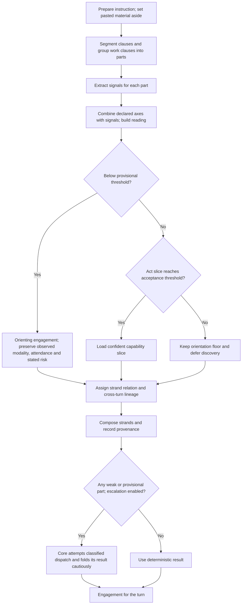
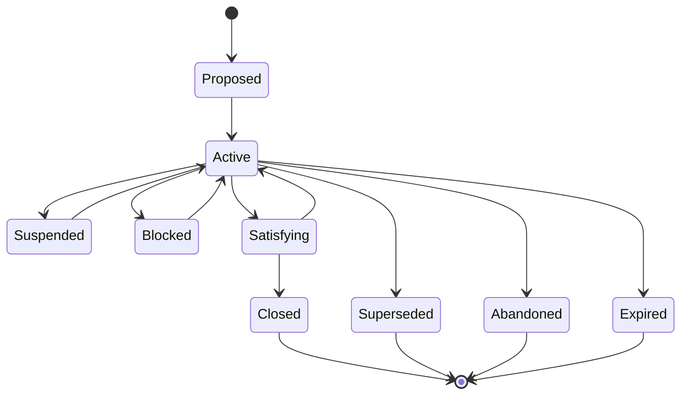

# 47 — The commitment kernel

Status: **shipped**. The current deterministic reader is
`vak_intent::RESOLVER_VERSION = 8`. The historical reviews below explain why
it changed; this document describes the current implementation. One known
boundary remains: `full-access` bypasses the permission engine's approval
gate, so the kernel's irreversible-work approval floor cannot force a prompt
there.

| Phase | Delivers | Governs the turn through |
|---|---|---|
| I0 | kernel (`vak-intent`): seven axes, cascade, authority, narrowing lattice, **strands** | `Core::resolve_turn_intent_with_escalation` |
| I1 | commitment ledger (`vak-commit`): lifecycle, satisfaction lattice, projection, portfolio scheduler | `commitments::plan_episodes` then `begin_episodes` — one commitment per thread |
| I2 | admission, intent ledger entry, `[intent]`/`[commitment]` config, `vak intent explain` | `IntentRecord` (reading, strands, engagement, note) |
| I3 | route demand, per-commitment budget, prompt projection, **context profile** | `plan_route_ladder(demand)`, `CoreSpendGate::narrow_run_cap`; `ContextProfile` reaches the working-set planner through `ReadingKey.context` (`minimal`: no relevance retrieval, only an explicitly referenced preceding turn at `Full`), the tail (`working`/`full`: the workspace delta since the session began, logged as a `workspace_delta` activity first) and the note (`full`: `commitments::prompt_projection`) |
| I4 | capability slicing (progressive disclosure) | stage-4 exclusion for a confident reading; the tool surface (core vs. deferred) for every reading |
| I5 | envelopes: `vak grant` / `vak revoke`; a live grant narrows the strands that serve its commitment and pre-authorizes, one gate at a time, the actions it covers; revocation honoured on read | `vak_intent::apply_envelopes` → `intent::permission_mode` → `cfg.mode` and `spend_ceiling_usd` → the run cap; `intent::envelope_check` → `AgentConfig::envelope_check` |
| I6 | episodes bracketing durable turns; upkeep tick — schedule wakes, predicate wakes, escalation policies, explicit expiry; **`Defer`** | `intent::DeferringApprover` parks an unanswerable gate in the inbox and suspends the commitment |
| I7 | server endpoints, admin portfolio, composer strip, the `commitments` capability, per-channel autonomy ceiling, delivery cadence/urgency | the gateway reads `posture.delivery` from the turn's intent entry |
| I8 | misread evidence: escalation-as-measurement, restatement, per-cell accuracy | scoped to the turn's own tool calls; `vak intent show` reports weak cells |
| **I9** | **tiers 2/3**: a `Classify` dispatch on a weak reading — spend-gated, watchdogged, fail-open | `[intent] escalate = local \| cloud`, `classify_model` |
| **I10** | **control plane**: authority from the channel, explicit commands, no text heuristics | `ControlSource`, `parse_command`, `evaluate_intervention` |

Every part is switchable off with `[intent] enabled = false` and
`[commitment] enabled = false`, which together reproduce the runtime's
pre-kernel behaviour exactly. `DomainSet::All` means *everything*; disabling
capability slicing also produces it.

## Runtime map

```mermaid
flowchart LR
    A[Human request and trusted channel facts] --> B[Core gathers workspace and session facts]
    B --> C[vak-intent: segment and resolve strands]
    C --> D{Reading weak?}
    D -- Yes, configured --> E[Core: budgeted classifier dispatch]
    D -- No or unavailable --> F[Resolved intent]
    E --> F
    F --> G[Plan commitment episodes and apply live envelopes]
    G --> H[Record IntentRecord in session ledger]
    H --> I[Compose capability surface, route, context and approval posture]
    I --> J[Permission engine and tool broker]
    J --> K[Episode evidence and commitment ledger]
    K --> L[Portfolio maintenance and delivery]
```



The crates split policy from effects. `vak-intent` resolves a reading and
derives a narrowing engagement without dispatching a provider or tool.
`vak-commit` owns the durable event ledger, projection, satisfaction rules and
priority calculation. `vak-core` supplies runtime facts, performs optional
classification, admits work, enforces gates, and runs upkeep. Session entries
record model-visible intent text; commitment events record obligations and
their outcomes. Neither ledger stands in for the other.

## Problem

vak decides a great deal before a turn runs — provider and model, permission
mode, capability packet, budget, prompt layers — and made every one of those
decisions **without any model of what the user was trying to do**. Three
findings from the code as it stood:

1. **The only intent classifier was a keyword hack.** `is_managed_work_request`
   lowercased the prompt, looked for one of thirteen English verbs, and called
   it multi-step if it contained two markers from `[" and ", " then ",
   "first", …]`. That boolean was the entire difference between
   `WorkMode::Direct` and `WorkMode::Managed`, and it fired on "explain what
   this and that mean".
2. **Demand-driven routing was wired but fed zeros.** `score_demand` /
   `order_ladder_v2` is a good ordering function. Its only caller passed
   `estimated_input_tokens: 0, structured_output: false,
   reasoning_required: false, evidence_required: false`. Every session scored
   identical demand, so objective selection was constant and the router inert.
3. **The capability packet was all-or-nothing.** Every tool, skill, and MCP
   server was advertised on every turn, whether the user said "hi" or "migrate
   the billing schema".

Underneath those three is one structural gap. vak's unit of identity was the
session and its completion signal was "the model stopped talking". Both
assumptions break as soon as work outlives a conversation: there is nowhere to
put a month-long obligation, and no way to say whether it was ever met. The
stop-gate, the premature-completion guard, and the doom-loop detector are all
patches on an unfalsifiable signal.

## Design

Three things, deliberately not conflated:

| | Source | Wrong-ness costs |
|---|---|---|
| **Reading** | inferred from the request | a worse turn |
| **Authority** | granted by a human | a safety incident |
| **Engagement** | derived from both | bounded by the narrowing invariant |

A resolution bug can change what vak *thinks the work is*. It must never change
*what it is allowed to do about it*.

### Reading: seven axes, not a taxonomy

vak runs everything from "hi" to a multi-month programme, so a subject-matter
taxonomy is both endless and useless — "research" says nothing about what the
runtime should do. The axes are behavioural and orthogonal, and each drives one
subsystem.

| Axis | Values | Drives |
|---|---|---|
| `act` | `converse` `answer` `locate` `analyze` `author` `modify` `operate` `verify` `orchestrate` `govern` | which admitted tools are loaded, output shape, stop profile |
| `horizon` | `immediate` `turn` `session` `durable` | managed admission, commitment promotion, context profile |
| `stakes` | `inert` `reversible` `costly` `irreversible` | approval ceiling, checkpoint-before, delivery urgency |
| `evidence` | `none` `cited` `verified` `audited` | **minimum satisfaction strength to close** |
| `clarity` | `clear` `underspecified` `ambiguous` | ask vs. state-an-assumption |
| `modality` | `text` `image` `audio` `video` `screen` `data` `stream` | ladder filtering, delivery format |
| `attendance` | `interactive` `supervised` `unattended` | HIL mode, delivery cadence, gate answerability |

No axis collapses into another. A long task can be closely watched and a
ten-second automation unattended, so `horizon` is not `attendance`. Work can be
irreversible yet need only an assertion, or inert yet need citations, so
`stakes` is not `evidence`.

Subject matter survives only as an open-vocabulary `domains` tag, used for
skill affinity and telemetry and **never** for control flow — so adding a
domain can never change what the runtime is allowed to do.

`Author` / `Modify` / `Operate` is the safety-relevant split and means the same
thing for prose, a spreadsheet, and a production deploy. Only `Modify` /
`Operate` / `Govern` / `Verify` demand an execution or file-modification
receipt before honestly claiming done (`Act::requires_execution`); `Author`
is deliberately absent from that set — producing prose, code, or a plan is
proven by the response itself, and demanding a shell or file receipt for a
poem is the bug the split exists to avoid. A request that *names* a file
deliverable still needs one regardless of act (`OutcomeSpec::
requires_execution`, which reads the request text `Act::requires_execution`
does not have).

Interaction rule: **ambiguity only interrupts when the stakes are high.**
`ambiguous + inert` proceeds on a stated assumption; `ambiguous + irreversible`
asks.

#### Axis algebra

Two shapes, and conflating them was a real bug during implementation:

* **Categorical** (`act`, `clarity`): rival explanations. Confidence comes from
  the winner's lead over the runner-up.
* **Ordered** (`stakes`, `horizon`, `evidence`): levels on a scale. A signal
  saying `reversible` does not argue against `irreversible`, it agrees with it
  more weakly. Scoring these by argmax made corroborating evidence *reduce*
  confidence — a dirty working tree voting `reversible` dragged "deploy the
  billing service to production" below the acceptance floor and lost the
  irreversible reading entirely. Ordered axes now take the highest level with
  real support, which is also the cautious direction on every one of them.

Stakes words ("production", "force push", `rm -rf`, `git reset --hard`) and
environment-derived signals (a dirty tree) apply to effectful acts and to a
request whose verb the reader does not recognise — "force push to the
production branch" is no less dangerous for using a verb the lexicon lacks.
They do not apply to a request recognised as asking, finding or analysing: a
repository mid-edit does not make answering a question risky, and "why did
the production deploy fail?" changes nothing. Stakes come from what an action
does, never from what it is about ("customer", "payment", "live" are topics).

#### Confidence is per-axis

A single scalar conflates independent questions. Capability slicing depends
only on `act`; commitment promotion only on `horizon`. Gating both on the
weakest axis meant an unsignalled horizon — most requests, since few say how
long they will take — suppressed slicing the act reading was certain about.

For the slice specifically, the question is not "which single act won" but
"does the slice cover this request". Acts within half the winner's weight join
the slice, and confidence is how much of the total act evidence that set
accounts for. "Fix the failing test" is a `modify` *and* a `verify`; resolving
the tie by argmax would remove half of what it needs.

### Strands: a request is several pieces of work

A request is rarely one thing. "Explain the parser, then refactor it, and
also check whether the nightly job ran" is three pieces of work with three
readings, and the runtime has to know that: the tool surface must cover all
three, the stop rule must be the strictest of the three, and the nightly-job
question may well be a thread the user opened two turns ago.

So a turn resolves to a list of **strands** (`crate::strand`). Each carries
its own reading and engagement, its **relation** to the strands beside it
(`Independent`, `Sequential { after }`, `Dependent { on }`) and its
**lineage** to threads from earlier turns (`New`, `Continues`, `Corrects`,
`Replaces`). The turn's engagement is `Engagement::compose` over the strands:
everything meets — the strictest strand governs approval, permission, spend
and the stop rule — except the domain requirement, which is the **union**,
because a turn that is "search the web, then run the tests" needs both
toolsets. The composite reading kept on `Intent::reading` is the most
consequential strand widened by the others, for everything that wants one
answer (the misread ledger, the session index, a commitment's spec).

Segmentation is tier 1, deterministic. Pasted material is set aside first —
fenced code, runs of two or more lines that do not read as a request (a log,
a CSV, a stack trace), and a single very long raw line — so a 300-line log
is one part to read about, not 301 requests; it reaches the reading only as
"there is pasted material". The instruction is then split at sentence
boundaries, enumerated items, and a short list of sequencing (`then`, `after
that`, `finally`) and addition (`also`, `additionally`) markers, matched as
whole words. Plain "and" is not a boundary. Each clause gets a role —
imperative, question, request, social, or statement — and a part is a
clause that asks for work with the context clauses around it: "the deploy
failed, fix it" is one part, and "the deploy failed" alone asks for nothing
beyond an answer. A statement's words never vote for an act ("the build
**fails** on CI" reports; it does not ask to verify), a question's verbs
other than its head count half, a greeting or thanks is social, and a
request aimed at the requester ("alert me when…", "remind me to…") is an
answer to them rather than an operation on the world. There is no cap on
the number of parts, and no signal is taken from length. Every strand of a
several-part request is read at least as a `turn` horizon: "one reply, no
tools" cannot describe a part of something larger.

Strand ids are `{turn_id}.{index}`, where the host mints the turn id (a
UUIDv7) once per turn; a preview that persists nothing gets positional ids.
Threads, and the commitments keyed by them, are therefore unique across
turns, sessions and workspaces — positional ids collided on the second turn.

Cross-turn lineage: a strand continues an open thread when it shares the act
and either points at something ("it", "that") or shares a content word. It
is `New` otherwise — a wrong `New` costs a duplicate thread, a wrong
`Continues` merges unrelated work, so the tie goes to `New`. `Corrects` and
`Replaces` are **never inferred**: only an explicit `/goal fix …` or
`/goal replace …` produces them, because a wrongly inferred replacement
discards work. A replacing strand starts a thread of its own. Commitments
follow threads (`CommitmentSpec.thread_id`), decided before the turn writes
anything (`commitments::plan_episodes`): a strand on a thread with an open
commitment works on it whatever its own horizon reads as ("now also check
staging" is part of the weekly job it continues); a strand that replaces a
thread with an open commitment opens the successor and supersedes it; any
other strand opens one only when it is itself durable and confidently read.
The model-visible note lists the parts in order so the model knows there are
*k* things and which are still open.

The commitment decision is per strand, before anything is written. In
`commitments::plan_episodes`, an existing open commitment on the strand's
thread wins even when this turn's horizon is short. An explicit replacement
of a thread with an open commitment opens a successor and links the old one
as superseded. Otherwise a new commitment opens only if the strand's posture
requests one and its reading is confident enough to support a durable
obligation. `begin_episodes` then appends an `EpisodeStarted` for each planned
strand in order; if it finds an orphan episode from a prior crashed run, it
closes that episode as blocked before starting the next one. A ledger failure
skips that strand's episode and is logged; it does not cancel the turn.

### Resolution cascade

Cheapest first, stopping once confidence clears the bar.

| Tier | Cost | Reproducible |
|---|---|---|
| 0 — **declared**: CLI flags, flow intent, pinned channel policy, inherited worker engagement | free | yes |
| 1 — **signals**: lexical, structural, deictic, workspace, session, surface, attachment | free | yes |
| 2 — **local model**: strict JSON via Ollama | ~free | no |
| 3 — **cloud model**: only below the tier-1 threshold | metered | no |

Tiers 0–1 are pure functions of recorded inputs, so a decision that narrowed a
turn can be reconstructed months later. Tiers 2–3 record the model id and
prompt digest and are marked `reproducible: false` — the same honesty the
routing ledger applies to `Settlement::Unknown`. Never claim replay fidelity
you do not have.

The kernel decides **whether** a paid tier is warranted; `vak-core` performs
it (`Core::resolve_turn_intent_with_escalation`), because a dispatch is a
dispatch: `WorkPurpose::Classify`, a work receipt on the session, spend-gate
admission under `max_classify_usd`, a watchdog under the run's cancellation
token, and **fail-open** to the free-tier reading with the reason recorded
in `escalation_note` (a parsed answer that set nothing is kept there too,
bounded to its first 400 characters). A classifier outage must never block
work. `escalate = "local"` means a model on this machine and runs **only**
on the keyless `ollama` provider — with `classify_model` (an `ollama/` prefix
is accepted; a prefix naming another configured provider is refused rather
than read as a model name) or the effective model when the route is already
ollama — so a local setting can never send the request text off the machine.
`escalate = "cloud"` runs on the effective provider, or on `provider/model`
when `classify_model` names one; any paid provider needs a known price to be
held to, and an unpriced one is refused. The recorded tier names where the
model actually ran (`local-model` on ollama, `cloud-model` otherwise), not
which setting asked for it. The prompt is built by the kernel
(`classification_prompt`) — one JSON object per strand, each part shown on
one line and capped at 280 characters, pasted material left out — so its
digest is the kernel's and one long message cannot turn a cheap
classification into an expensive one. The output budget grows with the
number of parts (`classification_budget`: 100 + 120 per part, at most 1600
tokens), because a fixed budget truncated the answer for requests with more
than a few parts and a truncated array parses as nothing.
`parse_classifications` reads the first JSON value in the answer, as an
array or a single object, and ignores unknown values; a domain outside the
vocabulary is dropped. The request asks the model **not** to think (`ChatRequest.think =
Some(false)`, Ollama `think`): measured live on `gemma4:e2b-mlx`, the default
spent its whole output budget in the thinking channel and returned no JSON;
without thinking it answers in 0.8–4 s. The watchdog is
`classify_timeout_secs` (default 10). When the model splits the request
into a different number of parts than the segmenter did — it did, for one
strand containing "then", about half the time — the objects fold on the
cautious side (highest level per ordered axis, union of domains, lowest
confidence) and apply to every strand rather than being discarded.

Measured live (six runs, local Ollama): every run settled `local-model`
with five axes set, 0.8–3.9 s, and a cold model overrunning the watchdog
failed open with the reason in `escalation_note`. `escalate = "cloud"` is
privileged: a project config that sets it is stripped unless trusted, which
is why an untrusted workspace never spends credentials classifying.

A classifier may raise stakes or evidence freely; it may not lower either
below what the free tiers concluded, nor lower stakes below what the act it
chose implies. Authority-bearing limits are met with the free tier's, so a
classifier can change what a turn *reaches for* but never what it is
*allowed to do*. A classifier that states no confidence is provisional: it
may raise a floor, it may not remove a tool.

What a weak reading gets, with the kernel on, is the **orienting
engagement**: the general posture and the orientation floor
(`filesystem`, `memory`) as its domain requirement — an explicit decision,
never a collapsed top element — made at least as careful as any risk the
text stated. Stakes above the ordinary and an evidence standard are only
ever read from words the request contains, so a weak part keeps them: a
reading too weak to narrow capability is never too weak to raise caution,
and "force push to the production branch" asks first whether or not its
verb was understood. `DomainSet::All` keeps its one meaning,
everything (design 68 Principle 6:
when a decision cannot be made confidently, send less and give the model a
way to ask for more). No reading, confident or not, removes a capability:
admission is policy only (docs/design/41-capability-registry.md), and the
reading decides which admitted tools are loaded versus deferred behind
`find_tools`.

#### Resolver algorithm as implemented



`resolve` is a pure function of the request, declared axes, authority and
resolver config. For each part it calls `assemble`, derives an engagement,
and gives the strand an id from the host's turn id. A weak part falls back to
`Reading::general` while retaining its observed attendance and modalities and
any stated higher stakes or evidence requirement. A provisional part may
raise caution but does not qualify for a confident capability slice. The
composite keeps a turn-level reading for consumers needing one answer and
uses `Engagement::compose` for its operating limits.

The returned `Resolution` is either `Settled` or `Escalate { partial, reason }`.
Core can decline or fail the classifier dispatch and still use `partial`.
`apply_classification` cannot lower caution established by deterministic
signals; a classifier answer without confidence does not earn capability
slicing. The lexicon digest test pins the signal tables and segmentation
vocabulary to resolver version 6.

### Authority: the autonomy spectrum

Autonomy is **delegated by a human**; attendance is **observed by the runtime**.
Conflating them is why agents nag when you wanted autonomy and barrel ahead
when nobody is watching.

| Autonomy | Meaning | Approval ceiling by stakes |
|---|---|---|
| `manual` | propose only | `ask` at every level |
| `assisted` | act on reversible things; ask for costly or irreversible | `auto-approve` for inert/reversible, `ask` from costly up |
| `delegated` | act inside a declared envelope; escalate outside it | `ask` at the turn; each gated action a live envelope covers proceeds |
| `autonomous` | act freely within the permission mode; report afterwards | stakes alone: `approve-safe` at costly, `ask` at irreversible |

The table is the code (`Authority::approval_ceiling`) and a test pins it.

An **envelope** is pre-authorization *within existing authority* — never a
grant of new authority. It belongs to a commitment, so it is not part of the
turn's `Authority`: which commitment a strand works on is only known once
the request is read. It reaches a turn twice. First, `apply_envelopes`
narrows the strands that serve its commitment: its `permission_ceiling`
lowers their permission ceiling (reaching the mode through the same
`PermissionMode::capped_by` a gateway channel override uses) and its spend
limit lowers their spend ceiling; under `delegated` autonomy such a strand
works in the `Envelope` HIL mode, unless it is irreversible or deferred.
Second, at the approval gate: for a delegated turn with nothing
irreversible in it, `intent::envelope_check` lets a gated action through
when a live envelope covers it — its tool is in the tool scope, if there is
one, and every path it names is inside the path scope, made
workspace-relative, with no `..`, absolute or foreign-root path coverable.
The grant is read from the ledger at every check, so a revocation, an
expiry, a closed commitment or a spent limit applies at the very next gate.
An ask raised by an operator's rule or by the circuit breaker is never one a
grant stands in for.

`intent.autonomy`, `intent.escalate = "cloud"`, and switching the kernel or
its posture off (`intent.enabled = false`, `intent.posture = false`) are
**privileged config**, stripped for an untrusted project. A cloned repository
must not grant itself the right to act without asking, spend the user's
credentials classifying, or remove the approval floor the kernel raises for
irreversible work.

Under a gated permission mode, irreversible work reaches a human whatever
was delegated. `full-access` is an exception: the permission engine allows
calls without an approval gate, so this floor alone cannot prompt there. A
grant to act without asking is not a grant to act without anyone ever
knowing.

### Human-in-the-loop: four modes

Chosen by `attendance × stakes × autonomy`.

| Mode | When | Behaviour |
|---|---|---|
| **Interrupt** | interactive, high stakes | block and ask now |
| **Envelope** | delegated, working on an enveloped commitment | proceed inside the grant, escalate outside |
| **Review** | reversible and checkpointed | do it, show the diff, offer reversal |
| **Defer** | unattended, needs a human | suspend into the inbox |

**Defer** is the new one. An unattended surface used to fail closed
unconditionally — correct for a one-shot turn, wrong for month-long work, which
should wait rather than fail. Deferring needs somewhere to park the question,
so it is only offered when the horizon opens a commitment; a one-shot
unattended turn still fails closed exactly as before. It covers irreversible
work too: an irreversible step with nobody present reaches the inbox, not a
gate that can only time out. Wiring: `intent::DeferringApprover` wraps the
run's approver when `gate_fallback` is `Defer`; a gate the inner approver
cannot answer becomes an `ApprovalPending` inbox entry and a
`Suspended { Human }` event on the commitment, and the turn still fails
closed — nothing happens without the answer, but the work survives.

Every deferred question carries an escalation policy. `AssumeConservative` is
refused above `costly`: assuming a default for an irreversible action because
nobody replied is precisely the autonomy this system exists to prevent.

### The commitment

`horizon = durable` — work that outlives the session: a recurrence, a watch,
"every day" — promotes a resolution into a durable **commitment** in its own
append-only ledger, independent of any session. Multi-step work inside one
session runs managed, under a plan, and opens no commitment; below that,
intents resolve and die inside the turn — a simple prompt pays nothing.

A commitment is held by the Agent that took it on: its ledger is in the
Agent's home (docs/design/64-agent-owned-platform.md), the `commitments`
capability reads that ledger, and each commitment records the conversation
audience that asked for it, so an Agent serving several chats never shows
one chat what another asked of it. The upkeep tick
(`commitments::maintain_all`) sweeps every Agent's portfolio, and a predicate
is checked in the workspace its commitment belongs to — confined to it: the
check runs in the server process, outside any sandbox, so a criterion that
names an absolute path, a `..` step or a symlink out of the tree is not
checked at all.



This shows the conceptual lifecycle. The event ledger in
`vak-commit/src/ledger.rs` defines the exact accepted event transitions and
validates them at append time; consumers should use its projected `Phase`
rather than infer state from this diagram.

`Verdict::Unknown` is mandatory, not a nicety. Without it the only way to tidy
an untracked commitment is to assert an outcome nobody verified.

#### The satisfaction lattice — how we know it is done

```
Asserted  <  Cited  <  Observed  <  Attested
```

Strength comes from **how a criterion was established**, not from anyone's
confidence:

| Criterion kind | Strength |
|---|---|
| `Shell`, `FileExists`, `FileContains`, `ToolSucceeded`, `FlowCompleted` | `Observed` — the runtime ran it |
| `ExternalReceipt` | `Attested` — a third party vouched |
| `Semantic` | `Asserted` — only the model's judgement |

**Closure invariant:** a commitment may not close `fulfilled` below the
strength its `evidence` axis demands, and the ledger refuses the event at
append time. A ledger that can record a lie is not an audit trail — so the
strength a closure records is recomputed from the criteria at append time,
whatever the caller claimed, and the check-and-append runs under an OS file
lock that a crashed writer releases with its process.

The model may **propose** criteria; it may never **mark one passed**. Same
separation of powers as permission-before-dispatch. A failed or undetermined
check carries no evidentiary weight regardless of kind — only a pass earns it.

Failure verdicts are deliberately unconstrained: recording `failed`,
`abandoned`, or an honest `unknown` must always be possible, or the ledger
could not tell the truth about work that went wrong.

Criterion and evidence vocabulary is reused from `vak-session`
(`CriterionKind`, `CriterionResult`, `EvidenceRef`, `WorkCriterion`,
`WorkOwner`) rather than redefined.

#### Progress versus motion

Every episode ends with a typed advancement: `Advanced` (a criterion moved),
`Learned` (uncertainty reduced — legitimate progress), `Blocked`, or `Stalled`
(spent budget, moved nothing, learned nothing). Consecutive stalls trip a
breaker at commitment scale. `Learned` exists so genuine exploration is not
punished, which is how naive progress metrics fail.

#### Suspension

Every wake condition maps onto a mechanism vak already has, which is why this
is rewiring rather than new infrastructure:

| Condition | Mechanism |
|---|---|
| `Human` | `vak-core/src/inbox.rs` + gateway approval forwarding |
| `Schedule` | `vak-core/src/triggers.rs` cron engine + scheduler catch-up |
| `Predicate` | a script trigger's watchdog — **zero tokens while the predicate stays false** |
| `Commitment` | dependency edge |
| `External` | `vak-delivery` outbox / webhook |

#### Long-horizon mechanics

* **Re-admission.** A commitment resuming after weeks re-resolves its
  engagement against current reality and records the drift. Never silently
  inherit a stale contract.
* **Lifetime economics.** A lifetime budget and relevance TTL, not just
  per-run caps. Budget exhaustion *holds* the work rather than failing it — a
  human can raise the ceiling, and everything established is still good.
  Expiry produces an explicit `expired` verdict, never a silent deletion.
* **Supersession.** "Forget the migration, just add the index" supersedes with
  a lineage link. Without this you get the zombie task graveyard that kills
  every list-based agent.
* **Portfolio scheduler.** Deterministic and inspectable: a total order over
  stakes, deadline proximity, staleness, progress, review-due, and a user pin
  that dominates every computed factor. Every priority decomposes into named
  components. An opaque scheduler in a system whose thesis is auditability
  would be the one place you could not ask "why did it do that".

`vak_commit::portfolio::prioritize` exposes the actual additive score:

| Component | Current contribution |
|---|---:|
| User pin | `1000` |
| Stakes | inert `1`, reversible `2`, costly `3`, irreversible `4` |
| Deadline | `min(24 / hours_left, 50)` while the expiry is in the future |
| Staleness | `ln(1 + idle_hours)` when idle time is positive |
| Progress | `2 × passed_criteria / all_criteria` when criteria exist |
| Review due | `3` after `review_every_hours` |

Terminal, suspended, blocked, over-budget, expired and stalled commitments
receive a `withheld` reason. `rank` puts runnable commitments first, then
sorts by descending score and commitment id for a stable tie-break. A pin
changes priority, but never makes withheld work runnable. `next` returns the
highest ranked runnable commitment.

### Delivery posture

`DeliveryPosture` decides *when* a packet goes out, never what it says: the
semantic contract, the renderer and the outbox are untouched. Two rules
override the cadence, and both are about not losing something that matters —
an `Interrupt` urgency always sends, because an irreversible step's
confirmation must not sit in a digest until morning; and an approval always
sends, because a held gate is a stopped run and batching it would turn a
question into a hang.

### Per-channel autonomy

`ChannelPolicy.autonomy_ceiling` joins the existing restrictive-only chain. A
chat may cap delegation below what the workspace granted and may never raise
it: a Telegram chat gets to say "propose only, in here", and never "act
freely" on a workspace whose operator did not. `vak-config` ranks the names
without depending on the kernel; a test in `vak-core`, which sees both, pins
the two rankings equal.

### Control plane: authority from the channel, never from the text

A running turn can be steered, paused, cancelled, re-planned or approved.
Three sources, typed by the transport, never parsed from a body
(`ControlSource`):

| Kind | Human | Agent | System |
|---|---|---|---|
| status | ✓ | ✓ | ✓ |
| resume | ✓ | own children only | ✓ |
| pause / cancel | ✓ | own children only | ✗ |
| steer | ✓ (any free text) | typed message only | ✗ |
| replan / add / drop / prioritize | ✓ → new revision | requires human | ✗ |
| approve / reject a gate | ✓ | ✗ | ✗ |
| goal corrects / replaces | ✓ explicit only | ✗ | ✗ |

**Human free text is always steering.** Control from a human is only an
explicit command (`parse_command`): a leading slash command — `/stop`,
`/cancel`, `/pause`, `/resume`, `/status`, `/replan …`, `/add …`,
`/drop …`, `/prioritize …`, `/goal replace …`, `/goal fix …`,
`/until-done …` (hold completion until the person says `done`),
`/approve <gate>`, `/reject <gate>` — or a whole message that is exactly
`stop`, `cancel`, `pause`, `resume` or `status`. "Stop using semicolons in
the output" steers the running loop between steps; before this it cancelled
the run. Goal relation follows the same rule (`goal_relation`): only an
explicit command corrects or replaces the active goal, and a correction
keeps what was added to the goal while a replacement discards it. A message
after `/stop` starts a new goal rather than adding to cancelled work, and a
message added to a paused goal resumes it, because the turn carrying it
runs. Only a goal a person stated (`/goal …`) is shown to the model as the
primary objective; otherwise the objective is merely the conversation's
first message, and "hi" is not one. The message that starts a turn and one
steered into a running turn take the same path (`next_goal_update`), so
revisions count every update and are never reused. The earlier text
classifiers (`classify_intervention`, `classify_goal_update`) are gone: they
read "replace the deprecated API call" as a replacement of the goal.

"Own children only" is a fact about the target, not the caller: an agent may
control a session only when that session's own header names the agent as
the one that dispatched it (`InterventionRequest::target_parent_session_id`).
When the parentage is unknown, the answer is no.

### Did we read it right?

Misclassification becomes **measurable**. Typed misread signals: the user
rephrases immediately, corrects, aborts, overrides the intent chip — and
strongest, **escalation**, where the engagement sliced a tool out and the model
then asked for it. That is a measured misread, not a guess, and it is a direct
benefit of doing the slicing at all. These fold into the routing evidence
ledger with the same epistemics (success / failure / **unknown**, Laplace
shrinkage, 30-day TTL). Escalation is measured against the turn's *own*
tool calls (scanning the whole chain recorded a tool used three turns ago as
an escalation against today's reading); a request restated verbatim right
after the previous turn is recorded as `Restated` against the previous
reading. A deferred tool used after a reading too weak to decide what was
loaded is recorded but counts as unknown (`MisreadRow::sliced`): that
reading loaded only the orientation floor and expected discovery. Cells are
kept per resolver version, and only the running lexicon is judged. The loop
closes on a person: `vak intent show` lists the running lexicon's cells
that something contradicted and whose accuracy has fallen below 0.75 over at
least five observations, with the capabilities the model asked for.

## Invariants

1. **Intent narrows, never widens.** An engagement's `Limits` may lower a
   budget, lower a permission ceiling, or *raise* an approval floor. Never
   grant, extend, raise a cap, or lower a floor. A reading decides which
   admitted tools are loaded, never what is possible: it does not shorten the
   route ladder, cap the turn budget, or limit delegation — those caps only
   ever removed capacity from requests the reader got wrong. `Limits`
   is a meet semilattice whose top element reproduces pre-kernel behaviour;
   `meet` is the only composition operator offered and there is deliberately no
   `join`. `Limits.required_domains` is typed as a bounded semilattice `DomainSet`
   ($\bot = \text{Empty} \le \text{Only}(names) \le \top = \text{All}$); disjoint domain
   intersections collapse strictly to $\bot$ (`Empty`) rather than widening to unconstrained $\top$,
   guaranteeing $\text{meet}(a, b) \sqsubseteq a$ across all inputs.
2. **Intent never gates the permission engine.** Permission is evaluated
   exactly as before; intent may only add an approval requirement. Nothing in
   the kernel can authorize anything.
3. **An envelope is pre-authorization within existing authority**, never a
   grant, and never for irreversible work or an operator's ask rule. It is
   read at every gate, so a revocation applies to the very next one.
4. **The runtime evaluates satisfaction; the model never does.**
5. **A commitment may not close above its evidence class.**
6. **Model-visible means logged.** The intent note gets its own entry type
   carrying the exact contributed text; the projection reads those bytes rather
   than re-deriving them, so a replay reproduces the prompt even if the
   derivation rules have since changed.
7. **Reproducible, or declared not to be.** `RESOLVER_VERSION` and the tier-1
   lexicon move together: a test pins a digest of every table tier 1 reads
   (and the segmentation vocabulary) to the version, so a lexicon change that
   forgets the bump fails CI instead of silently invalidating every ledger
   row that claims `reproducible: true`. Nothing in `resolve` or `derive`
   reads a clock; time enters only where a grant's liveness is judged
   (`apply_envelopes`), as a parameter.
8. **Uncertainty resolves to the orienting engagement**, never to anything
   narrower, and never drops risk the text stated. Being unsure must never
   silently remove a tool or lower a floor.
9. **Commitments close explicitly**, with a verdict and evidence.
10. **Unsupported modality fails typed, never silently degrades.** Dropping an
    image because the serving model is text-only is the "everything worked as
    designed and the outcome was a lie" failure `reach` exists to prevent.
11. **Workers inherit, narrowed.**

## What this replaces

A consolidation, not an addition:

| Removed / demoted | Becomes |
|---|---|
| `is_managed_work_request` | **deleted**; managed-ness follows from `horizon` |
| `WorkMode::Auto`'s keyword branch | the reading |
| Session-scoped `WorkContract` as the only durable work state | commitment-scoped (staged) |
| Stop policy's completion role | narrows to "did this episode terminate cleanly" |
| Doom-loop heuristics | the stall breaker's measurement (staged) |
| Per-call approval as the only HIL | one of four modes |

## Layout

```
crates/vak-intent   axes, signals, cascade, authority, the narrowing lattice.
                    No vak dependencies: a pure decision layer, unit-testable
                    without a network, a model, or a config file.
crates/vak-commit   durable commitments, the satisfaction lattice, the
                    append-only ledger and its projection, the portfolio
                    scheduler. Reuses vak-session's criterion vocabulary.
vak-core/intent.rs  the seam: gathers facts, runs the cascade, projects the
                    engagement onto runtime knobs. Every function takes a
                    baseline and returns something no wider.
```

## Configuration

```toml
[intent]
enabled = true              # false reproduces pre-kernel behaviour exactly (privileged at false)
accept_confidence = 0.75    # bar for deciding which tools are loaded
provisional_confidence = 0.45
slice_capabilities = true   # false loads every admitted tool on every turn
posture = true              # the approval ceiling (stakes × autonomy) may lower the mode (privileged at false)
escalate = "none"           # none | local (ollama only) | cloud    (privileged at "cloud")
classify_model = "…"        # model, or provider/model, for the classifier
max_classify_usd = 0.01
classify_timeout_secs = 10  # watchdog; an overrun fails open to the free-tier reading
autonomy = "assisted"       # privileged

[route]
modality_hints = ["vision", "-vl"]   # legs able to serve non-text input; none ⇒ every leg

[commitment]
enabled = true
lifetime_budget_usd = 25.0
stall_limit = 3
review_every_hours = 24
default_ttl_days = 30
```

## Surfaces

* `vak intent explain "<prompt>"` — the reading, every signal with the weight
  it carried, the engagement diff against doing nothing, and the exact text the
  model would additionally be told. Costs nothing, dispatches nothing.
* `vak intent show` — the resolved policy.
* `vak commit list|show|close|supersede|attest` — the portfolio, ordered by the
  same scheduler the runtime uses. `close --verdict fulfilled` surfaces the
  closure invariant to a person.
* `GET /intent/explain`, `GET /intent/policy`, `GET /commitments`,
  `GET /commitments/{id}`, `POST /commitments/{id}/close` (409 on a refused
  closure — the request was well-formed; the evidence simply does not support
  the claim).

## What the review changed

A deep review of the kernel (resolver version 1) found, and this version
fixes:

* `DomainSet::All` meant "everything" in the kernel and "nothing declared"
  in the runtime, so `enabled = false` did not reproduce pre-kernel
  behaviour. `All` now has one meaning; weak readings get the explicit
  orienting engagement.
* Horizon phrases matched substrings (`then` inside *authentication*), and a
  lone sub-floor vote won an ordered axis at 0.76 confidence — "fix the
  authentication bug" opened a durable commitment. Phrases match whole words;
  sub-floor votes abstain.
* Stakes words applied to questions ("where does this config live" read as
  irreversible, capped approval at `ask`, and told the model to confirm an
  irreversible step). They apply only to effectful acts.
* `assisted` capped every stakes level at `approve-safe`, indistinguishable
  from `autonomous` on costly work. The table above is now the code.
* Tiers 2/3 were configuration without a call site; they are wired (I9).
* Modality, permission and spend ceilings, HIL `Defer`, delivery posture,
  the stop and context profiles and the checkpoint decision were computed and
  never consumed; they are wired. The session's first checkpoint is always
  taken (it is the baseline the workspace delta is measured against); later
  ones only when the reading expects an effect.
* `Engagement::meet` was asymmetric and could reduce caution; the stop gate
  reasoned from requirement *prose*; the control plane granted authority to
  whatever body said `"human"`; goal and intervention classifiers were the
  keyword hacks this design set out to remove. All replaced.
* `RESOLVER_VERSION` stayed at 1 through eleven lexicon changes. Pinned.
* The misread ledger scanned the whole session for escalations. Scoped.

## What the second review changed

A second review (resolver version 3, 2026-09-26) measured the reader on
real inputs and followed every derived value to where the runtime used it.
Resolver version 4 and this change fix what it found.

**The reader.** Tier 1 read every line of a message as a request. A pasted
53 KB CSV took 105 s to resolve and a 300-line log became 301 strands, one
of them `irreversible`, with a 26 KB note and a 527 KB intent record. With
pasted material set aside (see *Strands*), measured in a release build: the
CSV resolves in 14 ms, the log is one `answer` strand with no note, and a
20 KB log's intent record is 2.5 KB. Statements no longer vote ("the deploy
failed" reported, it did not ask to operate), questions no longer read as
their verbs ("what happens when I press ctrl-c" is an answer), greetings
and thanks are social, topic words no longer raise stakes, "make sure"
raises the evidence standard only next to something checkable, horizon
phrases count only in a clause that asks for work, and no length signal
remains. The `live-data` domain — "ask for a value observed this turn" — is
set only for a request that seeks a fact (answer, locate, analyse) with a
temporal word that is not about something local or a time: "the current
price of copper" is live data; "the current directory" and "refactor the
current parser" are not. Destructive requests with an unknown verb keep
their stakes (see *Axis algebra*). A live run found ordinary instructions
the verb table lacked — "every day, append the date to log.txt" opened no
commitment because "append" was unknown — so common instruction verbs were
added (append, insert, replace, rewrite, merge, commit, revert, move,
upgrade, calculate, translate, push, upload, compile, lint and others),
weighted down where the word is often a noun. "Run" and "execute" stay out
on purpose: "run the tests" is a check, and reading "run" as an operation
would make it irreversible.

**The wiring.** Envelopes never reached a turn: the grant was looked up by
the session's managed-work contract id, which is not a commitment id. The
`commitments` capability read a different ledger from the one turns wrote,
so the model never saw its own commitments. Strand ids were positional, so
the second durable request of a session attached to the first one's
commitment. Every one is fixed as described above. The reading's caps on
the route ladder, the turn budget and delegation are removed (invariant 1).
The freshness check (docs/design/68-context-engine.md §7) is satisfied by
any observation of current state — reading the file, running the command —
not only by a web retrieval; the stop gate counts an integration's tool
call and a delegated task as execution; and a worker is held to the outcome
of its own prompt, clamped to what a read-only worker can do, not to its
parent's whole request.

**The edges.** Configured thresholds and caps written as `nan` or `inf`
(valid TOML) fall back to their defaults, because every comparison against
NaN is false. Runtime scaffolding is never stripped from inside a fenced
code block. The commitment and misread ledgers skip a corrupt line instead
of stopping at it.

**The live run** (local `gemma4:e2b-mlx`, 2026-09-26) confirmed the fixes
above end to end — a force push under `auto-approve` reached an approval
gate while an `ls` under the same settings did not; a grant let gated calls
through with no approver, and its revocation stopped the very next one; a
deferred gate parked its question and suspended the commitment; the model
read its own commitments — and found five more, all fixed here:

* A card that failed validation counted as an unresolved tool failure, so
  the stop gate sent complete, correct prose answers back to repair a card
  the small model could not build, until the turn failed. A card is a
  presentation of the answer: a failed one is simply not shown, and whether
  a card was needed is the presentation check's question.
* The stop gate's generic rule demanded a verification command after every
  code edit, overriding the reading: "explain calc.py, then add a subtract
  function" (an authoring stop profile) was sent to run a check its surface
  could not run. With a reading present, a re-run is owed only when the
  reading holds the work to a check or the request's words ask for one.
* The multi-part note labelled parts by act ("Part 2: author"), and the model
  copied the label into its answer. The note now states order and
  dependency as plain sentences.
* The `commitments` capability needed an approver to read the Agent's own
  portfolio, so "what are you working on?" failed on an unattended surface;
  it is a read tool now, like `session_search`. And "right now" beside the
  agent's own state ("what commitments are you holding right now?") read as
  a live-data question; the agent's own state is local.
* The verb table lacked common instructions (see *The reader*).

On the `main` line, resolver version 4 separately fixed the sense of `live`:
the verb "reside" ("we live in the city") carries no recency or stakes,
while "a live score" asks for a current value and "go live" describes a
launch. Version 5 combined that reading with the clause-aware reader described
above. Version 6 pins the tier-1 lexicon and lets irreversible stakes words
raise caution even when another recognized action verb is present. Version 7
preserves internal hyphens during lexical reading and recognizes the compound
verb "double-check", preventing a noun such as "latency-check" from becoming
a verification command. Version 8 lets the previous act resolve an explicit
deictic follow-up but never classify a fresh directive by itself. The digest
regression test prevents lexicon tables from drifting without a version bump.

One finding is left as a decision rather than a fix: under `full-access`
the permission engine allows every call without asking, so the approval
floor the kernel raises for irreversible work has nothing to gate there. A
force push in a `full-access` session still runs unasked.

## Verification

`cargo test -p vak-intent -p vak-commit` covers axis algebra, the cascade, the
lifecycle, and the property test that no engagement derived from any reading in
the reachable space (10 acts × 4 horizons × 4 stakes × 4 evidence × 3 clarity ×
3 attendance × 4 autonomy × 2 slice settings) ever widens the baseline.

`crates/vak-session/tests/intent_entries.rs` proves the projection: the note
reaches the model immediately before the turn it governs, only the newest one
applies, a silent engagement costs zero tokens, replay reproduces the recorded
bytes, and notes stay out of the compaction packet.
