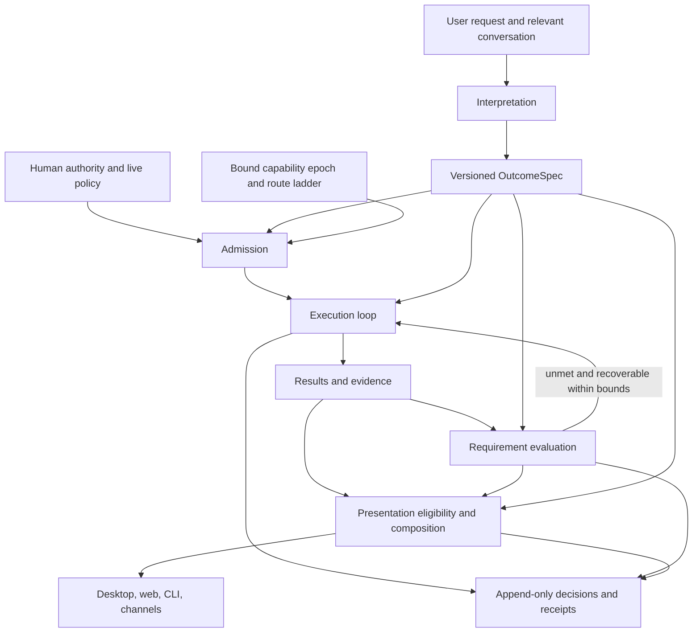

# 52 — Outcome-directed runtime

Status: implementation complete for the repository-verifiable runtime slices;
live workload measurement remains operational validation.

## Decision

Make the requested outcome a small, versioned input shared by admission,
context selection, capability discovery, execution, verification, and delivery.
Each stage produces its own decision with references to that input and to the
evidence it used. No stage infers the whole task again from incidental words.

The central value is an `OutcomeSpec`: what is wanted, what must be preserved,
what counts as completion, and which choices remain uncertain. It belongs to
the existing work contract vocabulary. An ordinary question gets a lightweight
specification in its session; it does not get a project plan or a background job.
Managed work and durable commitments reference the same specification when
their lifetimes require it. This creates no second scheduler or task store.

The runtime separates four responsibilities:

1. Understanding proposes the outcome and requirements.
2. Admission establishes enforceable bounds within existing human authority.
3. Execution produces results and evidence under those bounds.
4. Presentation projects those results faithfully onto a surface.

Interpretation is fallible. A correct implementation must remain useful when
the understanding is incomplete or wrong. Confidence never grants permission,
turns a claim into a fact, or supplies missing data for a renderer.

## 1. Product purpose and success

The purpose is continuity between what the user asked for and what the system
actually delivers. For the user this means fewer wrong actions, missing tools,
premature stops, unsupported claims, and inexplicable output formats.

The visible preview is optional inspection of this mechanism. Its existence is
not a reason to add an extra classifier call, block sending, or generate a
seven-field dashboard on every keystroke. Ordinary conversation must stay cheap.

Success is measured against the same harness without inferred optimization:
task completion, scope violations, missing-capability recovery, unsupported
completion claims, rendering errors, latency, cost, and correction burden.
Classifier agreement alone does not establish product value.

### Motivating failure

A current-events response is labelled `coding.test_report` with signals
`tests,pass_fail`. The current substring matcher in
`crates/vak-delivery/src/skills.rs` recognizes `tests` inside `protests` and
`passed` inside `surpassed`; both longer words occur in the supplied response.
This is a concrete mechanism consistent with the screenshot, not a replay of
its session ledger. The projection also supplies the last tool context of a
turn to each text block, including user text. Mere co-occurrence is being used
where the system needs an explicit relationship between a result and its source.

The new design must reject a test-report candidate without relevant typed test
results regardless of the wording, selected workspace, or most recent tool.
Changing substring matching to whole words is insufficient: a news article can
legitimately discuss tests and failures without becoming a software test report.

### Existing foundations and gaps

Preserve the append-only ledger, permission broker, frozen route ladder,
capability epochs, managed-work ownership, commitment scheduler, evidence
receipts, closed presentation AST, and deterministic Markdown fallback.

The inspected implementation already connects intent to capability domains and
approval narrowing. It also derives limits with no production consumers found
for intent turn caps, subagent caps, or ladder truncation. Model-classification
application exists in the kernel but is not called by the production resolver.
Misread detection examines a name slice while current selection uses domains.
These observations motivate explicit consumer coverage and end-to-end tests;
they are not claims that the existing independent permission boundary is absent.

## 2. Architecture and ownership



Use existing crate boundaries initially:

| Owner | Responsibility |
|---|---|
| `vak-intent` | Pure interpretation validation, requirement composition, narrowing derivation; no provider dispatch or domain instance tables |
| `vak-session` | Specification revisions, decision/result references, reconstructable model projections |
| `vak-core` | Resolution orchestration, admission, context construction, capability discovery, bounded recovery |
| `vak-agent` | Brokered execution and progress loop; consumption of enforced limits |
| `vak-commit` | Existing durable ownership, wakeups, criteria and closure |
| `vak-delivery` | Result eligibility, composition, closed AST projection, coverage and fallback |
| `vak-plugin` and capability registry | Contribution validation, ownership, activation, versions, epochs, revocation |
| Clients and server | Render the shared projections; do not independently classify intent |

No universal workflow DSL, new microservice, vector database, or new crate is
required for the initial implementation. Domain behavior belongs in packages.

## 3. Shared data model

Names below describe proposed contracts, not types already shipped. Reuse
existing IDs, criterion kinds, evidence references, work ownership, and resource
limits instead of introducing equivalent parallel representations.

### OutcomeSpec

| Field | Meaning |
|---|---|
| Identity | Schema version, spec ID, revision, parent revision, owning turn/work item/commitment |
| Objective | Short faithful statement plus references to the actual user request |
| Deliverables | One or more requested results with stable IDs, dependencies when needed, and optional semantic types |
| Requirements | Scope, preservation constraints, evidence needs, temporal requirements, output preferences, and completion conditions |
| Interpretations | Unresolved alternatives and assumptions with their consequences |
| Provenance | Explicit/inherited/inferred origin, source spans, interpreter version and applicable extension digests |

A requirement has an ID, target deliverable, predicate or opaque domain payload,
origin, importance (`must`, `prefer`), and evaluation mode. Unknown is explicit;
missing fields must not mean clear, safe, complete, or no evidence required.

Origin and importance are separate. An explicit table request can be a strong
preference; an inferred need for fresh sources can be important for an honest
answer. Importance does not make an inferred requirement an authorization.

Represent evidence requirements as a set of predicates rather than a single
global scalar. A source may be cited but stale; a command may be observed but
irrelevant; a receipt may be authentic but concern a different transaction.
Reuse the existing satisfaction strength as a minimum where applicable, and
evaluate relevance, freshness, coverage, and identity separately. Do not retype
or redefine the shipped satisfaction enum.

### AdmissionDecision

References one spec revision and records the capability epoch, permission
lease, existing route contract, allowed effects and resource bounds. Each bound
names its enforcement consumer and reason. Derived limits are composed with
the existing ceiling using `meet`; the interpreter has no authority to widen.

Distinguish `Enforced`, `Advisory`, `Unavailable`, and `NotApplicable` for each
projection. The UI may say “at most two iterations” only for an enforced limit
consumed by the runtime. Advisory values may guide work but cannot masquerade
as guarantees. A required hard constraint lacking an enforcement consumer
refuses affected execution with a typed reason.

### ResultRecord

Every meaningful output has a stable result ID, producer identity, owning turn
and work item, semantic type and schema version when known, payload or artifact
reference, exact fallback content, and references to input results and evidence.
Status is explicit: partial, complete, failed, cancelled, or unavailable.

Record validity and truth separately. A model-authored `test.report` payload may
be structurally valid while its claimed passes have no execution evidence.
Such a result cannot acquire an observed-success badge by naming the type.

### EvidenceRecord and Evaluation

Evidence retains source identity, retrieval/execution time, original content or
bounded immutable artifact reference and digest, producer, and scope. A source
reference records publication time and event time separately when available;
unknown timestamps remain unknown. Retention loss is explicitly unavailable,
not silently reconstructed from a current web page.

An evaluation references the requirement, result and exact evidence, evaluator
identity/version, verdict (`met`, `unmet`, `unknown`, `not_applicable`) and method.
Semantic judgement remains asserted. Deterministically proving that a citation
exists does not prove that it entails a claim. Extension validators cannot
declare their own output more trustworthy than its acquisition method permits.

### DecisionRecord

Each stage records its input references, selected option, material alternatives
and rejection reasons, algorithm/package versions, and disposition. Store a
bounded set of alternatives, with counts and digests for omitted diagnostics.
Explanations are projections of these records, not model-written rationales.

### Minimal runtime interface

The following is conceptual pseudocode, not a new tool API or wire schema:

```text
interpret(recorded_request, bounded_context, profile_snapshot)
    -> ProposedSpec | NeedsChoice | Unknown

admit(validated_spec, existing_authority, bound_epoch, frozen_routes)
    -> AdmittedRevision | Refused(reason)

dispatch(proposal, admitted_revision_id, current_permission_lease)
    -> ResultRecord + broker_receipt

evaluate(requirement_id, result_refs, evidence_refs, evaluator_binding)
    -> Evaluation

present(result_refs, evaluation_refs, output_preferences, surface_snapshot)
    -> PresentationDocument + coverage + decisions
```

`AdmittedRevision` is host-created; model JSON can reference it but cannot
construct one. Each call/result uses the owning request, spec revision and
work-item identity. Resolve references within the permitted workspace/session
scope before dereferencing; knowing an evidence ID is not access permission.
Never merge evidence from another turn because the tool name happens to match.
Cross-turn reuse is explicit and rechecks applicability and freshness.

Use one exhaustive host mapping from each supported hard constraint to a
consumer: effect restriction -> broker, iteration bound -> agent loop,
delegation bound -> child admission, spend bound -> budget gate, route prefix ->
provider dispatcher, completion predicate -> evaluator. Missing mappings are
admission failures for required constraints. The UI reads acknowledgements from
this mapping; it must not derive guarantees by formatting arbitrary spec fields.

The normalized model packet contains only actionable requirements and their
uncertainties, available discovery handles, and the admitted revision reference.
It need not include the diagnostic graph. HTTP/SSE, CLI inspection and desktop
commands expose views of these same records through their existing session,
intent and presentation surfaces; none invokes its own interpretation engine.

## 4. Understanding and admission

### Composition and provisional preview

Typing produces a provisional local preview against a draft revision. Cancel
obsolete work and discard responses for older draft IDs. Preview must not spawn
MCP services, run tools, create commitments, or call a metered classifier.
Attachments are descriptors until the user submits them. No background
submission of draft text to an external model is implicit in this feature.

On Send, record the user message immediately and bind the complete input before
resolution. Reuse a preview only if all its input identities still match; it
does not bypass admission. A stale preview cannot set execution bounds.

### Interpretation cascade

1. Read explicit structured choices and relevant inherited task requirements.
2. Build a bounded context packet: current request, referenced recent exchange,
   active deliverables, explicit constraints, and attachment metadata. Resolve
   “yes, do that” against the actual proposal it references.
3. Use deterministic extraction for concrete references, dates and explicit
   choices. Lexical hints nominate candidates, not irreversible decisions.
4. For requests needing semantic interpretation, let the normal model propose
   a structured spec before its first affected action. The host validates it.
   This can share the first ordinary dispatch; a separate classifier is optional.
5. Invoke a separate classifier only when the expected consequence of ambiguity
   justifies its configured latency and cost, within the frozen route contract.
   Record its dispatch and cancellation like every other model call.

Host validation checks schema, references, consistency, and non-widening. It
cannot prove arbitrary natural-language equivalence. Uncertain interpretations
therefore retain general capabilities and record uncertainty. Model-generated
confidence alone must not justify restrictive optimization. No prompt-length
rule sets duration, delegation budget, or fallback depth.

Quoted instructions, source documents and tool results retain their origin as
data. They may inform the objective only through the user's request to use them;
they cannot declare scope, grant authority, or edit a spec. An interpreter can
still misunderstand text, which is why permissions remain independent.

### Material ambiguity

Clarify when plausible readings differ on an external effect, recipient,
destructive target, required commitment, or consequential deliverable that
cannot be safely advanced without the choice. Ordinary factual questions do
not require approval of a generated specification. Proceed on a visible,
revisable assumption when the likely cost of a wrong assumption is small.

“Current events” may default to a concise recent overview in the user's time
zone, with the chosen date range visible. Do not silently redefine “current”
as whatever old articles were easiest to fetch. If the exact interval is
material, resolve it explicitly.

### Admission and revision

Bootstrap admission allows the ordinary model request under existing policy;
an effectful proposal must reference an admitted spec revision before dispatch.
New sessions use known demand before freezing routes where practical. Existing
sessions retain their route contract: no classification can reorder or expand
it. If the ladder cannot satisfy a required modality, report the mismatch.

An inferred discovery preference may be revised without widening authority.
An enforced restriction remains in force for that admission. Restoring a tool
excluded by an enforced slice requires a subsequent admission at a turn
boundary, using the existing ceiling and recorded revision; never mutate the
active grant. New permissions, higher spending caps and irreversible actions
still follow their existing human boundaries. Capability additions follow the
registry's next-turn epoch rule; revocations apply immediately.

Bind revision IDs to queued proposals and check them at dispatch. A steering
change that narrows scope stops incompatible pending work before its replacement
is active. In-flight work uses existing cancellation and partial-result rules;
receipts stay attached to the revision under which it actually executed. An
old approval cannot authorize a proposal changed by a later revision. Concurrent
children report against their own pinned requirement versions; the parent
re-evaluates applicability before using their results for a revised objective.

User steering appends a spec revision. Semantic changes invalidate evaluations
of affected requirements; previous evidence remains in the ledger. A model may
propose a revision but cannot silently weaken explicit acceptance criteria to
make a task pass. Strengthening evidence needs does not retroactively fabricate
proof. New authority is resolved independently.

## 5. How the pipeline consumes the specification

| Stage | Consumes | Produces and invariant |
|---|---|---|
| Context | Objective, references, constraints, active requirements | Packet plus inclusion reasons; repository presence alone does not make code relevant |
| Discovery | Needed operations and result types | Ranked admitted candidates, availability and known gaps; descriptions are not guarantees |
| Routing | Modalities, structured output needs, bounded demand | Existing frozen ladder selection/prefix only; preserve resilience unless an explicit bound requires otherwise |
| Planning | Deliverables and dependencies | Optional work items; a greeting does not generate a plan graph |
| Dispatch | Admitted revision, schema, arguments, current lease | Permission/resource decision and broker receipt before effects |
| Evidence | Typed outputs and raw receipts | Scoped evidence graph; successful execution is not automatic task satisfaction |
| Verification | Per-deliverable requirements | Met/unmet/unknown results with bounded recovery suggestions |
| Presentation | Requested form, eligible results, evaluations, surface | Per-result composition, exact fallback, coverage and explanation |
| Completion | Required deliverables and evaluations | Complete/partial/blocked/failed/cancelled; explicit limitations |
| Scheduling | Explicit continuing obligation and termination | Existing commitment and scheduler; topic or prompt length never creates recurrence |

Freshness, identity, units, target paths, recipients and output constraints are
carried as structured requirements where material. Stages consume only the
subset they own. A renderer does not need the entire prompt or provider secrets.

### Capability discovery without starvation

Keep permission admission separate from model context selection. Within an
admitted epoch, show a compact catalog and load schemas through the canonical
capability discovery path. Loading a schema from that already admitted catalog
is progressive disclosure, not a new permission grant. If this is implemented,
replace the old intent slice as the discovery mechanism rather than running
both selection systems indefinitely.

Effect restrictions such as “review only” are enforced independently at the
broker. A broadly capable Bash tool cannot be labelled read-only merely because
the request was a review. Unclassifiable effects follow the policy gate and
sandbox; capability metadata is not enforcement.

Unavailable integrations appear as unavailable with a reason and retry state.
Do not wait for all optional integrations at admission. Discover or probe the
one actually needed lazily and within bounds. Never install a new package or
inject a credential just because its description matches a requirement.

### Progress and recovery

Use evidence of progress: new relevant source material, a changed artifact,
completed checks, or an explicit user answer. Repeated paraphrases of the same
claim do not reset stall accounting. For ordinary conversation, producing an
answer can be sufficient; do not require tool evidence for a greeting or poem.

When a requirement is unmet, choose among another admitted capability,
correcting malformed output, gathering missing evidence, reporting partial
completion, or asking for a material decision. Every recovery consumes the
existing budget and deadline and carries a reason. No unlimited repair loop,
silent relaxation of completion conditions, or automatic trust escalation.

Completion aggregates required deliverables, not the most successful tool call.
A `must` requirement that is unmet or unknown prevents an unqualified complete
verdict for that deliverable. A missing preference is a recorded limitation,
not necessarily a blocker. For open-ended prose or creative work, semantic
adequacy can only be asserted; the user need not approve every answer, but the
runtime must not relabel that adequacy as observed. Separate “response produced”
from “all requested conditions established” in both records and presentation.

The smallest turn can use a host-created general spec, one ordinary model
dispatch, one text result and a basic presentation decision. No mandatory
planner, verifier model or child run is added. Promote to richer requirements
only when the request or observed work needs them. Learned user preferences may
suggest future defaults through existing memory controls; one correction does
not silently install a permanent policy or write a new prompt layer.

## 6. Result-driven presentation

Intent supplies purpose and user preference. Result shape supplies eligibility.
Evidence supplies what can be claimed. Surface capability supplies what can be
displayed. None substitutes for another.

The selection algorithm is deterministic over recorded inputs:

1. Partition by actual result ID, role, owner, and attachment relationship.
2. Validate a candidate semantic payload against its pinned schema and limits.
3. Check required provenance and evidence predicates for each renderer binding.
4. Filter for the surface's supported host AST components and accessibility.
5. Among eligible candidates prefer explicit user format, then applicable
   workspace/user preference, then exact schema compatibility and least-lossy
   composition. Record deterministic tie-breaking; plugins cannot win by
   assigning themselves an arbitrarily high global priority.
6. Render each result and retain exact Markdown/source fallback. Describe any
   unsupported or omitted interactive behavior in coverage metadata.

A typed test result requires a test producer/adapter linked to a concrete test
execution, not just a command containing `test` or an exit status of zero. A
generic command result remains a terminal result. Imported test data may be
displayed as imported data, with its origin, but not as checks run by Vak.

A chart requires real compatible series, units and periods. A citation view
requires real references. “Show as a chart” cannot invent numerical data. A
recipe timer is an optional client interaction and is not evidence of cooking
progress. Actions that affect external state use broker-owned action IDs and
fresh authorization; plugins cannot smuggle effects through UI callbacks.

Render multiple results independently: a bug fix may have a diff, a test
summary and explanatory prose. A news answer may contain a timeline and a
source list. User messages remain user-authored content and never inherit the
assistant's last tool signal or execution status.

The presentation wire contract represents this with `AnswerResult` and
`ResultOutcome`. Every outcome carries the stable `result_id` of the result it
describes; an `OutputItem` never borrows outcome state from its turn, neighbor,
or parent document. A single-result answer is only a convenience projection
of the same model, not a second presentation mode.

Streaming text renders immediately as ordinary text. Upgrade a particular
block only when its complete typed payload is valid; retain stable IDs and
avoid rearranging content the user is reading. Invalid partial JSON remains
buffered within a size limit or degrades explicitly. Cancellation preserves
text and completed results without marking the unfinished result successful.

Recorded recipe/type/version decisions support historical inspection. If an
extension is removed, the historical source remains available via trusted
fallback without executing the removed extension. “Render with current
preferences” is a new view decision, not a rewrite of the historical receipt.

## 7. Extensibility without a growing core taxonomy

Extend the existing plugin manifest and registry, not a new marketplace or
parallel loader. A package can contribute these declarative records:

| Contribution | Allowed responsibility | Forbidden responsibility |
|---|---|---|
| Outcome profile | Suggest domain requirements and result schemas | Claim user authorization or replace explicit requirements |
| Capability metadata | Declare operations, input/output types, effect hints, provenance | Self-certify permission or skip discovery failures |
| Environment provisioner | Create a workspace-local, declared runtime environment | Install globally, use unapproved registries, or hide network/package effects |
| Result schema | Namespaced payload structure, version and bounded validation | Redefine a host-owned type or claim evidence strength |
| Evidence adapter | Parse an identified producer's output into typed observations | Treat arbitrary text as trusted execution evidence |
| Evaluator binding | Check a declared predicate using admitted inputs | Mark its own model judgement observed/attested |
| Presentation recipe | Bind validated data to existing safe AST primitives | Run arbitrary JavaScript/HTML or authorize external actions |
| Examples and fixtures | Positive, negative and degradation scenarios | Automatically become live policy |

The host owns the protocol, policy algebra, evidence acquisition classes,
bounded schema/predicate operations, and closed rendering primitives. Extensions
own namespaced domain schemas, adapters, profiles and compositions. Free-form
domain labels can aid discovery but never become permission branches.

Start with a deliberately small predicate vocabulary: required fields, typed
references, timestamps, producer identity, units, simple bounds, and existing
criterion kinds. Domain-specific executable adapters/evaluators are optional
brokered workers with declared resources, read scope, timeout, cancellation and
provenance. Pure parsing gets no network or credentials. A check requiring an
external query is a normal permissioned, budgeted tool dispatch.

Example package, expressed as a design sketch rather than a shipped manifest:

```text
package: example.current-affairs
profile: recent briefing
  proposes: dated-source requirement; event/publication time distinction
  consumes: admitted retrieval capabilities
result type: example.current-affairs/briefing@1
  payload: items[{claim, source_refs, event_time?, publication_time?}]
evaluation bindings:
  source_refs_resolve -> host reference check
  time_window -> host timestamp check, unknown if date absent
  claim_supported -> semantic judgement, explicitly asserted
presentation:
  heading + list/timeline + citation components from host AST
  fallback: complete Markdown with source links
```

A second package can contribute a financial comparison, meeting summary or
equipment inspection using the same protocol. No `if plugin == news` branch is
added to the core. An unknown custom type can still be retained and displayed
through its safe fallback; it cannot gain a specialized renderer by resemblance.

Delegated work uses the same evidence boundary: a child ledger's terminal
marker records both lifecycle status and the admitted outcome snapshot. Parent
aggregation may therefore report child completion separately from contract
satisfaction; returned prose alone is never promoted to observed evidence.

### Conflict, version and lifecycle rules

Type ownership is namespaced by package identity, not display name. Duplicate
ownership in the same namespace is rejected. An explicit user selection can
choose an eligible profile; otherwise ambiguous profile suggestions remain
alternatives rather than silently combining incompatible obligations.

Profiles may not weaken inherited hard restrictions. Contradictory explicit
requirements produce a conflict record; ordinary stylistic preferences use
existing layer precedence and expose provenance. A plugin's defaults rank below
the user's explicit request. Package priority cannot overrule this order.

Bind package digest, schema version, adapter version and registry epoch at the
turn boundary. Additions appear next turn, revocations immediately stop future
dispatches. Reconciliation is level-triggered; failures retain reason and retry.
Pure historical display can use retained safe source/AST, never revoked code.

Unknown optional metadata is preserved where round-trip writers require it.
Unsupported required execution or evidence semantics make that contribution
unavailable. Do not silently ignore a predicate needed to claim completion.
Closed host UI primitives change through host releases; extensions compose
them and do not expand the executable UI registry dynamically.

## 8. User experience across the lifecycle

The primary UI is the answer and work. Inspection appears when it helps resolve
a consequential choice, with a remembered preference for diagnostic detail.

| Moment | Default experience | Inspection |
|---|---|---|
| Typing | Quiet composer; optional provisional line such as “Review only” | Inferred interpretation and unresolved choices, no asserted guarantees |
| Submitted | User message immediately visible; meaningful scope persists | Admitted revision, enforced bounds, actual availability |
| Working | Relevant progress and existing approval controls | Requirement -> selected capability -> receipt |
| Partial/blocked | Specific unmet need and available next action | Evidence gap, attempted recovery and remaining limits |
| Completed | Result with proportionate sources/checks | Asked -> delivered -> verified, with limitations |

For a current-events question, a useful preview is “Recent India overview with
sources,” marked provisional. The result might show “Sources dated Sep 5–6”
only when actual timestamps establish that. It must not say “verified news”
because source links merely exist.

For a review, show “Review only; no edits” only if the effect boundary enforces
it. Keep the existing permission selector understandable as the wider ceiling;
the task scope is a separate consequence of this request. A user correcting
“review” to “fix” supplies new task intent, not an automatic FullAccess grant.

Replace default “Why this rendering?” internals with “View details” scoped to
the result. A useful explanation names actual format preference, validated
result type, evidence disposition, surface fallback and any mismatch. Technical
IDs and rejection lists remain available one level deeper.

CLI, web, desktop and gateway use the same records. Channels get concise text
and authenticated inspection links where supported. Their inability to show a
chart cannot change completion evidence or permission. An unattended surface
uses existing inbox/defer behavior and never assumes an approval from silence.

## 9. Worked executions

### Current events in India

1. Bind the complete request and request time/time zone. Infer a recent overview
   and an evidence need; expose the chosen interval as an assumption.
2. Discover admitted retrieval capabilities. Repository presence does not
   influence tool selection or output recipe.
3. Retrieve sources and retain dated source records. Deduplicate syndicated
   reporting where possible; multiple links are not necessarily independent.
4. Produce briefing items with claim/source relationships. Evaluate temporal
   fit and reference integrity mechanically, semantic support honestly.
5. Render the supported briefing components or plain text with source links.
   “Protests” and “surpassed” have no effect on renderer eligibility.
6. If retrieval fails, provide an explicit limitation or partial result. Do not
   substitute model memory and label it current. No fabricated source counts.

### Fix a failing test and explain the change

Bind change and explanation deliverables plus relevant verification criteria.
Admit workspace edits under current permissions. A test adapter associates
results with the command, repository revision/diff and environment. Changing
the code after the test invalidates applicability to the final artifact until
rechecked. Render diff, test results and prose separately. A failed test can
render correctly while the task remains incomplete.

### Draft an email, then send after approval

The draft is one deliverable; sending is a dependent external effect with an
approval requirement. Successful draft generation cannot satisfy delivery.
Approval binds recipient and content digest; changing either invalidates that
approval. Record the provider's delivery receipt, distinguishing accepted by
provider from read by recipient. The renderer's Send control enters the same
broker boundary as a model tool call.

### Compare monthly figures from two spreadsheets

Bind datasets, periods, units and aggregation basis. A domain adapter exposes
those semantics; mismatched periods stay unresolved until aligned or explained.
Do not calculate growth from two conveniently available values. A chart can
render a partial dataset if labelled partial; it cannot imply a valid comparison
that verification rejected. The files and complete fallback remain available.

### Monitor a deployment until it completes

Explicit continuation creates a commitment referencing the same spec. Bind
target, polling policy, budget, termination predicate and delivery preference.
Use the existing scheduler and bounded probes. A restart resumes ownership and
receipts rather than issuing a duplicate deployment. A changed remote identity,
expired authority, or exhausted budget blocks/holds work with an honest reason.

## 10. Durability, performance and failure contracts

Session JSONL remains source of truth; indexes and live projections rebuild.
Append spec revisions, admission decisions, result references, evaluations and
presentation decisions using versioned event types. Every model-visible spec,
correction, recovered fact and discovery result has a corresponding ledger
projection through `derive_messages()`. Audit-only records are explicitly marked.

Use stable idempotency identities for dispatch and result association. On
restart, distinguish not dispatched, dispatched with known result, and outcome
unknown. Do not blindly retry an external effect with unknown completion.
Child work inherits admitted limits, epoch and requirement ownership; its
receipts identify its work item. Cancellation preserves partial artifacts and
never promotes them to success.

An append failure before an effect prevents dispatch. If an effect succeeded
but the follow-up append fails, recovery records uncertainty until a receipt can
be reconciled; it cannot invent success or execute again without analysis.

| Failure | Required behavior |
|---|---|
| Interpreter absent, slow or malformed | General behavior with explicit uncertainty; independent policy still applies |
| Ambiguous high-impact target | Stop the affected effect and resolve the target |
| Required capability unavailable | Bounded alternative or partial/blocked outcome |
| Schema or adapter failure | Preserve raw output; typed error; no specialized truth claim |
| Freshness not established | Unknown freshness, never an automatic recent label |
| Plugin revoked during work | Cancel affected dispatch/lease; preserve evidence and fallback |
| Renderer missing or fails | Deterministic safe fallback; execution result remains unchanged |
| Evidence retention unavailable | Visible loss of inspectability; no replay-truth claim |
| Budget/deadline exhausted | Preserve progress, stop/hold under existing ownership rules |

All streaming events carry delta and snapshot with stable sequence/result IDs.
Reconnect from a cursor or explicit resync; replay must not run tools or adapters
with effects. Bound parser depth, payload size, candidate count, interpreter
context and repair attempts. Cache only against all relevant identities:
request/context revision, spec, package digest, epoch, policy revision and surface
capabilities. Cache structural validation separately from time-sensitive evidence
evaluation. A cached source becoming old must not remain fresh by cache accident.

Initial performance targets, to validate rather than advertise: no added model
dispatch for routine turns; draft preview never blocks typing or Send; bounded
pure admission overhead around tens of milliseconds on reference hardware;
optional model resolution charged to an explicit sub-budget and watchdog.
Measure p50/p95 overhead and prompt-token deltas before setting release gates.

## 11. Evaluation and release evidence

Use three suites. Unit tests establish invariants; integration tests prove
consumers actually enforce them; task evaluations measure whether interpretation
and optimization improve outcomes. Passing one suite cannot substitute for another.

Minimum release cases:

- News containing `protests`, `surpassed`, `tests` and `failures` never becomes a
  test report without a suitable result and provenance.
- A valid test report in an otherwise noncoding conversation renders locally
  to its result; earlier or later messages do not acquire its recipe.
- Explicit “review, do not edit,” quoted commands and attached instructions
  cannot authorize edits. A model's misclassification cannot bypass the broker.
- Short substantial tasks, long simple questions, typos, multilingual requests,
  mixed deliverables and “yes, do that” are evaluated in conversational context.
- Every displayed enforced limit is exercised through a real execution path:
  tool loops, child dispatch, provider fallback and approval, not just helpers.
- Missing source dates, fabricated citation IDs, contradictory sources, outdated
  evidence, stale code revisions and wrong units cannot receive false completion.
- New, failing, updated and revoked plugins work through epoch/recovery rules
  without session rotation or a harness edit naming the plugin.
- Cancellation, crash, reconnect and unavailable historical extensions preserve
  source content and evidence identity across all surfaces.
- Unsupported custom types and unavailable renderers degrade without losing
  meaningful content or executing arbitrary UI.

Maintain a held-out corpus with expected deliverables, allowed effects,
acceptable alternative interpretations, evidence needs and completion outcomes.
Include natural multi-turn examples beyond hand-written keyword tests. Stratify
by language, domain, complexity and permission surface. Record adjudication
disagreements; do not force inherently ambiguous requests to one gold label.

Track task completion and unwarranted effects first, then false restrictions,
missing-capability rate, unsupported completion, renderer mismatch, user
corrections, latency and cost. Record actual selected/withheld capability IDs and
current-turn attempts. A tool the model never sees may never be requested, so
absence of escalation is unknown, not proof of accurate selection.

Compare baseline versus proposed behavior in isolated replay/fixture environments
and opt-in live evaluation; do not duplicate real external effects for an A/B
test. Do not auto-tune permission or evidence floors from telemetry. Enabling
inferred restrictions requires evidence of benefit on representative tasks,
with a predeclared acceptable regression threshold rather than a flattering
aggregate accuracy score.

## 12. Delivery plan and compatibility

Greenfield design does not authorize rewriting existing user state. Respect
the supported baseline and additive-only schema rules within a major version.
Add event types and optional fields; never redefine old ones or rewrite ledgers.
Historical records describe historical behavior. A higher unsupported required
schema is refused with a clear reason; unknown optional fields survive round trips.

One active decision path owns each new turn. A shadow implementation may emit
audit-only comparisons during development; it cannot drive effects or appear as
an authoritative receipt. Once a consumer adopts the new contract, remove its
old live heuristic selector in that change. Keep historical decoding as required
by the additive ledger contract, not a second live classification mode.

| Phase | Concrete scope | Exit condition |
|---|---|---|
| 0: establish truth | Enforced/advisory coverage; result-scoped rendering; reject evidence-free specialized recipes | Screenshot failure and limit-consumer integration cases pass |
| 1: shared specification | Lightweight OutcomeSpec, provenance, revisions and model projection | Ordinary, mixed and follow-up requests reconstruct correctly without a mandatory extra model call |
| 2: connect execution | Context/discovery, admission, existing budget and permission consumers | Same spec drives real tools and child runs; uncertainty retains usefulness |
| 3: connect evidence | Scoped result/evaluation records; requirement-aware completion | Missing/stale/wrong evidence yields honest partial or unknown outcomes |
| 4: extension protocol | Profiles, schemas, adapter/evaluator bindings, safe recipes in existing packages | A new domain package works without core instance-name edits; revoke/restart tests pass |
| 5: user projection | Provisional preview, turn scope, result details, cross-surface consistency | Users can correct consequential misunderstandings and inspect actual decisions |
| 6: measured optimization | Optional classifier, richer ranking and bounded recovery | Held-out task outcomes justify each optimization's latency and restriction costs |

### Implementation audit

The implementation is shipped and verified across the runtime, rather than
only represented by this proposal:

| Phase | Current evidence | Status |
|---|---|---|
| 0–1 | `OutcomeSpec`, evidence-aware recipe selection, append-only intent records, replay tests | shipped |
| 2 | admission context, frozen ladder cap, intent turn cap, bounded child-run objective/delegation propagation, and `AgentConfig` execution context | shipped; workspace consumer matrix verified |
| 3 | receipt timestamps, freshness policy, requirement evaluation, completion verdicts | shipped |
| 4 | plugin-declared requirements and rejection diagnostics | shipped; revocation and restart coverage verified |
| 5 | timeline audit, gateway envelope metadata, persistent review/actions, goal-update timeline entries, plan-change revisions, pause controls, Settings control, shared channel fallback | shipped; cross-surface acceptance verified |
| 6 | deterministic general-purpose evaluation, evidence provenance, and held-out corpus comparison | shipped; live/representative outcome measurement remains |

"Shipped" here means the code path has focused automated coverage. "Remains"
is intentionally explicit: it is not a claim that a focused test proves the
full phase exit condition.

The specification itself should land with a consumer, not as a disconnected
framework. First vertical slice: current-information request -> dated retrieval
results -> requirement checks -> supported briefing/fallback -> truthful receipt.
Second: code change -> revision-bound checks -> separate diff/test/prose results.
These exercise distinct domains before generalizing the extension protocol.

## 13. Tradeoffs and rejected alternatives

- One global task category is cheap but cannot represent mixed deliverables or
  distinguish desired results from incidental tools. Keep axes as diagnostic
  hints where useful; do not make them the sole source of downstream decisions.
- A large mandatory classifier adds latency and can confidently misunderstand.
  Prefer explicit data, bounded context and the ordinary first dispatch, with an
  optional measured fallback.
- An entirely heuristic engine is predictable but brittle to language and
  context. Use deterministic code to validate and enforce, with uncertainty in
  semantic interpretation rather than pretending keywords understand meaning.
- Letting the model choose any renderer is flexible but cannot establish schema
  validity or evidence. Models may propose typed results; host eligibility wins.
- A plugin per profession baked into core repeats the taxonomy problem. Keep
  the kernel small and allow packages to describe domain requirements and data.
- Hard hiding every apparently irrelevant capability can reduce tokens while
  making recovery impossible. Prefer discovery within admitted authority and
  reserve hard restrictions for enforceable scope, not speculative efficiency.
- Universal verification is impossible. Mechanically checked references and
  execution receipts have bounded meanings; semantic adequacy retains uncertainty.

The main remaining empirical questions are how much interpretation can share
the first provider dispatch across supported models, which requirement types
yield useful deterministic evaluation, and whether discovery reduces tokens
without harming completion. These are evaluation tasks, not reasons to invent
more architecture before the first two vertical slices work.
