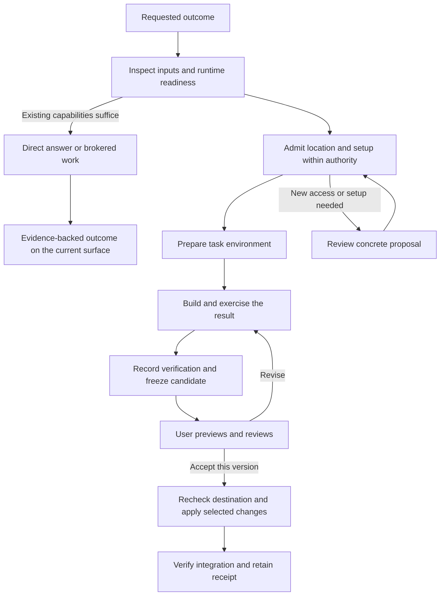

# 54 — Universal task environments, review, and controlled acceptance

Status: **implementation in progress**, greenfield contract researched 2026-09-08. This replaces the stale sandbox/workbench contract; no migration or compatibility path is planned. Builds on the existing outcome, evidence, permission, and managed-work contracts.

## Product decision

vak remains a **universal, outcome-directed harness**. Its unit of work is the user's objective, not a repository, container, application, or artifact. A task may produce understanding, a recommendation, a dataset, a document, an image, a simulation, an operational action, software, or several of these together. Some tasks need no execution environment at all. Others need a combination of isolated computation, brokered connectors, files, previews and human decisions.

Give the existing harness a capable task environment in which it can investigate, install approved dependencies, compute, author, build, run, render, inspect, and improve a result. Keep draft work separate from the user's working files until the user accepts a concrete change set. Existing-workspace work may happen directly there when the user has authorized that mode and the runtime can enforce the required boundaries. Code projects are one instance of this general workflow.

The general experience is **understand → obtain needed capabilities → work and verify → present an outcome → accept or act where required**. For a filesystem deliverable this becomes inspect → choose environment → prepare → produce and verify → review → accept into workspace → verify integration. For a cited answer, delivery may finish the task. For a connector mutation, the final boundary is its scoped external-action approval and receipt. A workspace import is not a compulsory ending for every task.

The user should approve a result or a material change to access/setup, not babysit every safe command inside an already admitted environment. Setup authorization, workspace-write authorization, acceptance of a result, and authorization to publish/deploy are distinct.

## Architectural preservation is a release requirement

This is an extension of vak's existing architecture, not a replacement harness patterned after a coding product. External products provide evidence for individual mechanisms; they do not define vak's scope, orchestration, authority model or completion semantics. The prior sandbox audit identifies broken connections to repair, not a reason to discard the rest of the harness. The implementation boundary is a dedicated `vak-sandbox` crate: it owns environment plans, candidate manifests, backend lifecycle contracts and compare-before-write promotion. `vak-core` admits and selects it; `vak-agent` orchestrates it; `vak-tools` executes through it; session, bus, delivery and UI project its records. No model, provider, prompt, gateway or workspace policy lives in the sandbox crate.

| Existing vak contract | How this proposal must use and preserve it |
|---|---|
| OutcomeSpec and result-scoped outcomes (design 52) | Environment requirements and candidate versions reference the same outcome revision. No parallel product-spec planner or new “sandbox task” goal model. |
| Seven-axis intent kernel and Limits meet (design 47) | Placement uses the admitted act/stakes/modality/attendance and required capabilities. It may only narrow existing authority. Do not replace the kernel with coding/research keyword routing or a second intent classifier. |
| Human authority, permission broker and revocation | Preparation, commands, file tools, connectors and promotion use the existing decision boundary. An environment recommendation never grants permission. |
| Frozen route ladder, demand routing, receipts and endurance | Environment selection does not select a new provider/model or extend the admitted ladder. Existing cancellation-aware inference recovery remains separate from execution recovery. |
| Managed work, commitment kernel and evidence lattice (designs 42/47/50) | Preparation and validation are steps of the existing work item. Draft-ready, human-accepted, applied and fulfilled are distinct; existing runtime satisfaction evaluates completion. No second scheduler. |
| Capability registry, lazy MCP and epoch reconciliation (design 41) | Profiles/provisioners/verifiers use installed typed capabilities and provenance. Domain metadata stays open vocabulary; no fixed table of instance names. Optional integrations do not block ordinary turn admission. |
| Append-only sessions and reconstructable context | Every model-visible environment fact/proposal/result is logged. Events, blobs, manifests and candidates have durable causal references. No hidden environment memory. |
| Layered prompts and Shared/project/scoped configuration (designs 44/45) | Preserve provenance and safety-floor composition. A scratch cwd is not a new trust root; model-authored setup cannot rewrite higher-layer controls. |
| Memory, learning and governed self-evolution (designs 23/26/43) | Useful recipes/preferences can follow the existing proposal/learning path. Remembered success is advisory, not a new grant or an automatic trusted installation. |
| Semantic output and multi-surface delivery (design 30) | Preview, data, document, research and action results use OutputTimeline, result IDs, evidence and SurfaceCapabilities. Workbench is an optional inspection surface, not the universal result model. |
| Gateway identity, channel overlays, inbox and durable automations | Preserve bot/chat/workspace ceilings and configured approvers. A background job can prepare a draft and route review through existing inbox/delivery mechanisms. No alternate approval channel. |
| Four-plane network contract and distributed fabric (designs 31/53) | Preserve plane separation, causal identities, scoped bus permissions, durable receipts/outbox and local mode. A message transport is not another authoritative task ledger; workers gain no control-plane authority from emitting events. |
| FinOps and operations evidence | Charge preparation, compute, retention and verification to existing work budgets; report measured readiness/resource/incident evidence rather than synthetic dashboard state. |

Before each implementation slice, trace its changes through this table and relevant production paths. Existing features must remain callable and observable across CLI, desktop, browser, server, gateways, flows, commitments and child runs. A universal runtime that works only in a desktop coding demo has not shipped.

## Research as of September 8, 2026

Sources below were opened during this research. Dated engineering reports are evidence of their authors' experiments, not independent guarantees. Undated documentation describes the retrieved current version, not a verified release history.

| Primary source | What it establishes | Design implication for vak |
|---|---|---|
| [Vercel/Herdr guide, August 10, 2026](https://vercel.com/kb/guide/run-herdr-coding-agents-isolated-vercel-sandboxes) | Reviews an input manifest with hashes, runs agents in isolated sandboxes, exports a binary patch, checks applicability, and applies explicitly. Conflicts leave local files unchanged. | A close precedent for a review-and-accept workflow; extend it to non-Git files and result bundles. |
| [Codex cloud environments](https://learn.chatgpt.com/docs/environments/cloud-environment) | Prepared tooling, setup/maintenance scripts, dependency installation, cached environments, and separate setup/agent network behavior. Setup secrets are removed before the agent phase. | Environment preparation is a first-class capability. Keep setup effects scoped; removing environment variables alone does not establish that setup wrote no secrets to disk. |
| [Codex worktrees](https://learn.chatgpt.com/docs/environments/git-worktrees) | Independent checkouts, setup scripts, selected starting state including local changes, and handoff back to Local. | Preserve the exact user's input state and make bringing work back an explicit workflow. |
| [Git worktree reference](https://git-scm.com/docs/git-worktree) | Linked worktrees share repository data and have per-worktree metadata. | A worktree separates edits; it is not an OS security boundary. Containment still has to protect shared Git/control data. |
| [Anthropic containment, May 25, 2026](https://www.anthropic.com/engineering/how-we-contain-claude) | Different execution surfaces use different containment approaches. Moving the conversational agent outside Cowork's VM allowed it to remain responsive when execution failed. | Keep vak's orchestrator/control plane available when the task environment is starting, broken, or stopped. |
| [Claude Code sandbox documentation](https://code.claude.com/docs/en/sandboxing) | Filesystem and network boundaries support autonomous execution inside a configured perimeter. | Strong boundaries can reduce repetitive prompts. vak must retain its own stricter no-automatic-FullAccess contract. |
| [Vercel Sandbox](https://vercel.com/docs/sandbox) and [persistence](https://vercel.com/docs/sandbox/concepts/persistent-sandboxes) | Firecracker microVMs, managed/custom images and saved filesystem state across stopped/resumed sessions. | A task environment can outlive an individual compute process. Filesystem persistence does not mean running processes have been checkpointed. |
| [OpenHands sandbox overview](https://docs.openhands.dev/openhands/usage/sandboxes/overview) | Docker, process, and remote execution providers, with Docker recommended and process mode explicitly lacking container isolation. | Use one environment contract with adapters and truthful enforcement capabilities. |
| [NVIDIA OpenShell policies](https://docs.nvidia.com/openshell/sandboxes/policies) and [inference routing](https://docs.nvidia.com/openshell/sandboxes/inference-routing) | Separate filesystem/process policy and network enforcement; gateway-managed inference credentials can remain outside sandbox code. | Broker destination-scoped access and credentials. Do not copy external policy mutation APIs into model authority. |
| [Anthropic application harness research, March 24, 2026](https://www.anthropic.com/engineering/harness-design-long-running-apps) | Explicit criteria, live application evaluation, and feedback improved the demonstrated applications; evaluation remained fallible and costly, and later simplification depended on model capability. | Quality comes from building and exercising the actual outcome with bounded feedback. Do not require expensive multi-agent choreography for every request or treat evaluator prose as observed truth. |
| [Dev Container specification](https://raw.githubusercontent.com/devcontainers/spec/main/docs/specs/devcontainerjson-reference.md) | Describes images, features, mounts, privileges and lifecycle commands, including host-side initialization. | Reuse configuration vocabulary where practical, but treat repository setup as untrusted executable input. Parse and review it; never automatically run host initialization. |

**Synthesis, proposed for vak:** pair an isolated working copy with a prepared runtime, observed verification, and a user-authorized promotion transaction. None of the sources establishes that a sandbox alone guarantees high-quality output.

## Universal work patterns

These are examples of capability composition, not a hardcoded task taxonomy. The same task can use several patterns; the existing intent axes and installed capabilities determine what applies.

| User objective | Work the harness can do autonomously within authority | Review/final effect |
|---|---|---|
| Investigate a question and recommend a course of action | Retrieve sources through approved tools, compare evidence, optionally calculate or simulate in isolation | Cited answer with uncertainty; no workspace mutation or artificial acceptance gate required. |
| Analyze a folder of measurements | Import selected data, validate units/schema, run transformations, inspect charts and reconcile totals | Review the analysis; save selected cleaned data, notebook/script and report if requested. |
| Produce a report, deck or creative asset | Draft, use installed authoring/media tools, render, inspect and refine against the brief | Preview actual output, request revisions, then save/export selected deliverables. |
| Improve an existing spreadsheet/document/media project | Work on a copy with application-compatible tooling, verify formulas/layout/media characteristics | Before/after review and version-checked replacement; preserve the original and subsequent edits. |
| Investigate an operational issue | Read permitted telemetry, reproduce/simulate locally, prepare a corrective proposal and verification plan | Execute the approved bounded real-world action through its connector; record actual receipt and outcome. A simulated repair is not a production repair. |
| Plan or prepare communications/workflows | Gather authorized context, draft records/messages/plans, validate references and constraints | User reviews the actual proposed external changes; send/update through the existing authorized connector only when covered. |
| Build or change software | Prepare runtime, implement in a draft, exercise behavior and inspect the running result | Review and import the change set, then verify target integration; publish/deploy only within separate authority. |
| Maintain an ongoing obligation | Existing commitment scheduler resumes evidence gathering or preparation under budget and policy | Existing inbox and channel delivery surface meaningful results or a required human decision. |

A sandbox contains local execution. It does not make a connected live service a draft, make credentials safe to expose, or turn an external mutation into a reversible operation. Brokered connectors retain their own scopes, destination rules and approval contracts. Where a connector offers a real draft/transaction/test mode, discover and use it; where it does not, present a proposed action without pretending it has been executed safely elsewhere.

## 1. Three separate questions

| Question | Options | Who decides? |
|---|---|---|
| Where may working files change? | Task draft, isolated project copy, existing workspace | Runtime selects within recorded human authority; source mutation needs that authority. |
| What executes the work? | Native restricted worker, local container, optional remote VM | Requirements plus capability probes and policy; never capability by optimistic label. |
| What may be accepted or published? | Selected files/change set, reproducible setup recipe, separately authorized external action | User accepts a concrete candidate; broker rechecks its scope and destination. |

These are orthogonal. A container with a read-write mount of the original repository is still editing the original repository. A copied project executed by an unrestricted host shell is not securely contained. A preview is not publication, and a successful build is not user acceptance.

## 2. Environment selection

Start with bounded inspection: request/outcome requirements, source state, dirty/untracked files, relevant manifests/lockfiles, declared test/run commands, existing approved environment, OS/architecture requirements, required services and data, available backends, and remaining budget. Inspect scripts as data before running them. Do not scan unrelated workspaces or secrets.

The model proposes requirements and a reason. A deterministic admission step checks actual capabilities and authority; its uncertainty cannot grant access. No new interpretation layer may silently narrow the existing general engagement beyond the intent contract.

| Situation | Default behavior | What the user sees or approves |
|---|---|---|
| Answer, locate or inspect using already available tools | Use the direct loop and required brokered capabilities; allocate compute only when needed | Answer/evidence or ordinary progress, without an unnecessary environment setup gate. |
| New report, analysis, document or prototype | Fresh draft with selected inputs and a suitable runtime profile | Progress and preview; destination/contents approved when accepting into workspace. |
| Existing project needing experimentation, dependency changes, builds or uncertain work | Isolated copy of the relevant current workspace state, then native/container execution as required | “Working on a copy”; exact input state and setup available for inspection. |
| Small existing-project edit with recorded direct-edit authority and sufficient local tools | Work in place through restricted tools; keep runtime intermediates in task scratch | Explain the selected location; show resulting diff and checks. No redundant mode prompt. |
| Small edit without direct-edit authority | Make it in a draft, or request a scoped switch if in-place work is materially preferable | Approve the result, or explicitly authorize direct editing. Confidence that the edit is easy is not permission. |
| Missing packages in an already approved task environment | Reuse approved recipe/cache; install within its network, storage and budget envelope | Setup progress; no repeated permission for the same admitted effects. |
| Setup would mutate the source workspace, host installation, services, network scope or budget | Prepare an exact setup proposal and isolated alternative before asking | Paths, packages, destinations, resource impact and rollback limits. |
| macOS SDK/device/GPU or another capability unavailable in the selected backend | Select an available authorized compatible backend, otherwise present the concrete requirement | Explain what can be verified now and what requires a native/device environment. No false “fully tested.” |
| Remote execution needed | Local remains preferred unless remote export/provider/cost has already been authorized | Exact export manifest, service/location and budget before new data egress. |

Do not reinterpret the existing `ReadOnly` mode as granting scratch writes. A writable draft needs a scoped execution lease that the permission engine actually authorizes. Source read-only access and task-draft write access must be explicit, independently enforceable capabilities; if current types cannot express that combination, add the contract rather than bypassing the mode.

## 3. The task environment

Proposed logical layout (host paths remain under the canonical task scratch root; backend paths are mapped by the broker):

```text
inputs/       immutable imported inputs and their manifest
work/         editable project/draft; the command cwd
runtime/      task HOME, package environment and approved reusable caches
tmp/          bounded temporary files
outputs/      selected deliverables ready for preview/export
```

The source workspace is not mounted writable in draft mode. Only the imported input set and task-owned roots are available. Security policy, session ledgers, provider keys, user configuration, gateway state and shared Git metadata stay outside model-controlled storage. Protect `.vak` while allowing only the intended task scratch subtree. The layout by itself grants no security; backend mounts/OS rules and all file tools must implement the same view.

Core retains the originating workspace's trusted configuration/provenance and admitted policy. It must not accidentally reload the copied project's `.vak` as a new authority source or inherit FullAccess merely because the worker cwd changed. File read/edit/search and Bash address the same task view; a host file tool must not silently edit the original while the shell edits a copy.

Git projects can use a broker-managed worktree or isolated repository snapshot. The untrusted task must not receive writable access to the source repository's shared `.git` directory; use brokered Git operations or private metadata. Preserve selected uncommitted and relevant untracked inputs with hashes. Starting only at HEAD is insufficient when the problem exists in the user's current edits. Non-Git projects use the same manifest/copy/change-set contract, without manufacturing a requirement to adopt Git.

Runtime profiles are data contributed through the existing capability registry: for example web application, Python/data, office rendering, Rust, or an existing project's declared environment. These are illustrative profiles, not hardcoded core categories. Profiles specify available executables, versions, architecture, image digest, setup operations, verification adapters and resource/network needs. Probe readiness and report missing capabilities; do not advertise installed tools from a static assumption.

For the first delivery, reuse local native and Docker adapters. Native handles small work and platform-specific tooling; Docker handles prepared Linux environments. Add a remote VM adapter only through the same contract and explicit data/cost authority. Do not build a new VM platform, require Kubernetes, or force cloud execution for local tasks.

## 4. Setup that makes the harness useful

An admitted setup recipe records exact commands or structured operations, package/lockfile provenance, files it will write, required registry endpoints, install-script behavior, resource estimates or explicit unknowns, credential recipient references, validation and cleanup behavior.

Preparation and execution may have different network grants. Both remain policy-gated. Dependency scripts are code execution: preparation is not an automatic exemption from containment. Prefer proxy/broker acquisition and recipient-scoped credentials over injecting broad secrets. A domain allowlist is only a coarse boundary; package identity/integrity and data-egress policy still matter. No host package installation or Docker socket mount occurs as a consequence of a missing tool.

Cache identity includes runtime/image digest, OS/architecture, dependency lockfiles, recipe revision and policy generation. Invalidate or reconcile when those change. Readiness probes verify the resulting tools and a minimal relevant command. Reuse should save installation time without pretending a stale cache is a verified environment.

Temporary system packages live inside the isolated backend. Portable source requirements belong in a proposed lockfile/setup recipe. Host venvs, `node_modules`, caches, credentials and mutable container root layers are not copied wholesale into the destination. On acceptance, install compatible dependencies in an authorized target environment from the reviewed recipe if needed; make that setup part of the approval when it has new effects.

Example approval, only if the effects are not already authorized:

> This project needs a browser runtime and dependencies from its lockfile. I can prepare them in the task environment, using the listed package registries. Your source files will stay unchanged. Review the setup details or approve preparation.

For an unavoidable in-place operation:

> The native build requires this machine's SDK. Proposed setup changes these paths and starts this local service. The isolated alternative can validate the code but cannot run the device test. Approve the listed setup, choose the isolated checks, or revise the approach.

The values shown must come from probes and the actual proposal; examples above are UI wording, not fabricated runtime results.

## 5. State and agent integration

Extend existing outcome/session/work records; do not create a competing scheduler or task database. Proposed protocol records (names are design targets, not existing types):

| Record | Minimum information |
|---|---|
| Environment plan | Outcome revision, input manifest, working location, runtime capabilities, setup recipe, policy/budget references, reason |
| Environment receipt | Stable environment/generation identity, actual backend, readiness, validated mounts/network, installed runtime evidence, lease and retention |
| Execution record | Session/run/tool-call identity, environment generation, command, actual cwd, sequenced output, terminal status, cancellation receipt |
| Candidate result | Versioned outcome and evidence; immutable files/change set and base hashes when relevant, or an exact proposed external action; preview and setup references where applicable |
| Promotion request | Candidate digest, destination identity and expected state, selected changes, setup effects, human authorization reference |
| Promotion receipt | Before/after hashes, per-file transaction state, applied version, post-apply checks, recovery/undo references |

Promotion receipts now include per-file `observed` verification results. The
runtime reads each destination after the atomic rename and records the digest
it observed; a failed observation aborts the receipt rather than presenting a
successful promotion to the UI.

Multi-file acceptance now uses a shared cross-process workspace lock and a
persistent transaction journal stored outside the destination workspace. The
journal saves verified before-images before the first rename and advances each
file through prepared, applying and applied states. On restart, an incomplete
transaction is rolled back before retry; recovery stops if the destination no
longer matches the recorded before or after hash, preserving later human work.
Completed transactions can reconstruct a missing append-only promotion record
only while every destination still matches its recorded after-hash. Addition,
change and deletion candidates are supported; target integration verification
remains open.

Scoped undo uses the same transaction journal and workspace lock. It is
available only for a recorded completed promotion, verifies that every target
still has the accepted after-hash, restores the saved before-image or removes a
file that acceptance added, and records per-file undo progress before and after
each mutation. Interrupted undo resumes from destination hashes. If any later
workspace edit is observed, undo stops without erasing it and requires human
resolution. The append-only sandbox ledger records the authenticated undo
receipt separately from the original promotion receipt.

Frozen review trees are made read only after every byte has been copied and
verified. On Unix this removes write bits while preserving executable bits;
other platforms use their native read-only permission. Files cannot be edited
and directories cannot receive unreviewed additions through ordinary process
access. Acceptance and revision seeding still rehash every selected file, so a
privileged permission change cannot bypass the reviewed-byte check. Server-owned
cleanup explicitly unlocks the tree before removal. Export digest failures,
candidate-ledger failures and revision-ledger failures all use that cleanup
boundary, so a failed review cannot strand a protected candidate directory.

Candidate manifests represent deletion explicitly. A revised task copy that
omits a path with an existing imported workspace baseline freezes a `Delete`
operation carrying that baseline and the reviewed parent identity. Review
shows the current bytes and the absence that will result. Acceptance verifies
the destination still matches the baseline before removing it, records
observed absence separately from after-hashes, and retains the before-image for
scoped undo. Removing a file that existed only in an unaccepted draft creates
no workspace deletion operation.

Append model-visible plans, setup results, environment failures and result references to the session so `derive_messages()` reconstructs what the model saw. Logs/blobs can be external content-addressed data with durable ledger references. Version new records additively; never reinterpret old entries or label unknown history verified.

Keep the model's working interface small: existing brokered file/Bash tools operate in the admitted task view; lifecycle requests use the existing orchestration/control boundary. Export, acceptance and permissions are broker-owned operations. Plugins can provide preparation/verification adapters but cannot authorize promotion. Avoid one new model tool per language/backend.



Conversation remains responsive during preparation and failure. The runtime supervisor supports start, stream, cancel, wait, probe, export and cleanup with actual backend behavior. Durable environment records distinguish running compute, stopped-but-retained filesystem, lost process, and expired data. Stop does not imply discard. Failure retains useful partial work; cleanup policies must not silently delete the only unaccepted candidate.

Changing execution backend or policy generation does not rewrite the frozen provider/model route or require a new conversation. Reconcile environment capabilities at turn boundaries, revoke immediately when required, and replace an execution environment safely when its boundary cannot be changed in place. Replacement cannot turn a prior denial into permission.

## 6. Review and acceptance into the workspace

Accepting a result is an import transaction, not `cp -r` from scratch.

1. Finish or freeze the candidate's writes; previews, test receipts and the accepted files refer to the same immutable version. Continued agent work creates a new candidate.
2. Present the proposed destination, files added/changed/deleted, relevant diff or before/after preview, verification, unresolved limitations and any target setup. Dependencies/caches/secrets/control files are excluded unless a separate authorized operation specifically covers an allowed item.
3. Bind the user's approval to the candidate digest, selected file set, destination scope, target setup and relevant baseline. Choosing “try in workspace” is still a workspace mutation; it requires the same explicit scope, with a reversible transaction where feasible.
4. Immediately before apply, recheck current policy, revocation, canonical paths, source and destination hashes, symlinks/hardlinks/path collisions, available storage, and file-type constraints. A reviewed path string alone is insufficient.
5. Compare the candidate against its imported base and the destination's current contents. Preserve unrelated user edits. On overlap, prepare conflict resolution in isolation and show the resulting change set; changed reviewed contents need refreshed approval. Do not silently overwrite or rerun generation into the workspace.
6. Stage and journal writes; use per-file atomic replacement with compare-before-write and a workspace coordination lock. Arbitrary multi-file replacement is not universally atomic: persist per-file progress and recover or report partial apply explicitly after a crash. Protect against external editors changing files between checks and writes.
7. Apply only the approved file changes and setup operations. Git patch applicability is a useful check, not the complete authorization/security contract. Do not execute repository hooks or start services just because source was imported.
8. Verify the integrated result in the target where authorized, binding evidence to that state/environment. The shipped acceptance receipt includes a deterministic digest of the exact selected candidate plus every observed target hash or deletion and records the workspace state as observed only after read-back succeeds. A verifier registry plans checks before review and runs them from the applied workspace; the shipped adapters parse JSON, CSV and TSV, require consistent tabular record widths, parse SVG structure, fully decode PNG/JPEG/GIF/WebP images and report their dimensions, require both the PDF header and end marker, and open DOCX/XLSX/PPTX packages to require their content-types, relationship root and format-specific primary part. Unsupported outcomes remain explicitly unavailable, and any failed check remains visible after apply. If target-specific checks cannot run, say so. A sandbox pass cannot be relabelled a native-device or production pass.

Executable project checks are a second boundary. The frozen candidate declares an exact command only when an observed project manifest supports it: Cargo, an explicit npm `test` script, Go, or pytest configuration. Review shows the command, acceptance does not run it, and the operator starts it with a separate **Run workspace check** action. The server first proves that the accepted files still match the applied-state receipt, then executes through the existing broker, sandbox, scrubbed environment, cancellation and output limits. Each attempt appends a `WorkspaceCheck` record with pass/fail output and the applied-state digest; it is refused after undo or workspace drift. This action never installs target dependencies or escalates permission.
9. Record a receipt and offer scoped undo. Undo first checks that the files still match the promotion's after-hashes; it must not erase subsequent user work. Changes to databases/external services require separate transactions and recovery semantics.

Workspace checks are planned from the exact candidate or destination manifest and run only after acceptance, after the applied-state digest is revalidated. Rust, Go and Python test checks remain available where their project markers exist. JavaScript projects expose both a declared production build (`npm run build`) and declared project tests (`npm test`) as separate user-invoked checks; neither is inferred as passed from sandbox activity.

When a person accepts only some files, the promotion record stores the checks planned from that selected file set. A candidate manifest that was not selected cannot introduce a command; a selected deletion removes its project checks. Before each run, the command is compared with the current effective manifest. The accepted digest is checked again after execution, so a build or test that changes an accepted file records a failed check with its output instead of a pass attributed to the older state.

Approval can be expressed through an authenticated UI action or a clearly bound human response in the existing approval system. Model messages, artifact HTML and tool output cannot resolve it. Gateway surfaces keep their configured approver requirements; unattended work prepares a candidate and waits or records an unresolved gate. Silence is never acceptance.

“Accept files,” “install target dependencies,” “run migrations,” and “deploy/publish” must not silently collapse into one operation. A user may explicitly authorize a combined concrete plan; otherwise preserve those boundaries.

## 7. UI: make the result and its state visible

Show a small location/status line in the task: **Working on an isolated copy**, **Working in your workspace**, **Preparing environment**, **Needs setup approval**, **Ready to review**, or **Applied; checking integration**. Include actual backend and access in expandable details.

The main result card contains the artifact/live preview, meaningful checks, changed files and **Accept into workspace**, **Request changes**, **Download**, and **Keep as draft** actions where applicable. Ask for a destination only when it is not already known. Workbench expands Output, Files, Environment, and Checks for that exact record; it is not a second source of result truth.

For running applications, expose a broker-owned preview endpoint tied to the execution and policy. Isolate it from the admin/control origin, authenticate access, constrain network and WebSocket routing, and label stopped previews. Arbitrary generated HTML cannot become an authenticated control-plane page. A user trying a draft app must not inadvertently mutate a production database; use task-owned services/fixtures or explicit scoped test access.

On reconnect, recover from session snapshots and event sequence. UI selection does not route output. Distinguish no execution, missing telemetry, backend unavailable and retained draft with stopped compute. Show pending review without requiring the user to discover a hidden panel.

## 8. How this improves quality

The environment enables an observable improvement loop: create a result, run it with the intended tools, inspect it as the user would, identify a concrete defect, and revise within the admitted budget. It supplies the means to improve quality; it does not supply taste, factual correctness, product requirements or acceptance by itself.

Bind checks to the existing `OutcomeSpec`. Preserve user constraints and define required behavior, presentation requirements, and material unknowns. Domain verification belongs in registered profiles/adapters rather than a growing core taxonomy.

| Outcome | Required evidence appropriate to the request |
|---|---|
| Application/product | Build plus actual critical user journeys, relevant API/data effects, failure paths, responsive rendering and a runnable deliverable. A screenshot is not functional verification. |
| Existing-project fix | Reproduction of the reported behavior, relevant regression checks, preservation of unrelated changes, and target integration evidence. |
| Data analysis | Input provenance, schema/units assumptions, meaningful reconciliation of computations and reproducible outputs. |
| Document/presentation | Actual rendered pages/slides, overflow/font/layout inspection, requested content coverage and usable editable/exported files. |
| Research report | Current primary sources, claim-to-source support, uncertainty and a usable synthesis. Execution success is not factual verification. |
| Creative/media work | Actual rendered or playable artifact, brief/format/duration constraints, quality checks possible with the admitted modalities, and explicit human taste decisions. |
| Operational or connector task | Actual scoped action receipt and read-back/postcondition where available; clear separation between proposed, simulated, attempted and completed effects. |
| Ongoing obligation | Existing commitment criteria evaluated from fresh evidence; no declaration of fulfillment merely because one sandbox run finished. |

Runtime-observed checks, external attestations, model critiques and human preference remain different evidence classes. A separately prompted evaluator can identify useful problems but its opinion remains Asserted; only observed actions/results acquire Observed strength. Record test/fixture provenance: passing tests authored by the builder can still miss the requirement. Do not let the model replace required tests or its own expected values to manufacture success.

Use deeper independent evaluation selectively for complex/high-impact work; do not hardwire multiple agents or many refinement rounds. Bound time/tokens/compute and stop on success, budget exhaustion or a real blocker. Preserve the best verified candidate when later experiments regress. Human taste and real-world acceptance stay visible rather than hidden behind an inflated numerical score.

## 9. Integration with the current repository

| Existing foundation | Required change |
|---|---|
| `crates/vak-intent/src/outcome.rs`, design 52 | Attach proposed environment and candidate/evidence references to existing outcome revisions. |
| `crates/vak-core/src/worktree.rs` | Current helper starts at HEAD. Add input-state handling, protected/private Git metadata strategy, non-Git copy support and safe retained-draft lifecycle. |
| `crates/vak-core/src/checkpoints.rs` | Reuse manifest concepts and preservation rules, but do not use whole-workspace restore as promotion undo or assume capped snapshots cover every result. |
| `crates/vak-tools/src/broker.rs`, `context.rs`, `bash.rs` | Fix streaming/cancellation from the audit; separate trusted policy origin from task execution view; authorize all file and shell effects consistently. |
| `crates/vak-core/src/sandbox_docker.rs` | Mount draft storage, add readiness/lifecycle/export/cancel receipts, retain recoverable task state, and enforce declared resources/network. |
| `crates/vak-session`, managed-work design 42 | Add versioned append-only records; retain existing ownership and scheduler. |
| `crates/vak-server/src/lib.rs`, `events.rs` | Session-scoped snapshot/events, immutable artifact/preview reads, authenticated promotion and transaction recovery. |
| `crates/vak-client-ui/src/store.ts`, `WorkbenchPanel.tsx`, `ChatPane.tsx` | Key by server identity, show environment/setup, expose actual result review and candidate-bound acceptance. |
| Capability registry and design 52 extension model | Runtime recipes and domain verification adapters; probe before advertising, reconcile without daemon restart. |

The current invariant 35 needs a precise update alongside implementation: intermediates and runtime state are quarantined, task drafts are writable under scoped authority, and original workspace changes require direct-edit authority or candidate promotion. Preserve the existing invariants against ambient secrets, unsupported containment, stale permissions and fabricated completion.

## 10. Delivery slices and proof of completion

**Slice 1 — trustworthy draft execution.** `vak-sandbox` is the new ownership boundary. Execution IDs, live broker event frames, process-group cancellation, per-agent execution `.vak/scratch/<agent-id>/<execution-id>` roots, recursive artifact discovery, control-file denial, and partial-output retention are implemented. Candidate export and compare-before-write promotion are exposed through the authenticated server and Workbench. Remaining verification work must prove source immutability across every backend.

**Slice 2 — prepare, run and preview.** Readiness probes, useful prepared environments, scoped setup recipes, resource/network receipts, multimodal result previews and retained drafts. Demonstrate both data/document work and an application becoming runnable without host pollution or FullAccess. Retain direct answers and brokered connectors as first-class paths.

**Slice 3 — review and promotion.** Immutable candidates, exact approval, conflict checking, crash-recoverable apply, scoped undo and post-apply evidence for Git and non-Git outcomes. This completes the central user journey and must not be postponed behind a generic environment marketplace.

**Slice 4 — adaptive placement and quality.** In-place mode with pre-existing authority, native capability selection, reusable profiles, bounded evaluation and measured outcome improvement. Optional remote adapters follow the same contract.

Acceptance scenarios:

1. New web application: prepare → build → user exercises preview → revise → accept into an empty destination → fresh target run succeeds from the supplied recipe.
2. Dirty existing repository: reproduce from current selected edits → fix in copy → concurrently edit original → accept only non-conflicting reviewed changes; never overwrite the user's new work.
3. Non-Git document/data task: selected inputs → render/reconcile → preview → accept selected outputs; original input remains intact.
4. Missing dependency: exact scoped setup, registry denial handled without bypass, reusable environment verified, no host/global install.
5. Already-authorized small edit: act in place without redundant prompts; sandbox and secret/control exclusions remain active.
6. Native-only requirement: accurately separate sandbox verification from device/OS checks and obtain scoped setup only when needed.
7. Cancel/reload/restart: partial logs and draft survive; descendants terminate; old approval cannot apply a newer candidate; promotion interruption recovers explicitly.
8. Concurrent sessions, malicious paths, modified artifact after review, output floods, failed probes, symlink/hardlink races, and policy revocation fail closed without corrupting another task.
9. Hosted preview: can exercise the draft app, cannot call control APIs with the host's credentials or mutate a live service without its own authority.
10. Research-only and operational work: a cited answer completes without creating a container; an operational simulation remains visibly a simulation until an authorized connector performs and verifies the real effect.
11. Cross-surface durable work: a gateway or scheduled commitment uses the same environment/evidence records, routes review through its configured approver, and resumes without losing memory, policy provenance, frozen routing or work ownership.
12. Architecture regression: disabling optional preparation/profiles leaves the existing direct-loop semantics available; new capabilities reconcile without a daemon restart; existing route/endurance, intent narrowing, delivery and satisfaction tests continue to pass.

Measure success with representative before/after tasks: accepted usable outcomes, integration failures, user corrections, time to first preview, missing-environment recovery, unnecessary approval count, resource cost, and any source mutation before acceptance. Set targets from a measured baseline; do not invent performance gains from architectural plausibility.

This proposal completes the research/design step. Shipping requires the end-to-end acceptance scenarios above; types, settings and UI labels alone do not establish implementation.
