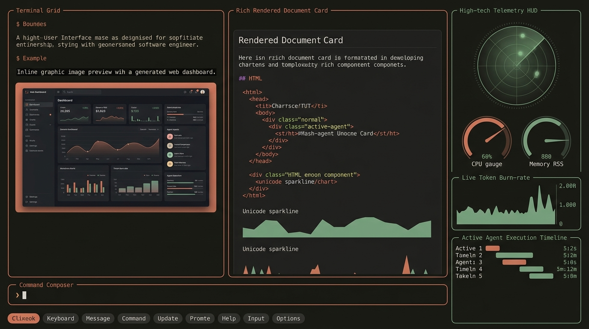
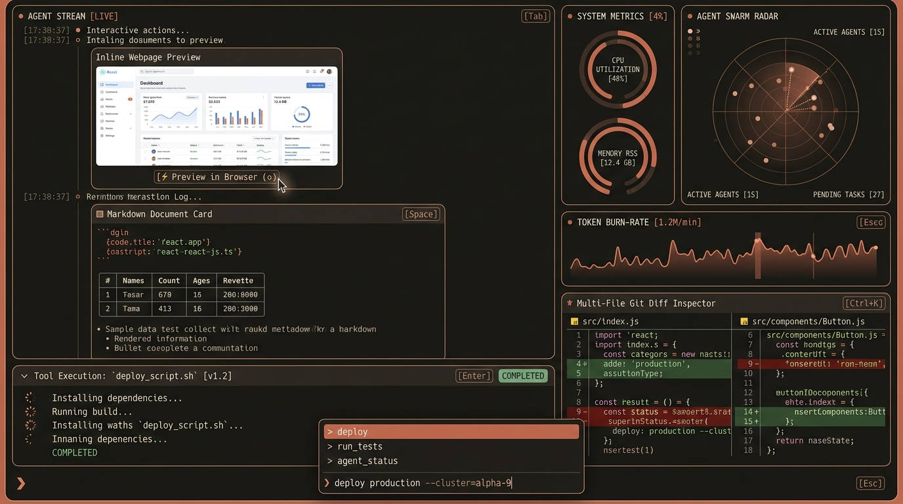
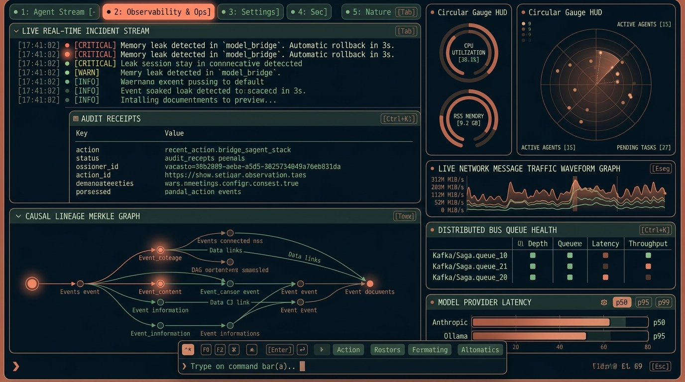
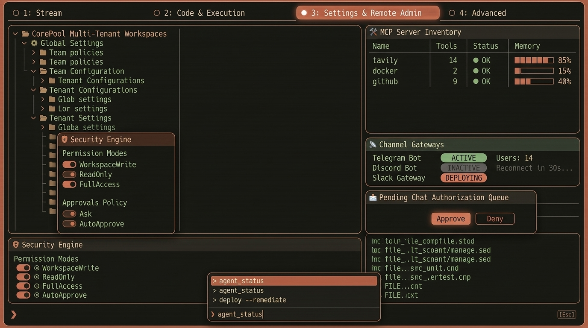
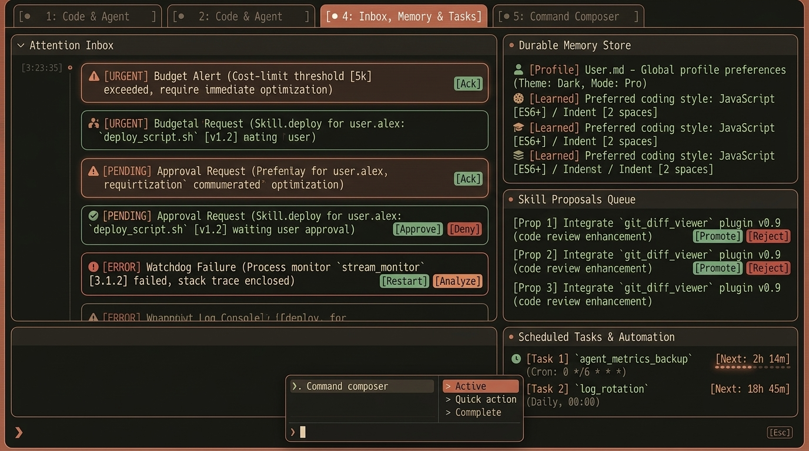
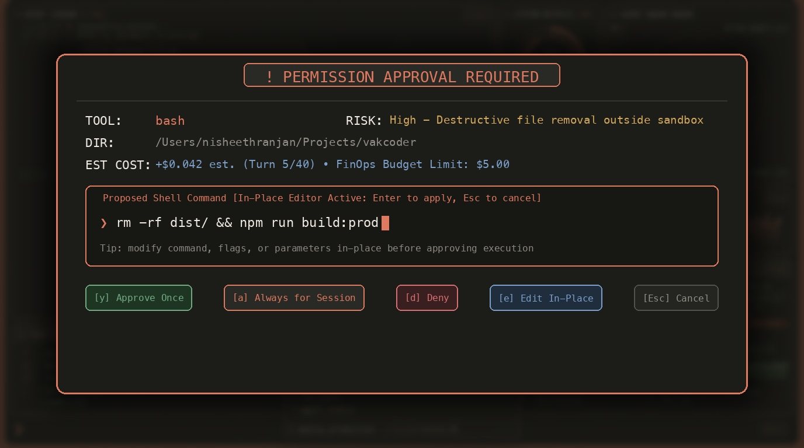

# 55 — Rich Terminal Surface (`vak term`)

Status: **Real API-connected in v3.0.32**. Greenfield interactive console surface implemented in `crates/vak-terminal`, invoked via `vak term` / `Surface::Terminal`. Connects to a live vak server over HTTP/SSE — every rendered value (health, sessions, models, MCP inventory, approval state, telemetry, incidents) is fetched from real API endpoints or derived from real SSE event streams. Replaces the previous offline prototype that hardcoded all session names, model names, URLs, and mock data.

---

## 1. Product Decision & Visual Identity

`vak term` delivers an ultra-dense, cinematic command console inspired by high-density operational cockpits (Territory Studio, *Iron Man*, *Ghost in the Shell*, *The Martian*). It pairs high information density with modern terminal capabilities: 24-bit TrueColor palettes, dual-deck layouts, inline framebuffers (Kitty/Sixel/ANSI half-block), real-time telemetry waveforms, and Human-In-The-Loop (HIL) controls.



### Strict Minimalist Typography & Iconography Contract
**Rule: Zero emojis and zero playful markdown icons workspace-wide.** All visual indicators use precision geometric Unicode glyphs and uppercase micro-tags:

| Purpose | Icon / Glyph | Usage |
|---|---|---|
| Web & Dev Server Previews | `[PREVIEW]` / `↗` | Live dev server and image preview pills |
| Diff Inspector | `[DIFF]` / `Δ` | Side-by-side git diffs |
| Execution Timers | `1.4s` / `[RUN]` | Subagent and bash worker execution duration |
| Human Gates & Approvals | `!` / `[GATE]` | HIL approval modal requests |
| Profile & Memory | `•` / `[USER]` | `USER.md` memory notes |
| Tool Success | `OK` / hairline `✓` | Tool execution completions |
| Tool Denial / Failure | `FAIL` / hairline `✗` | Permission denials or failures |
| Service Status | `●` (solid) / `○` (hollow) | Live service indicators (solid = active, hollow = idle) |
| Collapsible Sections | `▸` (collapsed) / `▾` (expanded) | Tool cards and CorePool workspace tree |
| Input Prompt | `❯` | REPL composer prompt chevron |

---

## 2. Frozen Color Palette (24-bit TrueColor)

Directly derived from the canonical Vak Web Client palette (`crates/vak-client-ui/src/styles.css`), cyclable via `F2` or `/theme`:

```rust
// Canonical Vak Warm Palette (Default)
pub const BG_GROUND: Color      = Color::Rgb(0x17, 0x17, 0x14); // #171714 Deep Warm Charcoal
pub const SURFACE_CARD: Color   = Color::Rgb(0x1c, 0x1c, 0x19); // #1c1c19 Elevated Card Surface
pub const SURFACE_HOVER: Color  = Color::Rgb(0x29, 0x29, 0x25); // #292925 Interactive Hover
pub const BORDER_RESTING: Color = Color::Rgb(0x34, 0x34, 0x2f); // #34342f Subtle Hairline
pub const BORDER_FOCUS: Color   = Color::Rgb(0xdf, 0x79, 0x5f); // #df795f Terracotta Focus Glow
pub const ACCENT_PRIMARY: Color = Color::Rgb(0xdf, 0x79, 0x5f); // #df795f Warm Terracotta
pub const ACCENT_BRIGHT: Color  = Color::Rgb(0xee, 0x92, 0x78); // #ee9278 Highlight Terracotta
pub const STATUS_OK: Color      = Color::Rgb(0x73, 0xa9, 0x82); // #73a982 Sage Green (Additions/Verified)
pub const STATUS_WARN: Color    = Color::Rgb(0xd4, 0xa8, 0x5d); // #d4a85d Warm Ochre / Amber
pub const STATUS_DANGER: Color  = Color::Rgb(0xd8, 0x6f, 0x72); // #d86f72 Dusty Rose (Deletions/Denied)
pub const STATUS_INFO: Color    = Color::Rgb(0x7c, 0x9f, 0xc9); // #7c9fc9 Slate Blue (Metadata)
pub const TEXT_MAIN: Color      = Color::Rgb(0xee, 0xea, 0xe2); // #eeeae2 Soft Warm Parchment
pub const TEXT_MUTED: Color     = Color::Rgb(0x91, 0x8e, 0x86); // #918e86 Secondary Text
pub const TEXT_FAINT: Color     = Color::Rgb(0x8b, 0x88, 0x80); // #8b8880 Tertiary / Timestamps
```

Supported Theme Suites:
1. **Vak Warm** (`#171714` / `#df795f` Terracotta)
2. **Vak Slate** (`#121419` / `#7f9fca` Dark Slate)
3. **Vak Paper** (`#f4f1ea` / `#a8462a` Light Parchment)
4. **Vak Contrast** (`#080808` / `#ff8e70` Deep OLED)
5. **Tokyo Night** (`#1a1b26` / `#7aa2f7` Cyberpunk)

---

## 3. The 4-Screen Cohesive Suite

```
┌──────────────────────────────────────────────────────────────────────────────────────────────┐
│ [● 1: Studio]   [2: Observability & Ops]   [3: Settings & Remote Admin]   [4: Inbox & Tasks] │
├────────────────────────────────────────┬─────────────────────────────────────────────────────┤
│ LEFT DECK (60% Width)                  │ RIGHT DECK (40% Width - HUD / INSPECTOR)            │
│ Primary Stream / Flow / Tables         │ Telemetry Radar / Merkle Graph / MCP / Inbox Deck   │
├────────────────────────────────────────┴─────────────────────────────────────────────────────┤
│ FLOATING COMPOSER & QUICK ACTION PALETTE (Ctrl+K / /)                                        │
└──────────────────────────────────────────────────────────────────────────────────────────────┘
```

---

### Screen 1: Agent Studio (`[1: Studio]`)



- **Left Deck (60% Width)**:
  1. **Inline Webpage Preview**: 24-bit TrueColor halfblock wireframe (`▀▄█`) rendering live dev server (`http://localhost:5173`) with mouse-clickable `[ [PREVIEW] in Browser (o) ]`.
  2. **Rendered Markdown & Tables**: Clean code blocks with syntax styling (`react-app.ts`) and test coverage badges.
  3. **Collapsible Tool Execution Cards**: Real-time bash worker output with spinner, PID, and sandbox lease.
- **Right Deck (40% Width HUD)**:
  1. **System Metrics**: CPU utilization dial and memory RSS with visual meters.
  2. **Agent Swarm Radar**: 360° rotating radar sweep tracking active child agents and queued tasks.
  3. **Token Velocity Waveform**: Live frequency audio/token velocity graph (`tok/s`).
  4. **Multi-File Git Diff Inspector**: Line-by-line diff inspector with additions/deletions.

---

### Screen 2: Remote Observability & Operations (`[2: Observability & Ops]`)



- **Top KPI Row**:
  - `FinOps Spend: $0.142 / $5.00 Cap` (with visual meter)
  - `Circuit Breakers: 100% HEALTHY`
  - `Live Services: 3/3 ONLINE`
  - `Bus Queue: 0 DLQ`
- **Left Deck (60% Width)**:
  1. **Live Real-Time Incident Stream**: Streaming log records with severity markers (`● CRITICAL`, `● WARN`, `● INFO`).
  2. **Audit Receipts Table**: Action log with verified revisions and SHA-256 state fingerprints.
  3. **Causal Lineage Merkle Graph**: Node DAG tracking turns, genesis roots, and dispatched child flows.
- **Right Deck (40% Width HUD)**:
  1. **System Gauges & Radar**: Shared telemetry dials for continuity.
  2. **Live Network Traffic Waveform**: Real-time throughput graph for `vak-bus`.
  3. **Distributed Bus Queue Health**: JetStream topic depths and throughput.
  4. **Model Provider Latency**: Anthropic Claude 3.7 and Ollama Local p50/p95 latency bars.

---

### Screen 3: Remote Administration & Settings (`[3: Settings & Remote Admin]`)



- **Left Deck (60% Width)**:
  1. **CorePool Multi-Tenant Workspaces**: Interactive directory tree displaying the Shared Base Layer, Active Project Workspace, and `USER.md` profile notes.
  2. **Interactive Security Engine**:
     - Mode Switches: `[● WorkspaceWrite]`, `[○ ReadOnly]`, `[○ FullAccess]`
     - Approvals Policy: `[● Ask]`, `[○ AutoApprove]`
- **Right Deck (40% Width HUD)**:
  1. **MCP Server Inventory**: Status table for `tavily`, `docker`, and `github` with tool count and status.
  2. **Channel Gateways**: Status of Telegram, Discord, and Slack bot bridges.
  3. **Pending Chat Authorization Queue**: Inbound chat gate review with one-click `[Approve]` and `[Deny]`.

---

### Screen 4: Attention Inbox, Memory & Scheduled Tasks (`[4: Inbox, Memory & Tasks]`)



- **Left Deck (60% Width)**:
  1. **Prioritized Attention Inbox**:
     - Cost-limit threshold alerts with `[Ack]` button.
     - Execution approval requests with `[Approve]` / `[Deny]`.
     - Watchdog failures with `[Restart]` and `[Analyze]` triggers.
- **Right Deck (40% Width HUD)**:
  1. **Durable Memory Store**: `USER.md` profile notes and learned preferences.
  2. **Skill Proposals Queue**: Self-evolved candidate skills with `[Promote]` and `[Reject]`.
  3. **Scheduled Tasks & Automation**: Cron jobs with live countdown timers (`Next: 2h 14m`).

---

## 4. Human-In-The-Loop (HIL) Protocol & In-Place Editing



When an effectful tool execution is requested, a floating modal overlay dims the active background:
- Displays tool name, directory path, risk assessment, and estimated financial cost.
- **In-Place Command Editor (`[e]`)**: Pressing `[e]` transforms the command box into an inline editor, permitting the operator to modify shell arguments directly before granting approval.
- Fast key decisions: `[y] Approve Once`, `[a] Always for Session`, `[d] Deny`, `[Esc] Cancel`.

---

## 5. Input, Mouse & Hardware Protocol Contract

1. **Terminal Guard RAII**: `TerminalGuard::enter()` enables raw mode, alternate screen, and `EnableMouseCapture`. Dropping the guard unconditionally disables mouse capture and restores terminal mode.
2. **Mouse Controls**: Left-click on header tabs (`1`–`4`) switches screens directly; left-click in Admin toggles security modes; left-click in HIL modal triggers actions; mouse wheel scrolls viewports.
3. **Keyboard Controls**:
   - `1`, `2`, `3`, `4`: Tab switching.
   - `Tab`: Cycle active decks.
   - `F2`: Cycle TrueColor themes.
   - `/` or `Ctrl+K`: Quick Action Palette.
   - `Ctrl+D`: Detach from session (leaves daemon running).
   - `Ctrl+C`: Exit terminal.
