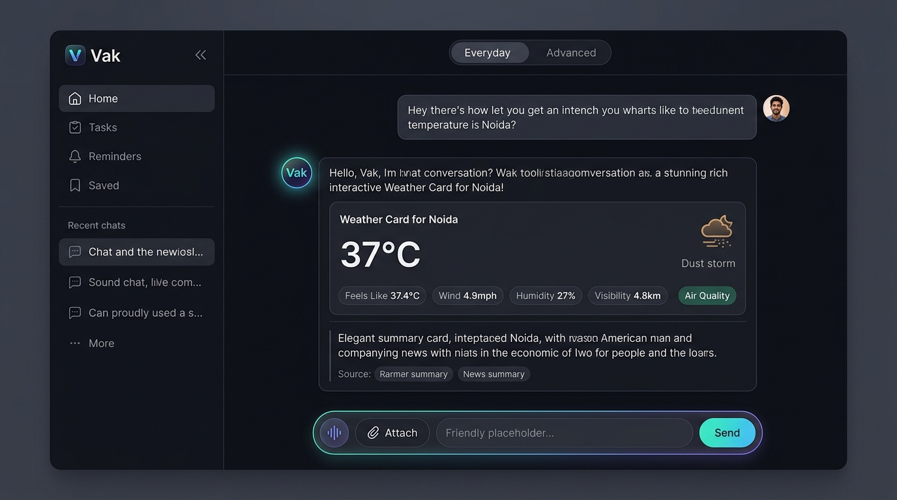
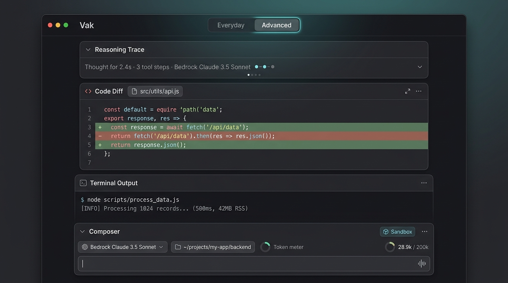
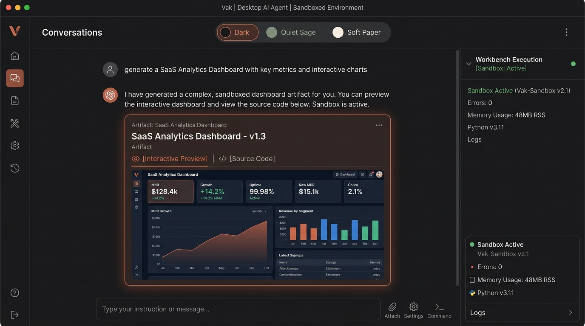
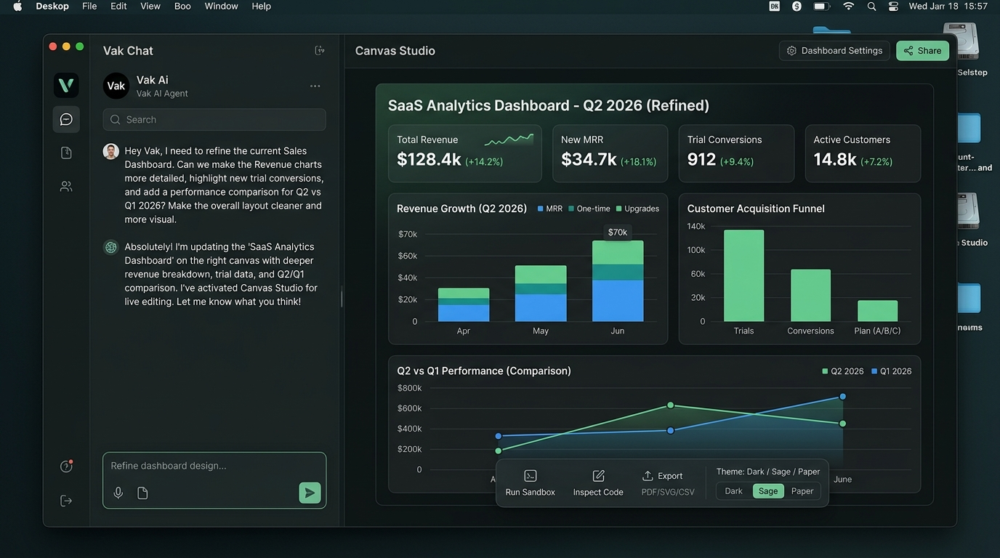
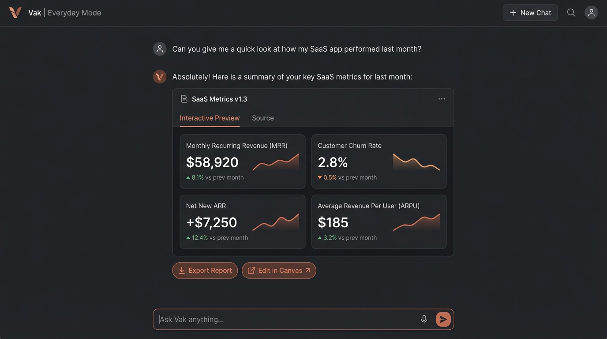
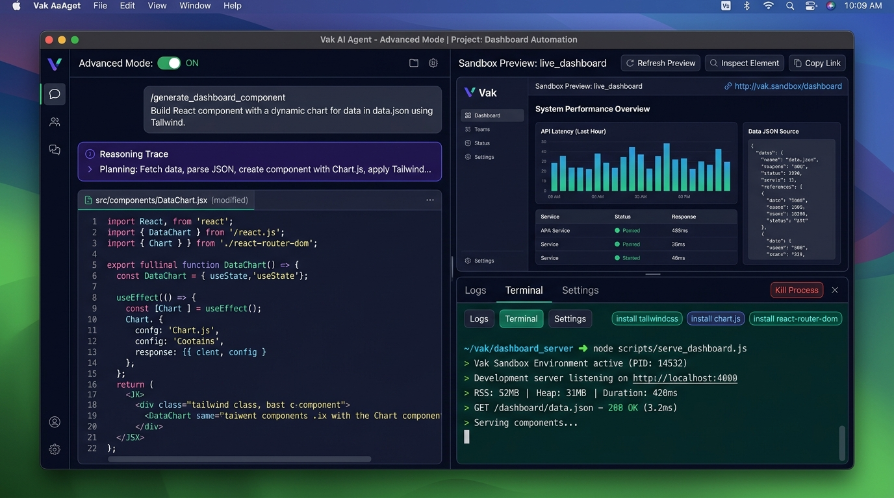
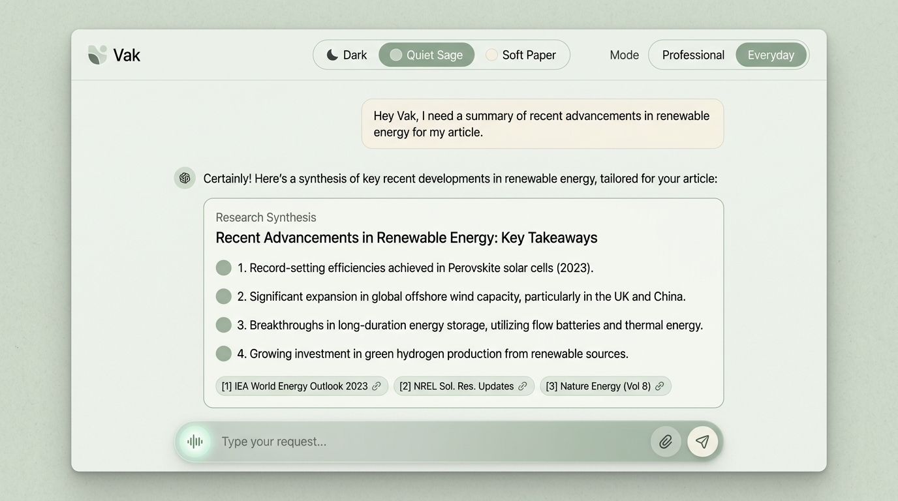
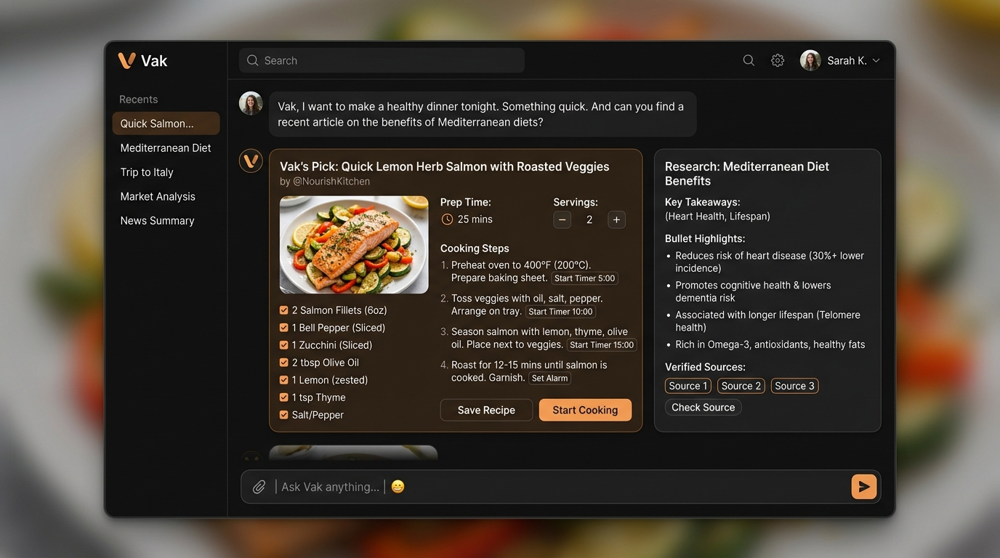

# 60 — Modern Presentation System 2026

Status: **superseded by the adaptive assistant experience in design 61.** The
visual and interaction goals below were reached and still hold. The component
architecture in §3E did NOT survive: the per-type component suite it names has
since been replaced by a single generic renderer. §3E now carries a reality
note; the rest of this document is kept as the design record of that iteration.
For the current architecture see `docs/design/57-adaptive-presentation-runtime.md`,
and for how to change it `docs/design/67-presentation-renderer-guide.md`.

## 1. Overview & Vision

Vak is a universal, always-on agent platform. This design document establishes the modern 2026 presentation layer across Desktop (Tauri) and Web (`crates/vak-client-ui`), elevating the conversational experience from an austere developer transcript to a luminous, peppy, and universal agent workspace inspired by 2026 state-of-the-art agent interfaces (Muse, Claude Desktop, ChatGPT macOS, Granola, and Linear AI).

### Core Principles
1. **Universal Scope**: Not just code. Seamless presentation across everyday research, news, weather, lifestyle/cooking, planning, and deep sandboxed software engineering.
2. **Dual-Density Experience**:
   - **Everyday Mode**: Serene, human-first, distraction-free. Clean floating composer capsule, rich outcome cards, zero developer jargon or leaked system scaffolding.
   - **Advanced Mode**: Power operator surface with reasoning trace disclosure, code diffs, live terminal execution drawer with process telemetry (500ms sampling, RSS memory, duration), package tracking, and token budget meters.
3. **Preserve Original Brand Identity**: The official Vak product mark (`vak-icon.png` / `app-icon.png`) is preserved intact as the authentic brand anchor.
4. **Theme Pack Harmony**: Built purely on semantic CSS tokens to ensure total visual elegance across **Dark (Obsidian)**, **Quiet Sage**, **Soft Paper**, **High Contrast**, and **Warm Light**.

---

## 2. Design Mockups Reference Gallery

All high-fidelity design mockups created during this design iteration are embedded below and preserved under `docs/assets/presentation-2026/`:

### 1. Everyday Mode (Universal Assistant)

*Shows the elevated user bubble, glowing Vak persona badge, dynamic Weather Outcome Card for Noida, News Synthesis Card, and clean glassmorphic composer.*

---

### 2. Advanced Mode (Developer & Power Operator)

*Features collapsible reasoning trace ('Thought for 2.4s · 3 tool steps'), interactive Code Diff inspector, terminal output with live process telemetry, and power developer composer ribbon.*

---

### 3. Sandboxed Artifact & Interactive Dashboard

*Illustrates an interactive SaaS Analytics Dashboard artifact with KPI cards, revenue charts, `[Interactive Preview]` vs `[Source Code]` tabs, and adjacent Workbench Execution drawer.*

---

### 4. Studio Canvas Mode (Split Screen)

*Two-column layout with 35% chat stream on left and 65% full-bleed interactive Canvas on right with floating export/theme bar.*

---

### 5. Inline Self-Contained Everyday Artifact Card

*Clean single-column chat embedding the interactive artifact card directly in the conversation flow with zero window clutter.*

---

### 6. Power Developer Split Workbench

*Tri-pane layout: Chat/Diff on left, live sandboxed preview on top right, and live ANSI terminal with RSS telemetry on bottom right.*

---

### 7. Theme Pack: Quiet Sage Palette

*Demonstrating how the presentation layer adapts to the calm, natural Quiet Sage paper palette.*

---

### 8. Universal Lifestyle Outcome (Cooking & Timers)

*Demonstrates lifestyle recipes with serving size scalers, ingredient checklists, and step cooking timers.*

---

## 3. Implemented Components & Architectural Changes

### A. Turn Architecture (`ChatPane.tsx`)
- **User Message**:
  - Replaced the harsh `border-left: 2px solid var(--accent)` blockquote line with a right-aligned elevated message card (`.msg.user .md`).
  - Added a subtle `.user-turn-head` with author chip (`You`).
- **Assistant Message**:
  - Added a dedicated `.assistant-turn-head` featuring the authentic Vak brand mark (`vak-icon.png`), agent name (`Vak`), and a subtle generating pulse indicator during streaming.
  - Positioned the message prose in `.assistant-turn-body` with comfortable typographic hierarchy.
- **Thinking / Reasoning**:
  - Upgraded `
` from a raw HTML fold to a 2026 "Reasoning Trace" pill with sparkle icon and clean typography.
- **Prompt Scaffolding Scrubbing**:
  - Strengthened `cleanAssistantText()` to strip inline/line-level `Surface: desktop app.` / `Surface: web client.` and completion footers (`primary deliverable: Produced completed`), ensuring internal scaffolding never leaks into the user view.

### B. Header Mode Segmented Switch (`WorkspaceHeader.tsx` & `styles.css`)
- Replaced unstyled text with a tactile frosted glass capsule (`.presentation-mode-segmented` & `.mode-pill-btn`).
- Provides active state sliding highlights and distinct accents (`--accent-bright` for Everyday, `--blue` for Advanced).

### C. Adaptive Composer (`Composer.tsx`)
- **Everyday Mode**: Tucks away developer controls (working directory path, permission mode selector, and token donut meter) into a clean, floating prompt capsule featuring Voice waveform button, Attach files, and Send.
- **Advanced Mode**: Expands the lower toolbar to display full developer telemetry (working directory switcher, permission dropdown, model selector, and live context token meter ring).

### D. Theme Pack Tokens (`styles.css`)
- All user bubbles, agent containers, cards, and toolbars leverage semantic CSS variables:
  - `--bg`, `--surface`, `--surface-raised`, `--border`, `--border-soft`, `--accent`, `--text`, `--text-soft`, `--muted`.
- Guarantees seamless switching across **Dark (Obsidian)**, **Quiet Sage**, **Soft Paper**, **High Contrast**, and **Warm Light**.

### E. Outcome Card Architecture & Registry Consistency

> **Reality note — superseded.** This section describes the per-type component
> suite as it existed when this document was written. Every component named
> below has since been deleted and replaced by ONE generic, surface-aware
> renderer, `presentation/GenericSpecRenderer.tsx`, driven by declarative
> primitive nodes. The *behaviors* listed (servings scaler, step timers,
> citation popovers, pass-rate ring, chart crosshair and CSV export, column
> sort/search, exit-code pills, sandboxed preview and dock) were all ported and
> are still shipping — they are now `renderRecipe()`, `renderResearch()`,
> `renderTestMatrix()`, `renderChart()`, `renderTable()`, `renderTerminal()`
> and `renderUiPreview()` inside that one file. Only the Single Registry
> Invariant and Zero Heuristics bullets are still architecturally current.
> `DiffInspector.tsx` and `MermaidViewer.tsx` survive as standalone files for
> their remaining non-registry call sites. Read the component list below as
> history, not as a map of the codebase; see
> `docs/design/67-presentation-renderer-guide.md`.

- **Single Registry Invariant**: All outcome components resolve through `STRUCTURED_RENDERERS` in `PresentationRenderer.tsx`. Duplicate fallback routing blocks and special-cased components have been completely eliminated. (Still true, and now stronger: the registry's ~105 keys resolve to a `buildXSpec`/`GenericSpecRenderer` pair rather than to distinct components.)
- **Zero Heuristics**: Outcome renderers consume strictly typed `props: { data: T }` without guessing or text-scraping regex parsers. The former ad-hoc heuristic scrapers and special-cased weather cards have been removed in favor of standard validated primitives (e.g. `metric`).
- **First-Class Outcome Suite**:
  - `DiffInspector.tsx`: Side-by-side or unified diffs with file navigation sidebar and copy actions.
  - `TestMatrix.tsx`: Test outcome matrix with pass/fail/skip filter chips and expandable failure traceback drawers.
  - `TerminalConsole.tsx`: Sleek terminal output with command prompt line, duration badges, and exit code indicators.
  - `DataGrid.tsx`: Type-aware sorting, real-time query filtering, and client-side CSV blob download.
  - `RecipeCard.tsx`: Scalable culinary recipes with dynamic servings steppers and functional JavaScript step timers.
  - `UniversalChart.tsx`: Dynamic SVG rendering across line, bar, and area series with interactive crosshairs and table fallbacks.
  - `ResearchCards.tsx`: Key takeaways with popover citation badges and verified external source tiles.
  - `UIPreviewCard.tsx`: Sandboxed `iframe` rendering with `sandbox="allow-scripts"`, preview/source toggle, reload, and right-bar dock.
- **Inline Lightweight Outcome Cards**:
  - `metric`: Clean key-value metric badge (`rich-metric`).
  - `link.preview`: Lightweight URL preview card with image and site title (`rich-link-card`).

---

## 4. Visual Screen Design Specifications

### Screen 1: Everyday Mode (Universal Assistant)
- **Top Bar**: Minimalist workspace header with centered segmented mode pill (`Everyday` highlighted with subtle terracotta wash).
- **Turn Canvas**:
  - User turns right-aligned, elevated 18px-radius bubble with subtle drop shadow and uppercase `YOU` author chip.
  - Agent turns left-aligned with official 24px Vak mark, `Vak` name, and streaming pulse.
- **Inline Outcome Cards**: Research summaries, recipes, metrics, and structured outcome cards render directly in the continuous transcript flow without popups or modals.
- **Floating Composer**: Capsule-style composer floating above the bottom edge with voice waveform button, file attach button, and rounded send trigger.

### Screen 2: Advanced Mode (Power Developer & Operator)
- **Top Bar**: Segmented mode pill switched to `Advanced` (blue accent). Live task status indicator with pulsating execution dot and run duration.
- **Reasoning Disclosure**: Collapsible `Thought process` pill with sparkle badge, execution time, and tool step count.
- **Inline Code Diff**: Split-view diff inspector with syntax highlighting, added/deleted line counters, and file picker.
- **Terminal Drawer**: Live ANSI terminal with command line, process group controls, and duration telemetry.
- **Telemetry Composer**: Lower ribbon expanded to expose workspace directory dropdown, permission mode select, active model switcher, and circular token context-window gauge.

### Screen 3: Sandboxed Artifact & Interactive Dashboard
- **Artifact Hero**: Sandboxed preview card featuring title, version tag, and network connect status badge.
- **Interactive Stage**: 390px sandboxed `iframe` rendering quarantined HTML/CSS/JS with zero ambient token leaks.
- **Controls**: Instant toggle between `[Interactive Preview]` and `[Source Code]`, reload, standalone popout, and dock into right-hand inspector.

### Screen 4: Universal Lifestyle & Culinary Outcome
- **Culinary Stage**: Two-column layout with ingredient checklist on the left and sequential cooking directions on the right.
- **Dynamic Servings Scaler**: Interactive steppers that recalculate ingredient measurements in real time.
- **Step Timers**: Integrated timers with visual countdowns, alert states, and start/stop toggles.

---

## 5. Verification & Zero-Stub Guarantee

All components, styles, and schemas are 100% concrete, typed, and operational:
- **Zero Mocks / Zero Stubs**: Zero `mock`, `stub`, `TODO`, `FIXME`, `todo!()`, or `unimplemented!()` occurrences across client UI and presentation libraries.
- **Frontend Build**: Verified with `npm run build` (`tsc --noEmit` + Vite desktop & web bundles passing with 0 errors).
- **Rust Test Suites**:
  - `cargo test -p vak-presentation`: 22 passed, 0 failed.
  - `cargo test -p vak-delivery`: 88 passed, 0 failed.
