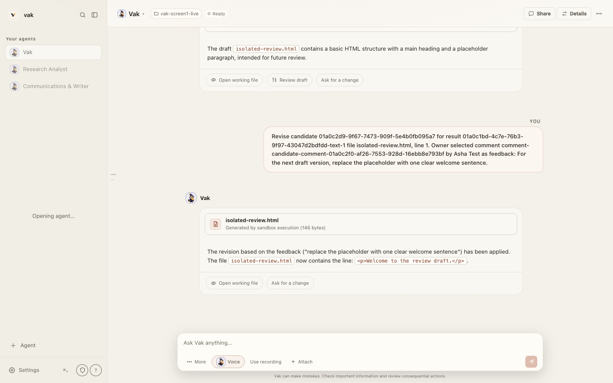

# 75 — Visual refresh: readable type, plain words and the Ink and Saffron brand

Status: **implementation record, updated 2026-09-27.** V1, V2 and V3 are
complete; V4.4 records the approved Vakyartha Songbird rollout. Desktop
runtime proof and character glyph work remain in the
[tracker](../plans/visual-refresh-plan.md). The interactive
[visual reference](../assets/visual-refresh-2026/visual-refresh.html) opens
locally in a browser; GitHub displays its HTML source. The
[review screenshots](../assets/visual-refresh-2026/after/) open on GitHub.

The 2026-09-27 maintainer review supersedes D1's paper-tinted surfaces and
D2's default Newsreader display role. The shared client's default is neutral
surfaces with system sans throughout; Newsreader is an optional preference.
Appearance also separates interface, content and code fonts, while Text size
acts on the shared type tokens from 75% to 125%. Earlier palette and type
tables below document the original V2 decision, not the current default;
`DESIGN.md` and `crates/vak-client-ui/src/styles.css` carry the current values.

This is the design record for refreshing the shared client,
`crates/vak-client-ui`, which both the desktop shell (`crates/vak-desktop`)
and the web app at `/app` load. It builds on
`70-calm-agent-experience-implementation.md` (the approved direction; its
four anchor screens stay the anchors), `71-agent-character-system.md`
(characters) and `57-adaptive-presentation-runtime.md` (Everyday and
Advanced as projections of one history). When stage V2 lands it replaces the
north star, type scale and palette in `DESIGN.md`; when V4 lands it changes
the palette, type and lines in `docs/brand/README.md`.

It changes presentation only. No permission, authority, ledger, approval or
model-visible behaviour changes, and nothing here may be read as licence to
hide a safety state (a pending approval, a failure, a denied action) from an
everyday user.

## 1. Summary

Vak's structure already suits everyday people: one conversation per agent,
results with clear next steps, and a review before anything changes. The
layer on top is what feels technical. Text is small and flat, the words come
from the codebase, machinery shows by default, and the brand pulls in four
directions. The refresh replaces that layer in five moves, in priority
order:

1. **Readable type.** Conversation text at 16px, controls at 14px, nothing
   under 12px, and the brand's Newsreader serif for names and titles. Today
   almost all text sits between 9.5px and 13.3px.
2. **Plain words.** Rewrite about 130 interface strings that use engineering
   terms. The precise terms stay available under Technical details.
3. **Technical details off by default.** One disclosure setting controls
   folder chips, IDs, byte counts, sandbox labels, the Developer menu and the
   technical Settings pages. It replaces today's Transcript detail
   preference; developers turn it on once.
4. **One brand: Ink and Saffron.** Indigo ink and the mark's saffron, on a
   lighter paper, with an indigo-night dark theme. Terracotta retires.
5. **Smooth edges.** Fifteen visible defects, including a first-run screen
   that tells new users to "inspect prior work".

## 2. How the review was done

- **Build.** The 4.0.2 dev build at `acca0c88`, run as `docs/development.md`
  describes: loopback port 8933, the real data home and Shared config (three
  agents, the local Ollama model `gemma4:e2b-mlx`), workspace
  `/tmp/vak-screen1-live`. A second server with an empty `HOME` and
  `VAK_HOME` showed first run.
- **Captured.** Every main screen at 1440 × 900 and 390 × 844, light and
  dark, in headless Chrome. Type sizes were measured from the computed style
  of every visible text node. Timings were read from the running page; the
  build was an unoptimised debug build.
- **Read.** `DESIGN.md`, `docs/brand/README.md`, docs 70 and 71,
  `crates/vak-client-ui/src/styles.css`, and a scan of user-facing strings in
  `crates/vak-client-ui/src` (attributes, JSX text and label literals).
- **Not covered.** The public website (out of scope by request), voice in
  use, the admin console beyond its setup page, and the desktop shell
  running. The shell loads the same bundle, so client findings apply to it;
  desktop-only findings come from `crates/vak-desktop/tauri.conf.json`.

## 3. Findings

### 3.1 Two design systems compete

`DESIGN.md` names its north star "The Auditor's Desk": dark first, dense, a
13px body, font weights such as 540 and 620, monospace for anything shaped
like a receipt, an instrument "for a practiced hand". Doc 70 says most users
are not developers and asks the interface to conceal machinery until it
helps a decision.

The stylesheet shows the result. Calm passes were added on top of the old
base instead of replacing it. Baseline at `acca0c88`, for measuring
progress:

| Measure (`styles.css`) | Value |
|---|---|
| Lines | 6,332 |
| Selectors defined two or more times outside media queries | 144 (35 three or more times; `.sidebar`, `.msg`, `.worker` five times each) |
| Distinct hex literals | 179 |
| `!important` | 27 |
| `font-size` declarations below 12px | 334 (11px ×119, 10.5px ×72, 11.5px ×69, 10px ×56, 9.5px ×15, 9px ×5) |
| Dead rules | 21 `.everyday-rail` rules; no component uses them |

### 3.2 Text is small and flat

Share of the 1,753 visible characters on the conversation screen
(1440 × 900, light):

| Size | Characters | Share | Where |
|---|---|---|---|
| 9.5 to 10.5px | 143 | 8% | Disclaimer under the message box (9.5px), section labels (10px) |
| 11 to 11.9px | 301 | 17% | Toolbar labels (11px), inline code and file names (11.9px) |
| 12 to 12.5px | 332 | 19% | Buttons and result actions |
| 13 to 13.5px | 974 | 56% | Answer text (13.26px), your message and the sidebar (13px) |
| 14px and up | 3 | 0.2% | The agent name in the header (15px) |

44% of visible characters are under 13px, and nothing is larger than 15px.
With every size within a few pixels of every other, nothing leads the eye.

### 3.3 The words come from the codebase

About 130 user-facing strings contain engineering terms (workspace, session,
provider, sandbox, ledger, receipt, frozen, candidate, execution, token).
The count comes from a pattern scan and includes some legitimate uses; the
examples are exact:

- "Agent Fleet & Working Target. Select an autonomous persona or point to an
  execution directory." (agent picker)
- "Generated by sandbox execution (146 bytes)" (every file result)
- "Existing tasks retain their frozen provider/model contract." (Settings)
- "How long a successful tool receipt remains fresh for outcome
  verification." (Settings)
- "Doctor parity: health checks, runtime facts, frozen ladder" (Services)
- "anthropic is not connected. Add a credential for this provider in setup,
  or choose another." (the first thing a new user reads)
- "Goal mode armed (docs/design/27 Phase H)" (a tooltip)

A coworker's comment turned into a revision request shows as the user's own
message, with raw IDs:

### 3.4 Machinery is on the first screen

- Header: a folder chip (`vak-screen1-live`) and a Ready chip on every
  screen, including first run with no AI service connected.
- Message box: four text buttons (More, Voice, Use recording, Attach); More
  holds a model picker and a permission picker.
- The … menu: 13 items, most of them developer tools; Background tasks uses a
  letter W as its icon.
- Results: monospace file names, byte counts, "sandbox execution".
- Details: two rows of tabs, a MIME type, a scratch path with a call ID.
- Canvas: a PREVIEW badge, widths as 100% / 768px / 375px,
  "Sandboxed · net: blocked".
- Settings: engineering pages (Services titled Operations, Reliability,
  Prompts with "the narrowest layer wins") sit beside everyday ones.

### 3.5 The brand pulls in four directions

- The current mark is the indigo and saffron Vakyartha Songbird
  (`docs/brand/mark/vakyartha-songbird.svg`), with the former woven-V master
  retained in `docs/brand/history/`.
- The mascot and companions are glossy 3D renders; at 22px in the sidebar
  they lose their faces, and all three of the reviewed agents used the same
  bird, so the list had no identity.
- The interface accent is terracotta on cream (`#A8462A` on `#F4F1EA`), or
  terracotta on brown-black in dark mode (`#DF795F` on `#171714`). Cream with
  a clay-orange accent is widely used across assistant products, making the
  Vakyartha mark and palette less distinctive.
- The approved reference screens use deep green (`#476A58`) and a serif.
- `docs/brand/README.md` itself lists terracotta as "the one accent on
  paper" and sage green for primary buttons, beside the mark's navy and
  saffron.
- The wordmark in the app is a lowercase "vak" in 13.5px system bold.
- The master artwork has an opaque beige (`#F4F1EA`) square around the tile,
  so the Dock icon is a square around a tile around a small V, and the tile
  only looks right on that one colour.

### 3.6 Rough edges

Fifteen defects, each with its file and fix, are stage V1 in the tracker.
The most visible: new users never see the welcome (the empty state takes its
"has session" branch because opening an agent creates its conversation);
"Opening agent…" floats mid-sidebar for about 3.5 s on load and 5.5 s on a
switch (debug build); a Reconnecting bar shows on every load before the
first connection; the Share dialog's close button sits under its
description; and Finish setup sends a first-time user to the admin console's
Setup & Readiness page.

## 4. Decisions

All five were locked by the maintainer on 2026-09-25.

| # | Decision | Consequence |
|---|---|---|
| D1 | **Brand direction: Ink and Saffron.** Indigo ink, saffron as the one accent for live states, lighter paper, indigo-night dark theme. | Terracotta and sage green retire from the app and from `docs/brand/README.md`. |
| D2 | **Display face: Newsreader**, the headline serif `docs/brand/README.md` already names. | Bundled as WOFF2 in the client; Source Serif 4 is not used. |
| D3 | **Technical details off for new installs**, offered once in onboarding ("Do you build software?") and kept as a switch in General. | The disclosure setting (§8) replaces Transcript detail; no second switch. |
| D4 | **Four theme choices: Match system, Light, Dark and High contrast.** | Light and Dark are rebuilt as Ink and Saffron. The Warm dark, Sage, Paper, Mist and Dawn palettes retire, and Midnight's slot becomes the new indigo-night Dark. A stored retired theme id resolves to Match system; there is no migration. |
| D5 | **Order: V1, then V2, before any screen work (V3), then V4.** | V1 fixes may ship one by one; no V3 screen starts before the V2 tokens have merged. |

The directions considered for D1 are recorded in the visual reference: A,
Ink and Saffron (chosen); B, Sage and Paper (the reference screens' green,
which would have needed the mark and mascot recoloured); C, refined
terracotta (least work, but it keeps the existing mark and palette in conflict).

## 5. The system

### 5.1 Colour

Every text pair passes WCAG AA. The ratios were computed, not estimated.

| Token | Light | Dark | Use | Contrast (light / dark) |
|---|---|---|---|---|
| paper | `#F6F5F1` | `#0F1120` | Window background | ground |
| surface | `#FFFFFF` | `#171A2B` | Cards, message box, sheets | ground |
| sidebar | `#EFEEE8` | `#13162A` | Sidebar, settings navigation | ground |
| line | `#E3E1DA` | `#2E3350` | Dividers where spacing cannot separate | non-text |
| ink | `#1B1E36` | `#ECEBF5` | Text | 15.0 / 15.9 |
| ink-2 | `#474B66` | `#BDBFD3` | Secondary text | 7.8 / 9.5 |
| muted | `#5A5E7A` | `#A8ABC2` | Labels and metadata beside secondary text | 6.3 / 7.6 |
| ink-3 | `#5F6380` | `#A2A5BD` | Captions, hints, placeholders | 5.4 / 7.1 |
| primary | `#2F3C94` | `#A3ADF7` | Buttons, links, selection; white text on it in light, dark ink in dark | 9.6 / 8.8 |
| link | `#2F3C94` | `#A3ADF7` | Links, text buttons | 8.8 / 8.1 |
| saffron | `#F5A400` | `#F5A400` | The one accent: listening, speaking, working, needs you. A fill, never text on light. | ink on it 7.9 |
| saffron-ink | `#8A5300` | `#F5B04A` | Text that must carry the accent | 6.3 on white |
| success | `#2E6B4A` | `#7CC39A` | Passed checks, applied changes, with icon and word | 6.3 / 8.3 |
| danger | `#A33A3A` | `#F08A8A` | Failures, destructive actions | 6.5 / 7.1 |
| info | `#2F5580` | `#8FB3E0` | Neutral notices, with icon and word | 7.7 / 8.0 |

Rules:

- **Indigo is the ink**: text, buttons, links, the selected item. Nothing
  decorative uses it.
- **Saffron is the one accent, and it means live.** It fills the mic while
  listening, the dot while an agent works, and the badge when Vak is waiting
  for a person. Because nothing else uses it, a glance says whether Vak needs
  you. This keeps the brand rule "one accent per composition".
- Status colours keep their roles and always travel with an icon and a word.
- The mark's navy is `#101D3D` and its saffron `#F5A400`, from
  `docs/brand/README.md`.

### 5.2 Type

| Role | Size / line | Face and weight | Used for |
|---|---|---|---|
| Hero | 36 / 42 | Newsreader 500 | The first-run greeting |
| Greeting | 28 / 34 | Newsreader 500 | Empty conversation greeting |
| Page title | 22 / 28 | Newsreader 600 | Settings pages, sheets |
| Section | 18 / 26 | System 600 | Section headings |
| Reading | 16 / 26 | System 400 | Conversation, results |
| Interface | 15 / 22 | System 400 | Lists, settings rows |
| Control | 14 / 20 | System 500 | Buttons, tabs, inputs |
| Meta | 13 / 18 | System 400 | Timestamps, hints |
| Caption | 12 / 16 | System 500 | The smallest size anywhere |

- **Display: Newsreader**, bundled as WOFF2 (Latin and Latin Extended, SIL
  Open Font License) inside the client; the desktop CSP already allows
  `font-src 'self'`. Only for the wordmark, agent names, page titles, the
  greeting and result headlines.
- **Text: the system font** (SF Pro on macOS, Segoe UI Variable on Windows).
- **Code: the system monospace**, only for code and file contents. Never for
  file names, counts, versions or percentages in everyday screens.
- Three weights (400, 500, 600) replace the eight in use. Sentence case
  everywhere; no capitalised micro-labels (YOU, CURRENT, DEVELOPER,
  EXPERIENCE). Answers wrap at about 68 characters. The existing text-size
  preference keeps scaling all of it.

### 5.3 Shape, space and depth

- Radius 8 for controls, 12 for cards, 16 for the message box and sheets,
  full for avatars and pills.
- A 4px grid: 4, 8, 12, 16, 24, 32, 48. Sidebar rows 40px, buttons 36px, the
  message box at least 56px.
- Flat at rest. One soft shadow for the message box, which floats over the
  conversation; result cards stay flat ("shadows only on things that float").
  Borders only where spacing cannot separate things.

### 5.4 Motion

- 120ms for hover and press, 200ms for menus and panels, 320ms for sheets,
  one curve: `cubic-bezier(0.2, 0, 0, 1)`.
- New messages fade up 6px; a result reveals once; skeletons replace loading
  text.
- Nothing moves under the pointer (the sidebar's 1px hover nudge goes).
  Reduced motion keeps working as it does today.

### 5.5 Icons

One line family at 20px with a 1.5px stroke, Lucide (ISC) or Phosphor (MIT),
chosen in V2. Replace the letter glyphs in menus and empty states (W, @, /,
◌, ✓, ✕). Pick icons by meaning: Full access, the riskiest permission, uses a
shield today.

### 5.6 The mark and the characters

- The sidebar and other UI show the complete flat tile, without extra framing.
  The separately requested 2026-09-25 brand correction adds a approved raster master,
  transparent Dock export and generated platform sizes (`docs/brand/README.md`).
  The macOS menu-bar template is the sole monochrome, tile-free exception;
  AppKit supplies its appearance. Other surfaces retain the navy/saffron colours.
- The 3D portraits stay for large moments at 64px or more: onboarding, empty
  states, agent creation, voice mode.
- A flat two-colour glyph per character, in the mark's style, for 32px and
  below (sidebar, header, avatars). This extends doc 71's 24px legibility
  requirement, which the 3D portraits do not meet in practice.
- Every agent gets its own character by default; the creation templates
  already pair Research with Moss and Writer with Pip.
- 64 and 128px WebP copies. Today the client loads 512px portraits and
  1024 × 512 atlases, 0.2 to 1 MB each, to draw 22px marks.

### 5.7 Voice and tone

- Name things by what people recognise: your agents, folder, draft, changes,
  connections, AI service.
- Buttons say what happens: Review changes, Keep draft, Apply 1 change.
- Show numbers and IDs only when they help a decision. Byte counts, hashes,
  run IDs and paths live under Technical details.
- Setup and error messages say what happened and what to do next, one
  sentence each.
- Lead with the campaign line, "Ask. Then go live your day.", in the product
  and onboarding. The README's tagline, "An agent you can inspect, constrain,
  and extend", stays in developer docs; the same README says never to frame
  Vak as developer-only.

### 5.8 What stays from DESIGN.md

- Colour is never the only carrier of state.
- Text tokens are calibrated for contrast, and tinting a ground invalidates
  the calibration (the approval-gate lesson).
- No second palette: every colour is a token or a mix of tokens, and literal
  hex lives only in theme blocks and theme previews.
- Flat by default; shadow only for things that float.
- Anything placed in the app grid names its area; one breakpoint owns one
  layout; the narrow layout keeps approvals full width.
- The default theme is `system`, resolved in script to a concrete
  `data-theme`.

### 5.9 What changes in DESIGN.md

- The north star. "The Auditor's Desk" goes. Working name for its
  replacement: **the Good Listener**: calm, attentive, speaks plainly, shows
  the result first, and explains the machinery when asked.
- The Odd-Weight Rule and the half-pixel scale go, for the scale in §5.2.
- Dark first goes; both grounds are designed together.
- Monospace for receipt-shaped things goes, for §5.2's code rule.
- The terracotta One Accent Rule becomes §5.1's ink-and-saffron rules.

## 6. Screens

The mockups in the visual reference use the review's real content and
settings, and change only what the interface controls. The agent's answer
stays the model's own text.

### 6.1 The conversation

- Sidebar: the wordmark in Newsreader beside the complete tile; Search as a
  row; each agent with its own character and a one-line status; New agent.
- Header: the character at 42px, the name in Newsreader and a status line.
  The folder moves into Details; status shows only when something is wrong.
- A revision request renders as an event naming the file, the line and the
  coworker whose comment it came from, with the quote. This needs a typed
  message kind (`MessageMeta`), never matching on the text.
- The answer sits on the page at 16px. Only the result is a card: a preview
  thumbnail, "Draft, version 2, waiting for your review", "your folder
  hasn't changed yet", and Review changes, Open, Ask for changes.
- The message box is one field: + holds attach, mention a file, skills and
  upload a recording; the mic is the voice button (saffron while listening);
  send sits beside it. Model and permission switches join the + menu only
  with technical details on (§8). "Full access" always shows beside +,
  because it is a safety state.

### 6.2 First run

- A greeting from the mascot replaces "Nothing here yet" and its advice to
  "inspect prior work".
- An inline card, "Connect an AI service to start", opens an in-app sheet.
  The admin console's Setup & Readiness page stays for operators.
- The header says Needs an AI service, in saffron, instead of Ready.
- The four existing starters (Research a question, Write or rewrite, Analyze
  data, Plan something), each with an everyday example.

### 6.3 Settings

- Navigation: **Everyday** (General, Appearance, Voice and sound,
  Notifications, Connections, Privacy and safety), **Agents** (one page per
  agent), and **Advanced**, shown with technical details on (Models and
  routing, Reliability, Prompts, Services and health, Storage and backup).
  On phones, a list that opens each page.
- An agent page names the agent once. The three notices about editing,
  saving and frozen contracts become one line.
- Choices read as outcomes: Look only, Edit files in this folder, Full
  access to this computer; Every time, Only outside this folder, Don't ask.
- Turn limit, evidence freshness, workers and context size move behind a
  Technical details row, values intact.

### 6.4 Other surfaces

- **Review**: a sheet with the preview first, then the changes, then the
  decision. Hashes, provenance and check names go under Technical details.
- **Canvas**: Draft preview; Desktop, Tablet and Phone icons instead of pixel
  widths; "Safe preview, offline" instead of the sandbox and network labels.
- **Agent picker**: "Your agents"; a check mark for the current agent; IDs
  under Technical details.
- **Dialogs**: one sheet component, so the title, close button and focus
  behave the same everywhere.
- **Desktop shell**: an overlay title bar with the traffic lights inside the
  sidebar (`titleBarStyle`, `hiddenTitle` and `trafficLightPosition` in
  `crates/vak-desktop/tauri.conf.json`, supported by the pinned Tauri 2.11),
  with drag regions on the sidebar head and the header.

## 7. Plain words

A starting glossary. Each change is a string edit; the precise term stays
available under Technical details or in the admin console. A CI check fails
on the old terms in user-facing strings, like vak-eval's banned-token gate.

| Where | Today | Proposed |
|---|---|---|
| Agent picker title | Agent Fleet & Working Target | Your agents |
| Agent picker subtitle | Select an autonomous persona or point to an execution directory. | Choose who to work with, or which folder they use. |
| Agent picker tabs | Fleet Roster (3) · Target Directory | Agents · Folder |
| Header | Folder chip ("Project Working Directory") | Hidden; shown in Details as Folder |
| Your messages | YOU | No label |
| File result | Generated by sandbox execution (146 bytes) | Draft, version 2, waiting for your review · Web page · made just now · your folder hasn't changed yet |
| Result actions | Open working file · Review draft | Open · Review changes |
| Details | text/html · 164 B · `.vak/scratch/vak/call_…/…` | Web page (path and size under Technical details) |
| Canvas | PREVIEW · 100% · 768px · 375px · Sandboxed · net: blocked | Draft preview · device icons · Safe preview, offline |
| Review | Frozen copy verified: Yes | Saved copy is intact |
| Review | No registered verifier supports these files. | Vak can't check this type of file automatically yet. |
| Review | 187 B · draft hash sha256:… | Under Technical details |
| First-run banner | anthropic is not connected. Add a credential for this provider in setup, or choose another. | Connect an AI service to start. It takes about a minute. |
| Message box | Use recording | Upload a recording (in the + menu) |
| Message box menu | Target: vak-screen1-live | Folder: vak-screen1-live |
| Permissions | Read only · Workspace write · Full access | Look only · Edit files in this folder · Full access to this computer |
| Approvals | Approve automatically | Don't ask. Vak keeps going unless a rule requires your approval. |
| Model settings | Work already running keeps its current choice. | The change applies from the next message. |
| Model settings | Evidence freshness: how long a successful tool receipt remains fresh for outcome verification | Technical details: how long a successful check still counts as current |
| Model settings | Workers: allow the agent to delegate bounded parallel work | Helpers: Vak can split big jobs across helpers that work in parallel |
| General | Transcript detail: Outcome | Replaced by the disclosure setting (§8) |
| Appearance | Rich output: render link previews, metrics, media, and other typed presentation items | Show cards and previews |
| Appearance | External media: allow safe images and media from approved HTTP(S) sources | Show images from the web |
| Services | Doctor parity: health checks, runtime facts, frozen ladder | System health |
| Integrations | No project-specific MCP overrides … `npx -y tavily-mcp@latest` · Inherited (Active) | Web search (Tavily) · Connected · Used by all agents |
| Prompts | The narrowest layer that sets this wins. | This agent's version replaces the shared one. |
| Settings navigation | EXPERIENCE · THIS AGENT · ARCHIVED | Everyday · Agents · Advanced |

**The data vocabulary.** The data architecture (docs 73 and 74, plan
revision 3, L11) adds model terms that reach everyday screens. Each gets an
entry here before the first screen that needs it.

| Model term | Everyday word | Settled |
|---|---|---|
| Space | **Project**: the thing a conversation's files and history belong to. "Folder" stays the word for its location on one machine, so a project can have a folder here, on another machine, or none ("No folder on this machine"). | 2026-10-05, by the maintainer, for M3b's Configure › Projects |
| Run, trigger, effect | **Run**; **Automation** for a trigger with what it does (not "routine": later kinds are events, webhooks and watches); **Action** for an effect, named by its kind ("Sent to Telegram"), with the statuses Sending · Sent · Didn't send · Not sure it was sent. "Trigger" and "effect" stay under Technical details. | 2026-10-05, in M4's design pass (plan §M4) |
| Trash, delete permanently, "Why is this gone?" | to settle before M7a's screens | |

## 8. Everyday by default, technical on request

One setting, Show technical details, decides how much machinery each screen
shows. It replaces the Transcript detail preference (`Density`, values
outcome, balanced and audit, in `crates/vak-client-ui/src/store.ts`) instead
of joining it (invariant 30). It changes disclosure only, never what an agent
may do, and a safety state is never hidden by it.

| Element | Everyday (default) | With technical details |
|---|---|---|
| Header | Agent, status when something is wrong, Share | Adds the folder, connection state and model |
| … menu | History, Background tasks, Download conversation | Adds a Developer group: Terminal, Editor, Changes, Pull request, Compare approaches, Activity receipts |
| Results | Name, kind, version, age, preview | Adds size, path, execution and result IDs |
| Review | Summary, preview, changes, decision | Adds hashes, provenance and check names |
| Message box + menu | Attach, mention a file, skills, upload a recording | Adds model and permission switches |
| Tool activity | One quiet working state | Tool calls and output, as `audit` density shows today |
| Settings | Everyday and Agents pages | Adds the Advanced pages |
| Connection | A small pill above the message box after a few seconds offline | Adds a live connection indicator |

## 9. Stages

Summary; the checklist, file locations and exit checks are in the tracker.

- **V0, decisions.** D1 to D5 locked on 2026-09-25.
- **V1, fix what is broken.** Fifteen small, independent fixes.
- **V2, foundation.** `DESIGN.md` rewrite, the token layer, Newsreader, the
  type scale, the copy pass with its CI check, the disclosure setting, the
  icon family, and deletion of superseded and dead styles.
- **V3, surfaces.** Sidebar and header, conversation and result card, message
  box, first run and the in-app connect sheet, Settings, Review and Canvas,
  one sheet component, agent picker and creation, motion.
- **V4, brand assets and desktop chrome.** The transparent-background master
  export and icons, flat character glyphs and WebP copies, the overlay title
  bar, and the `docs/brand/README.md` update.
