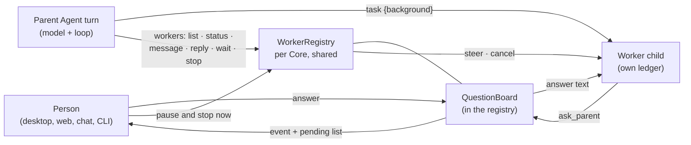
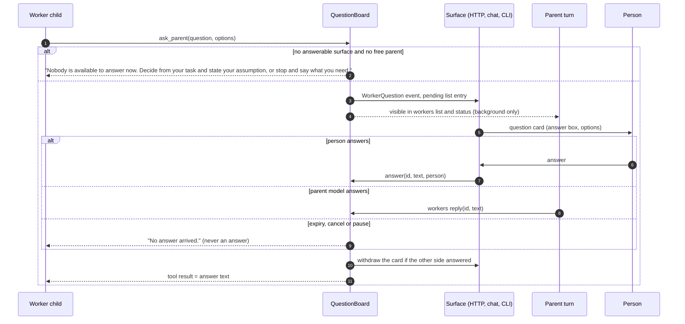

# 84 — Worker questions, live worker control, and pause-now
Status: in progress. Built: M3 (pause and stop now, §7), M1 (a worker's
question: the board, `ask_parent`, the HTTP list and answer endpoints and the
events, §4) and M2 (background tasks, read-only or leased writers, the `workers` tool and the
stop-gate join, §5). M4 is partly built: the web and desktop client's
question card, the gateway forward to the approver chat, the `vak exec`
terminal prompt and the admin console's read-only view. It extends `docs/design/64-agent-owned-platform.md` (Agent lifecycle),
`docs/design/47-commitment-kernel.md` (the control plane), and the `task`
tool of `docs/design/03-agent-loop.md`. Where this document and AGENTS.md
disagree, AGENTS.md wins until the change is made to both.

## 1. What is missing today

Facts, read from the tree at 5.3.2:

1. **A worker cannot ask.** A `task` child gets one self-contained prompt,
   runs to completion, and returns its final text. It has no tool to ask the
   person or its parent anything (`crates/vak-agent/src/task.rs`). A
   permission gate reaches the person through the parent's `Approver`, but
   `Approver::approve` answers yes or no and carries no free text.
2. **The parent cannot see a worker while it runs.** `task` blocks the
   parent's tool call until the child ends, so a model has no moment in which
   to look, and no model-facing tool to look with. The registry that lists,
   steers and stops live children (`WorkerRegistry`) is reachable only
   through HTTP endpoints (`/sessions/{id}/workers`, `.../steer`, `.../stop`),
   so a person can control a worker and an Agent cannot.
3. **Pause is a boundary.** Pausing an Agent refuses its next turn
   (doc 64). A person who wants the work to stop *now* has no way to ask,
   and under 1000 live Agents there should be one deliberate way that does
   not depend on polling.

The three gaps share one shape: a live child, a place where it can be seen,
and a bounded, authorised way to talk to it.

## 2. Goals, non-goals, and the rules this must keep

Goals: a worker can ask one specific question and get an answer; a parent
Agent can list, inspect, message, wait on and stop its own workers; a person
can pause an Agent and stop its running work in one explicit action.

Non-goals: a worker that spawns workers (depth stays 1); a worker that
talks to a *sibling*; any answer or message that grants authority; polling.

| Rule | How this design keeps it |
|---|---|
| Invariant 1, model-visible means logged | a question and its answer are a tool call and result in the child's ledger; the parent's side is an activity record; a message to a worker is a steering message in the child's ledger |
| Invariant 5, abort preserves partial output | pause-now cancels through the existing cancellation tokens; partial output survives |
| Invariant 14, brokered tools | `ask_parent` and `workers` are in-process orchestration tools like `task`; neither gets the policy engine, credentials, session store or a worker handle |
| Invariant 15, unattended fails closed | no answerable surface means no wait: the worker is told at once, never left blocked; silence, timeout and a late reply resolve nothing |
| Invariant 32, intent narrows; control authority comes from the channel | an Agent controls only its own children; an answer is data and never lowers an approval floor or grants a tool; a worker's question cannot change its scope |
| Invariant 33 | an answer is `Asserted` evidence at most; it never satisfies a criterion |
| Invariant 36 | a running turn's request stays append-only; nothing here edits it |
| Invariant 37 | pause-now is the explicit "cancel affected work" half of fail closed |
| "No mid turn stopping" (maintainer, 2026-10-01) | stopping a running turn happens **only** through the explicit pause-now action in §7, never as a side effect of saving or editing |

## 3. The shape



## 4. Part A: the worker asks (`ask_parent`)

### 4.1 Contract

A child-only tool, added by `TaskTool` to a child's tool list (read-only
children get it too, since it touches nothing). It is not in the parent's
capability set, so it is never advertised to a turn that cannot use it, and
the `Surface::Worker` text is **not** changed: a flow node also runs on the
Worker surface and has no such tool, so naming it there would be false
(doc 07: every code-owned section says only what is true where it is sent).
The tool's own description carries the guidance.

```text
ask_parent({ question: string (1..=500 chars),
             options?: string[] (<= 6, each <= 80 chars) })
  → the answer text, or an explicit "nobody could answer" message
```

Description (the only prompt text this adds, code-owned):

> Ask the person (or the Agent that started you) one specific question when
> you cannot continue without a decision only they can make. Do not ask what
> you can decide from your task or from what you can look up. An answer is
> information, not permission: it does not approve any action your tools
> would otherwise ask about. At most 3 questions per task, one at a time.

### 4.2 Who can answer, and in what order

| Parent mode | Answerers | Why |
|---|---|---|
| Foreground `task` (the parent is blocked in its own tool call) | the person only | the parent model cannot run |
| Background `task` (§5) | the parent model through `workers reply`, **or** the person; first answer wins | the parent is free and may know the answer from its own context; asking the person is the fallback |

The question lives on a `QuestionBoard` inside `WorkerRegistry` (already
shared per `Core`). One pending question per child, a oneshot channel back to
the blocked `ask_parent` call, and an expiry. An answer carries its source
(`person:<actor>` or `agent:<id>`), which is recorded.



### 4.3 What an answer is not

- It never approves a gated call. A gate still reaches the `Approver` and
  the permission engine exactly as before; an answer saying "yes, delete it"
  changes what the child knows, and `delete` still asks.
- It is wrapped as data in the tool result and the tool description says so.
- It is `Asserted` evidence at most (invariant 33).
- A parent-model answer is bounded by the same lengths and logged with the
  Agent as the actor; a person's is logged with the person.

### 4.4 Failure handling (the matrix row for doc 15)

| Condition | Result for the worker |
|---|---|
| surface not answerable (`Approver::answerable() == false`: scheduled run, best-of-N leg, heartbeat) and parent not free | immediate "nobody available" result, no wait |
| no answer within 900 s (the same bound as an HTTP gate) | "no answer arrived"; the entry is removed so a late reply resolves nothing |
| worker cancelled, or Agent paused-now | the blocked call ends as aborted; partial output preserved |
| 4th question, or a second while one is pending | refused with the reason, as a tool error the model can read |
| over-length question, option, or answer | refused or truncated at the boundary with the reason; never silently cut (invariant 36) |
| a question text that looks like a secret request | not detected by code; the worker's guardrails (never reveal credentials) are the control, and the answer is not a credential channel |

### 4.5 Surfaces

A surface must say it can show questions, or a worker is told at once that
nobody can answer. `Approver::answers_questions()` is `false` by default, so a
gateway chat, a scheduled run and the CLI (which can answer a yes/no gate but
cannot show a question) never leave a worker waiting. The server's approver
returns `true` only for a run whose client sent `can_show_questions: true` in
`POST /sessions/{id}/run`; the web and desktop client send it, `vak term` and
a plain API caller do not.

| Surface | Mechanism |
|---|---|
| HTTP and clients | `AgentEvent::WorkerQuestion { id, label, question, options }` on the parent's event stream; `GET /sessions/{id}/questions`; `POST /sessions/{id}/questions/{qid}` `{ text }`; the client renders a card beside the approvals card |
| Gateway chat | built. Forwarded to the approver chat like a gate, in forward mode only, and announced as `Question from <worker> [<code>]` with its choices. The approver chat answers with `answer <code> <text>`, or `answer <text>` when only one is waiting; with several waiting a reply must name one. The code is the random tail of the question id, because the head of a v7 id repeats for questions asked a minute apart. The window is the gateway's approval timeout (never longer than 15 minutes), silence or expiry means no and a late reply resolves nothing, a reply from any other chat is ordinary conversation, and a failed announcement ends the worker's wait at once. Revoking a session withdraws its questions. `Approver::announce_question` carries the question to the surface; the answer returns through the board |
| CLI | built, for `vak exec`. Attended means stdin and stderr are both terminals. The question is printed to stderr with its choices numbered, and a line is read from the keyboard: a number picks that choice, anything else is the answer as typed, and Enter skips, which tells the worker no answer arrived. Gates are unchanged (auto-approved with `--yes`, auto-denied otherwise), so `answerable` and `answers_questions` are independent. A piped or scripted run is unattended and the worker is told at once. One prompt at a time, read on a detached OS thread so a pending prompt never holds up process exit. `vak term`, a client of a server, uses the web path and does not send `can_show_questions` |
| Admin | built, read only. `GET /admin/api/questions` lists the questions waiting across live sessions (worker, question, choices, how long, session), and Home shows a "waiting on an answer" panel beside the approval gates, with a link to the session and no way to answer there: an answer belongs in the worker's conversation, the approver chat or the terminal. It refreshes from hub events (`WorkerQuestion`, `WorkerQuestionClosed`), which are emitted whichever surface announced the question. A wait that ends without an answer (expiry, skip, cancel) now emits `WorkerQuestionClosed`, which also clears the web client's card promptly |

### 4.6 Alternatives considered

| Option | For | Against | Verdict |
|---|---|---|---|
| Extend `Approver` with `ask(text) -> Option<String>` | one answering path for gates and questions | every `Approver` implementor (HTTP, gateway, defer, auto) changes at once; the parent-model answerer does not fit an approver at all | rejected: the board is a separate, small seam |
| Ask the parent *model* only | no UI work | the parent is blocked in foreground mode, so it can never answer; the person is the real answerer | rejected as the only path, kept as the second answerer in background mode |
| Inject the question into the parent's steering queue | reuses steering | steering is a person-to-run channel; mixing worker text into it breaks "who said this" and the typed control vocabulary | rejected |
| Let the worker finish with "I need X" and re-run | no new mechanism | loses the worker's context and cost; the parent must re-delegate | stays the fallback when nobody can answer |

## 5. Part B: background tasks and a model-facing `workers` tool

### 5.1 Why a second mode

`task` blocks, so there is no moment for the parent to look. The smallest
change that gives one is `task({ background: true })`: it returns the worker's
id at once and the child keeps running on its own tokio task. Foreground stays
the default and is unchanged.

**A background writer holds a lease.** A foreground `task` call holds its
resource claims only while it runs, so the parent cannot touch the same files
meanwhile. A background worker outlives its call, so for a writer the claims
become a *write lease* the registry holds until the worker ends (it lives on
the worker's registry entry, so any end of the worker releases it). A
background `task` without `readonly: true` must name `paths`: workspace-
relative files or folders, never the whole workspace, never `..`.

- **The worker is fenced.** Its tools are the read-only set plus `write` and
  `edit`, each wrapped so a path outside the lease is refused (compared by path
  component, and again through the filesystem so a symlink or a not-yet-created
  file under a link cannot lead out). `bash` and every other effectful tool are
  withheld, because they cannot be confined to a path. The permission engine,
  the sandbox and the approver still decide each write exactly as for any
  worker.
- **The parent is held off.** Just before each call runs, the loop compares its
  claims with the parent's live leases and refuses a conflicting call with the
  worker's id and "wait for it or stop it". Because a shell command claims
  everything, `bash` waits for every live writer; `read`, `grep` and the
  `workers` tool never conflict. The check runs per call, so a lease taken
  earlier in the same batch applies.
- **Leases do not overlap.** A second writer (or a foreground writer) whose
  paths overlap a live lease is refused the same way.
- **Ending leaves what was written.** Each file write is whole, but a writer
  stopped or cancelled between two files leaves the first changed and the
  second not. That is why the stop gate sends a parent back to wait before its
  turn ends (§5.2).

### 5.2 Lifetime: a background worker never outlives its parent turn

A worker whose parent turn has ended would run unattended with nobody to
receive its result. So:

1. The stop gate gains a `WorkersRunning` reason: a parent that tries to
   finish with live background workers is sent back once per worker set with
   "workers are still running: wait for them with `workers`, or stop them".
   This reuses the bounded stop-guard budget (`StopPolicy::max_blocks`).
2. When that budget is spent, the loop cancels the remaining workers and
   records each as cancelled with its partial output (invariant 5).

This is the one place a *worker* is stopped without a person asking, and it
is the end of its parent's turn, not a mid-turn stop.

### 5.3 The `workers` tool (parent only)

| Action | Effect | Authority |
|---|---|---|
| `list` | this session's workers: id, label, state (running, waiting for answer, finished, failed, cancelled), elapsed, steps, last tool, pending question | own children only |
| `status { id }` | the same for one worker plus the last 5 tool names and token use | own children |
| `message { id, text }` | steering text queued for the worker, picked up at its next step | own children; carries no authority, a worker's permissions do not change |
| `reply { id, text }` | answers the worker's pending question (§4) | own children |
| `wait { ids?, timeout_secs? }` | blocks until the named (or all) workers finish or the timeout passes, then returns their results | own children; non-exclusive claim so several waits can run |
| `result { id }` | a finished worker's final text and cards | own children |
| `stop { id }` | cancels one worker | own children |

Every action filters the registry by `parent_session_id == this session`.
A request for any other id is refused as unknown, never as forbidden, so
nothing leaks about other sessions. This matches the control matrix in
invariant 32: an Agent may act on its own children and nothing else, and a
scope change still needs a human (a message cannot add a path or a tool).

Admission: `workers` and `ask_parent` are declared like `task`
(`serves = ["orchestration"]`), appear in the "More tools" catalogue, and are
withheld on surfaces or channel policies that withhold `task`.

### 5.4 Costs and disadvantages

- **Parallel cost.** Background workers spend tokens concurrently. A cap
  (8 live per parent turn, configurable) and the existing spend gate bound it.
- **Non-determinism.** Results arrive in completion order. `wait` returns them
  in the order the ids were given, so the model's view is deterministic.
- **Context growth.** `list` and `status` are short by construction (one
  line per worker); a full result is read once with `result`.
- **Cache.** Tool results append; nothing before them changes (invariant 36).
- **More ways to loop.** Bounded by the per-turn cap, the question cap, and
  the stop gate; a model that polls `list` in a loop is caught by the
  existing identical-call counter.

## 6. Part A+B together: the answerer's view

A background parent sees a waiting worker in `list`:

```text
w-3  Researcher   waiting for an answer (2m)   "Which fiscal year should the totals use? [2025, 2026]"
w-4  Writer       running (4m, 9 steps, last: write)
```

It can `reply` from its own knowledge, or leave it for the person, and it
can tell the person in its own words that a worker is waiting.

## 7. Part C: pause and stop now

Saving or pausing an Agent never stops running work (doc 64). Stopping is a
separate, explicit action.

```text
POST /agents/{id}/pause   { "stop_running": true | false }     (default false)
POST /agents/{id}/resume
```

`stop_running: false` is today's behaviour: set the lifecycle, refuse the next
turn. `stop_running: true` does the same, then cancels the Agent's live work.

Order matters, to leave no window:

1. Write the lifecycle `paused` (so a turn admitted from now on is refused by
   the per-turn check).
2. Walk `state.sessions` once and collect the handles whose header Agent id
   is `id` (the gateway's handles are in the same map). This is a single pass
   over live sessions, `O(live)`, with no timers and no polling.
3. For each: cancel the run token and the side token, reject its pending
   approvals and questions as denied (invariant 11's pattern), and let
   cancellation propagate to its workers through their child tokens.
4. Record one `ConfigChange` security event naming the Agent and how many
   runs were stopped, and a per-session activity ("Run stopped: Agent
   paused") so the person sees why.

What it does not do: delete anything, rewrite a ledger, or touch another
Agent's work. Partial output is kept (invariant 5). The same action on
`archived` is the same code.

Disadvantage: a stopped turn may have made effects (a file written, a message
sent). Pause-now stops the *next* effect; it cannot undo the last. The result
the person sees lists what each stopped run had already done, from the ledger.

## 8. Alternatives for pause-now

| Option | For | Against | Verdict |
|---|---|---|---|
| Check the definition before every step | catches a pause within one step | a disk read per step per running turn; 1000 Agents is thousands of reads a second for a rare event | rejected |
| Cancel on every save of an inactive lifecycle | no extra option | an edit that happens to set paused kills work as a side effect, which the maintainer ruled out | rejected |
| Push-based cancel when the person asks (this design) | zero cost until used; deliberate | needs the explicit action | chosen |

## 9. Phases and exit tests

| Phase | Scope | Exit tests |
|---|---|---|
| M1 (built, surfaces in M4) | `QuestionBoard`, `ask_parent` for foreground workers, HTTP list and answer endpoints, event, fail-closed rules, ledger records | a worker's question is answered by the person and appears in the child's ledger; unanswerable returns at once; timeout leaves a late answer resolving nothing; the 4th question is refused; an answer never approves a gated call |
| M2 (built, writers added later) | `task { background }` (read-only, or a writer with a path lease), progress tracking, the `workers` tool, `WorkersRunning` stop-gate reason, parent-model `reply` | an Agent lists and messages its own worker mid-run; another session's worker is unknown; a parent cannot finish with a running worker until it waits or the budget is spent; cap enforced |
| M3 (built) | `POST /agents/{id}/pause` with `stop_running`, `resume`, the activity and security event | pausing with stop_running cancels live runs of that Agent only, keeps partial output, rejects pending gates and questions; without it, a running turn finishes and the next is refused |
| M4 (built: client card, gateway, CLI and admin view) | client question card, gateway forward, CLI prompt, admin read-only view | each surface answers a question; a non-approver chat cannot; silence means no |

Each phase ships whole: code, tests, this document's status line, and the
AGENTS.md changes it makes (the Layout entry for the new tools, and invariant
text for the answer-is-not-permission rule once M1 lands).

## 10. Open questions for the maintainer

1. Background writers: built as leased, fenced writers (§5.1). Open: should a writer be able to run `bash` inside its lease once there is a way to confine a command to a path?
2. Is a person-only answer enough for foreground workers, or should the
   parent model also be woken to answer mid-task (which would mean the
   parent must run while its own tool call is blocked)? This design says no.
3. The per-parent cap on live background workers: 8 (built), or lower for
   small local models?
4. Should a stopped-by-pause worker's partial result be handed to the
   parent's ledger as a typed activity (proposed), or left in the child's
   ledger only?
