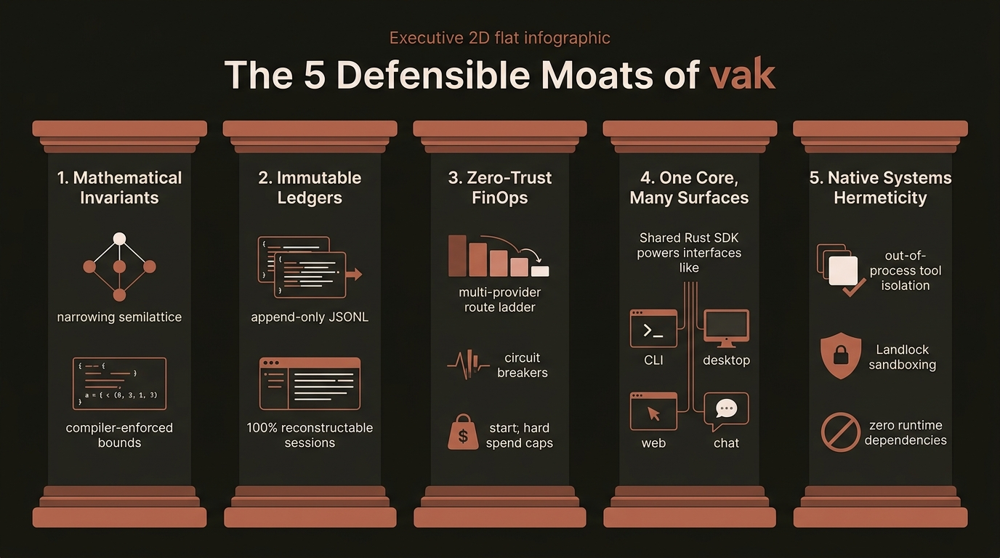
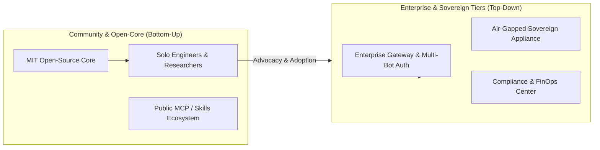

# The Strategic Investment Thesis: vak & The Sovereign Agent Market

> **Document Class:** Strategic Investment Memorandum & Market Intelligence  
> **Market Sector:** Enterprise AI Agent Infrastructure, Developer Tooling & Sovereign Compute  
> **Subject Platform:** **vak** (v3.0.99)

---

## 1. Executive Summary & Market Macro

The generative artificial intelligence market is navigating a classic infrastructure inflection point. Between 2023 and 2025, capital allocation was dominated by foundation model training. However, as frontier models (Anthropic Claude 3.7, OpenAI o3/GPT-4o, Google Gemini 2.5) approach capability parity on standard benchmarks, **the foundation model layer is commoditizing into utility compute**.

The real economic bottleneck—and the next major value-capture frontier—has shifted upward into the **execution, orchestration, and governance layer**:

```
Value Capture in Generative AI:
┌─────────────────────────────────────────────────────────────┐
│ 2023–2024: Foundation Model Layer (Training, Weights)       │ ──> Commoditizing
├─────────────────────────────────────────────────────────────┤
│ 2025–2026: Infrastructure & Harness Layer (vak)             │ ──> MASSIVE EXPANSION
├─────────────────────────────────────────────────────────────┤
│ 2026+: Vertical Application Layer                           │ ──> Fragmented
└─────────────────────────────────────────────────────────────┘
```

Enterprises, defense contractors, financial institutions, and security-conscious engineering organizations cannot deploy raw LLMs into production environments without an industrial-grade **Agent Harness**. Unconstrained agents fail in the wild due to:
1. **The Premature Completion Dilemma:** LLMs confidently hallucinate that tasks are "Done" without executing verification tests or compiling code.
2. **The Ambient Authority Threat:** Subprocesses run with unconstrained host credentials, creating catastrophic security and data-exfiltration vulnerabilities.
3. **FinOps Runaway:** Autonomous loops execute unmonitored circular retries, consuming thousands of dollars in tokens on dead-end paths.
4. **Compliance & Audit Vacuum:** Ephemeral memory structures prevent post-incident forensic reconstruction.

**vak** captures this value by establishing the world's most disciplined, auditable, and secure **Sovereign Agent Harness**. Built in pure systems Rust, vak provides the deterministic governance layer that enterprise organizations mandate before entrusting autonomous agents with production repositories, proprietary infrastructure, and operational budgets.

---

## 2. Competitive Landscape & Positioning Matrix

The autonomous agent landscape divides across two critical structural dimensions:
1. **Auditability & Execution Safety (Vertical Axis):** From ambient privileges and ephemeral state to append-only cryptographic ledgers, kernel-sandboxed isolation, and machine-verified completions.
2. **Surface Versatility & Harness Scope (Horizontal Axis):** From single-surface, cloud-locked assistants to universal sovereign harnesses driving CLI, Desktop, Web, and Channel fabrics.


*Figure 1: Market Positioning Matrix across Auditability/Safety vs. Surface Versatility.*

### The Four Market Archetypes

| Quadrant Archetype | Representative Platforms | Architectural Profile | Enterprise Bottlenecks |
|---|---|---|---|
| **Sovereign Agent Harness** | **vak** | Safe Rust native core; append-only JSONL; out-of-process isolation; 7-axis semilattice governance; "One Core, Many Surfaces". | Steep initial developer learning curve; requires systems engineering discipline. |
| **Specialized Coding Assistants** | Claude Code, Cursor, Windsurf, Aider | Node.js / Electron / Python; focused on IDE or CLI coding diffs; highly tuned developer UX. | Locked to a single surface (terminal or editor); ambient process permissions; un-auditable prompt state; single-vendor lock-in. |
| **Enterprise Orchestration Frameworks** | LangGraph, CrewAI, AutoGen, Dify | High-level Python/TS workflow graphs; heavy abstractions; multi-agent conversation wrappers. | High runtime memory bloat; no kernel-level sandboxing; fragile in-memory state; runtime dependency injection risks. |
| **Ad-Hoc API Wrappers** | Custom Python scripts, simple tool callers | Minimalist code wrapping LLM function-calling endpoints. | No failure recovery, zero budget control, high failure rate in production. |

---

## 3. The 5 Defensible Moats of vak

Why can't an incumbent like LangChain, Cursor, or Anthropic easily replicate `vak`?


*Figure 2: The five defensible structural moats of the vak platform.*


### Moat 1: Mathematically Bounded Governance (The Narrowing Semilattice)
In conventional frameworks, guardrails are soft prompt instructions or imperative runtime conditionals that can be bypassed by prompt injection. In `vak`, permission governance is modeled as a **meet semilattice** (`Limits::meet` in [`vak-intent`](../../crates/vak-intent)). Intent inference can mathematically only *narrow* capabilities, truncate route ladders, or raise approval floors—it possesses no algebraic operator to widen access. The Rust compiler enforces this at build time.

### Moat 2: Reconstructable Cryptographic Audit Trails
Enterprise compliance (SOC 2, ISO 27001, FedRAMP, HIPAA) requires complete forensic reconstructability. vak enforces an absolute invariant: **Model-Visible Means Logged**. Nothing reaches an LLM without an immutable append-only JSONL ledger record. Sessions are never destructively compacted; branching appends a new node with `parent_id`. A compliance auditor can replay an entire multi-agent session years later with zero data loss.

### Moat 3: True Data Sovereignty & Zero-Trust FinOps
Enterprise deployments cannot tolerate ambient cloud telemetry or unpredictable inference costs. `vak` incorporates a multi-provider routing ladder with:
- Dynamic demand scoring (matching task complexity to model tiers).
- Cross-model fallback ladders (Anthropic $\to$ OpenAI $\to$ Bedrock $\to$ local Ollama).
- Informed transience vs. hard circuit breakers (protecting enterprise budgets from circular retry loops).
- Local-first execution (zero telemetry phoning home).

### Moat 4: "One Core, Many Surfaces" Monopoly
While competitors build separate, disconnected products for CLI, desktop, and web, `vak` operates on a single unified core engine (`vak-core`). The CLI, the Tauri v2 native desktop app, the embedded SolidJS web client, the admin operations portal, and chat gateway bridges (Slack, Discord, Telegram) all bind to the exact same underlying SDK and state engine. Updates, security patches, and permission policies instantly apply across every surface simultaneously.

### Moat 5: Native Systems Hermeticity & Kernel Sandboxing
`vak` executes all built-in tools and Bash scripts through a brokered worker binary (`__tool_worker`) in a separate process group, hardened by Linux Landlock syscall filtering and macOS Seatbelt. A tool crash, memory leak, or runaway script cannot compromise the primary agent daemon.

---

## 4. Total Addressable Market (TAM) & Unit Economics

### Market Sizing

```
  ┌────────────────────────────────────────────────────────────────────────┐
  │ TOTAL ADDRESSABLE MARKET (TAM): $48.5B by 2030                         │
  │ Global Enterprise AI Software & Autonomous Systems Infrastructure      │
  ├────────────────────────────────────────────────────────────────────────┤
  │ SERVICEABLE ADDRESSABLE MARKET (SAM): $14.2B                           │
  │ Enterprise Developer Tooling, Regulated Software Automation & Defense   │
  ├────────────────────────────────────────────────────────────────────────┤
  │ SERVICEABLE OBTAINABLE MARKET (SOM): $2.1B                             │
  │ Sovereign Local-First Agent Platforms & Enterprise Security Harnesses  │
  └────────────────────────────────────────────────────────────────────────┘
```

1. **Enterprise DevOps & Developer Tooling:** Organizations are budgeting $30–$100/seat/month for autonomous coding and operational agents, but security teams are blocking deployment due to IP leakage and lack of auditing.
2. **Regulated & Sovereign Compute (Defense, Banking, Healthcare):** Highly regulated industries cannot send data to closed multi-tenant cloud agent wrappers. They require on-premise, air-gapped agent appliances.
3. **Autonomous IT & Infrastructure Operations:** Long-horizon, multi-day system administration tasks requiring durable commitments and zero-trust verification.

### Unit Economics: Rust vs. Python Cloud Bloat

Running agent swarms at enterprise scale in Python or Node.js incurs enormous cloud infrastructure overhead:

| Metric | Python/Node Agent Frameworks | **vak (Rust Native)** | Enterprise Advantage |
|---|---|---|---|
| **Base Process Idle Memory** | 180 MB – 450 MB | **12 MB – 28 MB** | **15x memory density** |
| **Startup / Turn Cold Start** | 1,200 ms – 3,500 ms | **< 15 ms** | **Near-instantaneous dispatch** |
| **Multi-Tenant Server Overhead** | Hundreds of separate containers | Single process multi-workspace `CorePool` | **90% server cost reduction** |
| **Deployment Footprint** | Gigabytes of virtualenvs & wheels | Single 35MB static binary | **Zero runtime dependencies** |

---

## 5. Commercialization Roadmap & Go-To-Market (GTM)

`vak` leverages a **dual-track Open-Core / Enterprise Appliance** commercialization model:



### Revenue Streams:
1. **Developer Open-Core (Adoption Engine):** Core harness is open-source (MIT). Drives developer mindshare, community tool integrations, and organic bottom-up enterprise penetration.
2. **Enterprise Sovereign Appliance (Annual License: $50k – $250k/cluster):**
   - Pre-packaged, air-gapped deployment for on-premise Kubernetes and bare-metal servers.
   - Built-in NATS distributed bus (`vak-bus`) with hardware-accelerated AES-256-GCM encryption.
   - Native integration with enterprise identity providers (SAML, Okta, Active Directory).
3. **Enterprise Compliance & FinOps Control Suite (Per-Seat SaaS: $40/user/month):**
   - Centralized Operations Center (`vak-ops`) with real-time incident fingerprints and token telemetry.
   - Immutable tamper-evident audit log streaming to enterprise SIEM platforms (Splunk, Datadog).
   - Global organizational budget caps and approval routing.

---

## 6. Strategic Risk Analysis & Mitigation

| Strategic Risk | Probability | Impact | Mitigation in vak Architecture |
|---|---|---|---|
| **Provider Verticalization** (LLM vendors baking agent loops into APIs) | High | Medium | **Model-Agnostic Abstraction:** vak treats models as commodity execution engines; value resides in the sandboxing, append-only ledger, and multi-surface presentation that cloud APIs cannot offer locally. |
| **Python Ecosystem Entrenchment** | High | Low | **Seamless Subprocess Extensibility:** Python scripts and tools run unmodified via MCP subprocesses and standard CLI hooks; developers get the ecosystem of Python with the safety of Rust. |
| **Maintenance Burden of Native Sandboxing** | Medium | Medium | **Layered Sandboxing Fallbacks:** If Linux Landlock or macOS Seatbelt are unavailable on a host, vak gracefully falls back to Docker containers or strict brokered process-group isolation. |

---

## 7. Investment Conclusion

`vak` is not another LLM wrapper; it is the **foundational operating system harness** for the autonomous agent era. By solving the core crises of safety, auditability, and completion verification at the systems level, `vak` establishes a wide, durable economic moat in the most critical layer of the enterprise AI technology stack.
