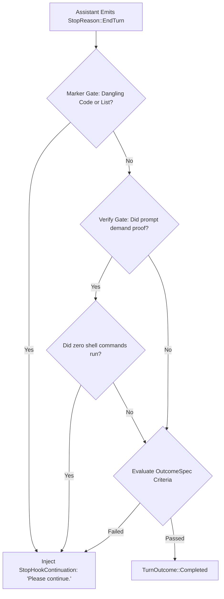
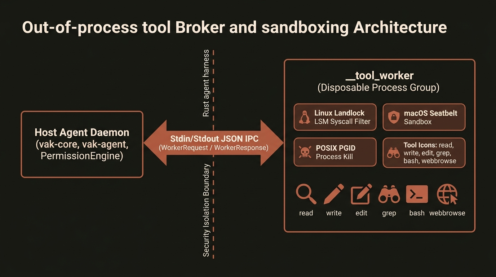
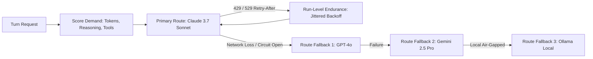

# Systems Architecture & Engineering Deep Dive: The vak Kernel

> **Document Class:** Technical Deep Dive & Systems Engineering Specification  
> **Audience:** System Architects, Core Engineers, AI Researchers & Security Specialists  
> **Platform Version:** vak v3.0.99 (Edition 2024 Rust)

---

## 1. Systems Philosophy & Workspace Topology

`vak` is engineered from the core principle that **safety and auditability cannot be patched onto an unconstrained runtime**. They must be guaranteed at the lowest layers of systems software: memory safety, process isolation, algebraic type invariants, and immutable storage.

```
┌─────────────────────────────────────────────────────────────────────────────┐
│                             SURFACES LAYER                                  │
│   vak (CLI)  •  vak-desktop (Tauri)  •  vak-client-ui  •  vak-server (Bridges)│
├─────────────────────────────────────────────────────────────────────────────┤
│                       PRESENTATION & DELIVERY LAYER                         │
│            vak-presentation (Closed AST)  •  vak-delivery (Outbox)          │
├─────────────────────────────────────────────────────────────────────────────┤
│                          CORE ORCHESTRATION LAYER                           │
│           vak-core (CorePool / SDK Facade / Memory / Route Scoring)         │
├─────────────────────────────────────────────────────────────────────────────┤
│                          EXECUTION & PROGRESS LAYER                         │
│          vak-agent (Loop / StopPolicy / Spend)  •  vak-flow (Plans)         │
├─────────────────────────────────────────────────────────────────────────────┤
│                          COGNITIVE & DECISION LAYER                         │
│          vak-intent (7-Axis Kernel)  •  vak-commit (Durable Commitments)    │
├─────────────────────────────────────────────────────────────────────────────┤
│                         SECURITY & SANDBOXING LAYER                         │
│     vak-permission (Rules Engine)  •  vak-sandbox (Landlock)  •  vak-tools  │
├─────────────────────────────────────────────────────────────────────────────┤
│                         PERSISTENCE, BUS & LLM LAYER                        │
│   vak-session (JSONL)  •  vak-store (FTS5)  •  vak-bus (NATS) • vak-llm     │
└─────────────────────────────────────────────────────────────────────────────┘
```

The workspace is cleanly factored into **28 specialized crates** with strict acyclic dependencies, zero ambient global state, and a workspace-wide `#![deny(unsafe_code)]` policy (with the sole documented exception of POSIX process-group kill in `vak-tools/src/bash.rs`).


*Figure 1: High-level 5-stage processing model of the vak agentic kernel.*

---

## 2. The 7-Axis Intent Kernel (`vak-intent`)

Conventional agent frameworks classify user intent using brittle regular expressions or unconstrained LLM prompt completions. `vak` formalizes intent into an algebraic type system:

```rust
pub struct Reading {
    pub act: Act,               // What kind of action is requested
    pub horizon: Horizon,       // Expected lifetime of the work
    pub stakes: Stakes,         // Consequence level / reversibility
    pub evidence: Evidence,     // Required proof strength to close
    pub clarity: Clarity,       // Specification completeness
    pub modality: Modality,     // Data types involved
    pub attendance: Attendance, // Human supervision mode
    pub confidences: Confidences,
    pub tier: Tier,
}
```


*Figure 2: The 7-Axis Reading, Narrowing Semilattice, and the Satisfaction Lattice.*

### The Narrowing Meet Semilattice (`Limits::meet`)

A critical architectural invariant in `vak` is: **Intent narrows, never widens**. 

The derived [`Engagement`](../../crates/vak-intent/src/engage.rs) holds a [`Limits`](../../crates/vak-intent/src/limits.rs) structure that forms a mathematical **meet semilattice**:

$$\text{Limits}_{\text{effective}} = \text{Limits}_{\text{baseline}} \sqcap \text{Limits}_{\text{intent}}$$

* $\sqcap$ (`meet`): The intersection operator. It can only reduce capabilities, lower token budgets, truncate fallback ladders to prefixes, or raise approval requirements.
* **Absence of Join**: The type `Limits` intentionally does **not implement a `join` method**. It is algebraically impossible for intent inference to grant a tool, elevate permissions, or bypass an approval gate.

### Axis Resolution Cascade

Intent is evaluated through an ordered, cost-conscious cascade:
1. **Tier 0 (Declared):** Flags, CLI options, pinned subagent constraints. (Free, 100% reproducible).
2. **Tier 1 (Signals):** Deterministic lexical, structural, and workspace facts. (Free, 100% reproducible).
3. **Tier 2 (Local Model):** Strict JSON inference via local Ollama. (Zero API cost, non-reproducible).
4. **Tier 3 (Cloud Model):** Invoked only when confidence falls below the acceptance threshold.

---

## 3. Outcome-Directed Runtime & Verify Gates (`OutcomeSpec`)

Modern LLMs suffer from "premature completion": emitting a polite concluding message while leaving code uncompiled, tests unrun, or files unedited.

`vak` solves this by introducing a formal contract: [`OutcomeSpec`](../../crates/vak-intent/src/outcome.rs).

```rust
pub struct OutcomeSpec {
    pub wanted: String,
    pub preserved: Vec<String>,
    pub completion_criteria: Vec<WorkCriterion>,
    pub uncertainties: Vec<String>,
}
```

### The `StopPolicy` Verify Gate

At every potential turn completion point in [`crates/vak-agent`](../../crates/vak-agent), before the loop returns `TurnOutcome::Completed`, the internal [`StopPolicy`](../../crates/vak-agent/src/stop_policy.rs) executes:



1. **Marker Gate:** Detects unclosed markdown fences, non-heading trailing colons, or bare list markers indicating truncated model generation.
2. **Verify Gate:** If the prompt requested proof ("run the tests", "prove it builds", "verify"), and **zero shell commands ran**, completion is denied. The engine appends `[stop-guard]: Verification required but not executed. Please run verification.` to the transcript and continues within `max_turns`.

---

## 4. Durable Commitments & Falsifiable Verification (`vak-commit`)

For long-horizon tasks that span multiple days or multiple interactive sessions, conversational sessions are the wrong unit of abstraction. `vak` introduces [`Commitment`](../../crates/vak-commit/src/types.rs):

* **Commitments are Primary:** The durable commitment is the primary entity; individual chat sessions are ephemeral [`Episode`](../../crates/vak-commit/src/types.rs) runs that advance it.
* **The Satisfaction Lattice:**
  
  $$\text{Asserted} < \text{Attested} < \text{Observed}$$
  
  * **`Asserted`:** The LLM claims the work is done (lowest confidence).
  * **`Attested`:** An external system provides a signed receipt or webhook.
  * **`Observed`:** The local runtime directly witnesses the result (e.g., `cargo test` exits with code `0`).

* **The Closure Invariant:** A commitment demands a minimum satisfaction level derived from its `evidence` axis. The [`CommitmentLedger`](../../crates/vak-commit/src/ledger.rs) strictly refuses to append a `Fulfilled` verdict unless backed by recorded, machine-verified evidence.

---

## 5. Out-of-Process Broker & Sandboxing Architecture

To protect host environments from rogue scripts, memory leaks, and process crashes, `vak` strictly isolates tool execution:


*Figure 3: Out-of-process tool broker and sandboxing architecture.*


1. **Versioned IPC (`WorkerRequest` / `WorkerResponse`):** Built-in tools and Bash operations execute through the `__tool_worker` subcommand in a separate process group (`setpgid`).
2. **Process Group Kill:** If a turn is cancelled or hits a watchdog timeout, `vak` issues a SIGTERM/SIGKILL to the entire process group, guaranteeing no orphaned runaway processes.
3. **Quarantined Scratch (`.vak/scratch/`):** Intermediate file generations are confined to quarantined scratch directories with live sandbox web previews before user promotion.
4. **Linux Landlock & Docker Backends:** Filesystem containment restricts directory traversal at the kernel level without requiring root privileges.

---

## 6. Immutable, Append-Only Session Storage (`vak-session`)

Every interaction is captured in an append-only JSON Lines (`.jsonl`) ledger:

* **Non-Destructive History:** Sessions are never rewritten or deleted. Branching appends a new message record with a `parent_id`.
* **Context Compaction:** When context limits are approached, older turns are summarized into a structured compaction event appended to the ledger. Verbatim message history is preserved on disk.
* **Model-Visible Means Logged:** Any data that enters an LLM context window must be reconstructable from the ledger via `SessionLog::derive_messages()`.
* **Disposable FTS5 Index (`vak-store`):** Fast search across hundreds of sessions is powered by a SQLite FTS5 index. The index is purely derivative and disposable; the JSONL ledgers remain the sole source of truth.

---

## 7. Multi-Provider Route Ladder & Resilient Epistemics (`vak-llm`)

`vak` rejects hardcoded model lists. Available models are discovered dynamically (`GET /models`) with 5-minute TTL memoization.



* **Informed Transience vs. Circuit Breaker:**
  * Transient rate limits (HTTP 429 with `Retry-After`) feed run-level endurance without tripping the breaker.
  * Hard connection drops, malformed JSON streams, or SSL faults increment the shared `CircuitBreaker`, failing fast to preserve user budget.
* **RouteFallback Events:** Transitioning across legs of the route ladder emits a typed `RouteFallback` event, ensuring complete visibility across all UI clients.

---

## 8. Distributed Swarm Fabric (`vak-bus`)

For multi-agent swarms spanning multiple machines, `crates/vak-bus` provides an industrial distributed messaging fabric:


*Figure 3: Multi-agent subagent orchestration, tool claiming, and causal lineage.*

1. **Transport:** High-throughput **NATS Core + JetStream** with in-memory fallbacks for local test suites.
2. **Zero-Trust Encryption:** Payloads are encrypted end-to-end using **AES-256-GCM** with keys derived per-workspace (`vak-bus::crypto::derive_workspace_key`).
3. **Causal Merkle Hash Chaining:** Every message envelope carries a cryptographic parent hash and W3C distributed trace context, preventing causal split-brain and guaranteeing linear event ordering across swarms.
4. **Dead-Letter Queues (DLQ):** Unroutable or failed messages are captured with complete stack traces and diagnostic metadata for post-mortem analysis.

---

## 9. Universal Output Engineering (`vak-presentation` & `vak-delivery`)

Text output from models is decoupled from surface-specific UI rendering:
1. **Compilation to AST:** Markdown is compiled into a bounded `PresentationDocument` (max 256 nodes, max depth 16, max 32KB text) to prevent DOM-overflow vulnerabilities.
2. **Outcome-First Renderers:**
   * **Diff Inspector:** Interactive side-by-side and unified diffs.
   * **Test Matrix:** Color-coded pass/fail test execution trees.
   * **Crosshair SVG Charts:** Embedded vector telemetry charts.
   * **Dynamic Data Grids:** Sortable, filterable tables.
3. **Durable Channel Outbox (`vak-delivery`):** Outbound messages to Slack, Discord, and Telegram are persisted in a local outbox queue with exponential retry backoff, ensuring messages are never lost during transport disconnects.

---

## 10. The Complete Turn Pipeline Detail


*Figure 4: Complete end-to-end turn pipeline from inbound request parsing to verified delivery.*

From inbound request admission to verified delivery, every step in `vak` is typed, sandboxed, and auditable. It is an architecture designed not just to demo well, but to operate reliably under the most demanding enterprise constraints.
