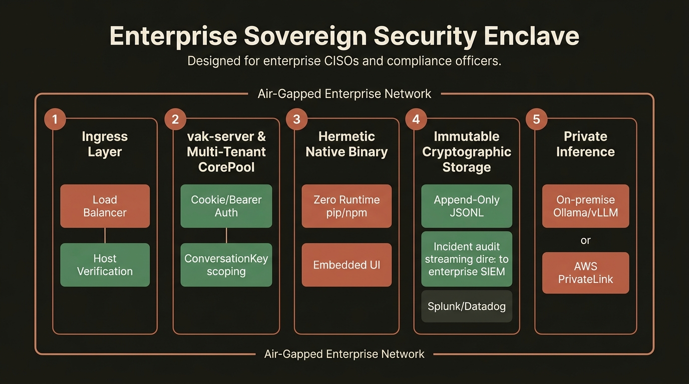
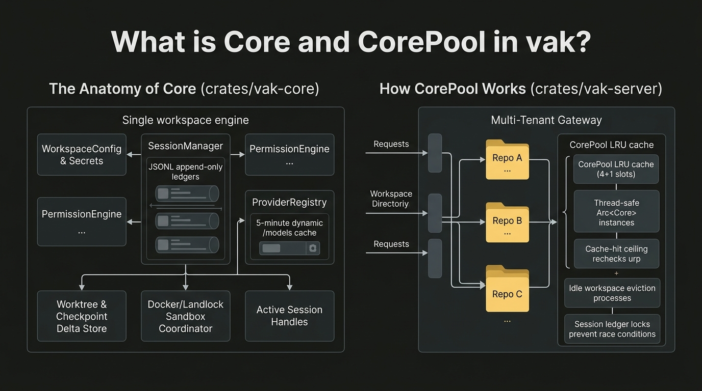
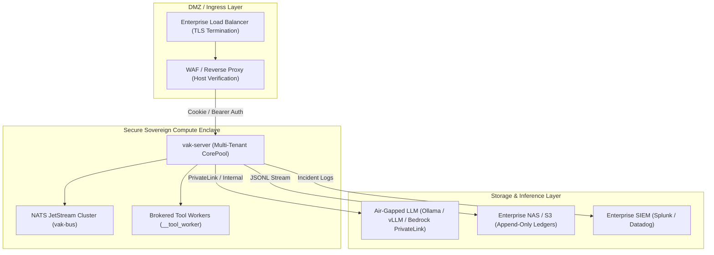

# Enterprise Governance, Security & Sovereign Compliance Whitepaper

> **Document Class:** Enterprise Compliance, Security Architecture & Operational Policy  
> **Target Audience:** Chief Information Security Officers (CISOs), Compliance Auditors, Enterprise Platform Directors & Infrastructure Architects  
> **Platform Version:** vak v3.1.0

---

## 1. Executive Summary & Enterprise Threat Model

When enterprises evaluate autonomous AI systems, the primary adoption blocker is rarely model capability—it is **governance, liability, and security risk**. Unregulated agents operating inside an enterprise network introduce three catastrophic risk vectors:
1. **Unbounded Data Exfiltration:** Agents with ambient network access transmitting internal source code, PII, or proprietary credentials to unauthorized cloud endpoints.
2. **Untracked Code Mutations:** Agents committing unvetted changes directly to production branches without cryptographically signed human authorization.
3. **Regulatory Non-Compliance:** Violations of SOC 2, HIPAA, GDPR, or FedRAMP standards due to ephemeral, un-auditable decision paths and black-box state stores.

*Figure 1: Enterprise sovereign security enclave architecture.*

**vak** is architected to satisfy the strictest enterprise compliance and zero-trust standards. By treating execution safety as an un-bypassable systems invariant, `vak` allows enterprises to reap the productivity gains of autonomous AI while maintaining total sovereignty over their code, infrastructure, and compliance posture.

---

## 2. Zero-Trust Software Supply Chain & Native Hermeticity

### The Risk of Python/Node.js in Production
Conventional AI frameworks (LangChain, AutoGen, CrewAI) rely on interpreted Python or TypeScript runtimes. In enterprise environments, this introduces acute supply-chain vulnerabilities:
* **Dynamic Dependency Poisoning:** Standard agent setups fetch hundreds of third-party wheels and npm packages at runtime, exposing internal servers to malicious upstream packages.
* **Ambient Code Modification:** Python files on disk (`site-packages`) can be monkey-patched or modified at runtime by rogue scripts.
* **Environment Variable Leakage:** Python sub-processes frequently inherit the parent process's entire `os.environ`, exposing production API keys and database credentials to unvetted scripts.

### How `vak` Guarantees Hermeticity

1. **Self-Contained Static Binaries:**
   - `vak` compiles down to standalone machine executables (`vak` and `__tool_worker`).
   - The embedded SolidJS web applications ([`vak-admin-ui`](../../crates/vak-admin-ui) and [`vak-client-ui`](../../crates/vak-client-ui)) are compiled into static assets and baked **directly into the binary** at compile time via [`include_dir`](../../Cargo.toml#L107).
   - **Zero runtime package manager dependencies:** No `pip`, no `npm`, no dynamic runtime downloads.
2. **Cryptographically Signed Builds (Ed25519 / SHA-256):**
   - Release binaries are compiled with strict Link-Time Optimization (`lto = "thin"`), stripped of debug symbols, and signed with Ed25519 cryptographic keys using [`ring`](../../Cargo.toml#L104).
3. **Scrubbed Process Environments:**
   - Subprocesses spawned by `vak` (Bash tools and MCP servers) receive an explicit, minimal whitelist of environment variables (`PATH`, `USER`, `LANG`).
   - LLM API keys, gateway tokens, and internal server secrets are never exposed to tool subprocesses.

---

## 3. Multi-Tenant Workspace & CorePool Isolation

For enterprise shared-server deployments, `vak-server` implements a multi-tenant workspace pool ([`CorePool`](../../crates/vak-core/src/lib.rs)):

*Figure 1: Anatomy of a single Core workspace vs. the multi-tenant CorePool.*

### Security Guarantees in `CorePool`:
1. **Cryptographic Identity Scoping (`ConversationKey`):**
   - Every active conversation is bound to a 4-part cryptographic key:
     
     $$\text{ConversationKey}(\text{workspace\_id}, \text{agent\_id}, \text{audience\_id}, \text{conversation\_id})$$
     
   - A request originating from one workspace can never read, modify, or leak data into another workspace.
2. **Channel Allowlist Enforcement:**
   - Remote channel endpoints (Telegram, Discord, Slack) are gated by `<sessions_home>/gateway/allowlist.json`.
   - Unknown chats land in an explicit `pending` state; denied chats are permanently blocked and fail closed.
3. **Non-Escalating Policy Chains:**
   - Permissions resolve down an immutable three-tier chain: **Bot $\to$ Chat $\to$ Workspace**.
   - An allowlist rule can only *narrow* authority; it can never grant more access than the workspace root permits (`PermissionMode::capped_by`).

---

## 4. SOC 2, HIPAA & FedRAMP Compliance Mapping

| Regulatory Requirement | Compliance Standard | Architectural Mechanism in vak |
|---|---|---|
| **Forensic Reconstructability** | SOC 2 (CC6.1, CC6.6) | **Append-Only JSONL:** Every model prompt, tool invocation, and provider response is immutably logged. Session histories are never deleted or rewritten. |
| **Data Sovereignty & Residency** | HIPAA (§ 164.312), FedRAMP | **Local-First / Air-Gapped:** Zero telemetry sent to external vendors; supports fully air-gapped local LLMs via Ollama and local vector stores. |
| **Least Privilege & Access Control** | SOC 2 (CC6.3), ISO 27001 | **Three-Mode Policy Engine:** `ReadOnly`, `WorkspaceWrite`, and `FullAccess` modes with path-containment validation and Landlock kernel filtering. |
| **Tamper-Evident Operations** | FedRAMP (AU-2, AU-9) | **Merkle Hash Chaining (`vak-bus`):** Distributed swarm messages embed cryptographic parent hashes and W3C trace lineage to prevent event tampering. |
| **Zero-Trust Token Governance** | Enterprise FinOps | **Hard Dispatch Ceilings:** Absolute spending caps per unit of work prevent runaway cloud LLM expenditures. |

---

## 5. Operational Resilience & High-Availability Service Units

For enterprise background operation, `vak` includes production-ready system service generators for **Linux `systemd`** and **macOS `launchd`**:

* **Canonical Workspace Isolation:** Generated units run from the canonical workspace directory (`~/vak-home`), never from an ambient transient folder.
* **Health Probes & Liveness Checks:** Exposes authenticated `/health` and `/health/ready` probes for integration with enterprise load balancers (Kubernetes, AWS ALB, Nginx).
* **Automated Incident Logging (`incidents.jsonl`):** System anomalies, failed authorization gates, and unexpected broker crashes append structured incident fingerprints to `<sessions_home>/operations/incidents.jsonl`.
* **Durable Outbox Persistence:** Channel deliveries to Slack or enterprise webhooks are committed to a SQLite-backed durable outbox before transmission, guaranteeing zero message loss across network partitions.

---

## 6. Sovereign Enterprise Deployment Topologies

### Supported Enclave Topologies:
1. **Fully Air-Gapped High-Security Enclave:** Running on isolated bare-metal servers with no egress to the public internet; inference routed entirely through on-premise vLLM or Ollama clusters.
2. **Virtual Private Cloud (VPC) Enterprise Hub:** Deployed inside AWS/GCP/Azure with private VPC endpoints (AWS PrivateLink to Bedrock or Azure OpenAI), completely shielded from public web exposure.
3. **Hybrid Developer Fleet:** Running locally on developer laptops with central policy synchronization and unified audit log streaming to corporate security teams.

---

## 7. Governance Conclusion

`vak` is engineered specifically to eliminate the "shadow AI" and operational security risks associated with unconstrained agent adoption. By enforcing mathematical safety bounds, hermetic compilation, out-of-process sandboxing, and immutable audit ledgers, `vak` provides enterprise CISOs and engineering leaders with the first genuinely **production-certifiable autonomous agent harness**.
