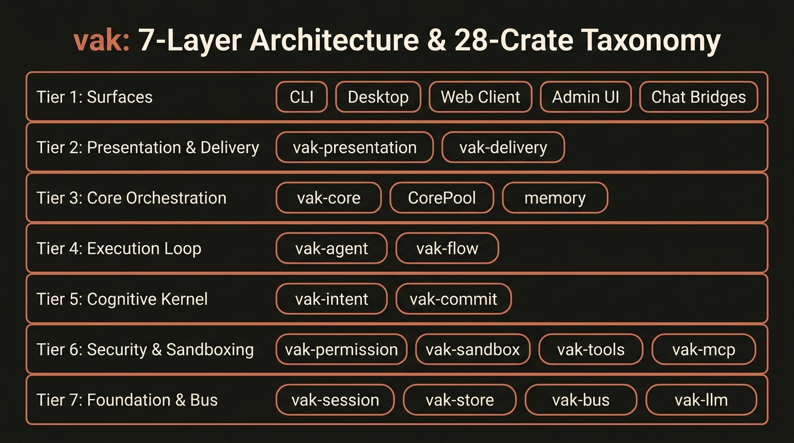

# System Architecture & 28-Crate Taxonomy Specification

> **Document Class:** Systems Engineering Reference & Workspace Architecture Specification  
> **Platform Version:** vak v3.1.0 (Edition 2024 Rust)  
> **Target Audience:** System Architects, Core Rust Engineers, Open-Source Contributors & Due-Diligence Auditors

---

## 1. Executive Summary & Design Principles

The `vak` codebase is structured as a **modular Rust workspace of 28 dedicated crates**. Unlike monolithic agent repositories that bundle model calling, prompt templates, tools, and UI rendering into an undifferentiated package, `vak` strictly enforces:

1. **Acyclic Dependency Inversion:** Higher-level execution loops depend on abstract traits rather than concrete hosts. For example, [`vak-agent`](../../crates/vak-agent) does not depend on [`vak-core`](../../crates/vak-core) or [`vak-server`](../../crates/vak-server); the host injects tool instances and normalizers at startup.
2. **Compile-Time Governance:** Invariants (such as narrowing-only permission limits, immutable append-only storage, and process-group isolation) are enforced by the Rust type system and borrow checker.
3. **Workspace-Wide Memory Safety:** The workspace enforces `#![deny(unsafe_code)]`. Raw pointer dereferencing and unsafe memory access are forbidden across all 28 crates (with the single documented exception of the POSIX process-group kill in [`vak-tools/src/bash.rs`](../../crates/vak-tools/src/bash.rs)).


*Figure 1: The 7 architectural tiers across the 28 workspace crates.*

---

## 2. The 7 Architectural Layers

```
Layer 7: Surfaces & User Interaction  [vak, vak-desktop, vak-client-ui, vak-admin-ui, vak-server]
   │
   ▼
Layer 6: Presentation & Channel Delivery  [vak-presentation, vak-delivery]
   │
   ▼
Layer 5: SDK Facade & Core Orchestration  [vak-core]
   │
   ▼
Layer 4: Execution & Progress Loop  [vak-agent, vak-flow]
   │
   ▼
Layer 3: Cognitive & Decision Kernel  [vak-intent, vak-commit]
   │
   ▼
Layer 2: Security, Sandboxing & Tool Brokering  [vak-permission, vak-sandbox, vak-tools, vak-mcp, vak-hooks, vak-plugin]
   │
   ▼
Layer 1: Persistence, Bus & Inference Foundations  [vak-session, vak-store, vak-bus, vak-llm, vak-config, vak-terminal, vak-voice, vak-eval, vak-ops, vak-tray]
```

### Layer 7: Surfaces & User Interaction
* **Crates:** [`vak`](../../crates/vak), [`vak-desktop`](../../crates/vak-desktop), [`vak-client-ui`](../../crates/vak-client-ui), [`vak-admin-ui`](../../crates/vak-admin-ui), [`vak-server`](../../crates/vak-server).
* **Role:** The presentation boundary. Contains zero private execution logic; all surfaces are thin consumers of [`vak-core`](../../crates/vak-core).
* **Contract:** Guarantees identical execution behavior, approval gates, and session ledgers regardless of whether the user interacts via terminal CLI, native desktop window, browser tab, or remote chat bridge.

### Layer 6: Presentation & Channel Delivery
* **Crates:** [`vak-presentation`](../../crates/vak-presentation), [`vak-delivery`](../../crates/vak-delivery).
* **Role:** Decouples raw Markdown generation from surface-specific rendering.
* **Contract:** Compiles text into an Abstract Syntax Tree ([`PresentationDocument`](../../crates/vak-presentation/src/presentation.rs)) with hard bounding limits (max 256 nodes, depth 16) to prevent DOM-overflow attacks. Translates rich outputs into platform-native blocks (Slack, Discord, Telegram) with durable outbox retry persistence.

### Layer 5: SDK Facade & Core Orchestration
* **Crates:** [`vak-core`](../../crates/vak-core).
* **Role:** The central coordination hub. Assembles configuration, provider keys, session ledgers, and tool registries.
* **Contract:** Manages [`CorePool`](../../crates/vak-core/src/lib.rs) for multi-tenant workspace isolation, routes dynamic model ladders, and coordinates episodic memory recall (`USER.md`).

### Layer 4: Execution & Progress Loop
* **Crates:** [`vak-agent`](../../crates/vak-agent), [`vak-flow`](../../crates/vak-flow).
* **Role:** Drives the autonomous turn cycle, parallel tool dispatch, and streaming event delivery.
* **Contract:** Errors are values (`TurnOutcome`); functions never panic on invalid inputs. Evaluates [`StopPolicy`](../../crates/vak-agent/src/stop_policy.rs) verify gates before allowing an agent to exit.

### Layer 3: Cognitive & Decision Kernel
* **Crates:** [`vak-intent`](../../crates/vak-intent), [`vak-commit`](../../crates/vak-commit).
* **Role:** Turns unconstrained prompts into typed, mathematically bounded engagements and durable obligations.
* **Contract:** Enforces the **narrowing meet semilattice** (`Limits::meet` can only reduce permissions, never widen them) and the **satisfaction lattice** (commitments close only with `Observed` world proof).

### Layer 2: Security, Sandboxing & Tool Brokering
* **Crates:** [`vak-permission`](../../crates/vak-permission), [`vak-sandbox`](../../crates/vak-sandbox), [`vak-tools`](../../crates/vak-tools), [`vak-mcp`](../../crates/vak-mcp), [`vak-hooks`](../../crates/vak-hooks), [`vak-plugin`](../../crates/vak-plugin).
* **Role:** Enforces runtime authorization, OS-level containment, and subprocess lifecycle.
* **Contract:** Pure functional permission evaluation `(tool, args, mode) -> Decision`. Out-of-process tool execution via `__tool_worker` in Landlock/Seatbelt-isolated process groups.

### Layer 1: Persistence, Bus & Inference Foundations
* **Crates:** [`vak-session`](../../crates/vak-session), [`vak-store`](../../crates/vak-store), [`vak-bus`](../../crates/vak-bus), [`vak-llm`](../../crates/vak-llm), [`vak-config`](../../crates/vak-config), [`vak-terminal`](../../crates/vak-terminal), [`vak-voice`](../../crates/vak-voice), [`vak-eval`](../../crates/vak-eval), [`vak-ops`](../../crates/vak-ops), [`vak-tray`](../../crates/vak-tray).
* **Role:** Low-level substrate for distributed messaging, provider streaming, immutable storage, terminal emulation, and operations monitoring.
* **Contract:** Model-visible means logged; append-only JSONL files are the sole source of truth; zero-trust AES-256-GCM message encryption across swarms.

---

## 3. Comprehensive 28-Crate Taxonomy Table

| # | Crate | Layer | Primary Responsibility | Key Types & Public APIs | Safety & Architectural Invariant |
|---|---|---|---|---|---|
| 1 | [`vak`](../../crates/vak) | Layer 7 | Binary CLI entry point and thin verb dispatcher. | `cli::Cli`, `Args`, `main()` | Contains zero core business logic; delegates completely to `vak-core`. |
| 2 | [`vak-desktop`](../../crates/vak-desktop) | Layer 7 | Tauri v2 desktop application shell. | `TauriApp`, `AppMenu`, `WindowManager` | Native OS windowing without breaking web-client parity. |
| 3 | [`vak-client-ui`](../../crates/vak-client-ui) | Layer 7 | SolidJS conversation canvas & workspace UI. | `App`, `ChatView`, `DiffInspector`, `Chart` | Embedded into `vak-server` at compile time; zero npm at runtime. |
| 4 | [`vak-admin-ui`](../../crates/vak-admin-ui) | Layer 7 | Embedded SolidJS operations & approvals portal. | `AdminPortal`, `SecurityView`, `Inbox` | Renders strictly verified operational telemetry; zero mock data. |
| 5 | [`vak-server`](../../crates/vak-server) | Layer 7 | Axum HTTP/SSE server & multi-bot gateway bridges. | `ServerState`, `CorePool`, `InboundRequest` | Loopback default; requires explicit host trust; multi-bot isolation. |
| 6 | [`vak-presentation`](../../crates/vak-presentation) | Layer 6 | Bounded declarative AST & HTML transcoder. | `PresentationSpec`, `PresentationDocument` | Max 256 nodes, depth 16; zero network/tool dependencies. |
| 7 | [`vak-delivery`](../../crates/vak-delivery) | Layer 6 | Channel output engineering & durable outbox. | `AnswerDraft`, `AdapterRegistry`, `Outbox` | Loss-accounting output; preserves raw Markdown source in all packets. |
| 8 | [`vak-core`](../../crates/vak-core) | Layer 5 | SDK facade, orchestration kernel, routing planner. | `Core`, `CoreConfig`, `plan_route_ladder()` | Atomic configuration updates; manages workspace trust barriers. |
| 9 | [`vak-agent`](../../crates/vak-agent) | Layer 4 | Autonomous turn execution loop & spend control. | `Agent`, `AgentConfig`, `TurnOutcome`, `StopPolicy` | Errors are values; never panics; cancellation threads everywhere. |
| 10 | [`vak-flow`](../../crates/vak-flow) | Layer 4 | Deterministic static workflow & dynamic plan engine. | `FlowEngine`, `PlanNode`, `FlowDispatcher` | Evaluates permission engine before dispatching effectful nodes. |
| 11 | [`vak-intent`](../../crates/vak-intent) | Layer 3 | 7-axis intent classification & narrowing semilattice. | `Reading`, `Authority`, `Engagement`, `Limits` | **Narrowing Invariant:** `Limits::meet` only restricts; cannot widen. |
| 12 | [`vak-commit`](../../crates/vak-commit) | Layer 3 | Long-horizon durable obligations & satisfaction. | `Commitment`, `CommitmentLedger`, `Verdict` | Closures require machine-verified `Observed` proof, not model assertion. |
| 13 | [`vak-permission`](../../crates/vak-permission) | Layer 2 | Three-mode permission engine & rule evaluation. | `PermissionEngine`, `Mode`, `Decision`, `Rule` | Pure functional evaluation `(tool, args, mode) -> Decision`. |
| 14 | [`vak-sandbox`](../../crates/vak-sandbox) | Layer 2 | Execution environment lifecycle (Docker/Landlock). | `EnvironmentBackend`, `CandidateManifest` | Isolated candidate review before workspace promotion. |
| 15 | [`vak-tools`](../../crates/vak-tools) | Layer 2 | Built-in tools and out-of-process worker IPC. | `Tool`, `BrokeredTool`, `__tool_worker` | Child process-group execution; classification via `ToolErrorKind`. |
| 16 | [`vak-mcp`](../../crates/vak-mcp) | Layer 2 | Model Context Protocol host & process supervisor. | `McpManager`, `McpClient`, `McpTool` | Lazy initialization; clean environment allowlist; non-blocking. |
| 17 | [`vak-hooks`](../../crates/vak-hooks) | Layer 2 | Pre/post tool interceptors & lifecycle hooks. | `HookConfig`, `HookRunner`, `HookDef` | Disabled hooks stay persisted as data; bounded recursive calls. |
| 18 | [`vak-plugin`](../../crates/vak-plugin) | Layer 2 | Plugin packaging & capability epoch management. | `PluginManager`, `PluginManifest` | Ephemeral activation epochs; signature-verified distributions. |
| 19 | [`vak-session`](../../crates/vak-session) | Layer 1 | Append-only JSONL session logging & message derivation.| `SessionLog`, `MessageRecord`, `derive_messages` | Model-visible means logged; history is immutable and append-only. |
| 20 | [`vak-store`](../../crates/vak-store) | Layer 1 | Rebuildable SQLite FTS5 search index over ledgers. | `StoreIndex`, `SearchQuery`, `SearchResult` | JSONL remains single source of truth; index is 100% disposable. |
| 21 | [`vak-bus`](../../crates/vak-bus) | Layer 1 | Distributed swarm messaging (NATS JetStream). | `NatsBus`, `MessageEnvelope`, `CausalLineage` | Zero-trust AES-256-GCM encryption; Merkle causal hash chaining. |
| 22 | [`vak-llm`](../../crates/vak-llm) | Layer 1 | Multi-provider streaming & route fallback ladder. | `Provider`, `ChatRequest`, `CircuitBreaker` | Dynamic catalog discovery (`GET /models`); typed `RouteFallback`. |
| 23 | [`vak-config`](../../crates/vak-config) | Layer 1 | Layered configuration resolution & path derivation. | `Config`, `load_config()`, `paths` | Layered precedence; secrets never committed to Git. |
| 24 | [`vak-terminal`](../../crates/vak-terminal) | Layer 1 | ANSI terminal rendering & carriage-return folding. | `TerminalRenderer`, `AnsiParser`, `PtySession` | 500ms process telemetry with RSS memory badges. |
| 25 | [`vak-voice`](../../crates/vak-voice) | Layer 1 | Voice synthesis & real-time bidirectional audio. | `VoicePipeline`, `AudioStream`, `Persona` | Scoped persona bounds without affecting tool execution authority. |
| 26 | [`vak-eval`](../../crates/vak-eval) | Layer 1 | Scenario benchmarking & ledger replay harness. | `EvalHarness`, `Scenario`, `EvalReport` | Replays append-only ledgers to verify deterministic regressions. |
| 27 | [`vak-ops`](../../crates/vak-ops) | Layer 1 | Operations Center telemetry & incident tracking. | `OpsCenter`, `IncidentLedger`, `ActionReceipt` | Fingerprinted incidents recorded to `incidents.jsonl`. |
| 28 | [`vak-tray`](../../crates/vak-tray) | Layer 1 | Native OS menu-bar controller & status listener. | `TrayIcon`, `MenuController`, `TrayEvent` | Native system tray event loop bound to local daemon state. |

---

## 4. Key Architectural Invariants

### 1. Inversion of Control Across the Loop Boundary
Notice that [`vak-agent`](../../crates/vak-agent) is located at Layer 4, while [`vak-core`](../../crates/vak-core) sits at Layer 5. In conventional architectures, an agent loop frequently imports the entire core platform. In `vak`, the loop is completely generic:
* It receives tools as dynamic trait objects: `Vec<Arc<dyn Tool>>`.
* It receives permission checks as an abstract `Arc<PermissionEngine>`.
* It interacts with static workflows via a generic trait: `Arc<dyn FlowDispatcher>`.

This inversion guarantees that unit testing the agent loop requires zero network mocks, zero disk IO, and zero platform daemons.

### 2. The Model-Visible Means Logged Invariant
Context sent to an LLM provider is never manufactured dynamically in volatile memory:
* `SessionLog::derive_messages()` rebuilds the complete context window exclusively from the append-only JSONL file.
* If an event is not in the ledger, it **cannot be seen by the model**.
* If a model sees an input, it is **guaranteed to be recorded on disk**.

---

## 5. Summary Blueprint


*Figure 2: Complete technical blueprint illustrating the strict vertical dependency hierarchy of vak.*

By enforcing this strict 28-crate taxonomy, `vak` achieves what few agent architectures can claim: **true modularity, fearless refactoring, zero-cost abstractions, and verifiable enterprise security.**
