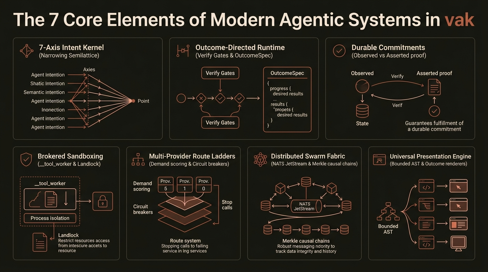
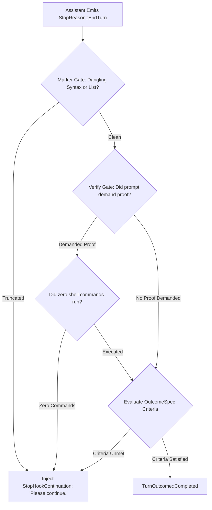
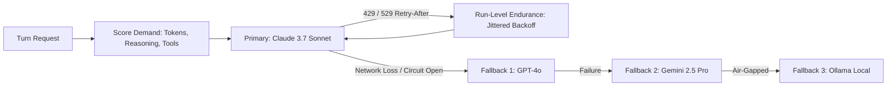

# Deep Dive: The 7 Core Elements of Modern Agentic Systems in vak

> **Document Class:** Systems Engineering Deep Dive & Modern Agentic Architecture Guide  
> **Platform Version:** vak v3.1.0 (Edition 2024 Rust)  
> **Target Audience:** System Architects, AI Researchers, Infrastructure Leads & Technical Evaluators

---

## 1. Executive Overview & The Modern Agentic Paradigm

Early autonomous agents (2023–2024) relied on naive while-loops wrapping foundation model API calls. In production, these "prompt-and-pray" systems routinely failed due to **unverifiable completion, prompt drift, ambient security breaches, and runaway token spending**.

`vak` replaces these brittle heuristics with an industrial, mathematically bounded systems architecture. Rather than treating an LLM as an omniscient black box, `vak` constrains autonomous behavior using **7 foundational modern agentic elements**:


*Figure 1: The 7 foundational pillars of the modern agentic architecture in vak.*

---

## 2. Element 1: The 7-Axis Intent Kernel (`vak-intent`)

Conventional agents infer intent by asking an LLM to generate freeform text or by scanning for hardcoded keywords. This creates non-deterministic control flow and security vulnerabilities. `vak` formalizes intent into an algebraic type system along **seven orthogonal behavioral axes**:

```rust
pub struct Reading {
    pub act: Act,               // converse, answer, locate, analyze, author, modify, operate, verify, orchestrate, govern
    pub horizon: Horizon,       // immediate, turn, session, durable
    pub stakes: Stakes,         // inert, reversible, costly, irreversible
    pub evidence: Evidence,     // none, cited, verified, audited
    pub clarity: Clarity,       // clear, underspecified, ambiguous
    pub modality: Modality,     // text, image, audio, video, screen, data, stream
    pub attendance: Attendance, // interactive, supervised, unattended
    pub confidences: Confidences,
    pub tier: Tier,
}
```

### The Narrowing Meet Semilattice (`Limits::meet`)
A core tenet of `vak` is: **Intent narrows, never widens**. 

The derived [`Engagement`](../../crates/vak-intent/src/engage.rs) holds a [`Limits`](../../crates/vak-intent/src/limits.rs) structure that forms a mathematical **meet semilattice**:

$$\text{Limits}_{\text{effective}} = \text{Limits}_{\text{baseline}} \sqcap \text{Limits}_{\text{intent}}$$

* $\sqcap$ (`meet`): The algebraic intersection operator. It can only reduce active capabilities, shorten route ladders to prefixes, lower token budgets, or elevate approval floors.
* **Absence of Join**: The type `Limits` intentionally does **not implement a `join` method**. It is mathematically impossible for an intent reading to grant permissions, unlock unapproved tools, or bypass human-in-the-loop policies.

### Progressive Capability Disclosure (Capability Slicing)
Rather than advertising every installed tool and MCP server on every turn (which bloats context and causes tool-selection confusion), `vak` uses the `Act` axis to project an exact **capability slice**:
* A reading of `analyze` receives only read-only tools (`read`, `grep`, `glob`).
* A reading of `modify` admits editing capabilities (`edit`, `write`) bounded by workspace paths.
* A reading of `operate` enables effectful execution (`bash`) under sandboxed supervision.

---

## 3. Element 2: Outcome-Directed Runtime & Verify Gates

Most agentic systems judge completion based on an opaque token stop signal ("the model stopped generating text"). Small and mid-sized models routinely stop mid-plan or claim success without doing the work.

`vak` introduces a declarative contract: [`OutcomeSpec`](../../crates/vak-intent/src/outcome.rs).

```rust
pub struct OutcomeSpec {
    pub wanted: String,
    pub preserved: Vec<String>,
    pub completion_criteria: Vec<WorkCriterion>,
    pub uncertainties: Vec<String>,
}
```

### The StopPolicy Verify Gate
Before any turn can conclude with `TurnOutcome::Completed`, [`vak-agent`](../../crates/vak-agent) evaluates the internal [`StopPolicy`](../../crates/vak-agent/src/stop_policy.rs):



1. **Marker Gate:** Detects dangling plan items, trailing colons without headers, or unclosed code blocks indicating truncated generation.
2. **Verify Gate:** If the user's prompt demanded verification ("prove it works", "must pass tests", "verify build") and **zero verification commands were executed**, completion is rejected. The engine appends `[stop-guard]: Verification required but not executed. Please run verification.` and forces the agent to continue.

---

## 4. Element 3: Durable Commitments & Ground-Truth Verification (`vak-commit`)

Conversational chat sessions are ephemeral. When work outlives a single sitting, conversational agents fail because there is no persistent state machine tracking completion. `vak` introduces [`Commitment`](../../crates/vak-commit/src/types.rs):

* **Commitments are the Primary Unit of Identity:** Individual chat sessions are merely ephemeral [`Episode`](../../crates/vak-commit/src/types.rs) runs that advance a durable commitment.
* **The Satisfaction Lattice:**
  
  $$\text{Asserted} < \text{Attested} < \text{Observed}$$
  
  * **`Asserted`:** The LLM claims the work is done (lowest confidence).
  * **`Attested`:** An external entity provides a signed receipt or webhook confirmation.
  * **`Observed`:** The runtime locally witnesses the proof (e.g., `cargo test` exits with code `0`).

* **The Closure Invariant:** A commitment demands a minimum satisfaction level derived from its `evidence` axis. The [`CommitmentLedger`](../../crates/vak-commit/src/ledger.rs) strictly refuses to append a `Fulfilled` verdict unless backed by recorded, machine-verified `Observed` evidence.

---

## 5. Element 4: Out-of-Process Tool Brokering & Sandboxing

Allowing an LLM agent to execute tools in the same process space as the orchestrator is a catastrophic architectural hazard: memory leaks, segfaults in native libraries, or malicious scripts can crash the entire agent daemon.

`vak` isolates all tool operations across an out-of-process broker:

```
┌─────────────────────────────────────────────────────────────────────────────┐
│                           HOST AGENT DAEMON                                 │
│  vak-core  •  vak-agent  •  vak-session  •  PermissionEngine (Policy Gate)   │
└──────────────────────────────────────┬──────────────────────────────────────┘
                                       │ Stdin / Stdout JSON IPC
                                       ▼
┌─────────────────────────────────────────────────────────────────────────────┐
│                    __tool_worker (DISPOSABLE PROCESS GROUP)                 │
│  Linux Landlock LSM Syscall Filter  •  macOS Seatbelt  •  POSIX Process PGID │
├─────────────────────────────────────────────────────────────────────────────┤
│  read  •  write  •  edit  •  grep  •  glob  •  webfetch  •  webbrowse (CDP) │
└─────────────────────────────────────────────────────────────────────────────┘
```

1. **The `__tool_worker` IPC Protocol:** Built-in tools and Bash scripts execute inside a child worker process spawned via standard input/output JSON streams.
2. **Process Group Termination:** Every tool execution runs in its own POSIX process group (`setpgid`). If a command times out or is cancelled, a `killpg` signal wipes out the entire process tree, leaving zero zombie processes.
3. **Linux Landlock & macOS Seatbelt:** Filesystem containment restricts directory traversal at the kernel level without requiring root privileges.
4. **Quarantined Scratch (`.vak/scratch/`):** Generative artifacts and temporary files remain quarantined until explicit user promotion via cryptographically hashed diff manifests (`CandidateManifest`).

---

## 6. Element 5: Multi-Provider Route Ladders & Resilient Epistemics

`vak` rejects hardcoded model lists. Model catalogs are discovered dynamically from provider APIs (`GET /models`) with 5-minute TTL memoization.



* **Informed Transience vs. Hard Circuit Breakers:**
  * Transient rate limits (HTTP 429 with `Retry-After`) feed run-level endurance without tripping the circuit breaker.
  * Hard connection drops, malformed JSON streams, or SSL faults increment the shared `CircuitBreaker`, failing fast to protect operational budgets.
* **Turn-Level Route Ladders:** The ladder is recomputed fresh on every turn based on token demands, reasoning requirements, and live provider health.

---

## 7. Element 6: Distributed Multi-Agent Swarms & Causal Fabric (`vak-bus`)

For multi-agent swarms operating across distributed machines, `crates/vak-bus` provides an enterprise-grade event fabric:

1. **High-Throughput Clustering:** Built on **NATS Core + JetStream** with in-memory fallbacks for local test harnesses.
2. **Zero-Trust Encryption:** Payloads are encrypted end-to-end using **AES-256-GCM** with keys derived per-workspace (`vak_bus::crypto::derive_workspace_key`).
3. **Causal Merkle Hash Chaining:** Every message envelope carries a cryptographic parent hash and W3C distributed trace context:
   
   $$\text{Envelope Hash}_{n} = \text{SHA256}(\text{Payload} \,\|\, \text{Envelope Hash}_{n-1} \,\|\, \text{Timestamp})$$
   
   This guarantees linear event ordering, prevents causal split-brain across distributed subagents, and provides a tamper-evident audit log.
4. **Dead-Letter Queues (DLQ):** Unroutable or failed messages are captured with complete stack traces and diagnostic metadata for post-mortem forensics.

---

## 8. Element 7: Universal Presentation & Loss-Accounting Delivery

Generating Markdown text is easy; delivering rich, interactive results across diverse enterprise surfaces without loss is difficult. `vak` decouples text generation from UI rendering:

1. **Bounded AST Compilation (`vak-presentation`):** Markdown is compiled into a bounded `PresentationDocument` (max 256 nodes, max depth 16, max 32KB text) to prevent DOM-overflow vulnerabilities and UI freeze.
2. **Outcome-First Universal Renderers:**
   * **Diff Inspector:** Side-by-side and unified git diff review with syntax highlighting.
   * **Test Matrix:** Color-coded pass/fail execution trees with drill-down logs.
   * **Crosshair SVG Charts:** Dynamic, responsive vector telemetry charts.
   * **Sortable Data Grids:** Tabular data display with client-side sorting and filtering.
3. **Durable Channel Outbox (`vak-delivery`):** Outbound messages to Slack, Discord, and Telegram are persisted in a local SQLite outbox queue before transmission, guaranteeing zero message loss across network blips.

---

## 9. Architectural Comparison: Traditional Agents vs. vak

| Capability Dimension | Traditional LLM Agent (LangChain / CrewAI / AutoGen) | **vak Sovereign Agent Architecture** |
|---|---|---|
| **Intent Determination** | Unconstrained LLM prompt completion or keyword regex | **7-Axis Reading with Narrowing Meet Semilattice** |
| **Completion Verification** | Model stop token (`StopReason::EndTurn`) | **`StopPolicy` Verify Gates + Ground-Truth Evidence** |
| **Long-Horizon Identity** | Ephemeral chat sessions or external databases | **Durable `Commitment` with `Observed` Satisfaction** |
| **Tool Execution Safety** | In-process Python/Node execution (ambient privileges) | **Out-of-process `__tool_worker` + Landlock/Seatbelt** |
| **Storage Integrity** | Mutable database records or rewritten memory | **Append-Only JSONL Ledgers (Model-Visible = Logged)** |
| **Multi-Provider Routing** | Static hardcoded provider configs | **Dynamic Demand Scoring + Frozen Fallback Ladders** |
| **Distributed Swarms** | Unencrypted HTTP REST webhooks | **NATS JetStream + AES-256-GCM + Merkle Lineage** |
| **Presentation Layer** | Raw Markdown strings dumped into chat | **Closed AST + Outcome-First Universal Renderers** |

---

## 10. Conclusion

By engineering these 7 core elements into a unified systems harness, `vak` transforms autonomous AI from an unpredictable conversational demo into an **auditable, deterministic, enterprise-grade software execution engine**.
