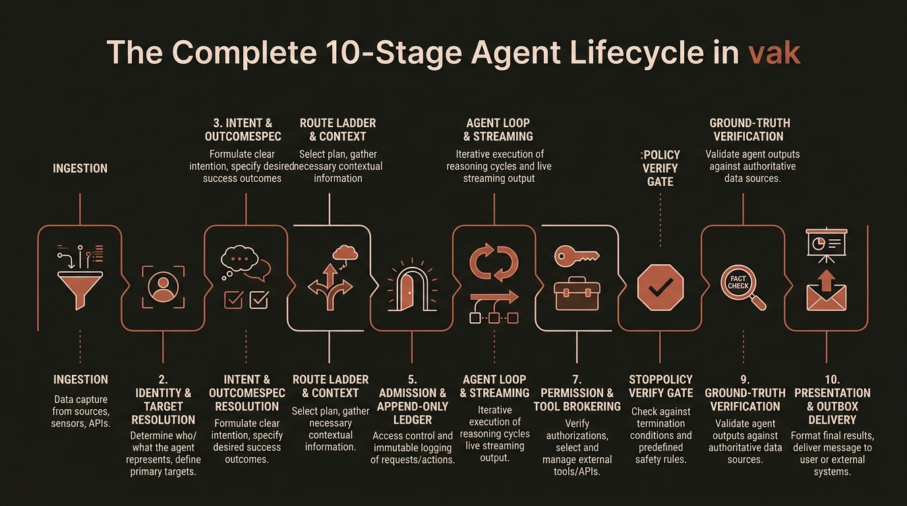
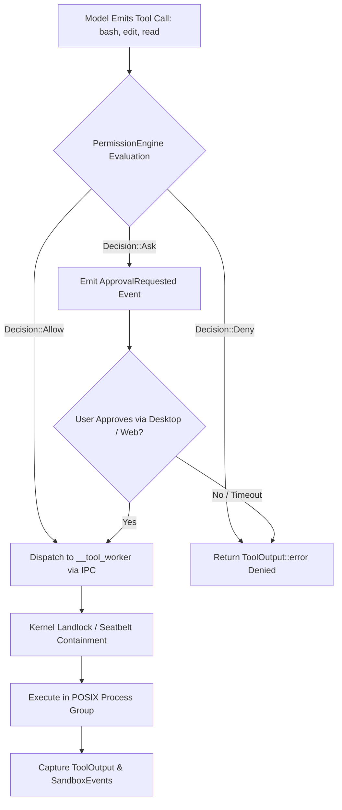
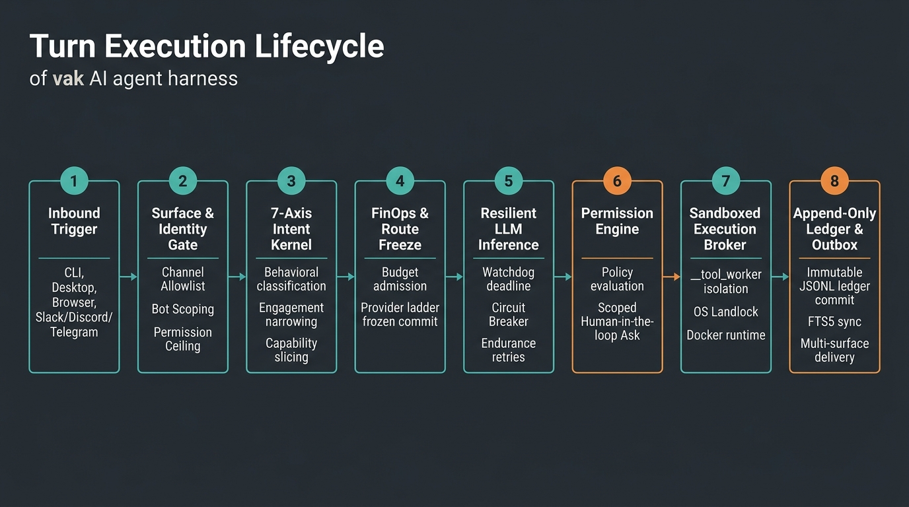

# Engineering Walkthrough: The Complete 10-Stage Agent Lifecycle

> **Document Class:** Runtime Architecture & Execution Lifecycle Specification  
> **Platform Version:** vak v3.0.99 (Edition 2024 Rust)  
> **Target Audience:** Systems Engineers, AI Infrastructure Leads, Core Runtime Developers & Security Auditors

---

## 1. Executive Summary & Lifecycle Philosophy

In many agent frameworks, an execution turn is an untracked, monolithic function that feeds text to an LLM and imperatively executes whatever tools the model returns. This creates **silent security escalations, non-reconstructable audit trails, and uncontrollable token spending**.

In `vak`, an agent turn is a **deterministic, 10-stage state machine** governed by formal contracts at every transition point. No model is called without an immutable ledger entry; no tool executes without out-of-process isolation; and no task concludes without ground-truth verification:


*Figure 1: The complete 10-stage execution pipeline of the vak agentic runtime.*

---

## 2. Comprehensive 10-Stage Execution Breakdown

```
[1. Ingestion] ──> [2. Identity & Target] ──> [3. Intent & OutcomeSpec]
                                                          │
                                                          ▼
[6. Agent Loop] <── [5. Admission & Ledger] <── [4. Route Ladder & Context]
       │
       ▼
[7. Permission & Broker] ──> [8. StopPolicy Gate] ──> [9. Ground-Truth Verify]
                                                              │
                                                              ▼
                                                   [10. Delivery & Outbox]
```

---

### Stage 1: Inbound Request Ingestion & Normalization

1. **Multi-Surface Ingestion:** Requests arrive from one of several surfaces:
   - CLI arguments via [`vak exec`](../../crates/vak/src/main.rs).
   - Local IPC from the Tauri desktop app ([`crates/vak-desktop`](../../crates/vak-desktop)).
   - HTTP/SSE POST requests to the [`vak-server`](../../crates/vak-server) `/chat` endpoint.
   - Channel webhooks (Telegram, Slack, Discord).
2. **Sanitization into `InboundRequest`:** Inbound channel bridges construct a typed [`InboundRequest`](../../crates/vak-server/src/gateway.rs). Placeholders or empty sender/chat IDs are rejected immediately to prevent identity spoofing.
3. **Host-Owned Normalization:** Before the request touches internal state, an [`InputNormalizer`](../../crates/vak-agent/src/lib.rs#L97) cleans text, scrubs prompt-scaffolding artifacts, and parses file attachments.

---

### Stage 2: Identity, Transport & Audience Resolution

```
Inbound Payload
   │
   ▼
Bot (Transport Credential)
   │
   ▼
EndpointAccess (Address Trust & Channel Allowlist)
   │
   ▼
AgentDefinition (Personality, Policy Ceiling, Scoped Memory)
   │
   ▼
ConversationKey(workspace_id, agent_id, audience_id, conversation_id)
```

1. **Bot vs. Agent Decoupling:** In `vak`, a `Bot` is merely a transport credential (e.g., a Telegram bot token). An `Agent` is a persistent specialist owning memory and policy. Multiple bots can route to one Agent, or one bot can route to multiple Agents depending on the conversation.
2. **Channel Allowlist Verification:** Remote chats are validated against `<sessions_home>/gateway/allowlist.json`. Unknown chats are placed into a reviewable `pending` state; denied chats fail closed.
3. **Minting the `ConversationKey`:** Every conversation resolves to an immutable 4-part key:
   
   $$\text{ConversationKey}(\text{workspace\_id}, \text{agent\_id}, \text{audience\_id}, \text{conversation\_id})$$
   
   This guarantees cryptographic multi-tenant isolation inside the shared [`CorePool`](../../crates/vak-core/src/lib.rs).

---

### Stage 3: Pre-Dispatch Intent & Outcome Resolution (`vak-intent`)

1. **The 7-Axis Reading:** Inferred across 7 orthogonal dimensions (`Act`, `Horizon`, `Stakes`, `Evidence`, `Clarity`, `Modality`, `Attendance`) using a fast cascade (Tier 0 flags $\to$ Tier 1 lexical/workspace signals $\to$ Tier 2 local Ollama).
2. **The Narrowing Meet Semilattice:** The system intersects the workspace baseline authority with the intent reading:
   
   $$\text{Limits}_{\text{effective}} = \text{Limits}_{\text{baseline}} \sqcap \text{Limits}_{\text{intent}}$$
   
   Intent can **only restrict** capabilities, budget, and route ladders—it cannot widen permissions.
3. **Formulating the `OutcomeSpec`:** Defines what is wanted, what files must be preserved, what criteria establish success, and what uncertainties remain.
4. **Progressive Capability Slicing:** Only tools admitted by the `Act` axis are exposed to the model context, keeping the context window small and preventing hallucinated tool calls.

---

### Stage 4: Dynamic Route Ladder Assembly & Context Projection

1. **Demand-Driven Routing (`Core::plan_route_ladder`):** The turn's route ladder is dynamically scored based on estimated input tokens, structured output requirements, reasoning needs, and live provider health.
2. **Strict Context Derivation (`SessionLog::derive_messages`):** Context is not synthesized on the fly; it is projected strictly from the immutable JSONL history. **Model-Visible Means Logged**: if an entry is not in the ledger, the model cannot see it.
3. **System Prompt Layering:** Prompts are composed in strict vertical layers:
   
   $$\text{System Prompt} = \text{Core Guardrails} + \text{Workspace Config} + \text{Agent Persona} + \text{USER.md Profile}$$

---

### Stage 5: Admission & Immutable Session Ledger Recording

1. **Frozen Contract Snapshot:** The session header freezes the admitted configuration: active tools, route ladder, spending ceiling, and initial capabilities snapshot.
2. **Append-Only Commit:** The user's input message and the admitted contract are appended to `<sessions_home>/<session_id>.jsonl`.
3. **Zero In-Memory Drift:** If the daemon crashes or the host loses power at this exact millisecond, the entire session state is 100% reconstructable upon reboot.

---

### Stage 6: Autonomous Execution Loop & Live Streaming (`vak-agent`)

1. **Streaming Provider Dispatch:** [`vak-llm`](../../crates/vak-llm) establishes a streaming connection with the selected provider (e.g., Claude 3.7 Sonnet).
2. **Delta and Snapshot Events:** Streams emit real-time [`AgentEvent::Stream`](../../crates/vak-agent/src/lib.rs#L160) packets containing both the immediate text delta and the accumulated snapshot, allowing consumers (desktop, web, TUI) to render without local re-derivation.
3. **Spend Gate & Circuit Breakers:**
   - Token expenditure is tracked against the session spend ceiling.
   - HTTP 429/529 errors with `Retry-After` trigger run-level endurance with jittered exponential backoff.
   - Hard network drops increment the shared `CircuitBreaker`, failing fast to preserve API budget.

---

### Stage 7: Permission Gate & Brokered Tool Execution

When the model emits one or more tool calls:



1. **Pure Permission Evaluation:** [`PermissionEngine`](../../crates/vak-permission/src/engine.rs) evaluates `(tool, args, mode)`. In `WorkspaceWrite` mode, writes outside the workspace root are denied.
2. **Human-in-the-Loop Approvals:** Calls requiring confirmation emit `ApprovalRequested` and pause until answered via desktop prompt or admin console.
3. **The `__tool_worker` Protocol:** Approved tools execute outside the host daemon in a dedicated child worker process group (`setpgid`).
4. **Kernel Containment:** Filesystem access is strictly restricted by Linux Landlock LSM syscall filters and macOS Seatbelt profiles.

---

### Stage 8: Tool Result Integration, Error Classification & StopPolicy

1. **Machine-Classified Errors (`ToolErrorKind`):**
   - Tool outputs are classified into `Correctable`, `Transient`, `Auth`, `Denied`, or `Cancelled`.
   - Correctable errors (e.g., invalid arguments) provide an actionable hint to the LLM for self-repair.
2. **Append to Ledger:** Tool results are appended to the session ledger as user `ToolResult` blocks.
3. **The `StopPolicy` Gate:** When the model attempts to finish (`StopReason::EndTurn`):
   - **Marker Gate:** Verifies text is not truncated (no dangling plan markers, open code blocks, or trailing colons).
   - **Verify Gate:** If the initial prompt required test execution or compilation proof and **zero shell commands ran**, completion is denied. A continuation directive (`[stop-guard]`) is appended and the agent continues.

---

### Stage 9: Post-Turn Verification & Ground-Truth Commitment Upkeep

1. **Durable Commitment Review (`vak-commit`):** If the turn belongs to a long-horizon commitment, the runtime evaluates criteria against the real world.
2. **Satisfaction Strength Evaluation:**
   - LLM self-congratulation ("I have successfully fixed the bug") is classified as **`Asserted`** (lowest strength).
   - A shell execution running `cargo test` returning exit code `0` is classified as **`Observed`** (highest strength).
3. **Closure Invariant Enforcement:** The [`CommitmentLedger`](../../crates/vak-commit/src/ledger.rs) strictly refuses to append a `Fulfilled` verdict unless all required criteria meet their demanded satisfaction strength with recorded evidence receipts.

---

### Stage 10: Presentation AST Compilation & Channel Outbox Delivery

```
Assistant Output (Markdown)
   │
   ▼
PresentationDocument (Bounded Closed AST: max 256 nodes, depth 16)
   │
   ▼
Outcome-First Universal Renderers (Diffs, Test Matrices, SVG Charts)
   │
   ▼
AdapterRegistry (Slack Blocks, Discord Embeds, Telegram HTML, SSE)
   │
   ▼
SQLite-Backed Durable Outbox (Exponential Retry on Network Partitions)
```

1. **Bounded AST Compilation (`vak-presentation`):** Markdown is compiled into a strictly bounded AST (`PresentationDocument`) to prevent client-side DOM-overflow vulnerabilities.
2. **Outcome-First Rendering:** The SolidJS canvas renders rich specialized components: interactive git diffs, test matrices, and crosshair SVG telemetry charts.
3. **Durable Outbox Persistence (`vak-delivery`):** Outbound packets to remote chat channels (Slack, Discord, Telegram) are committed to an on-disk SQLite outbox before network transmission. If an outbound webhook fails, the outbox worker retries with exponential backoff, ensuring **zero message loss**.

---

## 3. Visual Turn Pipeline Architecture


*Figure 2: Detailed state transitions during an active turn execution cycle.*

By strictly enforcing these 10 stages, `vak` guarantees that every agent action is **authorized before dispatch, isolated during execution, verified against reality, and immutably recorded for auditability**.
