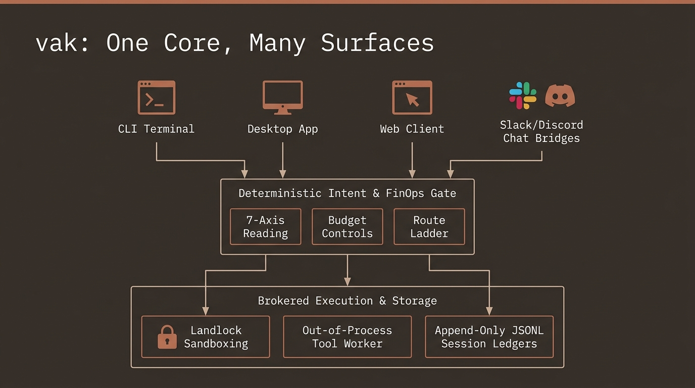

# vak: Technical & Investment Briefing Portal

> **Document Class:** Technical Architecture Whitepaper & Strategic Investment Memorandum  
> **Platform Version:** vak v3.0.99 (Enterprise & Sovereign Agent Harness)  
> **Target Audiences:** 
> 1. **Technical Community:** System Architects, AI/Security Engineers, Distributed Systems Researchers, and Open-Source Contributors.  
> 2. **Institutional & Strategic Investors:** Venture Capitalists, Corporate Venture Arms, Enterprise CTOs, and Infrastructure Strategists.

---

## Executive Overview

The generative AI sector has undergone a profound structural shift. Foundation models have evolved from novel conversational interfaces into high-capability, tool-executing software engines. However, as enterprises attempt to transition from exploratory prototypes to production deployments, they face an industry-wide blocker: **"The Harness Problem"**.

Most current agent frameworks (built on high-level, interpreted runtimes like Python or TypeScript) suffer from fundamental architectural flaws:
* **Fragile Execution:** Agent completion is governed by unfalsifiable signals ("the LLM stopped generating text") rather than real-world proof.
* **Ambient Security Exposure:** Subprocesses inherit host environments, leaking enterprise secrets and exposing filesystems without kernel containment.
* **Non-Reconstructable Audits:** Session histories are rewritten, compacted destructively, or stored in ephemeral memory, rendering compliance verification impossible.
* **Surface Fragmentation:** Inconsistent behavior and divergent security rules between CLI tools, desktop IDEs, and team chat channels.

*Figure 1: The "One Core, Many Surfaces" architectural model of vak.*

**vak** resolves this crisis with a unified, high-performance systems harness written in **safe Rust (2024 Edition)**. Operating under the guiding thesis of **"One Core, Many Surfaces"**, vak provides Codex-grade safety, pi-grade transparency, Claude Code-grade extensibility, and opencode-grade simplicity across all execution modalities.

---

## Strategic Briefing Directory

To serve the distinct evaluation criteria of our technical peers and investment partners, this documentation suite is partitioned into three focused volumes:

### 1. [The Investor Thesis & Market Opportunity](01-investor-thesis.md)
*For Institutional Investors, Venture Partners, and Strategic Acquirers.*
* **The Macro Shift:** Why the foundation model commoditization cycle shifts market value directly into the harness and orchestration layer.
* **Market Positioning Matrix:** Detailed competitive quadrant analysis comparing vak against LangGraph, CrewAI, Claude Code, Cursor, and OpenHands.
* **The Five Defensible Moats:** Structural defensibility rooted in systems architecture, immutable ledgers, and zero-trust FinOps.
* **Total Addressable Market (TAM) & Unit Economics:** Cost efficiency of zero-overhead Rust runtimes vs. bloated cloud-hosted Python frameworks.
* **Commercialization & Enterprise Trajectory:** Dual-track licensing, air-gapped sovereign appliances, and managed enterprise gateway tiers.

### 2. [Technical Deep Dive & Systems Architecture](02-technical-deep-dive.md)
*For Systems Engineers, Core Architects, AI Researchers, and Security Specialists.*
* **Workspace Anatomy:** The 28-crate modular hierarchy organized across 7 functional layers.
* **The 7-Axis Intent Kernel:** Algebraic meet semilattices (`Limits::meet`) guaranteeing that intent inference can only narrow authority, never widen permissions.
* **Outcome-Directed Runtime & Verify Gates:** Formal `OutcomeSpec` contracts and `StopPolicy` verify gates eliminating hallucinated completions.
* **Durable Commitments (`vak-commit`):** Evaluating completion against ground-truth world state (`Observed` evidence) rather than model self-assertion.
* **Brokered Execution Protocol (`__tool_worker`):** Out-of-process tool isolation, Linux Landlock syscall filtering, macOS Seatbelt, and quarantined scratch spaces.
* **Distributed Swarm Fabric (`vak-bus`):** NATS Core + JetStream, AES-256-GCM envelope encryption, and Merkle causal lineage.

### 3. [Enterprise Governance, Security & Compliance](03-enterprise-governance.md)
*For Enterprise CISOs, Compliance Officers, and Platform Engineering Leadership.*
* **Hermetic Binary Deliveries:** Eliminating runtime supply-chain attacks (zero `pip`/`npm` dependencies in production).
* **SOC 2 & FedRAMP Audit Readiness:** Fully reconstructable agent sessions via append-only JSONL ledgers and `derive_messages()`.
* **Multi-Tenant CorePool Architecture:** Workspace isolation, cryptographic tenant scoping, and channel endpoint authorization.
* **High-Availability Operations:** Systemd/LaunchAgent daemonization, self-healing health probes, and persistent outbox delivery queues.

### 4. [System Architecture & 28-Crate Taxonomy](04-system-architecture-and-crate-taxonomy.md)
*For System Architects, Core Engineers, and Open-Source Contributors.*
* **7-Layer Modular Stack:** From Layer 7 Surfaces down to Layer 1 Persistence and Bus foundations.
* **Exhaustive 28-Crate Directory:** Detailed role, key Rust types, and safety invariants for every crate in the workspace.
* **Compile-Time Inversion of Control:** How trait injection keeps the agent loop generic, minimal, and fully testable without network mocks.

### 5. [Deep Dive: 7 Core Modern Agentic System Elements](05-modern-agentic-system-elements.md)
*For AI Researchers, Systems Leads, and Technical Evaluators.*
* **The 7 Core Modern Agentic Elements:** 7-Axis Intent Kernel, Outcome-Directed Runtime, Durable Commitments, Out-of-Process Brokering, Multi-Provider Route Ladders, Distributed Swarm Fabric, and Universal Presentation Engine.
* **Algebraic Narrowing & Verification:** Deep dive into `Limits::meet` semilattices, `StopPolicy` verify gates, and satisfaction lattices.
* **Architectural Matrix:** Comparative analysis against traditional LLM agent frameworks (LangChain, CrewAI, AutoGen).

### 6. [The Complete 10-Stage Agent Lifecycle](06-complete-agent-lifecycle.md)
*For Systems Engineers, Runtime Developers, and Compliance Auditors.*
* **10-Stage End-to-End Walkthrough:** Ingestion, Identity Resolution, Intent & OutcomeSpec, Dynamic Route Ladder, Admission & Append-Only Ledger, Agent Loop, Permission & Brokering, StopPolicy Gate, Ground-Truth Verification, and Outbox Delivery.
* **State Transition Invariants:** Process group isolation via `__tool_worker`, Landlock LSM containment, and cryptographic `derive_messages()` context projection.

---

## Visual Architecture Overview

*Figure 1: The strict 5-tier dependency stack of vak, from L0 core systems foundations to L4 multi-surface presentation.*

---

## Contact & Governance

* **Source Repository:** `nranjan2code/code` (Private Enterprise Monorepo)
* **License:** MIT Core with Enterprise Commercial Extensions
* **Core Maintainers:** Antigravity AI Systems Architecture Group
