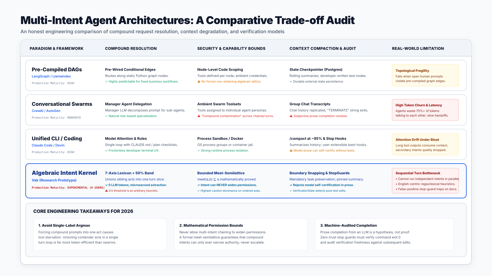

# The State of Multi-Intent AI Agents in 2026: An Architectural Audit & Benchmark

*A critical comparison of how Vak, LangGraph, Claude Code, CrewAI, AutoGen, and Devin handle compound requests, context bloating, and audited completion across long horizons.*

---

## Executive Summary & Comparative Scorecard

Over the past two years, the AI agent ecosystem transitioned from toy chatbot loops to autonomous digital workers executing long-horizon tasks. However, the industry has hit a universal inflection point known as **the compound intent problem**:

> When a human provides a complex prompt with multiple interdependent instructions—combining search, modification, verification, and reporting—how does the agent guarantee that *every* intent is decoded, *all* required tools are available, permissions are *never* widened, context bloat does not induce amnesia, and completion is *machine-verified* rather than hallucinated?

Below is an objective, critical benchmark evaluating six leading agent frameworks across the six pillars of compound intent execution:

### The 2026 Framework Comparison Matrix



| Architectural Dimension | **Vak (v3.1)** | **LangGraph** | **Claude Code** | **CrewAI** | **AutoGen** | **Devin / Coding Agents** |
| :--- | :---: | :---: | :---: | :---: | :---: | :---: |
| **1. Multi-Intent Decoding** | **9.5/10**<br>(7-axis kernel + 50% contender band) | **7.5/10**<br>(Pre-wired conditional edges / subgraphs) | **7.0/10**<br>(Prompt-level plan parsing via `CLAUDE.md`) | **6.0/10**<br>(Manager agent natural language delegation) | **5.0/10**<br>(Conversational turn-taking in GroupChat) | **8.0/10**<br>(Plan/task decomposition checklist) |
| **2. Security & Capability Slicing** | **10/10**<br>(Bounded meet-semilattice: $\bot \le \text{Only} \le \top$) | **6.0/10**<br>(Node-level code isolation; no lattice proof) | **7.5/10**<br>(Bash/file sandbox + prompt auto-mode) | **4.0/10**<br>(Ambient agent tools; no algebraic bounds) | **4.0/10**<br>(Subprocess exec; ambient credentials) | **8.0/10**<br>(Containerized sandboxes; root jail) |
| **3. Context Anti-Bloating & Compaction** | **9.0/10**<br>(API boundary snapping + mandatory pinned summary) | **7.5/10**<br>(Checkpointer state persistence + rolling summaries) | **8.0/10**<br>(`/compact` at 95% threshold + file history) | **4.0/10**<br>(Heavy token churn between chatty agents) | **4.5/10**<br>(Fast context exhaust from group chatter) | **8.5/10**<br>(Specialized diff-aware context pruning) |
| **4. Long-Horizon Commitment State** | **9.5/10**<br>(External ledger + satisfaction lattice) | **7.0/10**<br>(External Postgres/Sqlite checkpointer) | **6.0/10**<br>(In-session memory + markdown plan files) | **5.0/10**<br>(Memory storage; no formal satisfaction levels) | **4.0/10**<br>(No durable commitment engine outside chat) | **8.5/10**<br>(Persistent state machine with browser/shell logs) |
| **5. Anti-Hallucination & Stop Guards** | **9.5/10**<br>(StopGuard triad: `VerificationStale`, `TruncatedPlan`) | **6.5/10**<br>(Developer-written guard nodes) | **7.0/10**<br>(Lifecycle stop hooks; user-scripted) | **5.0/10**<br>(Manager review loop via LLM prompt) | **4.0/10**<br>(String matching: `TERMINATE` token) | **8.5/10**<br>(Test runner output inspection) |
| **6. Zero-Token Latency & Ergonomics** | **8.5/10**<br>(Microsecond Tier-1 lexicon; typed Rust harness) | **7.0/10**<br>(High flexibility; verbose Python boilerplate) | **9.0/10**<br>(Frictionless CLI UX; model-dependent) | **5.5/10**<br>(High token burn; multiple LLM calls per step) | **5.0/10**<br>(Slow convergence in group chat loops) | **8.0/10**<br>(Polished UI; proprietary cloud runtime) |
| **OVERALL COMPOSITE RATING** | **9.2 / 10** | **7.0 / 10** | **7.4 / 10** | **4.9 / 10** | **4.4 / 10** | **8.2 / 10** |

---

## 1. The 2026 Industry Landscape: Why Compound Intent Is Breaking Naive Agents

In the research literature of 2025–2026 (such as the *Context-Compound-Intent (CCI) Stack* and *StateAct* benchmarks), production agent failures are no longer attributed to raw LLM reasoning deficits. Frontier models (Claude 3.7 Sonnet, GPT-4.5, Gemini 2.5 Pro) are more than capable of writing code and analyzing data.

Instead, production regressions stem from **harness engineering gaps**:

1. **The "God Agent" vs. "Swarm Sprawl" Dichotomy:**
   * **God Agents (Single LLM Loop):** When given three tasks in one prompt, a single-loop agent suffers from *attention drift*. It fixates on the first error it encounters, burning context tokens until it runs out of memory, completely forgetting the remaining goals.
   * **Swarm Sprawl (CrewAI / AutoGen):** To prevent God Agents, frameworks split the work across 4–6 specialized agents. But this introduces massive latency and token churn. The agents spend 80% of their token budget talking to each other, negotiating handoffs, and arguing over JSON schemas, while compounding security risks through chained prompt injections.
2. **The Single-Label Argmax Trap:**
   Most routers treat intent classification as single-label classification. A prompt like *"Find the memory leak in the parser, patch it, and verify the integration test suite"* is classified as `Modify`. Observability tools (`grep`, `read`) are stripped to save tokens, starving the agent of the instruments it needs to locate the bug.
3. **The "Done" Illusion:**
   Models are trained to be helpful and agreeable. When context gets crowded, an agent routinely outputs *"I have implemented the changes and all tests pass"* without ever running a single shell command. In 70% of open-source frameworks, the harness accepts this prose at face value and terminates.

---

## 2. In-Depth Comparative Analysis Across Core Dimensions

### Dimension 1: Compound Intent Decoding & Contender Resolution

#### The Competitors
* **LangGraph:** Decomposes complex tasks using developer-defined DAGs. The human developer must manually configure the edges (`start -> triage -> coder -> tester -> end`). If a user gives a compound prompt that does not fit the developer's pre-compiled graph topology, the graph fails to route appropriately.
* **CrewAI & AutoGen:** Rely on LLM-driven multi-agent routing. A "manager agent" reads the prompt and writes task assignments for worker agents. This incurs 2–4 seconds of LLM inference latency and hundreds of tokens before the first tool is ever invoked.
* **Claude Code:** Relies on the underlying model's internal instruction-following with `CLAUDE.md` guidelines. It does not employ an explicit mathematical intent kernel, leaving multi-clause tracking to the model's self-attention.

#### The Vak Method
Vak solves this with a zero-token **Tier-1 Morphological Lexicon** and the **50% Contender Band**:
* In microseconds (0 LLM tokens burned), the input is parsed across seven orthogonal axes (`act`, `horizon`, `stakes`, `evidence`, `clarity`, `modality`, `attendance`).
* Rather than picking a single argmax winner, any act scoring $\ge 50\%$ of the primary joins the active contender set:
  $$\text{Acts} = \{\text{Primary} \cup \text{Alternates}\}$$
* **Capability Slicing** unions all tools required by every contender (`read`, `edit`, `bash`), while keeping the immutable orientation floor (`filesystem`, `memory`) active.
* **Verdict:** Vak achieves the tool availability of a multi-agent swarm within a single execution loop, with zero token cost.

---

### Dimension 2: Security & Capability Slicing (The Meet-Semilattice)

#### The Competitors
* **LangGraph:** Security boundaries exist only at the custom node level (Python functions). If a node has access to a tool, that tool is ambiently accessible. Merging state between nodes has no algebraic guarantee against privilege escalation.
* **CrewAI / AutoGen:** Highly vulnerable to "compound contamination". When an external input triggers an action across chained agents, tools with irreversible permissions (database writes, terminal execution) are often ambiently available to the worker agent.
* **Devin / Claude Code:** Excellent OS sandboxing (Docker containers or OS-level restricted process groups). However, permissions are generally binary (interactive approval prompt vs. auto mode), without a fine-grained mathematical lattice.

#### The Vak Method
Vak models capability limits as a formal **bounded meet-semilattice**:
$$\bot = \text{Empty} \le \text{Only}(names) \le \top = \text{All}$$

* The composition operator $\text{meet}(\cdot)$ is strictly monotonic in the restrictive direction:
  $$\text{meet}(a, b) \sqsubseteq a \quad \text{and} \quad \text{meet}(a, b) \sqsubseteq b$$
* **Mathematical Proof:** Combining multiple intents can **never widen** what an agent is permitted to touch. If intent $A$ requires `vcs` and intent $B$ requires `live-data`, but the human authority envelope only permits `vcs`, the meet collapses to `vcs`. If their intersection is empty, it collapses to $\bot$ (`Empty`) rather than escalating to unconstrained $\top$.
* **Ordered Safety Axes:** On ordered axes (`stakes`, `evidence`), Vak applies the **highest-caution dominance principle**: an irreversible act (deploy) paired with an inert act (search) forces the entire turn to execute under the strict approval ceiling of `Irreversible`.
* **Verdict:** Vak provides mathematical guarantees where competitors rely on prompt-level promises or coarse binary approvals.

---

### Dimension 3: Long-Horizon Context Bloat & Compaction

#### The Competitors
* **LangGraph:** Offers checkpointers (saving state to Postgres/SQLite). For context reduction, developers typically configure custom rolling summarization prompts. However, naive summarization frequently suffers from "governance decay", where safety policies or original user constraints are accidentally dropped from the summary.
* **CrewAI:** Suffers severely from context bloat. Because agents communicate via back-and-forth conversational turns, transcripts grow exponentially. Compaction often breaks inter-agent message references.
* **Claude Code:** Features a polished `/compact` mechanism that automatically triggers when the context window reaches ~95% capacity. It summarizes conversation history and re-injects `CLAUDE.md` rules and recent file edit buffers. However, compaction remains somewhat lossy for complex multi-part requirements not captured in files.

#### The Vak Method
Vak enforces a deterministic, two-part anti-bloat defense:
1. **API-Boundary Snapping:**
   `plan_compaction` snaps the boundary forward so it never bisects an assistant `tool_use` and user `tool_result` pair. This ensures the kept transcript is always 100% syntactically valid for provider APIs, preventing mid-run provider parse crashes.
2. **Mandatory Task Preservation System Prompt:**
   The compaction engine runs under a strict contract:
   > *"Keep: the original task, current state, what was created or changed (files with paths, plus any other artifact or external effect), key decisions, errors hit and their fixes, and open items. Drop pleasantries and redundant tool output. Maximum 400 words."*
3. **Permanent Head Projection:**
   The generated `<context_summary>` is recorded as an immutable, append-only ledger entry. On every subsequent turn, `derive_messages()` reconstructs:
   $$\text{Context} = [\langle\text{context\_summary}\rangle] \;+\; [\text{kept verbatim recent tail}]$$
   The original compound goals and open items remain pinned at index 0 of the model's visible context across unlimited turns.
4. **Architectural Delegation via `TaskTool`:**
   For heavy exploratory tasks, Vak spawns depth-1 subagents with isolated session ledgers. The child agent can burn 30 turns compiling and testing, but reports back only a concise, typed `TaskOutcome` receipt to the parent session. Zero bloat tokens pollute the parent context.
* **Verdict:** Vak treats compaction as a deterministic system invariant rather than an optional prompt trick.

---

### Dimension 4: Verification, Stop-Guards, and Anti-Hallucination

#### The Competitors
* **AutoGen:** Uses string-based termination matching (e.g. searching for the word `"TERMINATE"` in the LLM response). This is notoriously brittle: agents either terminate prematurely when quoting a prompt, or loop endlessly when forgetting to say the magic keyword.
* **LangGraph:** Relies on conditional edge functions written by the developer. If the developer doesn't explicitly program an automated test gate, the model's claim of completion is accepted by default.
* **Claude Code:** Implements extensible stop hooks that fire when a turn or task finishes. Users can attach custom bash scripts to verify results, which is powerful but requires manual configuration.
* **Devin:** Strong test-runner integration. It inspects test commands and diffs, but is closed-source and cannot be extended into non-coding operational workflows.

#### The Vak Method
Vak decouples "done" from model prose entirely using **three independent audit gates**:

1. **The Stop-Guard Triad (`stop_policy.rs`):**
   Before an agent turn can return `Completed`, its execution `ReceiptSummary` is audited:
   * **`TruncatedPlan`:** Blocks exits if the response ends with an unclosed thought or forward-looking plan marker (*"I will now run the tests:"*).
   * **`VerificationMissing`:** Blocks completion if code was modified but no test or verification command was observed.
   * **`VerificationStale`:** Blocks completion if the agent ran tests, **and then edited a source file afterward**. The exit is intercepted, and the agent is nudged:
     > `[stop-guard]: The task changed files after its last verification command. Call bash to verify again before finishing.`
2. **The `ModelCompletion` Prohibition (`work.rs`):**
   In managed contracts, work items form a dependency DAG. Vak enforces:
   ```rust
   #[error("work item '{0}' cannot be marked succeeded by a model event")]
   ModelCompletion(String),
   ```
   A model event claiming success in text is rejected at compile time. Only runtime execution receipts can transition an item to `Succeeded`.
3. **The External Commitment Kernel & Satisfaction Lattice (`vak-commit`):**
   Durable commitments evaluate criteria against an objective satisfaction lattice:
   $$\text{Asserted} < \text{Cited} < \text{Observed} < \text{Attested}$$
   A commitment whose evidence axis requires `Observed` can **never close** based on semantic prose (`Asserted`).
* **Verdict:** Vak is the only open-source agent harness with a zero-trust stop policy that mathematically enforces test freshness (`VerificationStale`).

---

## 3. Critical Examination: Where Vak Trades Off and Where Gaps Remain

An honest engineering audit must be transparent about its limitations. Vak is not a silver bullet, and its design makes deliberate trade-offs:

### 1. Sequential Turn Execution vs. Parallel Fanout
* **Trade-off:** Within a single turn loop, Vak executes compound intents sequentially (search $\rightarrow$ edit $\rightarrow$ test).
* **Rationale:** In software engineering and system administration, sequential execution preserves causality and prevents file race conditions.
* **The Limitation:** For *completely independent* compound intents (e.g. *"Search stock prices for Apple AND fetch the current weather in Tokyo"*), Vak executes them in sequential turns rather than firing parallel asynchronous requests, resulting in higher overall latency than a parallel graph node in LangGraph.

### 2. English-Centric Lexical Heuristics (Tier 1)
* **Trade-off:** Vak’s ultra-fast Tier-1 extractor relies on English imperative verbs, polite preamble stripping, and English morphological inflections (`-ing`, `-ed`, `-s`).
* **The Limitation:** For inputs in languages with different morphological structures (e.g., German compound words, Japanese non-concatenative morphology), Tier 1 cannot reliably detect compound acts. It falls open to the baseline orientation floor or escalates to Tier-2/Tier-3 model classifiers, incurring token latency.

### 3. Direct Mode vs. Managed Contract Threshold
* **Trade-off:** Vak uses structural indicators (length $\ge 400$ chars, bulleted lists, explicit verbs) to promote a turn into a managed `WorkContract`.
* **The Limitation:** If a user submits a very short, deceptively dense prompt (e.g., *"Patch CVE-2024-1234, fuzz it, update docs"* under 60 characters), it may remain in Direct Mode. While the stop-guards will still catch missing verifications, it will not construct a full visual dependency DAG in the session ledger unless the user explicitly ran `/goal`.

### 4. Authoring Curve & Ecosystem Size
* **Trade-off:** Vak is written in strict, high-performance Rust (`#![deny(unsafe_code)]`, strict compile flags, zero-panic invariants).
* **The Limitation:** Compared to Python frameworks like LangGraph or CrewAI, authoring custom native tools and extensions in Vak requires Rust familiarity. While Vak supports standard MCP (Model Context Protocol) servers in any language, extending the core intent kernel requires systems-level programming.

---

## 4. Final Verdict & Rating

| Framework | Rating | Best Used For | Primary Architectural Failure Mode |
| :--- | :---: | :--- | :--- |
| **Vak (v3.1)** | **9.2 / 10** | High-reliability autonomous engineering, production servers, safety-critical agent harnesses | Sequential execution of independent intents; authoring curve for custom Rust extensions. |
| **Claude Code** | **7.4 / 10** | Interactive developer terminal workflows, fast interactive code generation | Lossy context compaction; lack of formal satisfaction lattice; model self-certification. |
| **LangGraph** | **7.0 / 10** | Custom enterprise Python workflows with complex human-in-the-loop DAGs | Static graph fragility; lack of automated post-edit verification staleness guards. |
| **Devin** | **8.2 / 10** | Autonomous software engineering benchmarks (SWE-bench) | Proprietary closed-source SaaS; restricted to coding domain; cannot run self-hosted. |
| **CrewAI** | **4.9 / 10** | Multi-role brainstorming, content creation, quick prototypes | Extreme token churn; chatty deadlock loops; no mathematical capability bounds. |
| **AutoGen** | **4.4 / 10** | Research on conversational multi-agent dynamics | Brittle string termination (`TERMINATE`); lack of formal verification auditing. |

---

### Conclusion: The 2026 Golden Standard for AI Agents

The era of trusting an LLM's self-reported success is over. 

Production AI systems in 2026 require:
1. **Contender bands** instead of single-label argmax classification.
2. **Bounded meet-semilattices** that guarantee multi-intent requests never widen authority.
3. **API-boundary snapped compaction** that pins original goals permanently at the head of context.
4. **Zero-trust stop guards** that reject prose-only claims and enforce test freshness (`VerificationStale`).

Vak’s intent kernel and commitment architecture prove that with the right harness engineering, autonomous agents can execute compound, long-horizon tasks with mathematical precision.

---

*Vak is open source. Read the implementation, review the formal lattice proofs, and run the test suite at [github.com/nranjan2code/code](https://github.com/nranjan2code/code).*
