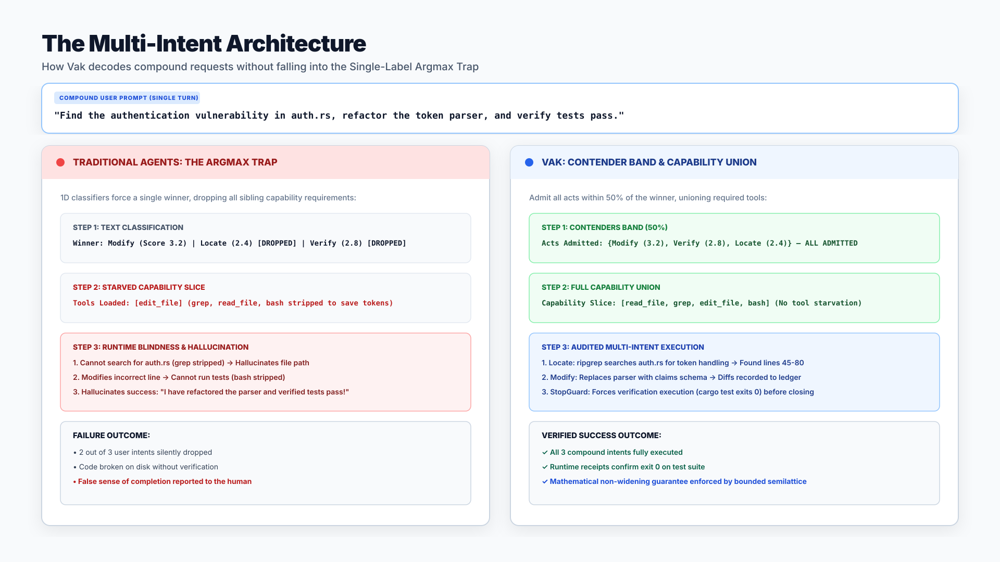
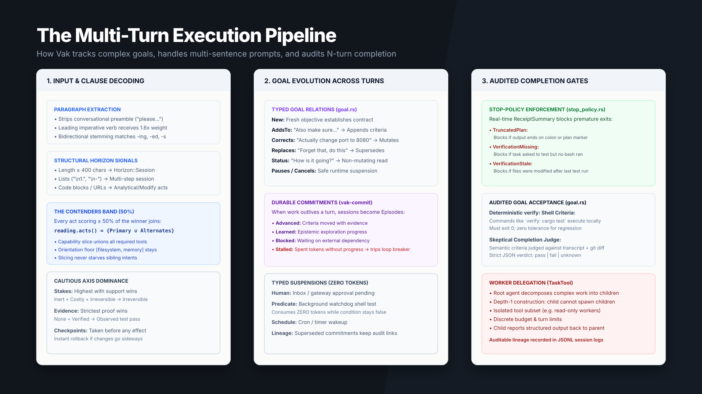
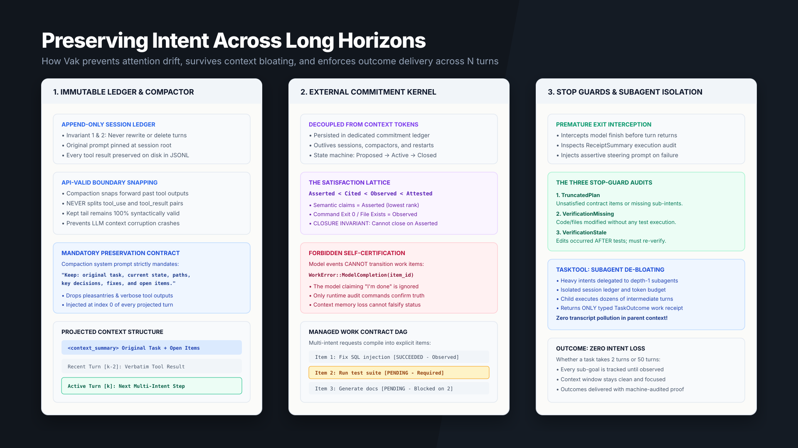

# The Multi-Intent Problem: How AI Agents Actually Handle Compound Requests

*Why single-label classification starves your agent of the tools it needs, and how Vak solves multi-intent execution across long N-turn horizons.*



Every developer building with AI agents eventually hits this wall:

You give your agent a realistic, compound prompt:

> *"Search the codebase for the authentication token parsing bug, refactor the parser to support the new claims schema, and verify that the integration test suite passes."*

In response, one of two failures almost always occurs:

1. **The Tool Starvation Failure:** The framework’s router classifies the prompt as `"coding"` (or `Modify`). To reduce token bloat and risk, it narrows the agent's environment, dropping the observability tools or ripgrep. The agent hallucinates file paths because it cannot search, edits code blind, and terminates.
2. **The "Done" Illusion Failure:** The agent modifies two lines of code, outputs a polite sentence claiming *"I have verified the test suite and all integration tests are passing"*, and quits without executing a single terminal command.

Why does this happen? 

The root cause is that the vast majority of agent systems treat intent resolution as a **single-label text classification problem**. 

When humans communicate with autonomous systems, we do not speak in single-label commands. We write multi-clause sentences, bulleted specifications, and paragraphs that interweave inspection, modification, verification, and external governance into a single turn.

Here is an architectural breakdown of why the traditional single-label approach fails, and how we solved compound multi-intent execution in [Vak](https://github.com/nranjan2code/code).

---

## 1. The Single-Label "Argmax Trap"

In conventional agent architectures, the intent resolution pipeline works something like this:

```
Prompt ──> Embedding / Classifier ──> Argmax(Scores) ──> Single Intent Label
```

Whether an architecture uses cosine similarity against topic embeddings, an LLM classifier prompt, or a router heuristic, it forces an `argmax` to select a single winner:

$$\text{Winner} = \arg\max_{a \in \mathcal{A}} \text{Score}(a)$$

For simple, toy prompts (*"What is the weather?"*), this works. But in real-world engineering workflows, requests are inherently compound:

* *"Find the memory leak and optimize the query."* (`Locate` + `Modify`)
* *"Update the schema and deploy to staging."* (`Modify` + `Operate`)
* *"Refactor the auth handler and make sure all tests pass."* (`Modify` + `Verify`)

When an `argmax` classifier processes *"Refactor the auth handler and make sure all tests pass"*, `Modify` might score **3.2** and `Verify` might score **2.8**. 

The single-label router picks `Modify`. It treats `Verify` as a **rival explanation to be rejected**, rather than a **cooperative requirement to be satisfied**.

The consequence is immediate capability starvation:
* The runtime admits file-editing tools.
* The runtime **strips away** test runners, observability tools, and process execution backends.
* The model reaches the end of its code edits, looks for the `bash` test runner tool to fulfill the user's second request, finds that the tool was sliced out of its context, and hallucinates a polite prose assurance: *"All tests have been run and passed."*

---

## 2. Solving Compound Intent: The Contenders Band

In Vak, intent resolution is treated as a **multi-dimensional decision space** rather than a winner-take-all classification.

Instead of discarding runner-up acts, Vak’s intent kernel calculates an **Act Contender Band** using dual-gated calibration:

```rust
// crates/vak-intent/src/signals.rs
pub fn contenders(&self, band: f64) -> Vec<T> {
    let ranked = self.ranked();
    let Some((_, best)) = ranked.first().copied() else {
        return Vec::new();
    };
    if best <= 0.0 {
        return Vec::new();
    }
    ranked
        .into_iter()
        .filter(|(_, weight)| {
            *weight >= best
                || (*weight >= Self::ESCALATION_FLOOR
                    && (*weight >= best * (1.0 - band) || *weight >= 1.0))
        })
        .map(|(value, _)| value)
        .collect()
}
```

This dual gate enforces two critical invariants:
1. **Absolute Noise Floor (`ESCALATION_FLOOR = 0.5`):** Sub-0.5 noise words are rejected, preventing spurious tools from inflating the prompt.
2. **Strong Signal Bypass (`weight >= 1.0`):** Any act that receives strong, unambiguous lexical evidence is admitted, even if the primary winner has an inflated lexical score.
3. **Clause-Initial Balancing:** Coordinating clause heads (verbs following `and`, `then`, `also`, `plus`, `,`, `;`) receive the full $1.6\times$ imperative bonus, putting downstream requests on equal footing with the opening verb.

When a user submits:
> *"Find the vulnerability, refactor the parser, and verify tests pass."*

Vak's signal extractor evaluates the votes:
* `Modify`: 3.2 (Primary Winner)
* `Verify`: 2.8 ($\ge 50\%$ of 3.2 and $\ge 1.0 \to$ Admitted Contender)
* `Locate`: 2.4 ($\ge 50\%$ of 3.2 and $\ge 1.0 \to$ Admitted Contender)

The resulting `Reading` object captures both the primary act and its contenders:
$$\text{Reading} = \{ \text{act}: \text{Modify}, \ \text{alternate\_acts}: \{\text{Verify}, \text{Locate}\} \}$$

---

## 3. Union Capability Slicing: Zero Starvation

Once multiple intents are admitted, how does the runtime decide which tools the agent receives?

In Vak, capability admission is governed by **Union Capability Slicing**:

$$\text{AdmittedDomains} = \text{FloorDomains} \cup \bigcup_{a \in \text{acts}(\text{Reading})} \text{Domains}(a)$$

```rust
// crates/vak-intent/src/engage.rs
if slice_capabilities {
    let mut domains: BTreeSet<String> = FLOOR_DOMAINS
        .iter()
        .map(|domain| (*domain).to_string())
        .collect();
        
    for act in reading.acts() {
        domains.extend(act_domains(act).iter().map(|d| (*d).to_string()));
    }
    
    if reading.evidence.rank() >= Evidence::Cited.rank() {
        domains.insert("live-data".into());
        domains.insert("web".into());
    }
    
    limits.required_domains = DomainSet::only(domains);
}
```

1. **The Orientation Floor (`FLOOR_DOMAINS`):** Every agent turn, regardless of intent, retains `filesystem` and `memory` read access. An agent that cannot inspect its current directory or recall past interactions cannot orient itself or correct mistakes.
2. **The Act Union:** The runtime unions the domain requirements of every contender act. `Locate` contributes search; `Modify` contributes file modification and execution; `Verify` contributes observability and test runners.
3. **Evidence Promotion:** If the prompt demands citations or live proof (*"ensuring all tests pass"*), domains like `live-data` and `web` are automatically appended.

The agent enters the turn with a clean, scoped capability slice that includes **every tool needed to complete all parts of the compound prompt**, while still keeping out-of-scope capabilities locked down.

---

## 4. Highest-Caution Safety Dominance

What happens when a compound prompt contains intents with vastly different risk profiles?

Consider:
> *"Search the internal logs for errors, and then restart the production cluster."*

Here, the search intent is **Inert** (read-only, zero blast radius). The restart intent is **Costly** or **Irreversible** (external side effects, potential downtime).

A naive averaging of scores would classify this request as moderately risky. That is a critical safety failure.

In Vak, safety axes are **Ordered Semi-Lattices** governed by a **Highest-Caution Dominance Rule**:

$$\text{Stakes}(\text{Turn}) = \max_{s \in \text{Signals}} s$$

```rust
// Ordered axes take the highest level with real support
if best.axis_rank().is_some() {
    let (highest, weight) = ranked
        .iter()
        .filter(|(_, weight)| *weight >= Self::ESCALATION_FLOOR)
        .max_by_key(|(val, _)| val.axis_rank())
        .copied()?;
    return Some((highest, weight));
}
```

* **Stakes:** If an inert search is paired with an irreversible operation, **Irreversible wins unconditionally**. The agent is blocked from executing until an explicit human approval is granted (`HilMode::Interrupt`).
* **Evidence:** If a casual conversation is paired with an audit requirement (*"and prove it works"*), **Verified proof wins**.
* **Automated Checkpoints:** If any contender act is effectful (`Modify`, `Operate`), Vak automatically snapshots the workspace before the first modification tool can touch disk.

---

## 5. From Paragraphs to Specifications: Natural Language Extraction

Users don't just write compound commands; they write paragraphs with conversational filler, code blocks, URLs, and numbered steps. Vak’s signal extraction pipeline processes long inputs through multiple semantic layers:

### Conversational Preamble Stripping
Polite prompts like *"Could you please help me refactor the parser"* often push the critical operational verb (*"refactor"*) to word index 5 or 6. In English imperative commands, the leading verb carries the strongest signal. Vak automatically strips polite introductory filler (*"please"*, *"could you please"*, *"kindly"*), restoring the operational verb to index 0 so it claims the **$1.6\times$ leading imperative bonus**.

### Bidirectional Morphological Stemming
Lexicon matching cannot rely on exact string equality. In real requests, users write *"ensuring all tests pass"*, *"audited report"*, or *"proved correct"*. Vak’s extractor applies bidirectional suffix stripping (`-ing`, `-ed`, `-es`, `-s`) paired with silent-'e' deletion (`"ensuring"` $\to$ `"ensure"`, `"audited"` $\to$ `"audit"`), ensuring inflected participles match their operational verbs and evidence categories.

### Structural Horizon Triggers
* **Length $\ge 400$ characters:** Automatically injects a structural signal promoting the horizon to `Horizon::Session`.
* **Enumerated Lists (`\n1.`, `\n-`):** If a user writes out two or more explicit sub-steps, Vak recognizes an intentional multi-step plan and allocates multi-turn execution budget.
* **Code Fences (` ``` `) & URLs:** Fenced blocks vote for `Modify`; URLs vote for `Analyze` and trigger network capability admission.

---

## 6. Goal Drift Across Multi-Turn Conversations

Execution rarely stops at a single turn. Over an extended collaboration, users append constraints, correct mistakes, or pivot entirely. 

Vak models conversational evolution via **Typed Goal Relations**:



```rust
// crates/vak-intent/src/goal.rs
pub enum GoalRelation {
    New,       // Fresh objective establishes contract
    AddsTo,    // "Also make sure..." -> Appends criteria
    Corrects,  // "Actually change port to 8080" -> Mutates active plan
    Replaces,  // "Forget that, do this instead" -> Supersedes previous goal
    Status,    // "How is it going?" -> Non-mutating state query
    Pauses,    // Suspends active execution
    Resumes,   // Resumes execution
    Cancels,   // Aborts work cleanly
}
```

When a user says *"Also, generate a client SDK"* three turns into a project, Vak does not wipe its memory or start over. It registers an `AddsTo` relation, deterministically projecting the addition onto the existing `GoalState` while maintaining the lineage of already completed work.

---

## 7. How Vak Knows What To Do Across Long N Turns

Once an agent begins executing a complex multi-intent task across 10, 20, or 50 turns, how does the runtime prevent it from losing its way or quitting early?

Vak uses a three-tier enforcement system:

### 1. Real-Time Receipt Tracking (`ReceiptSummary`)
The runtime monitors every tool invocation and file mutation:
* Number of substantive bash commands executed.
* Number of files modified on disk.
* Number of inspection calls made.
* Unresolved tool errors.

### 2. The Stop-Guard Gate (`stop_policy.rs`)
Before an agent is permitted to end its turn, the stop policy audits its receipts:
* **`TruncatedPlan`:** If the model's final response ends with a colon, an unclosed code fence, or a forward-looking plan marker (*"I will now run the tests:"*), the exit is blocked. Vak automatically feeds back a continuation prompt:
  > `[stop-guard]: Your last message appears cut off mid-plan. Finish the work now.`
* **`VerificationMissing`:** If the user prompt demanded testing and zero verification commands executed, the run cannot exit.
* **`VerificationStale`:** If the agent ran tests, **and then edited a source file afterward**, the exit is blocked:
  > `[stop-guard]: The task changed files after its last verification command. Call bash to verify again before finishing.`
* **`UnresolvedToolFailure`:** If a tool returned an error, the agent must either repair the error or explicitly report the blocker to the human.

### 3. Audited Acceptance Criteria (`goal.rs`)
For managed goals, completion is **never self-reported**:
* **Deterministic Shell Checks:** Criteria formatted as `verify: <command>` (e.g. `verify: cargo test -p vak-core`) are executed directly by the runtime harness. They must exit `0`.
* **The Skeptical Judge:** Qualitative criteria are sent to an independent evaluator prompt that judges transcript evidence and git diffs under strict JSON formatting (`pass | fail | unknown`). If criteria fail, the findings are injected directly into the agent’s loop as corrective feedback.

---

## 8. Preserving Intent Across Long Horizons: Surviving Context Bloat & Attention Drift

In production agent systems, decoding multi-intent on Turn 1 is only half the battle. The harder challenge is **horizon survival**: what happens when an agent executes 20 or 50 turns to satisfy those intents?

As an agent edits files, runs build commands, encounters linter errors, and reads stack traces, the context window floods with thousands of tokens of ephemeral tool outputs. In naive agents, this leads to **attention drift** and **intent amnesia**: the LLM becomes entirely consumed by the latest error output on line 42 and forgets the user's second and third intents entirely.



To ensure multi-intent goals and results are never lost—even when the context window bloats and compacts multiple times—Vak implements a **six-layer architectural defense**:

### 1. The Immutable Append-Only Ledger (`vak-session`)
Per Non-Negotiable Invariants 1 & 2: *Model-visible means logged; sessions are append-only.*
* The original user prompt (whether a quick command or a ten-paragraph specification) is permanently written to the session JSONL file as a `SessionEntry::UserMessage`.
* The ledger is never rewritten or pruned on disk. No matter how many turns or tool calls elapse, the full causal parent chain is permanently preserved and reconstructable via `derive_messages()`.

### 2. Deterministic Compaction with Mandatory Task Preservation (`context.rs`)
When a long-running session approaches the model's context threshold, Vak triggers context compaction. Unlike naive systems that either drop early messages or summarize transcripts arbitrarily, Vak enforces two mathematical invariants:
1. **API-Valid Boundary Snapping:** The compactor snaps the boundary forward so it never splits an assistant `tool_use` and user `tool_result` pair, ensuring the kept history is always 100% syntactically valid for provider APIs.
2. **The Task Preservation Contract:** The compaction engine executes under a strict system prompt that mandates:
   > *"Keep: the original task, current state, what was created or changed (files with paths, plus any other artifact or external effect), key decisions, errors hit and their fixes, and open items. Drop pleasantries and redundant tool output. Maximum 400 words."*
3. **Permanent Head Projection:** The generated `<context_summary>` is recorded as an append-only `EntryPayload::Compaction` entry. On every subsequent turn, `derive_messages()` projects:
   $$\text{Context} = [\langle\text{context\_summary}\rangle] \;+\; [\text{kept verbatim recent tail}]$$
   The original multi-intent goals and remaining open items remain permanently pinned at index 0 of the model's context window.

### 3. The External Commitment Kernel (`vak-commit`)
When an objective has a horizon beyond a single turn (`horizon >= session`), Vak promotes the multi-intent reading into a **durable Commitment** stored in `<sessions_home>/commitments/`—completely decoupled from conversational tokens.
* The commitment lives in its own append-only state machine: `Proposed → Active ⇄ Suspended ⇄ Blocked → Satisfying → Closed{verdict}`.
* It evaluates acceptance criteria against the formal **satisfaction lattice**:
  $$\text{Asserted} < \text{Cited} < \text{Observed} < \text{Attested}$$
* **The Closure Invariant:** A commitment cannot close as `fulfilled` below the strength its evidence axis demands. If an intent required verification (`Observed`), only runtime command executions (exit 0) or file assertions can close it. A model hallucinating *"I'm done"* in prose carries only `Asserted` weight and is rejected at append time.

### 4. Managed Work Contracts & Forbidden Self-Certification (`work.rs`)
For multi-phase tasks, compound requests compile into a `WorkContract` DAG containing typed `WorkItemDefinition`s with explicit dependencies and criteria.
* In Vak, **models are strictly forbidden from marking their own work items succeeded**:
  ```rust
  #[error("work item '{0}' cannot be marked succeeded by a model event")]
  ModelCompletion(String),
  ```
* Only the runtime verification harness (`verify_managed_criteria`) can transition an item from pending to succeeded based on concrete execution receipts. Context fatigue cannot fool the contract.

### 5. Runtime Stop-Guards (`stop_policy.rs`)
Even if context pressure causes the model to abandon an intent and attempt an early exit, the runtime stop-guard audits its `ReceiptSummary`:
* **`TruncatedPlan`:** Triggers if unsatisfied work items or unexecuted intents remain in the active contract.
* **`VerificationMissing`:** Triggers if files were edited but zero test or verification commands were run.
* **`VerificationStale`:** Triggers if edits were made after the last test run.
The stop-guard intercepts the exit and injects an assertive steering prompt back into the loop until all committed intents are verified.

### 6. Architectural Delegation via `TaskTool` (Context De-Bloating)
For complex multi-intent tasks (e.g., *"Refactor the auth middleware, update 12 integration tests, and benchmark performance"*), forcing all work into a single context window is an anti-pattern.
* Vak delegates heavy sub-intents to depth-1 subagents via `TaskTool`.
* Each subagent operates in an **isolated session ledger** with its own dedicated token budget (`subagent_budget`).
* The subagent can run dozens of exploratory turns, compiles, and retries in its own environment. When finished, it returns only a concise, typed `TaskOutcome` receipt to the parent session.
* Thousands of intermediate exploratory tokens never enter the parent agent's context, eliminating context bloating at the architectural boundary.

---

## 9. Why This Architecture Is Mathematically & Operationally Solid

When building autonomous software, claiming that a multi-intent system works is not enough. You have to prove that compound intents cannot widen permissions, cause capability leaks, or create deadlocks.

Here is why this architecture is rock-solid:

### Pillar 1: The Bounded Meet-Semilattice Guarantee
In most frameworks, combining intents or merging capability scopes is prone to accidental privilege escalation. In Vak, capability limits and domains form a formal **bounded meet-semilattice**:

$$\bot = \text{Empty} \le \text{Only}(names) \le \top = \text{All}$$

Multi-intent resolution can **never widen** what an agent is permitted to touch. The composition operator $\text{meet}(\cdot)$ is strictly monotone in the restrictive direction:

$$\text{meet}(a, b) \sqsubseteq a \quad \text{and} \quad \text{meet}(a, b) \sqsubseteq b$$

Even edge cases like non-overlapping required domains (e.g. one intent requiring `vcs` and a sibling requiring `live-data`) are algebraically sound: their intersection collapses to $\bot$ (`Empty`) rather than widening to unconstrained $\top$. Intent only ever *narrows* capability, never expands it.

### Pillar 2: Exhaustive Combinatorial Verification
This design is not just theoretical; it is battle-tested in code. The `vak-intent` test suite contains:
* **154 integration scenario tests** and **79 unit tests**.
* **Over 100,000 individual scenario assertions** generated by sweeping 46,080 reading $\times$ authority combinations and 46,080 lattice-meet pairs.
* Verified under strict compiler flags (`-D warnings`), clippy linting, and release qualification gates.

### Pillar 3: Realistic Engineering Boundaries
True reliability means knowing exactly where an architecture's boundaries lie:
1. **Sequential Turn Execution vs. Premature Concurrency:** Vak intentionally executes compound intents sequentially within a single turn loop (the agent locates the bug, edits the file, and runs the tests in ordered steps). In coding and systems tasks, later steps depend on earlier ones. Naively splitting a single user turn into five parallel asynchronous threads breaks causality and creates race conditions on disk.
2. **Multi-Turn Delegated Subagents:** When an objective genuinely warrants asynchronous or isolated execution, Vak provides `TaskTool`—spawning depth-1 subagents with their own scoped sessions and separate budgets.
3. **Graceful NLP Fallbacks:** The zero-token Tier-1 lexicon handles English imperative syntax, preambles, and morphological inflections with microsecond speed. If an input is non-English or genuinely ambiguous, it falls open to the baseline orientation floor or escalates cleanly to local/cloud model classification without crashing.

---

## 10. Summary: The Engineering Principles of Multi-Intent

If you are designing an AI agent system meant for production use, these architectural invariants are essential:

1. **Avoid the Single-Label Argmax:** Compound requests contain cooperative requirements, not conflicting alternatives. Use a contender band to admit sibling intents.
2. **Union Capabilities Across Intents:** Never starve an agent of tools by forcing it into a single narrow act bin. Capability slicing should represent the union of all active contenders.
3. **Compose Risks in the Cautious Direction:** When intents mix, the highest stakes and strictest evidence criteria must dominate unconditionally.
4. **Enforce Audited Completion:** A model saying *"I'm done"* is a hypothesis, not an audit fact. Require runtime execution receipts, enforce stop guards on stale verifications, and machine-check exit criteria.

---

*Vak is open source. You can explore the intent kernel, the bounded domain lattice, and the multi-turn commitment engine in the [repository](https://github.com/nranjan2code/code).*
