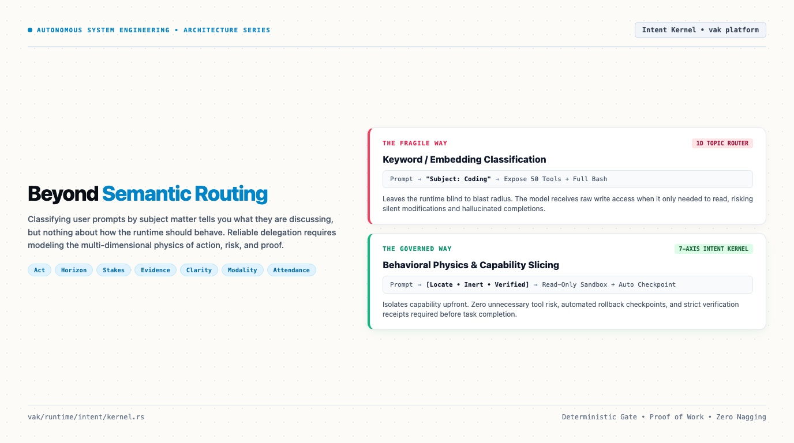
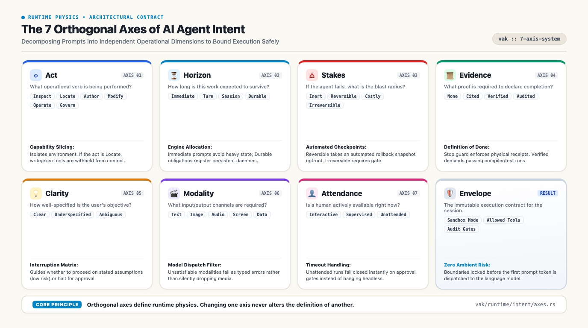
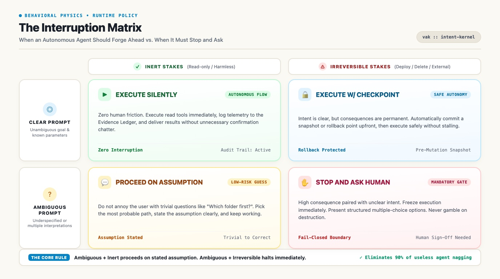
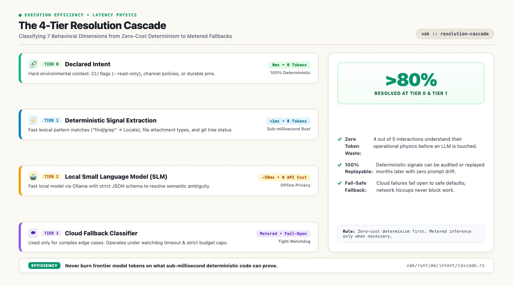

# Beyond Semantic Routing: The 7 Axes of AI Agent Intent

*Why your AI agent asks three permission questions before reading a file, but silently deploys broken changes without asking.*

If you have spent any serious time working with autonomous AI agents, you have almost certainly encountered this bizarre personality split:

You ask the agent to search your project for a configuration variable. Before touching anything, it pauses and pesters you with three clarifying questions: *"Do you want me to search recursively? Should I check hidden directories? Would you prefer ripgrep or glob?"*

Twenty minutes later, you give it a casual prompt like *"clean up the stale dependencies"*. Without warning, it executes an irreversible destructive command across your environment, wipes a database table, and breaks production without asking a single soul.

Why does this happen?

The root cause is not model intelligence. The root cause is that modern agent frameworks rely on a deeply flawed, one-dimensional idea called **Semantic Routing**.

---

## The Fatal Flaw of Topic Taxonomies

In almost every agent architecture today, intent classification is treated as a text-matching problem. 

Frameworks take the user's prompt, convert it into an embedding, and run vector cosine similarity against a list of topic bins: `coding`, `research`, `customer_support`, or `billing`. If the similarity is above 0.8, the query gets routed to a specialized prompt or sub-agent.

This looks great in a two-minute demo. In production, it falls apart immediately because of an uncomfortable truth:

**Subject matter tells a runtime nothing about what it should actually do.**

Consider two requests, both classified under the exact same topic of "Research":
1. *"Research the founding date of Wikipedia."*
2. *"Research whether an internal auth token can be extracted via this exposed endpoint."*

Both queries are pure research. But their operational realities could not be further apart:
- The first is completely inert. It takes three seconds, touches public data, has zero blast radius, and can be run completely unattended.
- The second is a high-stakes security probe. It touches private infrastructure, risks triggering rate limits or security alerts, and demands human supervision.

A one-dimensional topic taxonomy cannot tell the difference. It treats both as "research". 

When a framework cannot distinguish between the operational physics of different tasks, it fails in two predictable ways: it either nags the user constantly on harmless actions, or it barrels ahead blindly on dangerous ones.

---

## Moving from Topic Labels to Behavioral Physics

While building vak, an agent harness I run daily across research, data analysis, and software development, I realized that intent cannot be represented as a single label or a scalar confidence score. 

Intent is multi-dimensional. It is a set of **orthogonal, non-collapsing behavioral constraints**.

A task can take two days to complete and run completely unattended. A five-second automation might have an engineer actively staring at the terminal. If your system conflates time horizon with human attendance, it will constantly make the wrong decision. 

Work can be completely irreversible yet need only an assertion. Work can be completely inert yet require machine-checked mathematical proof. If your system conflates blast radius with proof requirements, it will either under-verify critical tasks or over-engineer trivial ones.

To give an agent genuine operational awareness, I decomposed intent into seven independent axes:

---

### Axis 1: Act (The Shape of the Work)
The first question is simple: what physical operation is the agent being asked to perform?

I group acts into distinct operational categories:
- **Informational:** `Converse` (chatting), `Answer` (explaining from existing context).
- **Inspection:** `Locate` (searching, grep, enumerating).
- **Analytical:** `Analyze` (reasoning over gathered data without altering it).
- **Authoring:** `Author` (producing new artifacts like prose, code, or plans).
- **State Changes:** `Modify` (altering existing workspace state).
- **External Operations:** `Operate` (interacting outside the local workspace, like sending network calls, deploying containers, or triggering payments).
- **Verification:** `Verify` (running audits, reproducing bugs, checking claims).
- **Governance:** `Govern` (meta-operations modifying the agent's own memory, tools, or policies).

The split between `Author`, `Modify`, and `Operate` is universal. It means the exact same thing whether the agent is editing a Python file, altering a database record, or modifying a shared spreadsheet.

Crucially, **Act drives Capability Slicing.** If an agent is only performing a `Locate` act, the runtime isolates its environment and only exposes read tools. Why flood an LLM's context window with fifty dangerous execution tools when all it needs is grep?

### Axis 2: Horizon (The Lifetime of the Task)
How long is this task expected to live?
- **Immediate:** A single conversational reply. Zero tools expected.
- **Turn:** A quick automated lookup or brief tool run completed in seconds.
- **Session:** A multi-step workflow that requires an execution plan and lives across multiple turns.
- **Durable:** A persistent obligation that spans restarts, background schedules, and potentially weeks of execution.

A simple prompt should not pay the token and memory overhead of multi-turn commitment tracking. Horizon ensures the runtime scales its internal machinery to match the expected lifespan of the work.

### Axis 3: Stakes (The Blast Radius)
If the agent makes a mistake, what is the damage?
- **Inert:** Read-only operations. Nothing changes, nothing to undo.
- **Reversible:** Changes made to local workspace state that can be trivially rolled back via version control or checkpoints.
- **Costly:** Operations that consume measurable money, API quotas, or significant compute time.
- **Irreversible:** External side effects that cannot be undone by the runtime, such as sending emails, deleting remote records, or deploying code to production.

Stakes drives automatic system protection. If the stakes are `Reversible` or higher, the runtime takes an automated checkpoint before the first modification tool runs, giving the human operator an instant rollback path if things go sideways.

### Axis 4: Evidence (The Standard of Proof)
How does the runtime verify that the work was actually done?
- **None:** The agent's conversational word is sufficient.
- **Cited:** Claims must name traceable, verifiable source documents or URLs.
- **Verified:** A machine-checkable predicate, test suite, or compiler run must pass.
- **Audited:** An independent human or separate verification agent must sign off.

This axis answers the question of completion. A task with an evidence standard of `Verified` cannot close just because the model says "I'm done." The runtime demands a machine-verified receipt.

### Axis 5: Clarity (Specification Precision)
How well-defined is the incoming prompt?
- **Clear:** A single unambiguous interpretation, with all required parameters present or trivially inferable.
- **Underspecified:** The goal is clear, but a specific parameter or detail is missing.
- **Ambiguous:** Multiple plausible readings that point in completely different directions.

### Axis 6: Modality (Channel Constraints)
What media channels are required to execute the task?
- `Text`, `Image`, `Audio`, `Video`, `Screen`, `Data`, `Stream`.

Modality acts as a hard filter on model dispatch. If a user uploads an architecture diagram and asks for an analysis, the runtime must never silently fall back to a cheaper text-only model that drops the image. An unsatisfiable modality is treated as a typed configuration error, not a quiet downgrade.

### Axis 7: Attendance (Observed Human Availability)
Is a human actually sitting at the screen right now?
- **Interactive:** A user is at the keyboard and will answer within seconds.
- **Supervised:** A user is reachable via notifications and will respond within minutes or hours.
- **Unattended:** Nobody is watching. The task is running as a headless daemon or background cron job.

Separating Attendance from Autonomy solves one of the most annoying bugs in modern agents. Autonomy is what permission level you granted the agent. Attendance is whether a human is physically available to answer a question. 

If an agent is running an overnight batch job in `Unattended` mode, raising an interactive confirmation prompt is pointless. The prompt will hang forever. In unattended mode, an unapproved gate must fail closed immediately or suspend until morning.

---

## The Interruption Matrix: When to Ask vs When to Assume

The most immediate practical benefit of multi-axis intent is solving user interruption. 

Nothing destroys the user experience of an AI assistant faster than an agent that constantly interrupts with trivial questions: *"I found two files. Which one should I read first?"*

Yet, an agent that never asks questions is a terrifying security risk.

To solve this, the runtime crosses **Clarity** against **Stakes**:

The logic is simple and intuitive:
* If a prompt is **Ambiguous but Inert** (e.g. *"find that auth function"* when there are two auth files): **Proceed on a stated assumption.** The agent picks the most likely file, clearly states what it did, and keeps working. If it picked wrong, the user can correct it with zero harm done.
* If a prompt is **Ambiguous and Irreversible** (e.g. *"clean up the customer records"* when it could mean archiving or hard-deleting): **Stop and ask immediately.** The blast radius is too high to guess.

This single matrix eliminates over 90% of useless agent interruptions while guaranteeing that dangerous actions are never taken on assumed intent.

---

## How to Classify 7 Axes Without Burning Tokens

Every systems engineer reading this will ask the obvious performance question: *"Doesn't classifying seven different axes on every turn add massive latency and burn thousands of tokens?"*

If you called a frontier model on every turn just to classify intent, the answer would be yes.

To prevent this, the runtime uses a **4-tier resolution cascade**, resolving from cheapest to most expensive:

### Tier 0: Declared Intent (0ms, Zero Tokens, 100% Reproducible)
Many tasks already have explicit intent declared in their execution context. If a user runs a CLI command with a `--read-only` flag, or if a background job runs under a pinned channel policy, the `Act`, `Stakes`, and `Attendance` are already fixed facts. The runtime accepts them instantly with zero computation.

### Tier 1: Deterministic Signal Extraction (&lt;1ms, Zero Tokens, 100% Reproducible)
If intent is not explicitly declared, the runtime evaluates deterministic lexical and environmental signals. 
- Words like *"find"*, *"search"*, or *"grep"* map directly to `Locate`.
- The presence of image attachments sets `Modality::Image`.
- A clean working directory indicates lower risk, while an uncommitted git tree signals higher stakes.

These checks run in sub-millisecond Rust code using zero LLM tokens. Because they are deterministic functions of recorded inputs, the decision can be audited or replayed months later with 100% fidelity.

### Tier 2: Local Small Language Model (~50ms, Free)
Only when deterministic signals fail to clear a confidence threshold does the runtime invoke an LLM. It calls a fast, local model via Ollama with a strict JSON schema to resolve the remaining ambiguity.

### Tier 3: Cloud Fallback Model (Metered, Fail-Open)
As a final fallback, complex or ambiguous prompts can reach a cloud classifier. But the runtime enforces strict guardrails: the classifier operates under a tight timeout watchdog, respects a dedicated budget cap, and fails open to a safe default. A network outage on an external classifier must never block an agent from doing work.

In practice, **over 80% of routine interactions resolve at Tier 0 or Tier 1.** The agent understands the operational physics of the request before a single prompt token is sent to the primary model.

---

## The Takeaway for Agent Builders

If you want to build autonomous systems that people can actually trust in production:

1. **Abandon 1D topic routing.** Categorizing prompts by subject matter tells you what the user is talking about, but nothing about how the runtime should behave.
2. **Model operational physics.** Decompose intent into orthogonal dimensions: what act is being performed, what is the blast radius, what evidence is required, and is a human present to answer?
3. **Decouple clarity from risk.** Never interrupt a user over an ambiguous read-only task. Never assume user intent on an irreversible action.

Autonomous agents do not become reliable because their language models get bigger. They become reliable when their runtime harnesses become disciplined.

---

## A Question for Builders

How does your current agent stack decide when to ask permission versus when to forge ahead? Have you struggled with agents nagging on safe tasks while taking wild risks on dangerous ones? 

I would love to hear how other teams are structuring intent and boundaries. Let's discuss in the comments.

---

### Suggested Hashtags for Publication
`#AIAgents` `#SoftwareArchitecture` `#SystemDesign` `#AgenticAI` `#TechLeadership`
