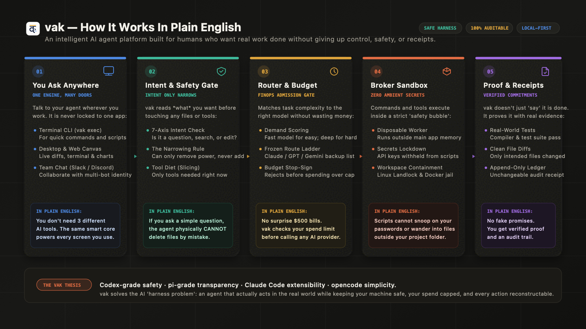

# vak: System Architecture & Market Positioning

> **Status:** v3.0.29 Repository Architecture & Market Research Briefing  
> **Target Audience:** Engineering Leadership, System Architects, Platform Strategists, and Enterprise Operators.

---

## Executive Overview

In today's agent AI ecosystem, autonomous systems have expanded far beyond simple chat wrappers into tool-executing software engines. However, the majority of platforms suffer from a critical flaw: **the harness problem**. Models are treated as unconstrained black boxes, session state is ephemeral or destructively rewritten, tools execute with ambient process permissions, and runtime behavior diverges across CLI, desktop, and chat bots.

**vak** solves this with a clear thesis: **Codex-grade safety, pi-grade transparency, Claude Code-grade extensibility, and opencode-grade simplicity.** Built from the ground up in high-performance Rust, vak establishes a unified, auditable harness governed by a single principle: **"One core, many surfaces."**

```
                  ┌────────────────────────────────────────────────────────┐
                  │                 vak: ONE CORE, MANY SURFACES           │
                  │  CLI  •  Desktop  •  Web Client  •  Gateway  •  Bridges │
                  └───────────────────────────┬────────────────────────────┘
                                              ▼
                  ┌────────────────────────────────────────────────────────┐
                  │           DETERMINISTIC INTENT & FINOPS GATE           │
                  │   7-Axis Reading  •  Budget Cap  •  Frozen Route Ladder │
                  └───────────────────────────┬────────────────────────────┘
                                              ▼
                  ┌────────────────────────────────────────────────────────┐
                  │         BROKERED EXECUTION & APPEND-ONLY LEDGER        │
                  │   __tool_worker  •  OS Sandbox  •  Reconstructable JSONL│
                  └────────────────────────────────────────────────────────┘
```

---

## Visual Architecture & Strategic Portfolio

This briefing includes 6 dedicated 2D engineering and market infographics (flat, modern, zero 3D or sci-fi elements):

### 1. How vak Works — In Plain English ([`vak-simple-architecture.jpg`](vak-simple-architecture.jpg) / [Vector SVG](vak-simple-architecture.svg))
*A clean, intuitive 5-step visual explaining the platform in non-technical terms: from asking anywhere to safety filtering, budget protection, sandboxed isolation, and verified real-world proof.*



---

### 2. The 5-Layer Dependency Stack ([`vak-layered-architecture.jpg`](vak-layered-architecture.jpg))
*The strict 5-layer dependency hierarchy (L0 Foundations $\rightarrow$ L1 Records & Sandboxing $\rightarrow$ L2 Capability & Intent/Commitments $\rightarrow$ L3 Workspace Core $\rightarrow$ L4 Surfaces).*


---

### 3. What is `Core` and what is `CorePool`? ([`vak-core-and-corepool.jpg`](vak-core-and-corepool.jpg))
*Deconstructing the anatomy of a single workspace engine (`vak-core`) vs. the multi-tenant LRU workspace pool (`vak-server`'s CorePool with tenant isolation and session locking).*


---

### 4. How Intent and Commitments Work ([`vak-intent-and-commitment.jpg`](vak-intent-and-commitment.jpg))
*The 7-Axis Intent Kernel (`vak-intent`), the Narrowing Lattice (reading $\cap$ authority = engagement), and the Satisfaction Lattice (`vak-commit` verifying work against compiler/test reality rather than LLM assertions).*


---

### 5. Competitive Landscape & Market Positioning Matrix ([`market-positioning-matrix.jpg`](market-positioning-matrix.jpg))
*Where vak sits against Specialized Coding Assistants (Claude Code, Cursor), Enterprise Frameworks (LangGraph, AutoGen, CrewAI), and Autonomous Agents (Devin, OpenHands).*


---

### 6. Complete 10-Step Turn Execution Pipeline ([`vak-turn-pipeline-detail.jpg`](vak-turn-pipeline-detail.jpg))
*The complete 10-stage execution pipeline detailing Inbound Ingress, Gateway & CorePool 3-segment identity, 7-Axis Intent reading, Commitment registration, FinOps admission, Resilient Inference, Permission Engine, Broker Sandbox isolation, Ground-truth Verification, and Append-Only Ledger Commit.*


---

### 7. The Agent & Worker Lifecycle ([`vak-worker-lifecycle.jpg`](vak-worker-lifecycle.jpg))
*How the parent agent loop executes, evaluates delegation heuristics, enforces Depth-1 recursion limits, spawns child sessions with `Surface::Worker`, and manages live steering via `WorkerRegistry`.*


---

## Document Index

This market analysis and architecture briefing is split into four comprehensive deep-dives:

1. **[Vak System Architecture: Layer-by-Layer Engineering Specification](architecture.md)**
   - The strict 5-layer dependency hierarchy (L0 to L4) covering all 25 crates.
   - Comprehensive breakdown of **Core** vs **CorePool** (anatomy, lifecycle, eviction, isolation).
   - Comprehensive breakdown of the **7-Axis Intent Kernel** (`vak-intent`) and the Narrowing Invariant.
   - Comprehensive breakdown of the **Commitment Engine** (`vak-commit`) and verifiable Done-Contracts.
   - The broker boundary (`__tool_worker`), OS Landlock LSM containment, and Docker sandboxes.

2. **[The Agent & Worker Engine: Execution Loop & Lifecycle Control](agent-and-workers.md)**
   - Detailed operational analysis of `crates/vak-agent` and `crates/vak-core`.
   - The 4 delegation heuristics: Context Preservation, Role Specialization, Concurrency, and Work Contracts.
   - Depth-1 recursion containment, `Surface::Worker` replacement, and atomic budget tracking.
   - Live telemetry, `WorkerRegistry` handles, in-flight operator steering, and graceful cancellation.

3. **[From Prompt to Final Output: End-to-End Execution Flow & Routing Logic](prompt-to-output-deepdive.md)**
   - Tracing an inbound prompt through the 8 execution phases.
   - The Demand Router (`score_demand`), Quality Objectives, and the **Frozen Route Ladder**.
   - The 6-Block Layered Prompt Engine across 7 inheritance tiers (Seed $\rightarrow$ Role).
   - Real-world ground-truth Done-Contract verification (Satisfaction Lattice) and CommonMark AST projection to Slack/Discord/Desktop.

4. **[AI Agent Market Landscape & Strategic Positioning (2026 Edition)](market-analysis.md)**
   - The 2026 Agent AI ecosystem evolution (from prompt wrappers to production harnesses).
   - Architectural and operational flaws in incumbent platforms.
   - Comprehensive comparative matrix: **vak** vs. **Claude Code**, **Cursor**, **LangGraph**, **CrewAI**, **OpenHands**, and **Devin**.
   - Strategic moats, enterprise deployment readiness, and long-term defensibility.

---

## Quick Reference: Core Architectural Invariants

| Principle | Incumbent Platforms | vak Implementation |
|---|---|---|
| **Auditability** | Ephemeral context, lossy compaction, prompt drift | **Append-only JSONL ledgers**; every model request reconstructable via `derive_messages()` |
| **Workspace Tenancy** | Reinstantiated per turn or single global state | **`Core` for workspace state**, **`CorePool` for LRU multi-tenant pooling** |
| **Intent Understanding** | Keyword string checks or loose taxonomy | **7-Axis Behavioral Intent Kernel** with the **Narrowing Invariant** |
| **Task Completion** | Model claims "I am done" in conversation | **Verifiable Done-Contracts** evaluated against compiler exits and git diffs |
| **Tool Security** | Ambient subprocess execution, leaked environment secrets | **Brokered worker isolation** (`__tool_worker`), disposable process groups, Landlock/Docker sandboxes |
| **Surface Consistency** | Siloed agents per surface with disparate capabilities | **One Core, Many Surfaces**; exact same policy engine across CLI, Desktop, Web, and Channel Bridges |
| **Provider Routing** | Fragile fallbacks, runaway cost loops | **FinOps admission gate**, frozen route ladders committed at admission, informed circuit breakers |
| **Reliability** | Random crashes on provider rate limits | **Watchdog deadlines**, endurance retries within committed ladder, causal Merkle message fabric |
