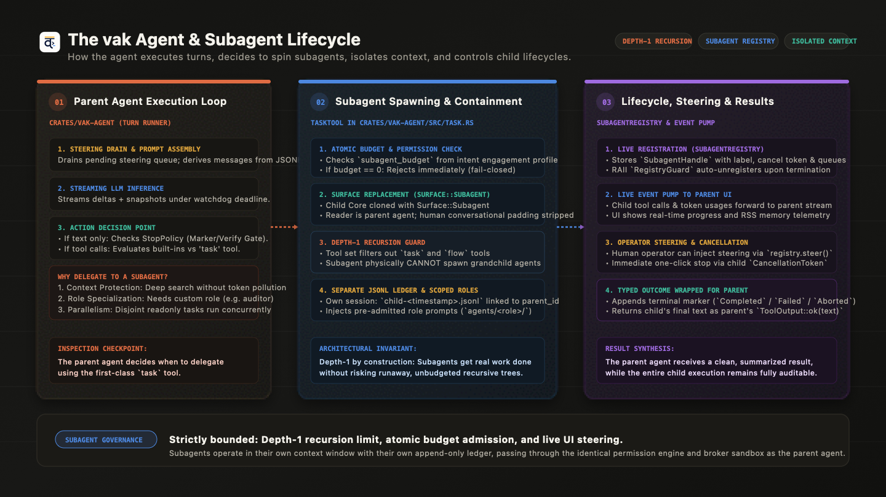

# The vak Agent & Worker Engine: Execution Loop, Delegation Heuristics, and Lifecycle Control

> **Status:** Production Architecture Specification (v3.0.29)  
> **Repository Implementation:** [`crates/vak-agent`](file:///Users/nisheethranjan/Projects/vakcoder/crates/vak-agent), [`crates/vak-core`](file:///Users/nisheethranjan/Projects/vakcoder/crates/vak-core)  
> **Key Modules:** [`crates/vak-agent/src/agent.rs`](file:///Users/nisheethranjan/Projects/vakcoder/crates/vak-agent/src/agent.rs), [`crates/vak-agent/src/task.rs`](file:///Users/nisheethranjan/Projects/vakcoder/crates/vak-agent/src/task.rs), [`crates/vak-agent/src/stop_policy.rs`](file:///Users/nisheethranjan/Projects/vakcoder/crates/vak-agent/src/stop_policy.rs)

---

## 1. Visual Overview: The Worker Lifecycle



The diagram above details the three distinct phases of worker delegation in vak:
1. **Parent Execution Loop:** The main agent runs its turn cycle, evaluates tools, and decides whether a subtask requires isolated delegation.
2. **Worker Spawning & Containment:** The `task` tool performs pre-flight budget admission, replaces the surface with `Surface::Worker`, enforces **Depth-1 recursion limits**, and spins up an isolated child session.
3. **Lifecycle, Steering & Results:** The child registers in `WorkerRegistry`, pumps live progress events to the parent UI, supports mid-run operator steering/cancellation, and returns a clean, typed outcome upon completion.

---

## 2. How the Main Agent Works: The Turn Execution Cycle

In vak, [`crates/vak-agent`](file:///Users/nisheethranjan/Projects/vakcoder/crates/vak-agent) implements the core agent loop (`Agent::run`). It is designed around three strict principles: **Errors are values**, **Model-visible means logged**, and **Cancellation threads everywhere**.

```
run(prompt, steering, cancel, events) -> TurnOutcome
  │
  ├─ 1. Append User Message to session.jsonl
  │
  └─ 2. Turn Loop (turn in 0..max_turns):
         │
         ├─ A. Drain Steering Queue:
         │     Inject pending human steering messages as prioritized user turns.
         │
         ├─ B. Reconstruct Prompt History:
         │     `request = { model, system, messages: session.derive_messages(), tools }`
         │     (Prompt is NEVER an ephemeral cache; derived directly from JSONL ledger).
         │
         ├─ C. Streaming Inference:
         │     `stream = provider.stream(request, cancel)`
         │     Forwards StreamEvents (Delta + Accumulated Snapshot) to UI in real time.
         │     Evaluates per-step Watchdog Deadlines and Informed Circuit Breakers.
         │
         ├─ D. Assistant Message Commit:
         │     Appends model response and token metadata to JSONL ledger.
         │
         ├─ E. Completion Check (Stop Gate):
         │     If stop_reason != ToolUse:
         │         Evaluates internal `StopPolicy` (Marker Gate & Verify Gate).
         │         If verified -> Return `TurnOutcome::Completed`.
         │
         └─ F. Parallel Tool Batch Execution:
               Evaluates proposed tool batch across `PermissionEngine`.
               Executes built-in tools or the `task` worker tool.
               Appends `ToolResult` blocks -> Continues to next turn.
```

### 2.1 The Stop Gate (Guarding Against Premature Completion)
Small or rushed models frequently stop generating text mid-plan or claim success before verifying their work. `vak-agent` intercepts completion points using an internal `StopPolicy`:
- **Marker Gate:** Detects unclosed fenced code blocks or trailing `:` lines indicating truncated thought.
- **Verify Gate:** If the initial user prompt demanded verification ("ensure tests pass", "prove that it builds"), but zero bash commands were run during the entire turn, the gate emits a `StopHookContinuation`, appending:
  `[stop-guard]: Verification was demanded but no verification commands were run. Please verify.`
  The agent is forced to continue within its turn budget.

---

## 3. How the Agent Decides to Spin Workers

Workers are exposed to the main agent as a first-class tool called **`task`** ([`crates/vak-agent/src/task.rs`](file:///Users/nisheethranjan/Projects/vakcoder/crates/vak-agent/src/task.rs)):

```json
{
  "name": "task",
  "description": "Delegate a self-contained subtask to a worker with its own context window and transcript. Use for focused research or exploration whose details you do not need in your own context. The worker cannot spawn further workers.",
  "parameters": {
    "prompt": "Complete, self-contained instructions for the worker",
    "role": "audit | researcher | tester | reviewer",
    "label": "Short label shown in the UI",
    "readonly": false,
    "paths": ["src/parser/**"]
  }
}
```

### 3.1 The 4 Core Delegation Heuristics

The parent agent decides to invoke `task` under four specific conditions:

1. **Context Window Preservation (Anti-Pollution):**
   - *Scenario:* The agent needs to read 40 log files or search through an unfamiliar 100,000-line directory tree.
   - *Decision:* Dumping thousands of raw lines into the parent context would exhaust token budgets and degrade reasoning performance. The agent delegates the exploration to a worker, which reads the files in its own isolated context and returns only a concise 5-line summary.

2. **Role Specialization (`role` parameter):**
   - *Scenario:* The parent agent is writing a complex cryptographic function and needs an objective security audit.
   - *Decision:* The agent specifies `"role": "audit"`. The runtime loads specialized role prompts from `.vak/prompts/agents/audit/` with strict verification checklists that the generalist parent does not carry.

3. **Parallelism & Concurrency (`readonly: true` & `paths`):**
   - *Scenario:* Three independent subsystems need to be inspected simultaneously.
   - *Decision:* By setting `"readonly": true`, workers bypass sequential execution locks and execute concurrently. When writing, specifying disjoint `paths` globs allows non-overlapping workers to run in parallel.

4. **Managed Contracts & Portfolio Work (`contract_id`, `work_item_id`):**
   - *Scenario:* Executing a multi-day managed work contract (`vak-commit`).
   - *Decision:* Independent work items are distributed to workers that report completion receipts back to the master portfolio scheduler.

---

## 4. Pre-Flight Admission & Security Guards

Before any child agent is permitted to spawn, `TaskTool` evaluates three strict security invariants:

1. **Atomic Worker Budget Check:**
   - The turn's engagement profile (`vak-intent`) supplies an explicit `worker_budget`.
   - `worker_budget == Some(0)` represents an enforced denial.
   - For non-zero budgets, an atomic counter (`budget_used.fetch_add(1)`) tracks active children. If the budget is exhausted, the call fails closed:
     `ToolOutput::error("worker delegation budget exhausted for this turn")`

2. **Global Configuration Gate:**
   - The workspace must have workers enabled (`core.effective_workers() == true`). If disabled by operator policy, the tool is withheld from the capability slice.

3. **Pre-Admitted Role Validation:**
   - A child can **only** run under a role that was resolvable when the parent session was admitted. An unknown or hallucinated role name fails immediately rather than silently falling back to defaults, preventing prompt-injection attacks.

---

## 5. Worker Isolation & Containment Architecture

When admitted, the worker is instantiated with four layers of structural containment:

### 5.1 Depth-1 Recursion Guard (No Runaway Trees)
In `crates/vak-agent/src/task.rs`, the child's toolset is explicitly filtered:
```rust
let child_tools: Vec<Arc<dyn Tool>> = tools
    .into_iter()
    .filter(|tool| tool.name() != "task" && tool.name() != "flow")
    .collect();
```
A worker **physically does not possess the `task` tool**. It is **Depth-1 by construction**. It can never spawn grandchild agents, preventing runaway token exhaustion or exponential process loops.

### 5.2 Surface Replacement (`Surface::Worker`)
The child's `Core` is cloned with `Surface::Worker`:
- The child agent's reader is the **parent agent**, not a human user.
- The runtime automatically replaces human-facing prompt notes with:
  `"Surface: worker. Your reply is read by the agent who delegated this task. Do not include conversational pleasantries."`
- The child outputs direct, concise technical evidence.

### 5.3 Independent Session & Append-Only Ledger
The worker receives its own unique session ID: `child-<nanoseconds>`.
- Writes to `<workspace>/.vak/sessions/child-<nanoseconds>.jsonl`.
- Linked permanently to the parent via `parent_session_id`.
- The child's entire transcript is preserved for post-mortem debugging and compliance audits.

### 5.4 Identical Permission Engine & Broker Sandbox
A worker inherits the parent's active security mode (`ReadOnly`, `Restricted`, `FullAccess`). If `readonly: true` was requested, permissions are automatically narrowed to `Mode::ReadOnly`. All tool calls cross the `__tool_worker` IPC broker boundary under Linux Landlock LSM containment with zero ambient secrets.

---

## 6. Lifecycle Management, Steering & Observability

Live workers are managed via [`WorkerRegistry`](file:///Users/nisheethranjan/Projects/vakcoder/crates/vak-agent/src/task.rs#L119):

```rust
pub struct WorkerHandle {
    pub label: String,
    pub started_at: std::time::Instant,
    pub steering: Arc<SteeringQueues>,
    pub cancel: CancellationToken,
    pub parent_session_id: String,
}
```

```
┌─────────────────────────────────────────────────────────────────────────────┐
│                             WORKER REGISTRY                               │
│      Maintains active map of live child agents: Arc<WorkerRegistry>        │
├─────────────────────────────────────────────────────────────────────────────┤
│  • Active Worker: `child-178887...`                                        │
│  • Label: "Audit crates/vak-bus for memory safety"                          │
│  • Parent Session: `session-019...`                                         │
│  • Elapsed Time: 14.2s                                                      │
└──────────────────────┬───────────────────────────────┬──────────────────────┘
                       │                               │
                       ▼                               ▼
       ┌───────────────────────────────┐ ┌───────────────────────────┐
       │   OPERATOR STEERING & CONTROL │ │    LIVE TELEMETRY PUMP    │
       │ • registry.steer(id, text)    │ │ • WorkerToolCall        │
       │ • registry.stop(id) [Cancel]  │ │ • WorkerUsage (Tokens)  │
       │ • registry.queue_follow_up()  │ │ • Sandbox Event Stream    │
       └───────────────────────────────┘ └───────────────────────────┘
```

### 6.1 RAII Lifecycle Registration
When spawned, the child registers in the shared registry. An RAII guard (`RegistryGuard`) guarantees that when the child's async task terminates (whether by completion, error, or panic), it is **automatically unregistered** from active tracking.

### 6.2 Live Event Pump to Parent UI
While the child agent executes in the background, an event pump forwards events to the parent's event stream:
- `AgentEvent::WorkerToolCall`: Displays live tool invocations in the desktop/web workbench.
- `AgentEvent::WorkerUsage`: Forwards incremental input and output token consumption.
- `AgentEvent::Sandbox`: Forwards terminal logs and process RSS telemetry.

### 6.3 In-Flight Human Steering & Cancellation
Because the child's `WorkerHandle` exposes its internal `SteeringQueues` and child `CancellationToken`:
- A human operator watching the UI can click **Steer** to inject mid-flight course corrections (`registry.steer(child_id, "focus only on line 42")`).
- An operator can click **Stop** to cancel the child immediately (`registry.stop(child_id)`), unwinding the child turn without killing the parent agent.

### 6.4 Terminal Status Persistence & Outcome Wrapping
When the child finishes:
1. It records an explicit terminal marker to its ledger:
   `append_child_run_result(ChildRunStatus::Completed | Failed | Aborted | MaxTurns)`.
2. The child's final assistant text is extracted and packaged into the parent's tool result:
   - If successful $\rightarrow$ `ToolOutput::ok(text)`
   - If cancelled $\rightarrow$ `ToolOutput::error("worker was cancelled. Partial output: ...")`
   - If turn limit reached $\rightarrow$ `ToolOutput::error("worker hit its turn limit before finishing")`
3. The parent agent receives the tool output, updates its own context, and proceeds to the next reasoning step.

---

## 7. Summary: Parent Agent vs. Worker Mechanics

| Feature | Parent Agent | Child Worker |
|---|---|---|
| **Entry Surface** | CLI, Desktop, Web, Slack, Discord | `Surface::Worker` (Internal only) |
| **Context Window** | Main session context | Independent, isolated context window |
| **Session Ledger** | Primary session (`session-<id>.jsonl`) | Child session (`child-<id>.jsonl`) linked to parent |
| **Recursion Ability** | Can spawn workers via `task` tool | **Forbidden (Depth-1 by construction)**; `task` tool excluded |
| **Budget Control** | Governed by workspace FinOps caps | Bound by explicit `worker_budget` from intent engine |
| **Human Steering** | Interactive chat / terminal input | Steered via `WorkerRegistry` from UI or parent agent |
| **Tool Execution** | Brokered `__tool_worker` + Landlock/Docker | Identical brokered `__tool_worker` + Landlock/Docker |
| **Output Destination** | User display / remote channel outbox | Returned as typed `ToolOutput` to parent agent |
