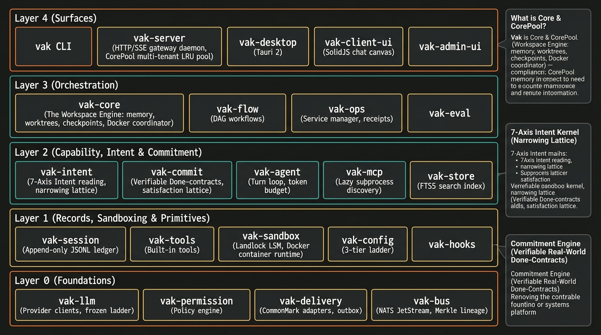
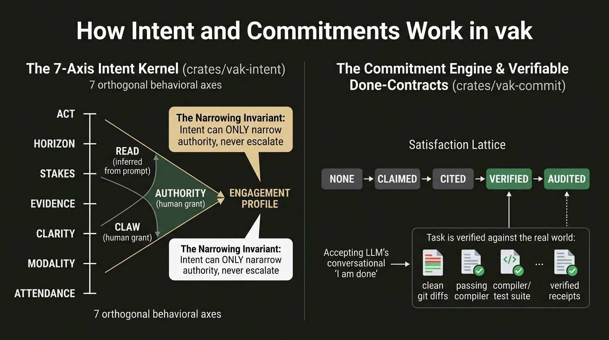
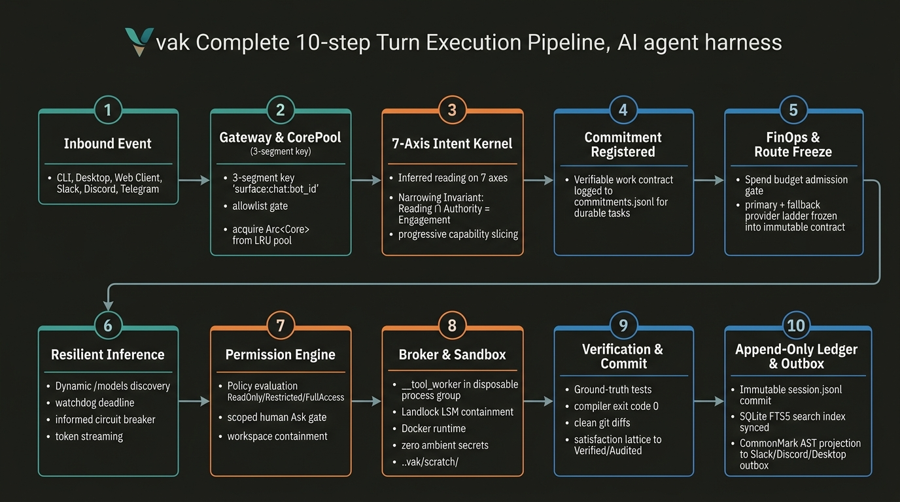

# vak System Architecture: Layer-by-Layer Engineering Specification

> **Status:** Production Architecture Specification (v3.0.29)  
> **Workspace:** [vakcoder](file:///Users/nisheethranjan/Projects/vakcoder)  
> **Core Architecture:** Five Dependency Layers (L0–L4), "One Core, Many Surfaces", Brokered Sandbox Isolation, 7-Axis Intent Kernel, Verifiable Commitment Contracts, Append-Only Ledgers.

---

## 1. Architectural Philosophy: The Sovereign Harness

Most agent frameworks treat the Large Language Model as an unconstrained, ambient orchestrator. The model executes arbitrary Python scripts or shell commands on the host machine, holding ephemeral state in volatile memory, rewriting conversation history at will, and declaring tasks "done" merely because it finished generating tokens.

**vak** rejects this model in favor of a strict systems-engineering discipline:

1. **One Core, Many Surfaces:** A single, auditable Rust engine (`vak-core`) powers the terminal CLI, a native Tauri desktop app, an embedded SolidJS web client, an HTTP/SSE server, and chat bridges (Slack, Discord, Telegram). No surface has privileged shortcuts or divergent behavior.
2. **Model-Visible Means Logged (Append-Only Ledgers):** The source of truth is strictly an append-only JSONL ledger (`vak-session`). Every prompt sent to a model is 100% reconstructable via `derive_messages()`. Compaction and branching append new records (`parent_id`) rather than mutating history.
3. **Intent Can Only Narrow, Never Escalate:** The 7-axis Intent Kernel (`vak-intent`) analyzes user intent to calculate an engagement profile that strictly narrows authority. An intent classification can never grant additional capabilities.
4. **Verifiable Done-Contracts (Commitments):** In `vak-commit`, a task is not complete when the model stops talking. Completion is measured against real-world evidence (passing test suites, zero compiler exit codes, clean diffs, and cryptographic receipts).
5. **Broker-Isolated Sandboxing:** Subprocesses never inherit ambient environment credentials or access the host filesystem unconstrained. Built-in tools cross a broker boundary (`__tool_worker`) into disposable process groups sandboxed by Linux Landlock LSM syscalls or Docker containers.

---

## 2. Layer-by-Layer Architecture: The 5-Tier Dependency Stack

The system is strictly ordered into 5 vertical dependency layers. Dependencies flow strictly downwards: **Layer $N$ may only import Layer $< N$**.



```
┌─────────────────────────────────────────────────────────────────────────────┐
│                          LAYER 4: SURFACES & INGRESS                        │
│   vak (CLI)  •  vak-server (HTTP/SSE Gateway)  •  vak-desktop (Tauri 2)     │
│   vak-client-ui (SolidJS Canvas)  •  vak-admin-ui  •  vak-tray (Menu Bar)   │
└──────────────────────────────────────┬──────────────────────────────────────┘
                                       │ composes & exposes ↓
┌──────────────────────────────────────▼──────────────────────────────────────┐
│                        LAYER 3: WORKSPACE ORCHESTRATION                     │
│    vak-core (The Workspace Engine)  •  vak-flow (DAG Workflows)             │
│    vak-ops (Service Lifecycle & Ops Center)  •  vak-eval (Harness Evals)    │
└──────────────────────────────────────┬──────────────────────────────────────┘
                                       │ drives ↓
┌──────────────────────────────────────▼──────────────────────────────────────┐
│              LAYER 2: CAPABILITY ENGINES, INTENT & COMMITMENTS              │
│    vak-intent (7-Axis Intent Kernel)  •  vak-commit (Done-Contracts)        │
│    vak-agent (Execution Turn Loop)  •  vak-mcp (Subprocess Tool Discovery)  │
│    vak-store (Rebuildable SQLite FTS5 Index)                                │
└──────────────────────────────────────┬──────────────────────────────────────┘
                                       │ builds on ↓
┌──────────────────────────────────────▼──────────────────────────────────────┐
│               LAYER 1: RECORDS, SANDBOXING & PRIMITIVES                     │
│    vak-session (Append-Only Ledgers)  •  vak-sandbox (Landlock / Docker)    │
│    vak-tools (Brokered Tools)  •  vak-config (3-Tier Hierarchy)             │
│    vak-hooks (Deterministic Lifecycle Filters)  •  vak-plugin (Signed Reg)  │
└──────────────────────────────────────┬──────────────────────────────────────┘
                                       │ rests on ↓
┌──────────────────────────────────────▼──────────────────────────────────────┐
│                            LAYER 0: FOUNDATIONS                             │
│    vak-llm (Multi-Provider Frozen Ladder)  •  vak-permission (Policy Engine) │
│    vak-delivery (CommonMark Adapters)  •  vak-bus (NATS JetStream + Merkle) │
└─────────────────────────────────────────────────────────────────────────────┘
```

---

## 3. Deep-Dive: What is `Core` and what is `CorePool`?

One of the most frequent architectural misunderstandings is conflating `Core` with `CorePool`. They operate at fundamentally different layers:


### What is `Core`? ([`crates/vak-core`](file:///Users/nisheethranjan/Projects/vakcoder/crates/vak-core))
`Core` is the stateful orchestrator of a **single workspace** (e.g., a specific Git repository or working directory). It resides in **Layer 3** and holds the runtime context for that directory:

1. **Workspace Configuration & Secrets:** Loads project-level `.vak/config.toml` merged with the user's shared `~/vak-home/.vak/config.toml`. It resolves Git-ignored project credentials without leaking them to subprocesses.
2. **Session Manager:** Manages the append-only JSONL ledgers in `<workspace>/.vak/sessions/`. It enforces session ledger locks so concurrent requests to the same session do not corrupt state.
3. **Provider Registry & Discovered Model Cache:** Manages provider credentials (Anthropic, OpenAI, OpenRouter, Gemini, Ollama) and memoizes dynamic `GET /models` discovery queries with a 5-minute TTL cache.
4. **Workspace Permission Engine:** Enforces the workspace's active security ceiling (`ReadOnly`, `Restricted`, or `FullAccess`) and evaluates rule sets.
5. **Worktree & Checkpoint Store:** Manages isolated Git worktrees for parallel execution branches and stores non-destructive checkpoint deltas.
6. **Sandbox Coordinator:** Coordinates whether tool execution runs natively, under Linux Landlock LSM containment, or inside an isolated Docker container image.
7. **Personal Memory & Skills:** Loads `USER.md` profile memory, persistent project instructions (`AGENTS.md`), and local workspace skills.

### What is `CorePool`? ([`crates/vak-server`](file:///Users/nisheethranjan/Projects/vakcoder/crates/vak-server))
When vak runs as a daemon or multi-tenant gateway (`vak serve --gateway`), a single server process may receive requests for dozens of different projects—such as a developer asking questions about `Repo-A` from the CLI while a Slack bridge issues automated queries against `Repo-B`.

`CorePool` is an **LRU (Least Recently Used) cache of active `Arc<Core>` instances** residing in **Layer 4**:

- **Avoiding Reinitialization Overhead:** Initializing a workspace `Core` involves reading Git history, compiling ignore rules, checking worktree status, and loading config. `CorePool` keeps warm workspaces in memory.
- **Bounded Memory Footprint (4 + 1 Slots):** By default, `CorePool` holds 4 warm workspaces plus 1 pinned default workspace (`~/vak-home`). When a request arrives for a 5th workspace, the least recently used idle `Core` is gracefully flushed and evicted.
- **Tenant Isolation:** Every workspace has its own independent `Arc<Core>`, its own append-only ledger path, its own permission engine, and its own session lock. Tenant A cannot see Tenant B's files, secrets, or session logs.
- **Security Ceiling Refresh on Cache Hits:** When a warm `Core` is retrieved from the pool, `CorePool` re-verifies the persisted security ceiling in `.vak/config.toml`. If permissions were narrowed on disk, the cached `Core` revokes active capabilities immediately before servicing the request.

---

## 4. Deep-Dive: The `Intent` Kernel (`vak-intent`)

Most agent systems rely on brittle keyword matching (e.g., checking if a user said "please create a file") or open-ended subject-matter taxonomies ("coding", "marketing", "math"). Subject-matter categories fail because "coding" does not indicate whether the model should explain an algorithm, search for a bug, or execute a destructive production deploy.

In vak, **[`crates/vak-intent`](file:///Users/nisheethranjan/Projects/vakcoder/crates/vak-intent)** implements a **7-Axis Behavioral Intent Kernel**:



### The 7 Orthogonal Behavioral Axes
Every inbound user turn is evaluated across seven orthogonal dimensions:

| Axis | Values | Subsystem Driven |
|---|---|---|
| **`act`** | `converse`, `answer`, `locate`, `analyze`, `author`, `modify`, `operate`, `verify`, `orchestrate`, `govern` | **Capability Slicing & Stop Profile:** Dictates which tools are exposed and how the turn completes. |
| **`horizon`** | `immediate`, `turn`, `session`, `durable` | **Admission & Context:** Determines if the request is single-turn or promoted to a long-horizon managed commitment. |
| **`stakes`** | `inert`, `reversible`, `costly`, `irreversible` | **Safety Ceilings & Checkpoints:** Dictates whether an automatic checkpoint is captured before execution and whether human approval is required. |
| **`evidence`** | `none`, `cited`, `verified`, `audited` | **Done-Contract Threshold:** Dictates the minimum evidence required before work can be declared satisfied. |
| **`clarity`** | `clear`, `underspecified`, `ambiguous` | **Disambiguation Policy:** High stakes + ambiguous $\rightarrow$ ask human; Low stakes + ambiguous $\rightarrow$ proceed on stated assumption. |
| **`modality`** | `text`, `image`, `audio`, `video`, `screen`, `data`, `stream` | **Route Filtering:** Filters provider ladder for multimodal capabilities. |
| **`attendance`**| `interactive`, `supervised`, `unattended` | **Human-in-the-Loop:** Dictates approval timeout behavior (unattended fails closed). |

### The Narrowing Invariant
The fundamental mathematical contract of `vak-intent` is the **Narrowing Lattice**:

$$\text{Engagement Profile} = \text{Reading} \cap \text{Authority}$$

- **Reading:** Inferred by the intent classifier from the user prompt.
- **Authority:** Explicitly granted by human policy (e.g., `Restricted` mode).
- **The Invariant:** A misread intent can only cause a worse turn (e.g., asking for clarification or refusing to edit a file). **It can NEVER widen authority or bypass a security gate.** If a user prompt asks a question (`act = answer`), write permissions are stripped from the turn even if the workspace is in `FullAccess`.

### Progressive Capability Slicing
Instead of dumping 50+ tool schemas, skills, and MCP definitions into the LLM system prompt on every turn, `vak-intent` extracts a minimal **Capability Slice**. If `act = answer`, file editing and Bash tools are omitted from the model's tool definitions entirely, reducing token spend, eliminating hallucinated tool calls, and preventing prompt-injection attacks.

---

## 5. Deep-Dive: The `Commitment` Engine (`vak-commit`)

In standard agent architectures, a task ends when "the model stopped generating text." This leads to premature completion errors where the agent claims: *"I have fixed the issue and all tests pass!"* without actually compiling the code or running the test suite.

**[`crates/vak-commit`](file:///Users/nisheethranjan/Projects/vakcoder/crates/vak-commit)** decouples task satisfaction from conversational output:

### The Satisfaction Lattice
A commitment transitions through five discrete satisfaction states:

$$\text{None} \longrightarrow \text{Claimed} \longrightarrow \text{Cited} \longrightarrow \text{Verified} \longrightarrow \text{Audited}$$

1. **`None`:** The commitment is registered but no work has been produced.
2. **`Claimed`:** The LLM claims it has completed the work in text. (vak **refuses** to close tasks at this stage).
3. **`Cited`:** The model points to specific line numbers, logs, or artifact paths.
4. **`Verified`:** The runtime independently verifies ground-truth reality:
   - Compiler/Linter exit code equals `0`.
   - Test suite passes cleanly.
   - Non-empty Git diff matching expected file patterns.
   - External verification receipt recorded.
5. **`Audited`:** Cryptographically signed receipt with Merkle lineage stored in the ledger.

### Long-Horizon Portfolio Scheduler
When a commitment outlives an interactive session (`horizon = durable`), it is registered in the workspace's durable commitment ledger (`commitments.jsonl`). A background tick inspects wake conditions, evaluates real-world predicates without consuming LLM tokens, and alerts the operator via notifications when state changes occur.

---

## 6. Detailed Walkthrough of All 5 Layers

### Layer 0: Foundations (Zero Workspace Dependencies)
- **[`crates/vak-llm`](file:///Users/nisheethranjan/Projects/vakcoder/crates/vak-llm):** The unified inference abstraction.
  - *Dynamic Model Discovery:* Calls `GET /models` directly against provider keys.
  - *Frozen Route Ladder:* Commits an immutable ordered list of model fallbacks at turn admission.
  - *FinOps Admission Gate:* Evaluates token budgets before dispatch.
  - *Circuit Breaker:* Informed transience (HTTP 429 with `Retry-After`) feeds endurance waits without tripping the breaker; blind network collapses trip the breaker to fail fast.
- **[`crates/vak-permission`](file:///Users/nisheethranjan/Projects/vakcoder/crates/vak-permission):** The core security kernel.
  - Evaluates action requests against security modes (`ReadOnly`, `Restricted`, `FullAccess`).
  - Evaluates channel capability overlays and scopes approvals.
- **[`crates/vak-delivery`](file:///Users/nisheethranjan/Projects/vakcoder/crates/vak-delivery):** Outbound communication layer.
  - Converts internal agent events into CommonMark AST (`pulldown-cmark`).
  - Projects semantic adapter payloads for Slack, Discord, Telegram, and Webhook channels.
  - Durable retry outbox queue ensures delivery over unstable networks.
- **[`crates/vak-bus`](file:///Users/nisheethranjan/Projects/vakcoder/crates/vak-bus):** Distributed event fabric.
  - High-throughput messaging backed by NATS Core and NATS JetStream.
  - AES-256-GCM envelope payload encryption.
  - W3C Trace Context and Merkle causal lineage tracking for distributed swarms.

### Layer 1: Records, Sandboxing & Primitives
- **[`crates/vak-session`](file:///Users/nisheethranjan/Projects/vakcoder/crates/vak-session):** Append-only JSONL ledger. Every event (user input, model chunk, tool call, error, partial output) is appended immutably. Prompt histories are derived via `derive_messages()`.
- **[`crates/vak-tools`](file:///Users/nisheethranjan/Projects/vakcoder/crates/vak-tools):** Built-in tools (`bash`, `read_file`, `write_file`, `edit_file`, `list_dir`, `grep_search`, `web_fetch`, `browse`). Executes via `__tool_worker`.
- **[`crates/vak-sandbox`](file:///Users/nisheethranjan/Projects/vakcoder/crates/vak-sandbox):** Process isolation mechanisms.
  - Linux Landlock LSM syscall filters restricting filesystem access to the workspace root.
  - Quarantined scratch directory at `.vak/scratch/`.
  - Docker container execution backend.
- **[`crates/vak-config`](file:///Users/nisheethranjan/Projects/vakcoder/crates/vak-config):** 3-tier configuration hierarchy (Shared User `~/vak-home/.vak/config.toml` $\rightarrow$ Workspace `.vak/config.toml` $\rightarrow$ Scoped Session Pins).
- **[`crates/vak-hooks`](file:///Users/nisheethranjan/Projects/vakcoder/crates/vak-hooks):** Pre-turn, post-turn, and command interceptors.
- **[`crates/vak-plugin`](file:///Users/nisheethranjan/Projects/vakcoder/crates/vak-plugin):** Signed plugin registry with Ed25519 verification (`ring`).

### Layer 2: Capability Engines, Intent & Commitments
- **[`crates/vak-intent`](file:///Users/nisheethranjan/Projects/vakcoder/crates/vak-intent):** 7-Axis Intent Kernel, Narrowing Lattice, and Capability Slicing.
- **[`crates/vak-commit`](file:///Users/nisheethranjan/Projects/vakcoder/crates/vak-commit):** Commitment ledger, Satisfaction Lattice, and verifiable Done-Contracts.
- **[`crates/vak-agent`](file:///Users/nisheethranjan/Projects/vakcoder/crates/vak-agent):** The agent turn loop. Handles prompt construction, token budgeting, non-destructive context compaction, and delta+snapshot streaming.
- **[`crates/vak-mcp`](file:///Users/nisheethranjan/Projects/vakcoder/crates/vak-mcp):** Model Context Protocol client manager with lazy subprocess discovery.
- **[`crates/vak-store`](file:///Users/nisheethranjan/Projects/vakcoder/crates/vak-store):** SQLite FTS5 rebuildable search index over session ledgers.

### Layer 3: Workspace Orchestration
- **[`crates/vak-core`](file:///Users/nisheethranjan/Projects/vakcoder/crates/vak-core):** The unified workspace orchestrator ("One Core"). Combines all L0–L2 engines into a single workspace context.
- **[`crates/vak-flow`](file:///Users/nisheethranjan/Projects/vakcoder/crates/vak-flow):** Static and dynamic DAG execution engine.
- **[`crates/vak-ops`](file:///Users/nisheethranjan/Projects/vakcoder/crates/vak-ops):** Operations Center engine (`/ops/center`), service lifecycle (macOS launchd / Linux systemd), telemetry, and before/after verification receipts (`actions.jsonl`).
- **[`crates/vak-eval`](file:///Users/nisheethranjan/Projects/vakcoder/crates/vak-eval):** Automated regression and benchmark harness.

### Layer 4: Surfaces & Ingress
- **[`crates/vak`](file:///Users/nisheethranjan/Projects/vakcoder/crates/vak):** CLI binary providing commands like `vak exec`, `vak plan`, `vak doctor`, and `vak config`.
- **[`crates/vak-server`](file:///Users/nisheethranjan/Projects/vakcoder/crates/vak-server):** Axum HTTP/SSE server, `CorePool` multi-tenant manager, gateway allowlist, and WebSocket terminal.
- **[`crates/vak-desktop`](file:///Users/nisheethranjan/Projects/vakcoder/crates/vak-desktop):** Native Tauri 2 desktop application.
- **[`crates/vak-client-ui`](file:///Users/nisheethranjan/Projects/vakcoder/crates/vak-client-ui):** SolidJS workspace UI (chat canvas, diff inspector, test matrix, interactive telemetry).
- **[`crates/vak-admin-ui`](file:///Users/nisheethranjan/Projects/vakcoder/crates/vak-admin-ui):** Embedded SolidJS admin console at `/admin`.
- **[`crates/vak-tray`](file:///Users/nisheethranjan/Projects/vakcoder/crates/vak-tray):** OS system tray status controller.

---

## 7. The End-to-End Execution Turn: How All Pieces Wire Together

To observe how all crates collaborate during a single user request, follow the end-to-end 10-step execution pipeline:



### Stage-by-Stage Operational Walkthrough:

1. **Stage 1: Inbound Event (Client Ingress)**
   - Inbound triggers arrive via interactive CLI (`vak exec`), Tauri desktop, embedded SolidJS browser client, or external channel bridges (Slack, Discord, Telegram).
   - Inbound requests are normalized into typed payloads with verified caller metadata.

2. **Stage 2: Gateway & CorePool (`vak-server`)**
   - The gateway parses the 3-segment identity key: `surface:chat:bot_id`. This prevents shared-bot collisions and enforces multi-bot isolation.
   - Evaluates `<sessions_home>/gateway/allowlist.json`. Unknown or unverified senders land in a reviewable `pending` state (fail-closed).
   - Acquires the active workspace's thread-safe `Arc<Core>` from the `CorePool` LRU cache (4+1 slots), re-verifying the persisted security ceiling on cache hits.

3. **Stage 3: 7-Axis Intent Kernel (`vak-intent`)**
   - Inbound user prompts are evaluated across 7 orthogonal behavioral axes (`act`, `horizon`, `stakes`, `evidence`, `clarity`, `modality`, `attendance`).
   - Applies the **Narrowing Invariant**: $\text{Reading} \cap \text{Authority} = \text{Engagement Profile}$. The intent reading can only narrow permissions, never widen them.
   - Emits a **Progressive Capability Slice**: only the tools, skills, and MCP servers strictly required for this engagement profile are exposed to the prompt.

4. **Stage 4: Commitment Registered (`vak-commit`)**
   - If `horizon >= durable`, the request represents long-horizon work that outlives a single interactive turn.
   - A `DurableCommitment` is registered in `commitments.jsonl` with explicit, verifiable done-conditions and satisfaction criteria.

5. **Stage 5: FinOps Admission & Route Freeze (`vak-llm`)**
   - The FinOps admission gate checks the workspace's token and financial budget ceiling prior to making any external network requests.
   - Freezes the **Provider Route Ladder** (primary model + deterministic fallback order) into an immutable contract for the duration of the session.

6. **Stage 6: Resilient Inference (`vak-llm` & `vak-agent`)**
   - Provider clients query dynamic `/models` discovery caches (5-min TTL).
   - The turn loop streams deltas and snapshots under per-step watchdog deadlines.
   - Informed transience (HTTP 429 with `Retry-After`) feeds endurance wait loops, while blind network collapses trip the circuit breaker to fail fast.

7. **Stage 7: Permission Engine & Human Gate (`vak-permission`)**
   - Intercepts proposed tool invocations and evaluates them against the active security mode (`ReadOnly`, `Restricted`, `FullAccess`).
   - Verifies strict workspace boundary containment (rejecting path traversal escapes and symlinks).
   - If an operation requires escalation, a scoped `Ask` human-in-the-loop prompt is issued. Unattended surfaces fail closed upon timeout.

8. **Stage 8: Sandboxed Broker Execution (`vak-tools` & `vak-sandbox`)**
   - Tools execute across the `__tool_worker` IPC broker in disposable process groups.
   - Sanitized environment variable allowlists ensure provider API keys and system secrets are never passed to subprocesses.
   - Confined by Linux Landlock LSM syscall filters, Docker container images, and quarantined scratch isolation (`.vak/scratch/`).

9. **Stage 9: Verification & Ground-Truth Commit (`vak-commit`)**
   - Evaluates real-world ground-truth predicates (compiler exit code `0`, clean git diffs, passing test suites, external receipts).
   - Advances the commitment's state along the Satisfaction Lattice: $\text{Claimed} \rightarrow \text{Cited} \rightarrow \text{Verified} \rightarrow \text{Audited}$, refusing to close work on conversational model claims alone.

10. **Stage 10: Append-Only Ledger Commit & Outbox Delivery (`vak-session` & `vak-delivery`)**
    - The turn event, partial outputs, tool results, and receipts are immutably appended to `session.jsonl`. Every prompt remains 100% reconstructable via `derive_messages()`.
    - SQLite FTS5 search index is updated in the background.
    - `vak-delivery` projects CommonMark AST envelopes into the durable outbox queue for guaranteed, ordered delivery across Slack, Discord, Telegram, and desktop canvases.

---

## 8. Summary: Why This Architecture Matters

| Dimension | Typical AI Agent Platforms | vak Architecture |
|---|---|---|
| **Architecture** | Scattered scripts or monolithic Python apps | **Strict 5-layer Rust dependency hierarchy**; no upward dependencies. |
| **Workspace Scope** | Single global state or re-instantiated per turn | **`Core` for workspace state**, **`CorePool` for LRU multi-tenant pooling**. |
| **Intent Understanding** | Keyword string checks or loose taxonomy | **7-Axis Behavioral Intent Kernel** with the **Narrowing Invariant**. |
| **Task Completion** | Model claims "I am done" in conversation | **Verifiable Done-Contracts** evaluated against compiler exits and git diffs. |
| **Execution Security** | Unsandboxed `subprocess.run()` with ambient keys | **`__tool_worker` IPC broker**, Landlock LSM, Docker runtime, zero ambient secrets. |
| **Session Integrity** | Ephemeral, destructively rewritten chat history | **Append-only JSONL ledgers**; every model input reconstructable via `derive_messages()`. |
