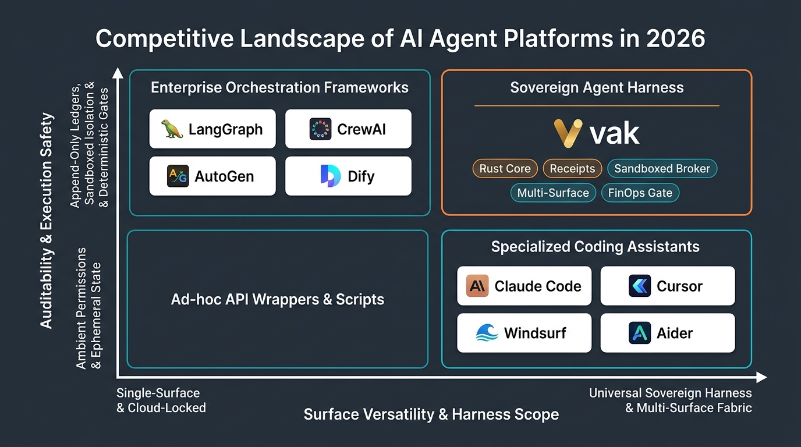

# AI Agent Market Landscape & Strategic Positioning (2026 Edition)

> **Document Type:** Industry Analysis, Competitive Intelligence & Platform Strategy  
> **Market Focus:** Autonomous Agent Platforms, Developer Tooling & Enterprise Harnesses  
> **Subject Platform:** **vak** (v3.0.29)

---

## 1. Executive Summary & The 2026 Market Shift

In 2024–2025, the AI industry focused primarily on raw foundation model capabilities: reasoning benchmarks, larger context windows, and multi-modal inputs. By 2026, however, the industry encountered what system architects term **"The Harness Problem"**:

> *A frontier reasoning model without a deterministic, secure, and auditable harness is dangerous in production, fragile in execution, and financially unconstrained.*

Enterprises and security-conscious engineers have discovered that deploying autonomous agents into real developer environments and business workflows introduces critical operational vulnerabilities:
- **Ambient Secret Leaks:** Subprocesses inheriting host daemon environments, leaking production API keys to unvetted scripts and dependencies.
- **Unbounded FinOps Waste:** Unconstrained agent retry loops burning thousands of dollars in tokens on single circular debugging sessions.
- **Black-Box Ephemeral State:** History rewritten on the fly, non-reconstructable prompts, and zero audit trails for compliance or post-mortem investigations.
- **Surface Fragmentation:** Disconnected silos where a vendor’s CLI operates differently from their web app, which in turn behaves differently from their Slack integration.

**vak** was engineered from inception to solve the Harness Problem. By implementing an immutable, append-only ledger system, strict process broker isolation, a 7-axis intent kernel, and a "One Core, Many Surfaces" architecture, vak positions itself as the industry's premier **Sovereign Agent Harness**.

---

## 2. Competitive Landscape & Positioning Matrix

The market can be evaluated across two foundational axes:
1. **Auditability & Execution Safety (Vertical Axis):** Ranging from ambient process permissions and ephemeral, rewritten state at the bottom, to append-only ledgers, broker-isolated sandboxing, and deterministic human-in-the-loop gates at the top.
2. **Surface Versatility & Harness Scope (Horizontal Axis):** Ranging from single-surface, cloud-locked assistants at the left, to universal sovereign harnesses with distributed multi-surface fabrics at the right.

### The Four Market Archetypes

#### 1. Sovereign Agent Harness (Top-Right: vak)
- **Characteristics:** Local-first, high-performance systems language (Rust), complete data sovereignty, verifiable work receipts, append-only ledgers, broker-isolated subprocess sandboxes, and unified execution across CLI, Desktop, Web, and Channel Bridges.
- **Market Leader:** **vak**.

#### 2. Specialized Coding Assistants (Bottom-Right: Claude Code, Cursor, Windsurf, Aider)
- **Characteristics:** Highly optimized for developer productivity inside code editors or terminals. Exceptional code suggestion loops and diff generation.
- **Limitations:** Typically tied to a single vendor or proprietary interface (terminal-only or IDE-only). Tools run with ambient user privileges, and prompts/sessions are generally not reconstructable or tamper-evident.

#### 3. Enterprise Orchestration Frameworks (Top-Left: LangGraph, CrewAI, AutoGen, Dify)
- **Characteristics:** High-level abstractions for defining multi-agent graph topologies, workflows, and state-machine transitions. Often targeted at enterprise automation.
- **Limitations:** Heavily tied to Python/Node runtimes with significant memory overhead. Subprocesses lack OS-level sandboxing; state is frequently held in ephemeral memory or complex external databases without cryptographic lineage.

#### 4. Ad-hoc API Wrappers & Scripts (Bottom-Left)
- **Characteristics:** Minimalist scripts wrapping LLM function-calling endpoints.
- **Limitations:** High fragility, no error recovery, no budget enforcement, no security boundaries.

---

## 3. Comprehensive Feature-by-Feature Benchmark Matrix

The following matrix compares **vak** against the leading representative platforms across all major architectural criteria:

| Evaluation Dimension | **vak (v3.0.29)** | **Claude Code** | **Cursor / Windsurf** | **LangGraph / CrewAI** | **OpenHands (SWE-agent)** |
|:---|:---:|:---:|:---:|:---:|:---:|
| **Core Runtime Engine** | **Rust (Zero-cost async)** | Node.js / TypeScript | Electron / Node.js | Python | Python / Docker |
| **Surface Architecture** | **One Core, Many Surfaces** (CLI, Desktop, Web, Slack, Discord, Telegram) | CLI terminal only | IDE Editor fork | Web UI / Python SDK | Web UI / Headless |
| **Session State Ledger** | **Append-only JSONL** (`derive_messages()` reconstructable) | Ephemeral / JSON session | Proprietary cloud sync | SQLite / Redis graph state | Ephemeral container files |
| **Process Isolation** | **Broker boundary** (`__tool_worker` + Landlock/Docker) | Host process execution | Host process execution | Ambient Python process | Docker container |
| **Secrets Containment** | **Sanitized allowlist**; API keys denied to subprocesses | Ambient env inherited | Ambient env inherited | Ambient env inherited | Container env injection |
| **Model Freedom** | **Fully agnostic** (Anthropic, OpenAI, Gemini, Ollama, OpenRouter) | Vendor-tied (Anthropic Claude only) | Multi-model (Cloud proxy) | Provider agnostic | Provider agnostic |
| **Model Discovery** | **Dynamic `/models` discovery** (No static baked lists) | Hardcoded models | Hardcoded models | Manual string config | Manual string config |
| **Provider Fallback & Retries** | **Frozen Route Ladder** + Circuit Breakers | Hardcoded provider retries | Cloud proxy failover | Custom user error handlers | Custom retry loop |
| **Budget & FinOps** | **Admission Gate** (Budget cap before dispatch) | None (Billed to API key) | Subscription / Usage quota | Manual external tracking | Manual token caps |
| **Intent & Engagement** | **7-Axis Intent Kernel** (Narrowing-only privileges) | Heuristic / None | Heuristic / None | Custom Graph edge logic | Prompt heuristics |
| **Work Contracts** | **Durable Commitments** (Verifiable against reality) | Model self-declaration | Model self-declaration | Workflow termination node | Benchmark test suite |
| **Distributed Mesh** | **NATS JetStream + Merkle Lineage** (`vak-bus`) | None | None | LangGraph Cloud / Celery | None |
| **Administrative Control** | **Embedded SolidJS SPA** (`/admin`) + Ops Center | None | Cloud team dashboard | Custom enterprise server | Basic web dashboard |

---

## 4. Strategic Moats & Differentiating Value Propositions

### Moat 1: "One Core, Many Surfaces" Consistency
Most agent tools force users to choose between an IDE extension, a terminal utility, or a web chatbot. If a team uses multiple surfaces, policies and behavior drift apart.  
**vak's differentiator:** A single Rust core binary powers:
- Interactive terminal workflows (`vak exec`, `vak plan`).
- Native Tauri 2 desktop experience (`vak-desktop`).
- Embedded, responsive SolidJS browser client (`vak-client-ui` at `/app`).
- Multi-tenant HTTP/SSE daemon with cookie auth (`vak-server`).
- Multi-bot remote team bridges (Slack, Discord, Telegram with 3-segment identity resolution).

Every surface uses the **identical permission engine, identical session ledger, and identical tool broker**.

### Moat 2: Uncompromised Auditability (The Append-Only Ledger)
In regulated enterprise environments (FinTech, HealthTech, Defense, Critical Infrastructure), black-box AI behavior is a compliance blocker.  
**vak's differentiator:** vak enforces that **model-visible means logged**. Every prompt sent to an LLM must be 100% reconstructable from the raw JSONL ledger using `derive_messages()`. Checkpoints are stored as non-destructive deltas; branching creates clean parent pointers without mutating previous records. If an agent deletes a file or pushes a commit, an immutable audit receipt is permanently recorded in `actions.jsonl`.

### Moat 3: Subprocess Sandboxing & Secrets Hygiene
Conventional agents run shell tools by invoking `subprocess.run()` with the parent process environment. This exposes API keys, SSH keys, and tokens to any downloaded script or hallucinated pip package.  
**vak's differentiator:** The execution broker (`__tool_worker`) spawns tools in disposable process groups with sanitized environment variable allowlists. Provider keys live outside git and are never ambient. On Linux, kernel Landlock LSM syscalls restrict filesystem access strictly to the workspace root; writes outside the root fail closed or are diverted into a quarantined `.vak/scratch/` directory.

### Moat 4: Frozen Route Ladders & FinOps Cost Predictability
Agent loops frequently get trapped in circular errors, re-querying expensive frontier models and exhausting monthly budgets in minutes.  
**vak's differentiator:** vak decouples model discovery from static code by dynamically querying provider `/models` endpoints. At session admission, a **Frozen Route Ladder** is committed. Walking the ladder never changes the contractual terms of the run. A strict FinOps admission gate rejects requests before network dispatch if token or budget allocations are breached.

### Moat 5: 7-Axis Intent Kernel & Verifiable Commitments
Standard agent systems rely on the LLM to decide when a task is "done", leading to premature celebration where the agent claims an issue is resolved despite failing unit tests.  
**vak's differentiator:** The 7-axis intent classifier evaluates user intent to narrow permissions (e.g., questions cannot trigger file writes). Long-horizon work generates a `DurableCommitment` managed by `vak-commit`, which verifies real-world criteria (clean git diffs, passing compiler checks, zero exit codes) before acknowledging completion.

### Moat 6: Distributed Event Fabric (`vak-bus`)
For enterprise deployments requiring multi-node coordination, vak is equipped with `vak-bus`:
- NATS Core and JetStream backing.
- AES-256-GCM envelope payload encryption.
- Merkle causal lineage trees guaranteeing verifiable provenance across distributed agent clusters.

---

## 5. Ideal Customer Profiles (ICPs) & Target Markets

### 1. Solo Security-Conscious Technical Power Users
- **Profile:** Senior software engineers, security researchers, and systems architects working on proprietary local repositories.
- **Pain Point:** Want the coding speed of Claude Code or Cursor, but refuse to transmit proprietary code to closed cloud mirrors or grant un-sandboxed shell access to their primary workstation.
- **vak Solution:** 100% local-first, OS Landlock sandboxing, complete API key quarantine, and transparent JSONL session logging.

### 2. Enterprise Platform & DevOps Engineering Teams
- **Profile:** Engineering directors responsible for internal developer platforms, automated triage bots, and continuous operations.
- **Pain Point:** Teams want to deploy agent automation across Slack, web portals, and CI/CD pipelines, but cannot tolerate fragmented architectures, unbudgeted API consumption, or lack of audit trails.
- **vak Solution:** "One Core, Many Surfaces" enables uniform multi-bot deployment across Slack/Discord; `vak-server` provides multi-tenant `CorePool` management; and `/ops/center` delivers real-time incident verification receipts.

### 3. Regulated Industry Organizations (FinTech, MedTech, GovTech)
- **Profile:** Compliance, InfoSec, and CISO teams evaluating generative AI tools.
- **Pain Point:** Absolute prohibition against black-box LLM systems that do not maintain immutable audit records or that allow arbitrary out-of-bounds network transmission.
- **vak Solution:** Append-only JSONL ledgers with deterministic reconstruction, fail-closed gateway allowlists, and cryptographic Merkle lineage via `vak-bus`.

---

## 6. Strategic Outlook (2026 and Beyond)

As frontier models approach parity in general reasoning, the competitive moat in agentic AI has decisively migrated to **the harness**. Platforms that provide reliable runtime isolation, verifiable contracts, transparent cost controls, and architectural versatility will dominate enterprise and developer adoption.

By combining the speed and safety of Rust with rigorous systems engineering, **vak** is uniquely positioned not merely as an alternative coding tool, but as the foundational agent harness for the autonomous computing era.
