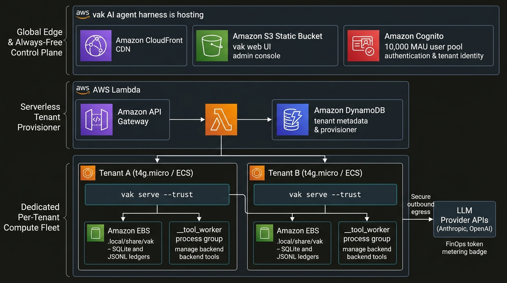
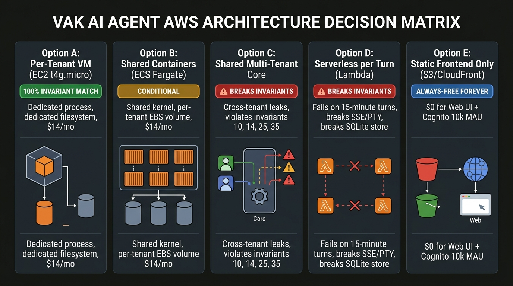

# Observation: hosting vak on AWS as a per‑tenant engine — individuals vs orgs/enterprises

Status: research observation, 2026-09-08.
Companions: `cost-model.md` (AWS Free Tier + per‑tenant economics),
`decision-matrix.md` (architecture options vs vak invariants).

## 1. What "host vak on AWS" actually means today

vak (workspace 3.0.26) is, by explicit design, **single‑tenant / single‑operator**.
- `docs/design/48-web-client.md`, Non‑goals: *"Multi‑user / multi‑tenant cloud.
  Phase D sketches the seams; it is **not in the shipping scope**. Until then a
  deployment is **one operator's** vak, and the auth model says so honestly."*
- `docs/design/34-channel-onboarding.md`, Phase 2 "What stays single‑process":
  *"A workspace that genuinely needs process‑level isolation (a different user
  account, a different machine) is out of scope here — that's still **'run
  another gateway process,'** unchanged from today."*
- `docs/design/34-channel-onboarding.md`, Non‑goals (still): *"No cross‑machine /
  cross‑account process isolation."*

Concretely, one deployment = one `vak serve --gateway --trust` process = one
bearer token = one data home (`<home>/.local/share/vak`) = one filesystem
root. The web/admin/console are embedded into that same binary via
`include_dir!` (`site/dist`, `client_ui/dist-web`, `admin_ui/dist`), so a
single 8901 listener serves the public site, the workspace client, the admin
panel, and the gateway API/SSE/PTY together.

**Therefore:** "host vak as the per‑tenant engine" is the *only* option that
keeps vak intact. It means: one tenant → one vak process on dedicated compute
with a dedicated workspace/data home. The decision matrix in this folder
confirms every other option (shared Core, Lambda) breaks at least one vak
invariant (10, 14, 25, 35 — workspace‑rooted FS access, brokered tool workers in
a disposable process group, fail‑closed sandboxing, scrubbed execution).

### 1.1 Architecture Blueprint: Hosting vak on AWS

The target architecture decouples the Always-Free static and control tier from dedicated, isolated tenant compute:
- **Global Edge & Always-Free Tier ($0.00 Forever):** Amazon CloudFront + Amazon S3 static bucket serving the embedded SolidJS UI bundles (`site/dist`, `client_ui/dist-web`, `admin_ui/dist`). User authentication and tenant scoping are anchored by Amazon Cognito (10,000 MAU perpetual Always-Free allowance).
- **Serverless Tenant Provisioner:** Amazon API Gateway + AWS Lambda + Amazon DynamoDB manage tenant metadata, auth verification, and container lifecycle.
- **Dedicated Per-Tenant Compute Fleet:** Each customer runs an isolated `vak serve --trust` process on a dedicated `t4g.micro` EC2 instance or dedicated ECS Fargate task with private EBS volume storage (`.local/share/vak` for SQLite index and JSONL ledgers) and `__tool_worker` process-group isolation.
- **Outbound Egress & FinOps:** Secure outbound API egress to frontier LLM providers (Anthropic, OpenAI) governed by vak's token metering and budget admission gates.

### 1.2 Architecture Decision Matrix at a Glance

As evaluated in [`decision-matrix.md`](decision-matrix.md):
- **Option A (Per-Tenant VM):** 100% Invariant Match. Dedicated process, dedicated filesystem, zero cross-tenant risk. Cost: ~$13.75/mo floor.
- **Option B (Shared Containers on ECS):** Conditional. Denser packaging, but shared Linux kernel means container escapes could compromise isolation.
- **Option C (Shared Multi-Tenant Core):** **Breaks Invariants.** Violates invariants 10, 14, 25, 35 by multiplexing un-sandboxed tenants into a single broker.
- **Option D (Serverless Lambda per Turn):** **Breaks Invariants.** Fails on 15-minute turns, breaks persistent SSE/WebSocket PTY channels, and loses warm SQLite ledger state.
- **Option E (Static Frontend Only):** Genuinely Always-Free ($0.00), perfect for web client and login, but engine requires paid compute.

---

## 2. Is "vak as the per‑tenant engine" the right choice for an *individual* customer?

### 2.1 It is architecturally correct — and vak's docs point you straight at it.
vak isolates by process + filesystem + the brokered tool worker
(`docs/design/25-docker-sandbox.md`: Seatbelt/Landlock + process‑group‑scoped
bash worker). That isolation model only makes sense if each customer gets a
real, separate process. "Per‑tenant VM" is *exactly* "run another gateway
process." No rewrite of vak is needed; you ship the same `docker/Dockerfile`
image and just run one container per customer with a private volume.

### 2.2 But it is economically brutal at the individual / consumer tier.
Per `cost-model.md`, a single always‑on tenant in us‑east‑1 (2026‑09) is
≈ **$13.75/mo** (t4g.micro $7.60 + public IPv4 $3.65 + 8 GB EBS $0.64 + a
little data). That floor never vanishes:
- The Free Plan's **$200 credit pays exactly one tenant for ~6 months**, then
  the account closes (or you convert to Paid and pay ~$14/mo).
- EC2 is **not Always‑Free** and a **public IPv4 is $0.005/hr (~$3.65/mo)**
  whether in use or idle since AWS's Nov 2023 IPv4 pricing. A reachable host
  *must* have one (or a NAT/ALB, which is more expensive).
- vak's sessions are warm for weeks and turns can run for minutes with a
  subprocess worker, so you can't time‑slice many individual tenants onto one
  shared box without breaking vak's warm session / warm worker model.

### 2.2.1 AWS Cost Model & Free Tier Economics

**Implication for individuals:** to offer vak to consumers *you must charge
≥ ~$14/mo just for bare infra* before your own margin, support, model‑API
costs, and billing. That is a non‑starter for a consumer/free tier product.
The Free Tier can subsidise at most a *handful* of beta tenants for six months.

### 2.3 Mitigations worth weighing
- **Idle shutdown.** vak doesn't natively suspend a tenant; the launcher
  (systemd/launchd under `vak-ops`, `docs/design/28-operations.md`) is the
  right seam to *stop* a tenant's unit when idle and *start* it on the next
  inbound message (Telegram bridge or a wake webhook). This trades the
  "warm‑for‑weeks" latency expectation for real money on an always‑on box —
  acceptable for personal use, hostile for collaborative/team use.
- **Shared frontend, per‑tenant engine.** Put the static public site + client
  + admin + Cognito login on S3+CloudFront (Always‑Free forever) and only
  spin up the per‑tenant `vak serve` container on demand. Still ~$14/mo for a
  tenant that is "on," but the Always‑Free frontend is genuinely free.
- **Accept it's a paid service.** The honest read of the economics: an
  individual user paying $15–25/mo for a private vak box is reasonable; a
  "free individual tier" hosted by you is not Free‑Tier‑sustainable.

### 2.4 Verdict for individuals
**Correct architecture, wrong price point for a free tier.** vak‑as‑per‑tenant
engine is the right *technical* choice (it's what the docs assume). The AWS
Free Tier only delays the cost — it cannot eliminate it. If the goal is an
individual offering, either (a) price it as a small paid service (~$15/mo),
or (b) tell individuals to run their own `vak serve` locally/on a $5 VPS and
treat the hosted gateway as a personal convenience, not a revenue tier.

---

## 3. What if we go up‑market — orgs and enterprises?

### 3.1 The per‑tenant VM model survives, but the bill and the requirements grow.
For an org/enterprise tenant, "run another gateway process" still holds:
dedicated compute, dedicated data home, dedicated trust. But enterprise
tenants buy a different package:

- **Bigger boxes.** Concurrent sessions/teams need more than 1 GB. Sizing:
  `t3a.small` (2 GB ~$16/mo) or `m6i.large` (4 GB ~$70/mo). With multi‑AZ HA
  (2× compute) the headline is ~$40–60+/mo *before* egress and support
  (`cost-model.md` §1.6).
- **No public IP / private networking.** Enterprises demand private subnets,
  VPC endpoints for provider APIs, and outbound via NAT (Gateway) rather than
  a public IPv4. NAT Gateway is **$0.045/hr + $0.045/GB** — a per‑tenant cost
  the Free Tier never reaches.
- **Compliance & audit.** vak already records append‑only receipts (work
  receipts, commitment ledger, `operations/incidents.jsonl` and
  `operations/actions.jsonl` — see AGENTS.md §26/§24/§47). For enterprise you
  still need SOC‑2‑ish controls, per‑tenant backup/export (`docs/hosting.md`
  §Backup = copy the data home), and SIEM ingestion — all separate spend.
- **Multi‑user *within* a tenant.** vak is one‑operator. An enterprise tenant
  will ask for teams/roles/SSO group mapping. vak doesn't have this; you'd
  either run a Core *per internal team* (cost multiplies within the contract)
  or build an identity‑to‑workspace shim. Neither is free or in‑scope for vak.

### 3.2 The real enterprise architecture is "tenant = AWS account."
`docs/design/34` explicitly defers "cross‑account process isolation" to a
future phase; today the guidance is "run another gateway process." For
enterprise, the natural reading of that guidance combined with AWS tenancy is
**one AWS account (or one dedicated ECS task on private subnets) per
enterprise tenant**, fronted by CloudFront + Cognito SSO (SAML/OIDC) + WAF.
That is:
- Strong isolation ✅ (matches vak's model)
- Enterprise‑acceptable ✅
- **Not Free Tier** ❌ each tenant account's compute + endpoints are
  pay‑as‑you‑go; the Free Tier has nothing for cross‑account isolation or
  private networking at scale.

### 3.3 A master admin console for many tenants
vak's admin console (`crates/vak-admin-ui`, `docs/design/33-admin-console.md`)
is the **operations** surface for *one* deployment (observation / operation
/ interaction against this Core's data). A *cross‑tenant* master admin has to
be a second application: tenant discovery, per‑tenant status (via the
`/health`, `/admin/api/*` snapshots each tenant's `vak serve` already
exposes), usage/billing ingestion, and central incident roll‑up. That control
plane *can* be serverless (API Gateway + Lambda + DynamoDB + CloudFront +
Cognito), and within modest volume it sits inside the Always‑Free allowances
(1M API req, 1M Lambda req, 25 GB DynamoDB). The **engine per tenant** stays
on paid compute.

### 3.4 Enterprise takeaway
The per‑tenant‑engine model **scales up fine conceptually** — it is the same
"run another gateway process" vak already endorses, just with bigger boxes,
private subnets, and SSO in front. The AWS Free Tier does **not** help at this
tier: enterprise tenants need private networking, cross‑account (or
cross‑task) isolation, and multi‑GB/multi‑vCPU boxes, none of which are free.
The only Always‑Free parts of an enterprise vak SaaS are the **static
frontend + login + the cross‑tenant control plane.**

---

## 4. One more thing: orgs/enterprises almost always want AI spend visibility

Regardless of tier, an org buying vak as a service will ask two questions the
Free Tier framing never answers:
1. **"Where do my model API costs go?"** — vak meters this. AGENTS.md:
   FinOps caps live in `vak-config` `[finops]` and the budget admission gate +
   `docs/design/42-managed-work-contracts.md` (Phases D+H+R); per‑turn cost
   ledgers and budget alerts are in‑tree. You can expose this per‑tenant, but
   the *model* bills (OpenAI/Anthropic/etc.) are the customer's spend, not
   AWS's — so the "free infra" narrative gets instantly dwarfed by "your
   10 developers' GPT‑4‑turbo bills."
2. **"Is my data actually isolated?"** — per the matrix, only per‑tenant
   process + filesystem (option A) gives a real answer without rewriting vak.

Both points reinforce the same conclusion below.

---

## 5. Synthesis

- **vak is, and will stay, single‑tenant by design.** The only hosting choice
  that doesn't require rewriting the product is **one engine process per
  customer** — which the docs explicitly frame as "run another gateway
  process." For any SaaS you build, that is your baseline, not an option you
  can refactor away from for free.
- **For individuals**, per‑tenant engine is *architecturally right* but
  *economically the Free Tier can only defer it*: ~$14/mo/tenant, and the
  $200 Free Plan credit pays one tenant for six months before the account
  closes. A genuine "free individual tier" hosted by you is not Free‑Tier
  achievable; price it or point individuals at self‑hosting.
- **For orgs/enterprises**, the same per‑tenant model holds but with bigger
  boxes, private subnets, SSO, and audit — none of which is Free‑Tier reachable.
  The enterprise SaaS's free tier consists only of the **static frontend +
  login + a serverless control plane**; every customer's engine is paid AWS
  compute, and the public IPv4 + NAT/private‑endpoint line items are where the
  bill actually lives.
- **The Free Tier is a 6‑month on‑ramp, not a hosting strategy** for a
  multi‑tenant vak service. Plan accordingly: build the per‑tenant provisioning
  and a cross‑tenant control plane (the latter *can* be serverless/Always‑Free),
  and budget the per‑tenant engine as a hard infra cost, not a "we'll
  free‑tier it" hope.

### Recommendation
1. Ship the **public site + web client + admin + Cognito login on S3 +
   CloudFront** first — it's the only part that is genuinely, perpetually free
   and survives the 6‑month Free Plan expiry.
2. Build a **per‑tenant provisioning plane** (Cognito trigger → start a dedicated
   `vak serve` task on ECS/Fargate, or an EC2 launch per enterprise tenant for
   private‑subnet needs), backed by per‑tenant volumes and the existing
   `vak serve --host 0.0.0.0 --trust` contract.
3. Treat the AWS Free Plan as a **6‑month credit trial** for however many
   tenant VMs it can stomach (≈1), not as a long‑term subsidy for the engine.
4. Do not attempt to make the *engine* serverless/Lambda — it breaks vak's warm
   sessions, 15‑minute+ turns, brokered subprocess workers, and SQLite ledger
   (see the decision matrix). That path stops being vak.
