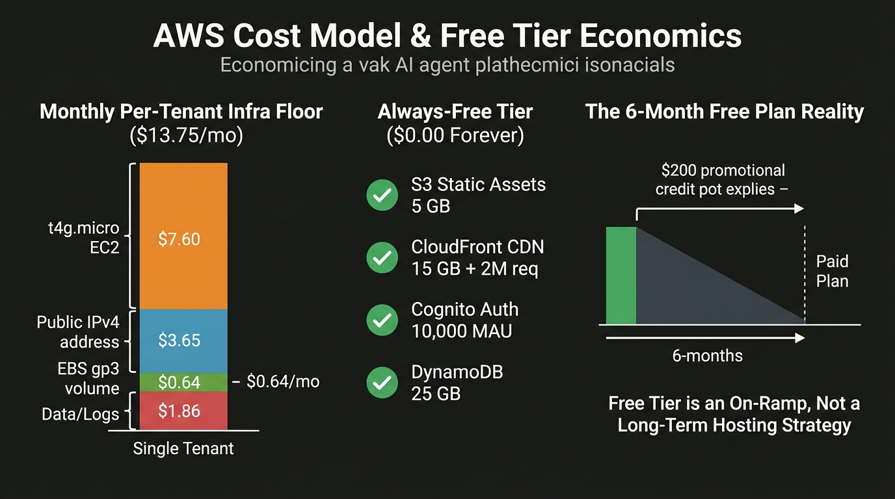

# AWS Free Tier & hosting economics — vak 2026-09

Status: research observation, 2026-09-08. Sources cited inline (AWS Free Tier
Terms last updated 2025-07-09; AWS VPC/EC2 pricing pages fetched 2026-09-08).
This is a *fact sheet*, not a deployment guide. See `README.md` for synthesis
and `decision-matrix.md` for the architecture choices.

## 1. The restructured Free Tier (the thing everyone gets wrong)

As of the July 2025 terms update, AWS Free Tier has two layers. The old
"750 hrs of t2.micro for 12 months, forever" mental model is **outdated**.

### 1.1 Free Plan (new customers, 6 months)
- `$100` promotional credit on signup + up to `$100` more for completing
  console activities = up to `$200` total. [per `aws.amazon.com/free/free-tier-faqs/` Q1/Q3]
- Credits expire **12 months** from account creation.
- The Free Plan account **expires at 6 months** (earlier of 6 months or
  credit exhaustion). After expiry the account closes; AWS retains data for
  90 days, then deletes it. [Q5/Q6]
- Ineligible if you've ever had an AWS account, or if you join AWS
  Organizations (which immediately upgrades you to Paid Plan and forfeits
  credits). [Q6/Q10]
- Limited to a subset of services; "services with an Always Free offer allow
  you to use the product for free up to specified limits as long as you are
  an AWS customer."

Net effect: **the Free Plan is a 6‑month $200 credit pot.** It can pay for
*real* services (EC2, IPv4, EBS) during that window, but the account dies at
6 months unless you convert to Paid Plan.

### 1.2 Always‑Free (ongoing, on both Free and Paid plans)
"Over 30 services" with monthly allowances that persist as long as you remain
an AWS customer. The ones relevant here:

| Service | Always‑Free monthly allowance | Meter / unit price beyond |
|---|---|---|
| S3 Standard | 5 GB | $0.023/GB (us-east‑1) |
| CloudFront | 15 GB data out + 2,000,000 HTTP/HTTPS requests | $0.085/GB + $0.0075/10k req |
| Lambda | 1,000,000 requests + 400,000 GB‑seconds | $0.20/1M requests + $0.0000166667/GB‑sec |
| API Gateway (REST + HTTP) | 1,000,000 requests each | $1.00/1M (REST) / $0.90/1M (HTTP) + data |
| DynamoDB | 25 GB storage + 25 RCU + 25 WCU | $0.25/GB (on‑demand) / $0.0065/req (RCU) |
| ECR | 500 MB storage | $0.10/GB |
| EFS | 5 GB storage | $0.30/GB |
| SQS | 1,000,000 requests | $0.40/1M |
| SNS | 1,000,000 requests | $0.50/1M |
| **Cognito (Lite/Essentials)** | **10,000 MAU/month, indefinitely** | $0.0055/MAU (Lite) / $0.015/MAU (Essentials) |
| CloudWatch Logs | 5 GB ingestion | $0.50/GB |

> Source for Cognito: `aws.amazon.com/cognito/pricing/` — "The free tier does
> not automatically expire at the end of your 12‑month AWS Free Tier term, and
> it is available to both existing and new AWS customers indefinitely … free
> tier of 10,000 monthly active users (MAU) per month per account."

### 1.3 What is *not* Always‑Free (the cost drivers)
- **EC2 instances**: not in Always‑Free. us‑east‑1 pricing (2026‑09):
  - `t4g.micro` (1 vCPU / 1 GB, ARM Graviton): **~$0.0104/hr ≈ $7.60/mo** (730 hrs).
  - `t3.micro` (1 vCPU / 1 GB, x86): ~$0.0112/hr ≈ $8.18/mo.
  - `t3a.nano` / `t4g.nano` (0.5 GB): ~$0.0054/hr ≈ $3.95/mo (but 0.5 GB RAM is
    too small for vak under load).
- **Elastic / public IPv4 address**: **$0.005/hr in-use AND idle ≈ $3.65/mo.**
  Source: `aws.amazon.com/vpc/pricing/` — "Hourly charge for In-use Public
  IPv4 Address $0.005 / Hourly charge for Idle Public IPv4 Address $0.005".
  (AWS started charging public IPv4 in Nov 2023; this is a real monthly cost
  for any reachable host.) New accounts *may* get a small courtesy allotment
  of free public IPv4s for the first 12 months — do not depend on it; it is
  not in the Always‑Free table.
- **EBS** (root volume): `gp3` us‑east‑1 **$0.08/GB‑mo**. For an 8 GB root + a
  data volume: ~$0.64/mo; 30 GB: ~$2.40/mo.
- **ALB / NLBI**: ~$0.008/hr (~$6/mo) + $0.006/data‑processed. Not free.
- **NAT Gateway**: $0.045/hr + $0.045/GB — expensive; avoid for a cheap tenant.
- **RDS**: not Always‑Free (legacy 12‑month offer only).

### 1.4 vak's resource profile (ground truth from the repo)
- **One binary**: `vak serve` built from `vak-server` (compiles in `vak` +
  `vak-delivery-worker`). `docker/Dockerfile` ships exactly this, **no Node**,
  because the static bundles are `include_dir!`'d in at build time:
  `site/dist` → `/`, `client_ui/dist-web` → `/app`, `admin_ui/dist` → `/admin`
  (`crates/vak-server/src/{site,client_ui,admin_ui,embedded_ui}.rs`).
- **Embedded DB**: `vak-store` uses `rusqlite` with the `bundled` feature —
  SQLite compiled into the binary, file‑backed in the data home. **No RDS /
  DynamoDB / external database is required for the core.** The 5 GB free
  DynamoDB allowance is therefore only relevant if you *rewrite* the store.
- **No GPU needed**: models are called as provider APIs (OpenAI/Anthropic/etc.)
  by default; local Ollama is optional. ARM Graviton (`t4g.micro`) is fine.
- **Subprocesses**: the broker spawns `vak-delivery-worker` and a `vak-tools`
  bash worker as process‑group‑scoped children on demand. So the OS must allow
  `fork/exec` with a process group — a managed container/Kubernetes pod with a
  locked‑down seccomp profile *may* need explicit `CAP_SYS_PTRACE`/`clone` allowances.
- **Memory**: the server idles low (tens of MB); an active turn with a worker
  peaks low‑hundreds of MB. **1 GB (`t4g.micro`) is workable for light
  single‑user use; it is tight during a busy run with a concurrent worker.**
  For an enterprise tenant sizing for concurrency, budget 2–4 GB.

### 1.5 Per‑tenant cost model (vak as the per‑tenant engine)
A single tenant = one `vak serve` process with its own workspace/data home,
served to that customer only (the isolation vak offers is filesystem +
process, per `docs/design/48-web-client.md` Phase E non‑goals / `docs/design/34`
"run another gateway process").

Base line (us-east-1, 2026-09), 24x7:

| Line item | Qty | Rate | /mo | Notes |
|---|---|---|---|---|
| t4g.micro EC2 | 730 hrs | $0.0104/hr | $7.60 | Free Plan $200 credit covers ~6 mo of ONE tenant |
| Public IPv4 | 1 | $0.005/hr | $3.65 | Charged in-use *and* idle; not Always‑Free |
| EBS gp3 | 8 GB | $0.08/GB | $0.64 | root only; add data volume for the ledger |
| Data out (estimate) | 20 GB | $0.09/GB | ~$1.80 | model/API traffic; CloudFront front end saves client egress |
| **Subtotal per tenant, always-on** | | | **~$13.75/mo** | |

Scaling:
- 1 tenant: ~$14/mo (Free Plan pays it for 6 months).
- 10 tenants: ~$140/mo (Free Plan's $200 covers ~1.5 tenant‑months, not 10).
- 100 tenants: ~$1,400/mo — the Free Tier stops mattering entirely.

> The Free Tier can therefore subsidise at most a **handful of tenant VMs for
> 6 months**; from tenant #2 onward the account must be on Paid Plan and the
> per‑tenant VM + IPv4 line is real spend.

### 1.6 Enterprise add‑ons (private network / compliance)
Per `docs/design/24-agent-security.md` and `docs/design/25-docker-sandbox.md`,
an enterprise tenant typically also wants:
- Private subnet, no public IP; provider APIs reached via **VPC endpoints**
  (Interface VPC Endpoints are $0.01/hr + $0.01/GB — not free) and the
  agent's outbound via a **NAT Gateway** ($0.045/hr + $0.045/GB) or a
  fleet of NAT instances.
- Larger instance (e.g. `t3a.small`/2GB $~$16/mo, or `m6i.large`/4GB ~$70/mo)
  to handle concurrent sessions/turns.
- Enterprise instances are typically multi‑AZ/redundant → 2× compute.

Enterprise tenant line, conservative:
| t3a.small (2 GB) ×2 AZ + natgw + vpc endpoints | |
|---|---|
| 2× compute | ~$32/mo |
| 1 NAT Gateway (idle) | ~$3.25/mo |
| Data processed | variable |
| **~ $40–60+/mo per enterprise tenant** before margin, egress, or support. |

None of this is Free‑Tier‑reachable at scale.

### 1.7 Takeaway
- **Free Plan = 6‑month $200 credit.** One tenant VM fits; the account then
  closes. It is a trial, not a hosting model.
- **Always‑Free covers the periphery, not the engine**: S3 (5 GB) + CloudFront
  (15 GB / 2M req) + Cognito (10k MAU) + Lambda/API‑Gateway (1M req) are enough
  for the *static public site + login + control plane*, but the per‑tenant
  vak engine needs an EC2 instance + a public IPv4 — i.e. **$13–14/mo from
  tenant #2, forever.**
- vak's own docs say multi‑tenant engine isolation is "run another gateway
  process" (`docs/design/34-channel-onboarding.md` Phase 2 "What stays
  single‑process"), which is precisely this per‑tenant‑VM model. It is
  architecturally aligned but economically the Free Tier only papers over it
  briefly.
